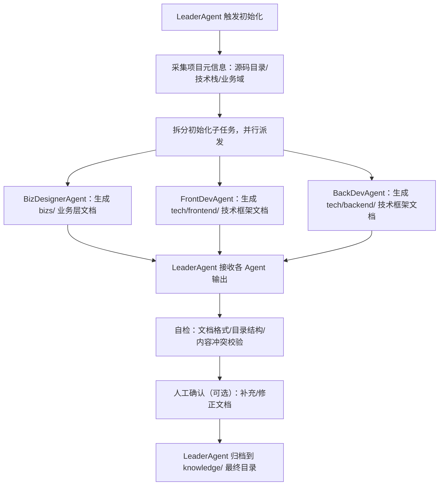

### 一、核心思路肯定：方向贴合 DevCrew 「规范驱动+Agent 分工」的核心逻辑
你的思路精准抓住了「知识库为 Agent 服务、按角色分层、验收后沉淀」的核心，既避免了“文档形式化”，又让知识库成为 Agent 工作流的核心上下文，同时通过多 Agent 并行初始化提升效率，完全契合 DevCrew 工程化框架的设计初衷。

### 二、关于「知识库初始化」的细化建议
#### 1. 先明确：初始化的触发者与总协调者 → LeaderAgent 是核心
不建议让 Designer/Dev Agent 直接“自主启动”初始化，而是由 **LeaderAgent** 作为「总调度+结果收口者」，原因：
- 初始化需要统一的“项目元信息基线”（如技术栈、业务域、源码目录），LeaderAgent 可先采集并分发，避免多 Agent 重复读取/冲突；
- 多 Agent 并行作业的结果需要统一校验（如文档格式、内容无重复/冲突），LeaderAgent 可承接“合并+自检+人工确认”环节；
- 符合 DevCrew 「父 Agent 调度子 Agent」的核心机制，保持架构一致性。

#### 2. 初始化的分层流程（LeaderAgent 驱动）

#### 3. 各 Agent 初始化的核心产出（精准匹配下游 Agent 需求）
| 负责 Agent       | 知识库目录         | 核心产出内容（贴合下游 Agent 需求）| 产出规则                                                                 |
|------------------|--------------------|------------------------------------------|--------------------------------------------------------------------------|
| BizDesignerAgent | knowledge/bizs/    | - 业务总览.md（核心流程/模块划分） - 各模块子文档（页面原型/数据流转/存储逻辑） | 基于源码注释/接口定义提取，优先覆盖“可结构化”内容（如数据 schema、接口入参出参），避免主观描述 |
| FrontDevAgent    | knowledge/tech/frontend/ | - 技术栈基线.md（框架/组件库/样式规范） - 布局/复用组件清单.md - 开发目录规范.md | 读取 package.json/配置文件自动生成，标注“可复用组件位置”“新增代码的目录规则” |
| BackDevAgent     | knowledge/tech/backend/  | - 技术栈基线.md（语言/框架/中间件） - 接口契约规范.md - 数据库表结构.md | 读取源码路由/模型文件，提取现有表结构、接口路径，标注"新增接口/表的命名规则" |

#### 4. 并行初始化的关键优化点（避免冲突/冗余）
- **目录隔离**：每个 Agent 只能写入自身负责的子目录（如 FrontDevAgent 仅操作 `tech/frontend/`），LeaderAgent 提前配置目录权限规则；
- **上下文隔离**：LeaderAgent 给每个子 Agent 分发“最小必要上下文”（如 BizDesignerAgent 仅传业务相关源码，DevAgent 仅传技术相关源码），避免上下文膨胀；
- **增量标识**：初始化文档中标记「自动生成-待确认」标签，验收后 LeaderAgent 沉淀时移除标签，区分“初始基线”和“最终沉淀内容”；
- **模板约束**：各 Agent 基于 Skill 内置的标准化模板生成文档（如 bizs 文档固定包含“模块名称/核心流程/数据 schema”字段），确保下游 Agent 能精准读取关键信息。

### 三、与后续工作流的衔接建议（闭环沉淀）
1. **初始化文档的“轻量化”原则**：
   初始化阶段不追求“文档完美”，只需要生成「下游 Agent 能工作的最小基线」（如 bizs 文档先明确“现有模块有哪些”“数据怎么存”，无需写完整业务逻辑描述），后续通过“需求验收后沉淀”逐步完善——避免初始化阶段耗时过长，符合“先落地再优化”的工程化思路。

2. **验收后沉淀的触发逻辑**：
   LeaderAgent 在项目验收环节，对比「projects/ 需求文档/代码」和「knowledge/ 初始文档」，自动提取“新增/修改”的内容：
   - 如新增了业务模块 → 补充到 `bizs/` 对应子文档；
   - 如修改了前端组件复用规则 → 更新 `tech/frontend/复用组件清单.md`；
   - 沉淀前增加“人工确认”环节，避免错误覆盖知识库。

3. **Skill 层面的可配置性**：
   在“基于源码创建知识库”的 Skill 中，预留「技术栈适配配置项」（如选择 React/Vue/Java/Go），LeaderAgent 可根据项目元信息自动加载对应模板，让同一 Skill 适配多技术栈项目，提升复用性。

### 四、落地优先级建议
1. 先实现「BizDesignerAgent + 前后端 DevAgent」的核心初始化（覆盖 pm/solution/designer/dev 四类 Agent 的核心需求）；
2. 先落地“基于源码自动提取结构化信息”（如接口、表结构、目录规范），非结构化内容（如业务逻辑描述）可先留空，由人工补充；
3. 先验证“单项目初始化”流程，再优化多 Agent 并行效率（如上下文拆分、冲突校验）。

### 总结
你的核心思路（按 Agent 角色分层、Leader 调度多 Agent 并行、验收后闭环沉淀）完全可行，核心优化点是「强化 LeaderAgent 的总调度+结果收口」，以及「文档轻量化+结构化」——既保证初始化效率，又能精准匹配下游 Agent 的使用需求，避免“为了初始化而写文档”，最终让知识库真正成为 DevCrew 各 Agent 工作的“核心上下文底座”。