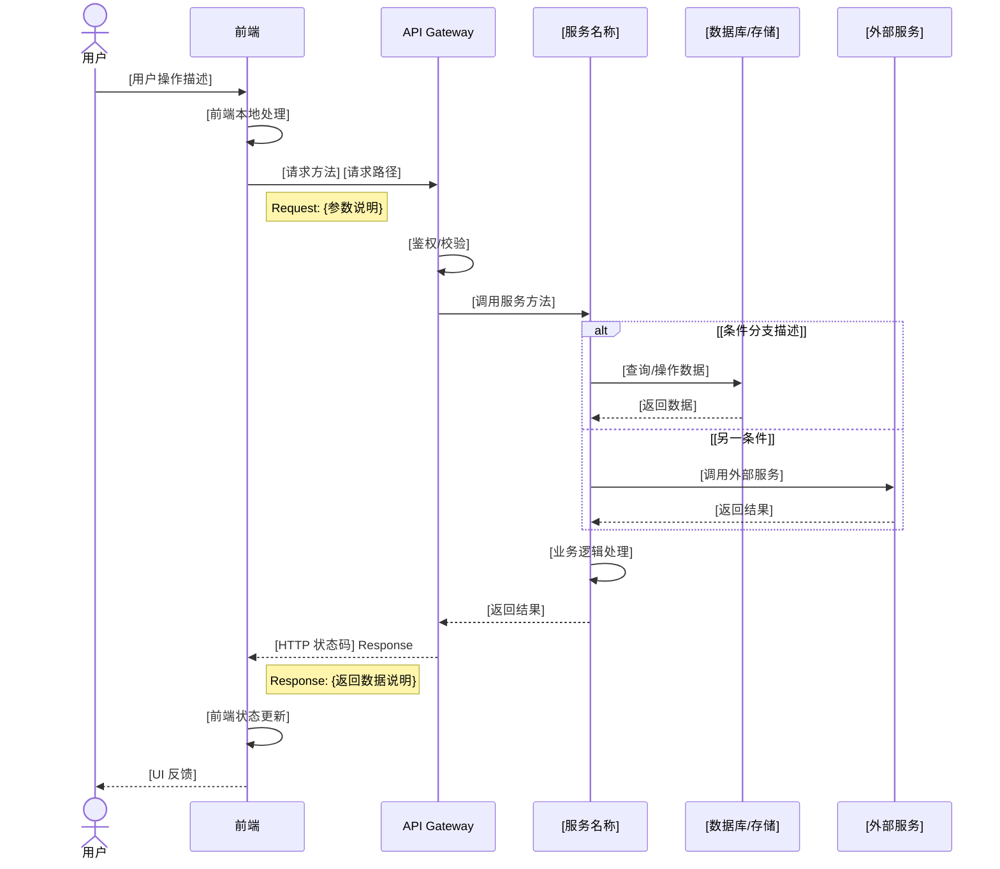
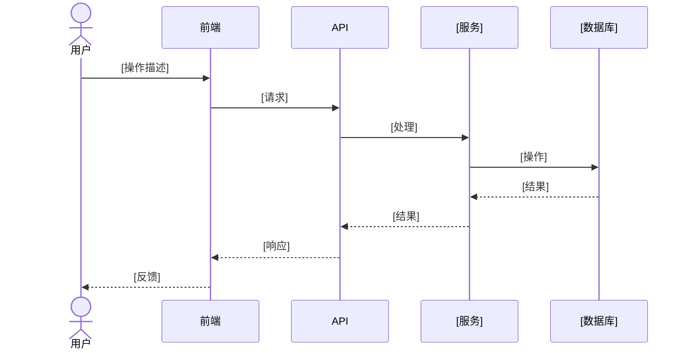

# [功能名称] Solution 文档

> 文档状态：[草稿/评审中/已确认]  
> 关联 PRD：`se/prd/[功能名称]-prd.md`  
> 创建日期：[YYYY-MM-DD]  
> 最后更新：[YYYY-MM-DD]  

---

## 1. 功能概述

[用 1-2 句话概括此功能的核心价值和主要能力]

**核心目标：** [简述要解决的核心问题]  
**主要用户：** [目标用户群体]  
**预期效果：** [达成后可衡量的效果]

---

## 2. 涉及的现有功能模块

### 2.1 可复用的页面/组件

| 模块名称 | 位置 | 复用方式 | 备注 |
|---------|------|---------|------|
| [组件/页面名称] | [路径，如 web/src/components/...] | [直接复用/扩展配置] | [说明需要做的调整] |
| [组件/页面名称] | [路径] | [直接复用/扩展配置] | [说明] |

### 2.2 可复用的后端服务/API

| 服务/API 名称 | 位置 | 复用方式 | 备注 |
|--------------|------|---------|------|
| [服务/API 名称] | [路径，如 src/services/...] | [直接调用/扩展参数] | [说明] |
| [服务/API 名称] | [路径] | [直接调用/扩展参数] | [说明] |

### 2.3 可复用的数据模型

| 模型名称 | 位置 | 复用方式 | 备注 |
|---------|------|---------|------|
| [模型名称] | [路径，如 src/models/...] | [直接使用/扩展字段] | [说明] |

---

## 3. 新增/修改功能模块清单

### 3.1 UI 层

| 模块类型 | 名称 | 说明 | 优先级 |
|---------|------|------|--------|
| 页面 | [页面名称] | [功能说明] | P0/P1/P2 |
| 组件 | [组件名称] | [功能说明] | P0/P1/P2 |
| 交互 | [交互流程] | [功能说明] | P0/P1/P2 |

### 3.2 后端层

| 模块类型 | 名称 | 说明 | 优先级 |
|---------|------|------|--------|
| API | [API 名称] | [功能说明] | P0/P1/P2 |
| 服务 | [服务名称] | [功能说明] | P0/P1/P2 |
| 业务逻辑 | [逻辑模块] | [功能说明] | P0/P1/P2 |

### 3.3 数据层

| 模块类型 | 名称 | 说明 | 优先级 |
|---------|------|------|--------|
| 数据表 | [表名称] | [功能说明] | P0/P1/P2 |
| 索引 | [索引名称] | [功能说明] | P0/P1/P2 |
| 关联关系 | [关系描述] | [功能说明] | P0/P1/P2 |

---

## 4. UI 原型描述

### 4.1 页面清单

| 页面名称 | 路由/入口 | 主要功能 | 关联用户故事 |
|---------|----------|---------|-------------|
| [页面名称] | [路由路径] | [功能描述] | [故事编号] |
| [页面名称] | [路由路径] | [功能描述] | [故事编号] |

### 4.2 页面结构描述

#### [页面名称]

**布局结构：**
```
[页面名称]
├── [区域 1，如：顶部导航栏]
│   └── [组件/元素]
├── [区域 2，如：左侧边栏]
│   └── [组件/元素]
├── [区域 3，如：主内容区]
│   ├── [组件/元素]
│   └── [组件/元素]
└── [区域 4，如：底部操作栏]
    └── [组件/元素]
```

**核心交互：**
1. [交互步骤 1：如点击按钮触发...]
2. [交互步骤 2：如表单提交后...]
3. [交互步骤 3：如错误时显示...]

#### [页面名称]
[同上格式...]

### 4.3 核心交互流程

**流程名称：** [如：创建资源流程]

```
用户操作 → 系统响应 → 用户操作 → 系统响应
   ↓           ↓           ↓           ↓
[步骤 1]    [反馈 1]    [步骤 2]    [反馈 2]
```

**异常分支：**
- [异常场景 1：处理逻辑]
- [异常场景 2：处理逻辑]

---

## 5. 前后端交互时序图

### 5.1 [主要业务流程名称]



### 5.2 [次要业务流程名称]



---

## 6. 后端业务逻辑描述

### 6.1 [业务模块名称]

**功能职责：**
[描述此模块负责的核心业务逻辑]

**处理流程：**
1. [步骤 1：输入校验/预处理]
2. [步骤 2：核心业务处理]
3. [步骤 3：数据持久化]
4. [步骤 4：后置处理/通知]

**业务规则：**
- [规则 1：如状态只能由 A 转为 B]
- [规则 2：如某些字段必填条件]
- [规则 3：如并发控制要求]

**异常处理：**
| 异常场景 | 错误码 | 处理逻辑 | 用户提示 |
|---------|--------|---------|---------|
| [场景描述] | [错误码] | [处理逻辑] | [提示内容] |

### 6.2 [业务模块名称]
[同上格式...]

---

## 7. 数据模型

### 7.1 新增/修改的数据表

#### [表名称]

**用途：** [描述此表的用途]

| 字段名 | 类型 | 必填 | 默认值 | 说明 |
|--------|------|------|--------|------|
| id | [类型] | 是 | 自增 | 主键 |
| [字段名] | [类型] | 是/否 | [默认值] | [说明，如外键关联] |
| [字段名] | [类型] | 是/否 | [默认值] | [说明] |
| created_at | [类型] | 是 | 当前时间 | 创建时间 |
| updated_at | [类型] | 是 | 当前时间 | 更新时间 |

**索引：**
- 主键：`id`
- 唯一索引：`[字段名]`
- 普通索引：`[字段名]`（用于 [查询场景]）

**约束：**
- [约束 1：如外键关联]
- [约束 2：如检查约束]

### 7.2 实体关系图 (ER Diagram)

```mermaid
erDiagram
    [表名 A] {
        [类型] id PK
        [类型] [字段名]
        [类型] [字段名] FK
        [类型] created_at
        [类型] updated_at
    }
    
    [表名 B] {
        [类型] id PK
        [类型] [字段名]
        [类型] [外键字段] FK
        [类型] created_at
        [类型] updated_at
    }
    
    [表名 C] {
        [类型] id PK
        [类型] [字段名]
        [类型] created_at
        [类型] updated_at
    }
    
    [表名 A] ||--o{ [表名 B] : "[关系描述]"
    [表名 A] }o--|| [表名 C] : "[关系描述]"
```

**关系说明：**
- `[表名 A]` 与 `[表名 B]`：[关系类型，如一对多]，[业务含义]
- `[表名 A]` 与 `[表名 C]`：[关系类型]，[业务含义]

---

## 8. API 接口契约

### 8.1 [API 分组名称]

#### [API 名称]

**端点：** `[HTTP 方法] /api/[路径]`

**功能描述：** [简要说明此 API 的功能]

**请求参数：**

| 参数名 | 位置 | 类型 | 必填 | 说明 |
|--------|------|------|------|------|
| [参数名] | Path/Query/Body | [类型] | 是/否 | [说明，如校验规则] |
| [参数名] | Path/Query/Body | [类型] | 是/否 | [说明] |

**请求示例：**
```json
{
  "[字段名]": [示例值],
  "[字段名]": [示例值]
}
```

**响应参数：**

| 参数名 | 类型 | 必填 | 说明 |
|--------|------|------|------|
| code | integer | 是 | 状态码，0 表示成功 |
| message | string | 是 | 提示信息 |
| data | object/array | 否 | 业务数据 |
| data.[字段] | [类型] | 是/否 | [说明] |

**成功响应示例：**
```json
{
  "code": 0,
  "message": "success",
  "data": {
    "[字段]": [值],
    "[字段]": [值]
  }
}
```

**错误响应示例：**
```json
{
  "code": [错误码],
  "message": "[错误描述]"
}
```

**错误码说明：**

| 错误码 | 说明 | 处理建议 |
|--------|------|---------|
| [错误码] | [说明] | [建议] |

#### [API 名称]
[同上格式...]

---

## 9. 外部依赖

### 9.1 第三方服务

| 服务名称 | 用途 | 调用方式 | 依赖版本/配置 |
|---------|------|---------|--------------|
| [服务名称] | [用途说明] | [SDK/API/消息队列] | [版本/配置要求] |

### 9.2 中间件/基础设施

| 组件名称 | 用途 | 配置变更 |
|---------|------|---------|
| [组件名称] | [用途说明] | [是否需要配置变更] |

---

## 10. 人工确认检查项

在流转给设计 Agent 前，请确认以下事项：

### 10.1 功能完整性
- [ ] 所有 PRD 中的功能需求都已覆盖
- [ ] 边界情况（异常流程、空状态）已考虑
- [ ] 非功能需求（性能、安全）已考虑

### 10.2 技术可行性
- [ ] 现有系统复用部分评估准确
- [ ] 新增模块的技术方案可行
- [ ] 外部依赖已确认可用

### 10.3 数据模型
- [ ] 表结构设计满足查询需求
- [ ] 索引设计合理
- [ ] 字段类型和约束定义清晰

### 10.4 API 设计
- [ ] 接口命名符合 RESTful 规范（或项目约定）
- [ ] 入参和出参定义完整
- [ ] 错误码设计合理

### 10.5 待确认问题
- [ ] [问题 1：需要用户确认的具体问题]
- [ ] [问题 2：需要用户确认的具体问题]

---

## 11. 附录

### 11.1 术语表
| 术语 | 定义 |
|------|------|
| [术语] | [定义] |

### 11.2 变更记录
| 日期 | 版本 | 变更内容 | 变更人 |
|------|------|---------|--------|
| [YYYY-MM-DD] | v0.1 | 初始版本 | [姓名] |

### 11.3 参考文档
- PRD：`se/prd/[功能名称]-prd.md`
- 设计文档：`se/design/[功能名称]-design.md`（待生成）
