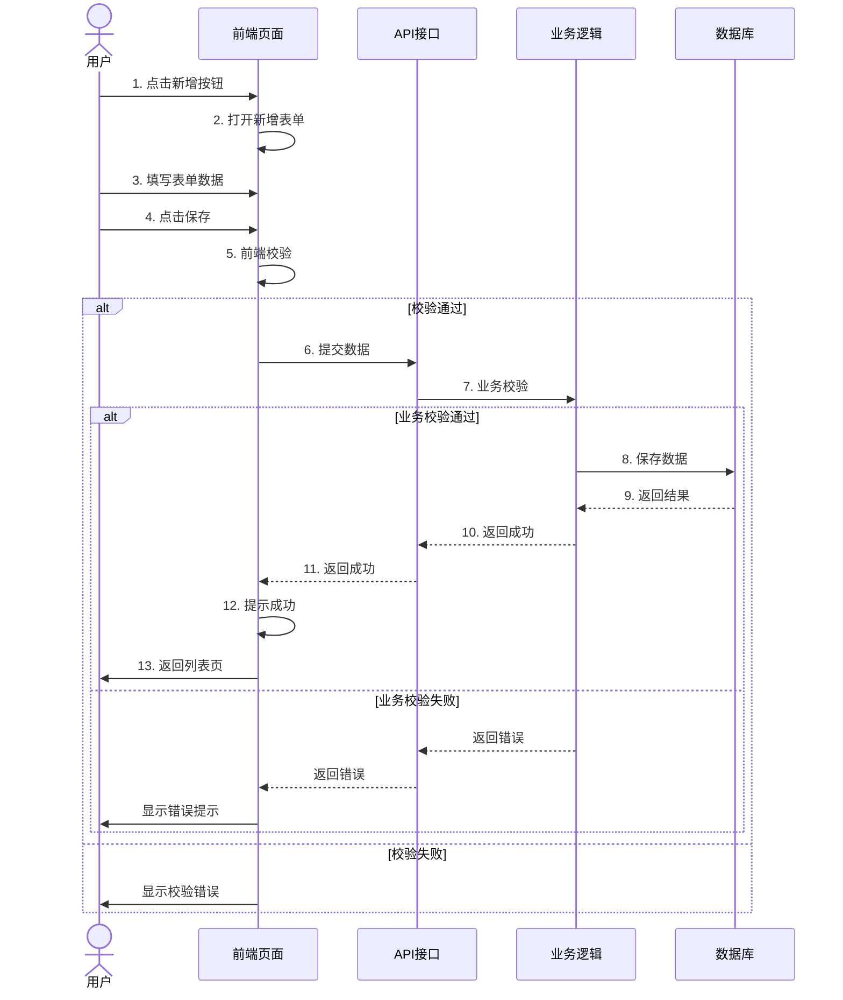
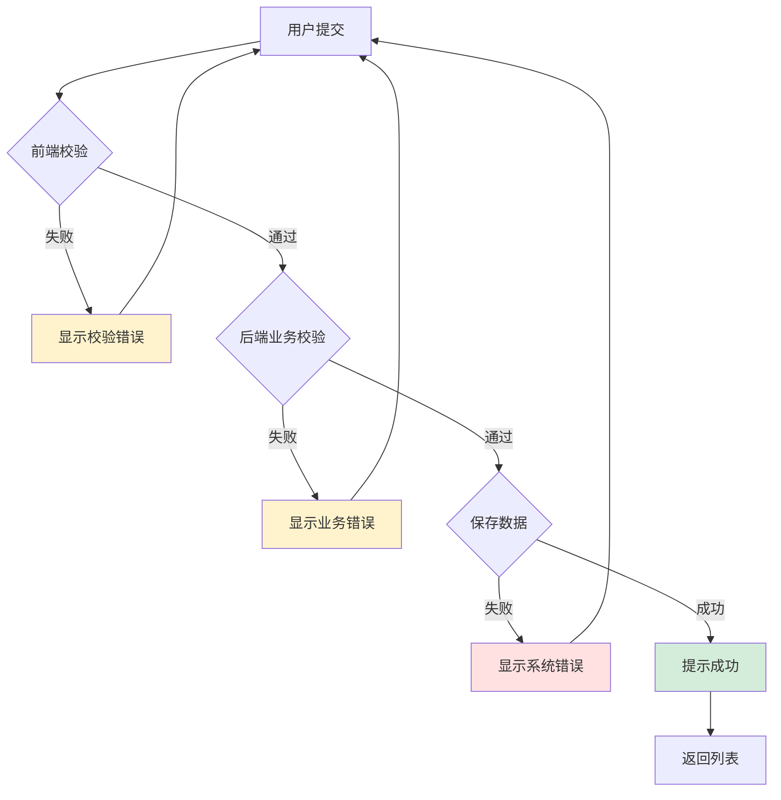

# 功能点详细设计模板 - [功能名称]

> **适用场景**：单个功能点的详细设计，包含UI原型、交互流程、数据定义，供AI Agent生成和读取
> **目标读者**：devcrew-product-manager, devcrew-solution-manager, devcrew-designer
> **关联文档**：[模块概览文档](../MODULE-XXX-OVERVIEW.md)
> 
> <!-- AI-TAG: FEATURE_DETAIL -->
> <!-- AI-CONTEXT: 此文档用于详细描述单个功能的UI、交互、数据规则，AI生成时应填充所有占位符 -->

---

## 1. 内容概述

<!-- AI-TAG: OVERVIEW -->

### 1.1 基本信息

| 项目 | 说明 |
|------|------|
| 功能名称 | {填写功能名称} |
| 所属模块 | {如：订单管理模块} |
| 核心功能 | {1-3句话描述核心功能价值} |
| 目标用户 | {描述目标用户群体} |
| 适用场景 | {描述核心适用业务场景} |

### 1.2 功能范围

本次设计包含以下内容：
- [ ] {界面1} 原型设计 + 交互逻辑
- [ ] {界面2} 原型设计 + 数据规则
- [ ] {核心流程} 交互说明 + 异常处理

---

## 2. 核心界面原型（划线式）

<!-- AI-TAG: UI_PROTOTYPE -->
<!-- AI-NOTE: UI原型使用ASCII线框图，直观展示页面布局和元素位置 -->

### 2.1 列表页（{页面名称}）

```
┌─────────────────────────────────────────────────────────────┐
│ 【页面标题】{如：商品管理列表}                              │
├─────────────────────────────────────────────────────────────┤
│ ┌─────────────┬─────────────┬─────────────┬─────────────┐  │
│ │ 筛选区      │ □ 复选框     │ 输入框□     │ 下拉框▼     │  │
│ │             │ 关键词：____|____________ │ 状态：______▼ │  │
│ │             │ [查询按钮]  [重置按钮] [新增按钮]          │  │
│ └─────────────┴─────────────┴─────────────┴─────────────┘  │
│                                                             │
│ ┌─────────────────────────────────────────────────────────┐ │
│ │ 序号 │ 字段1   │ 字段2   │ 字段3   │ 操作            │ │
│ ├──────┼─────────┼─────────┼─────────┼─────────────────┤ │
│ │ 1    │ {示例值} │ {示例值} │ {示例值} │ [编辑][删除]    │ │
│ │ 2    │ {示例值} │ {示例值} │ {示例值} │ [编辑][删除]    │ │
│ │ ...  │ ...     │ ...     │ ...     │ ...             │ │
│ └──────┴─────────┴─────────┴─────────┴─────────────────┘ │
│                                                             │
│ ┌─────────────────────────────────────────────────────────┐ │
│ │ 分页区：共{X}条  页码 [1][2][3]  每页{X}条 ▼            │ │
│ └─────────────────────────────────────────────────────────┘ │
└─────────────────────────────────────────────────────────────┘
```

**界面元素说明：**

| 区域 | 元素 | 类型 | 说明 | 交互 |
|------|------|------|------|------|
| 筛选区 | 关键词 | 输入框 | {模糊搜索商品名称/编码} | 回车触发查询 |
| 筛选区 | 状态下拉 | 下拉框 | {筛选商品状态} | 变更触发查询 |
| 筛选区 | 查询按钮 | 按钮 | {执行查询} | 点击刷新列表 |
| 列表区 | 编辑链接 | 链接 | {打开编辑页} | 点击跳转 |
| 列表区 | 删除链接 | 链接 | {删除记录} | 点击确认后删除 |

### 2.2 表单页（{页面名称}）

```
┌─────────────────────────────────────────────────────────────┐
│ 【页面标题】{如：新增商品}                                  │
├─────────────────────────────────────────────────────────────┤
│ ┌─────────────────────────────────────────────────────────┐ │
│ │ 基础信息区                                                │ │
│ │ ┌─────────────┬───────────────────────────────────────┐ │ │
│ │ │ 标签        │ 输入框/选择框                          │ │ │
│ │ │ 商品名称：  │ ____|__________________________________ │ │ │
│ │ │ 商品编码：  │ ____|__________________________________ │ │ │
│ │ │ 商品状态：  │ □ 启用  □ 禁用                        │ │ │
│ │ │ 商品分类：  │ ______▼                               │ │ │
│ │ │ 商品图片：  │ [上传按钮] □ 预览区                    │ │ │
│ │ └─────────────┴───────────────────────────────────────┘ │ │
│ └─────────────────────────────────────────────────────────┘ │
│                                                             │
│ ┌─────────────────────────────────────────────────────────┐ │
│ │ 高级配置区                                                │ │
│ │ ┌─────────────┬───────────────────────────────────────┐ │ │
│ │ │ 价格：      │ ____|________ 元                        │ │ │
│ │ │ 库存：      │ ____|________ 件                        │ │ │
│ │ │ 备注：      │ ┌───────────────────────────────────┐ │ │ │
│ │ │             │ │ 多行文本框                        │ │ │ │
│ │ │             │ │                                   │ │ │ │
│ │ │             │ └───────────────────────────────────┘ │ │ │
│ │ └─────────────┴───────────────────────────────────────┘ │ │
│ └─────────────────────────────────────────────────────────┘ │
│                                                             │
│ ┌─────────────────────────────────────────────────────────┐ │
│ │ [保存按钮]                [取消按钮]                     │ │
│ └─────────────────────────────────────────────────────────┘ │
└─────────────────────────────────────────────────────────────┘
```

**表单字段说明：**

| 字段 | 类型 | 必填 | 校验规则 | 默认值 |
|------|------|------|----------|--------|
| 商品名称 | 文本 | 是 | {长度2-100，不能重复} | - |
| 商品编码 | 文本 | 是 | {格式：SP+6位数字} | {自动生成} |
| 商品状态 | 单选 | 是 | {启用/禁用} | {启用} |
| 商品分类 | 下拉 | 是 | {必须选择} | - |
| 价格 | 数字 | 是 | {≥0，最多2位小数} | {0.00} |
| 库存 | 整数 | 是 | {≥0} | {0} |

### 2.3 弹窗页（{弹窗名称}）

```
┌─────────────────────────────────────────────────────────────┐
│ ┌─────────────────────────────────────────────────────────┐ │
│ │ 【弹窗标题】{如：删除确认}                               │ │
│ ├─────────────────────────────────────────────────────────┤ │
│ │                                                         │ │
│ │ 提示文案：{如：确认删除该商品吗？删除后不可恢复！}       │ │
│ │                                                         │ │
│ ├─────────────────────────────────────────────────────────┤ │
│ │            [取消按钮]        [确认按钮]                  │ │
│ └─────────────────────────────────────────────────────────┘ │
└─────────────────────────────────────────────────────────────┘
```

---

## 3. 交互流程说明

<!-- AI-TAG: INTERACTION_FLOW -->
<!-- AI-NOTE: 交互流程使用Mermaid时序图，清晰展示用户、前端、后端的交互过程 -->

### 3.1 核心操作流程（{流程名称}）



**流程步骤说明：**

| 步骤 | 操作 | 执行方 | 输入 | 输出 | 异常处理 |
|------|------|--------|------|------|----------|
| 1-2 | 打开表单 | 用户/前端 | 点击 | 表单页面 | - |
| 3 | 填写数据 | 用户 | 表单数据 | - | - |
| 4-5 | 保存/校验 | 前端 | 表单数据 | 校验结果 | 显示校验错误 |
| 6-7 | 提交/校验 | 后端 | 提交数据 | 校验结果 | 返回业务错误 |
| 8-13 | 保存/返回 | 后端/前端 | 有效数据 | 保存结果 | 返回系统错误 |

### 3.2 异常分支流程



### 3.3 交互规则说明

| 操作触发 | 交互行为 | 异常处理 |
|----------|----------|----------|
| 点击查询按钮 | 1. 清空列表数据<br>2. 展示加载状态<br>3. 加载筛选后数据 | 无匹配数据时展示"暂无数据"占位符 |
| 点击编辑按钮 | 1. 打开编辑表单<br>2. 回显当前行数据 | 数据加载失败时展示"数据加载失败，请重试" |
| 输入框失焦 | 触发字段格式校验（如手机号/邮箱） | 校验失败时在输入框下方展示红色提示文案 |
| 点击删除按钮 | 1. 弹出确认弹窗<br>2. 确认后执行删除 | 删除失败时展示错误提示 |

---

## 4. 数据字段定义

<!-- AI-TAG: DATA_DEFINITION -->
<!-- AI-NOTE: 数据定义对Solution Agent进行API设计和数据库设计很重要 -->

### 4.1 核心字段清单

| 字段名称 | 字段类型 | 数据格式 | 约束规则 | 备注 |
|----------|----------|----------|----------|------|
| {字段1} | 字符串/数字/布尔 | {如：长度≤32、格式为手机号} | {如：必填、唯一、默认值} | {补充说明} |
| {字段2} | 字符串 | {如：长度1-64} | {必填、支持模糊查询} | - |
| {字段3} | 数字 | {如：≥0、≤9999} | {非必填、默认值0} | 单位：件 |
| {字段4} | 枚举 | {如：0-禁用，1-启用} | {必填、默认值1} | - |

### 4.2 数据来源说明

| 字段名称 | 数据来源 | 更新时机 | 说明 |
|----------|----------|----------|------|
| {字段1} | 用户手动输入 | 新增/编辑表单提交时 | - |
| {字段2} | 关联查询{表名}表 | 页面加载时自动获取 | 下拉选项 |
| {字段3} | 系统自动生成 | 数据创建时生成 | 如唯一编码 |

### 4.3 API 数据契约

**请求参数：**

```json
{
  "{字段1}": "{示例值}",
  "{字段2}": "{示例值}",
  "{字段3}": {数值},
  "{字段4}": {枚举值}
}
```

**响应数据：**

```json
{
  "code": 0,
  "message": "success",
  "data": {
    "id": "{记录ID}",
    "{字段1}": "{返回值}",
    "{字段2}": "{返回值}",
    "createTime": "2024-01-01 12:00:00"
  }
}
```

---

## 5. 业务规则约束

<!-- AI-TAG: BUSINESS_RULES -->

### 5.1 权限规则

| 操作 | 权限要求 | 无权限处理 |
|------|----------|------------|
| 新增/编辑/删除 | 拥有{角色名称}角色或{权限编码}权限 | 隐藏操作按钮，点击时提示"无操作权限" |
| 查看敏感字段 | 拥有{数据权限}范围 | 敏感字段展示为"***" |

### 5.2 业务逻辑规则

1. **{规则1}**：{如：商品编码生成规则为"SP+年月日+6位随机数"}
2. **{规则2}**：{如：库存为0时，商品状态自动置为"下架"}
3. **{规则3}**：{如：价格修改后，需记录操作日志并同步至缓存}
4. **{规则4}**：{如：同一用户5分钟内重复提交相同表单时，触发防重校验}

### 5.3 校验规则

| 校验场景 | 校验规则 | 提示文案 | 校验时机 |
|----------|----------|----------|----------|
| 表单提交 | 商品名称不能为空 | 请输入商品名称 | 前端失焦+后端提交 |
| 表单提交 | 商品编码格式错误（需以SP开头） | 商品编码需以SP开头，请检查 | 后端提交 |
| 删除操作 | 商品关联订单时不可删除 | 该商品已关联订单，无法删除 | 后端删除前 |

---

## 6. 备注与补充说明

<!-- AI-TAG: ADDITIONAL_NOTES -->

### 6.1 兼容适配说明

- **界面适配**：支持PC端1920×1080分辨率，响应式适配1366×768及以上分辨率
- **交互适配**：支持鼠标点击/回车触发操作，支持键盘Tab键切换焦点

### 6.2 待确认事项

- [ ] **{待确认1}**：{如：商品分类的下拉选项是否需要支持模糊搜索}
- [ ] **{待确认2}**：{如：删除操作是否需要增加二级确认}

### 6.3 扩展说明

- 本原型为核心流程简化版，扩展字段/功能可在后续迭代中补充
- 划线式原型仅表达布局与交互逻辑，视觉样式（如颜色、字体）需参考产品视觉规范

---

**文档状态：** 📝 草稿 / 👀 评审中 / ✅ 已发布  
**最后更新：** {日期}  
**维护人：** {姓名}  
**关联模块文档：** [模块概览文档](../MODULE-XXX-OVERVIEW.md)
