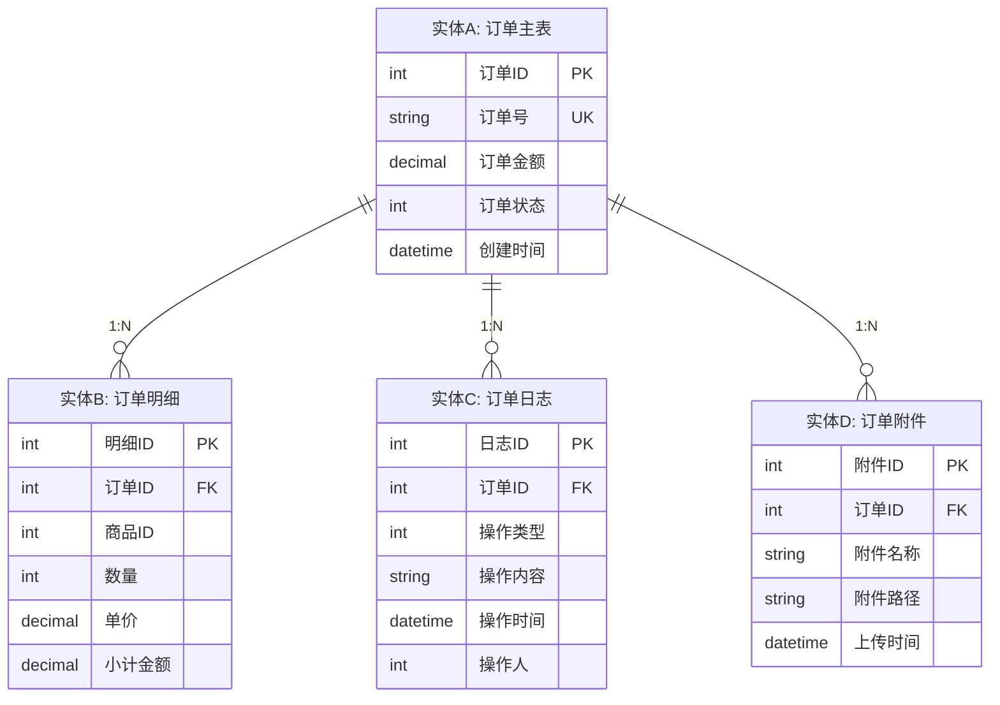
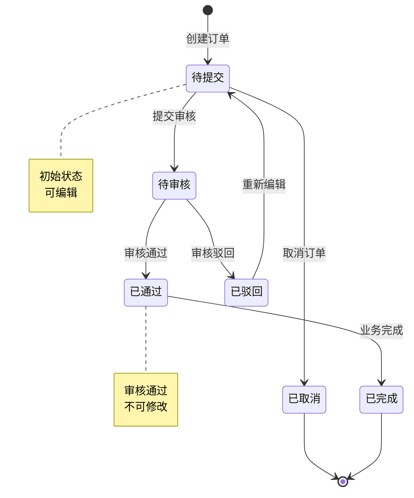
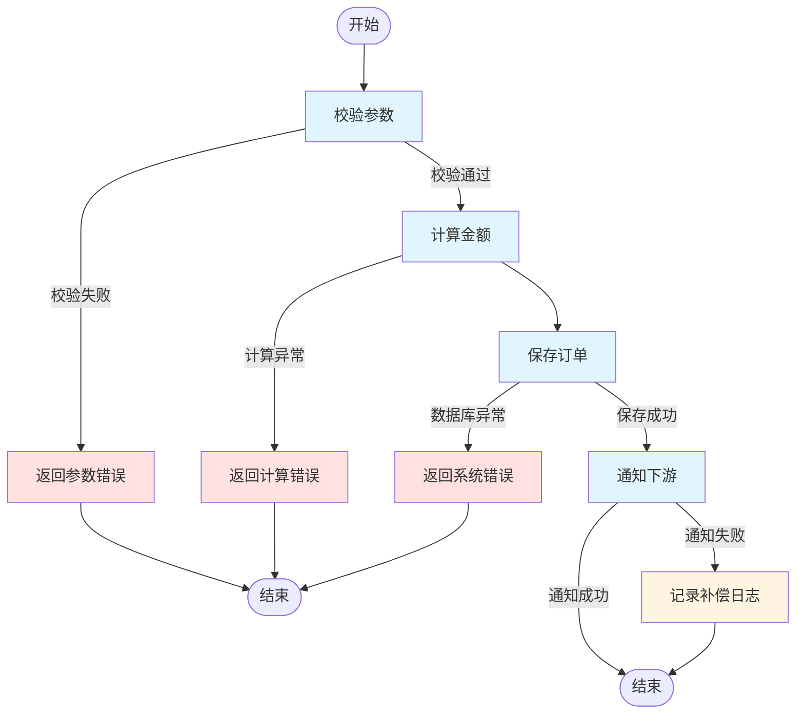

# 模块概览文档 - [模块名称]

> **适用场景**：描述单个业务模块的职责边界、功能清单、实体关系、对外依赖，供AI Agent读取以理解模块细节
> **目标读者**：devcrew-product-manager, devcrew-solution-manager
> **关联文档**：[系统功能全景文档](../SYSTEM-OVERVIEW.md)
> 
> <!-- AI-TAG: MODULE_OVERVIEW -->
> <!-- AI-CONTEXT: 读取此文档以理解模块职责、功能清单、实体关系、依赖接口，用于需求分析和方案设计 -->

---

## 1. 模块基本信息

### 1.1 模块定位

| 项目 | 说明 |
|------|------|
| 模块名称 | {填写模块名称} |
| 所属业务域 | {如：销售域、库存域} |
| 模块职责 | {一句话描述模块的核心职责} |
| 业务价值 | {解决什么业务问题，带来什么价值} |

### 1.2 模块边界

<!-- AI-TAG: MODULE_BOUNDARY -->
<!-- AI-NOTE: 模块边界帮助AI理解职责范围，避免需求分析时的范围蔓延 -->

```mermaid
graph TB
    subgraph 本模块["【{模块名称}】"]
        direction TB
        
        subgraph 负责["负责"]
            R1[{职责1: 如订单生命周期管理}]
            R2[{职责2: 如订单状态流转控制}]
            R3[{职责3: 如订单数据统计分析}]
        end
    end
    
    subgraph 外部["外部模块"]
        direction TB
        
        subgraph 依赖["本模块依赖"]
            D1[模块X<br/>获取用户数据]
            D2[模块Y<br/>获取商品数据]
        end
        
        subgraph 被依赖["依赖本模块"]
            U1[模块Z<br/>使用订单数据]
            U2[模块W<br/>接收状态通知]
        end
        
        subgraph 不负责["本模块不负责"]
            NR1[支付处理<br/>支付模块]
            NR2[物流跟踪<br/>物流模块]
        end
    end
    
    本模块 -.-> D1
    本模块 -.-> D2
    U1 -.-> 本模块
    U2 -.-> 本模块
    
    style 负责 fill:#d4edda
    style 不负责 fill:#f8d7da
    style 依赖 fill:#fff3cd
    style 被依赖 fill:#d1ecf1
```

**边界说明：**
| 类型 | 内容 | 说明 |
|------|------|------|
| **负责** | {职责1, 职责2, 职责3} | 本模块核心职责 |
| **依赖** | {模块X, 模块Y} | 本模块调用的外部模块 |
| **被依赖** | {模块Z, 模块W} | 调用本模块的外部模块 |
| **不负责** | {支付处理, 物流跟踪} | 明确不在本模块范围内 |

---

## 2. 功能清单 (Feature List)

### 2.1 功能树

<!-- AI-TAG: FEATURE_TREE -->
<!-- AI-NOTE: 功能树帮助AI理解模块功能结构，用于需求匹配和范围判断 -->

```mermaid
mindmap
  root((【{模块名称}】))
    功能组A
      功能A1 ✅
      功能A2 ✅
      功能A3 🚧
      功能A4 ⏳
    功能组B
      功能B1 ✅
      功能B2 🚧
    功能组C
      功能C1 ⏳
      功能C2 ⏳
```

**状态说明：** ✅ 已上线 / 🚧 开发中 / ⏳ 规划中 / ❌ 已下线

### 2.2 功能清单表

| 功能组 | 功能点 | 功能描述 | 状态 | 优先级 | 备注 |
|--------|--------|----------|------|--------|------|
| {订单管理} | {创建订单} | {支持手动/导入创建} | ✅ | P0 | {已上线} |
| {订单管理} | {查询订单} | {多维度筛选查询} | ✅ | P0 | {已上线} |
| {订单审核} | {提交审核} | {提交订单至审核流程} | 🚧 | P1 | {开发中} |
| {数据统计} | {订单报表} | {按时间/区域统计} | ⏳ | P2 | {规划中} |

---

## 3. 业务实体与关系

### 3.1 核心实体清单

| 实体名称 | 实体说明 | 关键属性 | 业务规则 |
|----------|----------|----------|----------|
| {实体A} | {如：订单主表} | {订单号、金额、状态} | {唯一性、状态流转规则} |
| {实体B} | {如：订单明细} | {商品、数量、单价} | {关联订单、级联删除} |
| {实体C} | {如：订单日志} | {操作人、时间、内容} | {只增不删、保留期限} |

### 3.2 实体关系图

<!-- AI-TAG: ENTITY_RELATIONSHIP -->
<!-- AI-NOTE: ER图对Solution Agent进行数据库设计和API设计至关重要 -->



### 3.3 实体状态流转

<!-- AI-TAG: STATE_MACHINE -->
<!-- AI-NOTE: 状态机对理解业务规则和实现状态控制逻辑很重要 -->

**实体A（订单）状态机：**



| 状态 | 说明 | 可转移状态 | 触发条件 |
|------|------|------------|----------|
| {待提交} | {草稿状态} | {待审核/已取消} | {提交/取消} |
| {待审核} | {等待审核} | {已通过/已驳回} | {审核通过/驳回} |
| {已通过} | {审核通过} | {已完成} | {业务完成} |

---

## 4. 对外依赖与接口

### 4.1 模块依赖关系

| 依赖方向 | 模块名称 | 依赖内容 | 依赖方式 | 说明 |
|----------|----------|----------|----------|------|
| {本模块依赖} | {用户中心} | {获取用户信息} | {API调用} | {通过用户ID获取详情} |
| {本模块依赖} | {商品模块} | {获取商品信息} | {API调用} | {通过商品ID获取详情} |
| {依赖本模块} | {支付模块} | {查询订单信息} | {API调用} | {支付时校验订单} |
| {依赖本模块} | {物流模块} | {接收订单发货} | {消息订阅} | {订单审核通过后通知} |

### 4.2 对外提供接口

| 接口名称 | 接口类型 | 调用方 | 功能说明 | 关键入参 | 关键出参 |
|----------|----------|--------|----------|----------|----------|
| {查询订单} | {API} | {支付模块} | {根据ID查订单} | {订单ID} | {订单详情} |
| {订单状态变更} | {消息} | {物流模块} | {状态变更通知} | {订单ID, 新状态} | {处理结果} |

### 4.3 依赖模块接口

| 接口名称 | 提供方 | 功能说明 | 调用场景 |
|----------|--------|----------|----------|
| {获取用户} | {用户中心} | {根据ID获取用户} | {创建订单时校验} |
| {获取商品} | {商品模块} | {根据ID获取商品} | {创建订单时校验} |

---

## 5. 核心业务流程

### 5.1 模块内核心流程

<!-- AI-TAG: CORE_PROCESS -->
<!-- AI-NOTE: 核心流程对Solution Agent进行方案设计和接口规划很重要 -->

**流程：{创建订单流程}**



**流程步骤说明：**

| 步骤 | 步骤名称 | 处理逻辑 | 输入 | 输出 | 异常处理 |
|------|----------|----------|------|------|----------|
| 1 | {参数校验} | {校验用户、商品、库存} | {请求参数} | {校验结果} | {返回参数错误} |
| 2 | {金额计算} | {计算商品金额、优惠、运费} | {商品信息} | {订单金额} | {计算异常} |
| 3 | {保存订单} | {写入订单主表、明细表} | {订单数据} | {订单ID} | {数据库异常} |
| 4 | {通知下游} | {发送订单创建消息} | {订单ID} | {发送结果} | {记录日志，不重试} |

### 5.2 异常处理规则

| 异常场景 | 异常类型 | 处理策略 | 用户提示 | 日志记录 |
|----------|----------|----------|----------|----------|
| {参数校验失败} | {业务异常} | {直接返回错误} | {显示具体错误} | {记录警告日志} |
| {商品不存在} | {业务异常} | {返回错误} | {提示商品无效} | {记录警告日志} |
| {数据库超时} | {系统异常} | {重试3次} | {提示系统繁忙} | {记录错误日志} |
| {下游通知失败} | {系统异常} | {记录待补偿} | {不提示用户} | {记录错误日志} |

---

## 6. 业务规则与约束

### 6.1 业务规则

| 规则编号 | 规则名称 | 规则描述 | 触发场景 | 相关实体 |
|----------|----------|----------|----------|----------|
| {R001} | {订单金额校验} | {订单金额必须大于0} | {创建订单时} | {订单主表} |
| {R002} | {库存扣减规则} | {订单通过审核后扣减库存} | {审核通过时} | {订单+库存} |
| {R003} | {状态流转规则} | {已完成的订单不可修改} | {修改订单时} | {订单主表} |

### 6.2 数据约束

| 约束类型 | 约束对象 | 约束规则 | 说明 |
|----------|----------|----------|------|
| {唯一性} | {订单号} | {全局唯一} | {业务单号，不可重复} |
| {必填性} | {用户ID} | {非空} | {必须关联用户} |
| {范围性} | {订单金额} | {≥0} | {金额不能为负} |
| {关联性} | {订单明细} | {至少1条} | {订单必须有明细} |

### 6.3 权限规则

| 操作 | 权限要求 | 无权限处理 |
|------|----------|------------|
| {创建订单} | {拥有订单创建权限} | {隐藏创建按钮} |
| {审核订单} | {拥有订单审核权限} | {隐藏审核按钮} |
| {查看全部订单} | {拥有数据权限：全部} | {只能查看自己创建的} |

---

## 7. 相关页面与原型（可选）

### 7.1 页面清单

| 页面名称 | 页面类型 | 功能说明 | 关联功能 | 原型文档 |
|----------|----------|----------|----------|----------|
| {订单列表页} | {列表页} | {展示订单列表} | {查询订单} | [链接](ui-prototype.md) |
| {订单详情页} | {详情页} | {展示订单详情} | {查看订单} | [链接](ui-prototype.md) |
| {订单编辑页} | {表单页} | {编辑订单信息} | {修改订单} | [链接](ui-prototype.md) |

### 7.2 页面原型

> 如需详细页面原型，请参考 [功能点详细设计模板](./FEATURE-DETAIL-TEMPLATE.md)

---

## 8. 变更历史

| 日期 | 版本 | 变更内容 | 变更类型 | 负责人 | 影响范围 |
|------|------|----------|----------|--------|----------|
| {日期} | {v1.2} | {新增订单审核功能} | {新增功能} | {张三} | {新增审核状态、审核接口} |
| {日期} | {v1.1} | {优化订单查询性能} | {性能优化} | {李四} | {查询接口} |
| {日期} | {v1.0} | {模块初始版本} | {初始发布} | {王五} | {全部} |

---

**文档状态：** 📝 草稿 / 👀 评审中 / ✅ 已发布  
**最后更新：** {日期}  
**维护人：** {姓名}  
**关联全景文档：** [系统功能全景文档](../SYSTEM-OVERVIEW.md)
