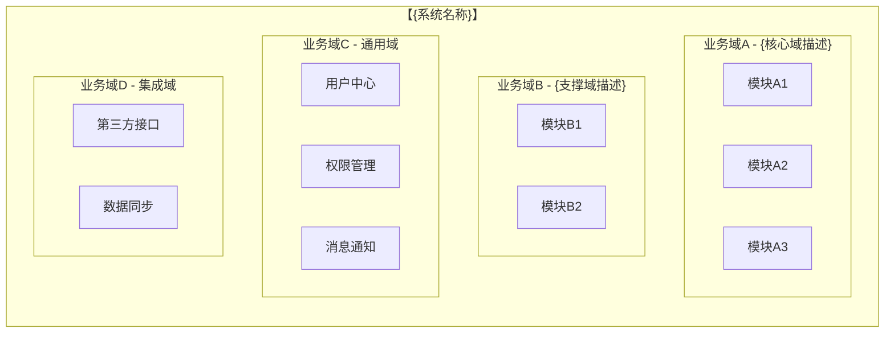
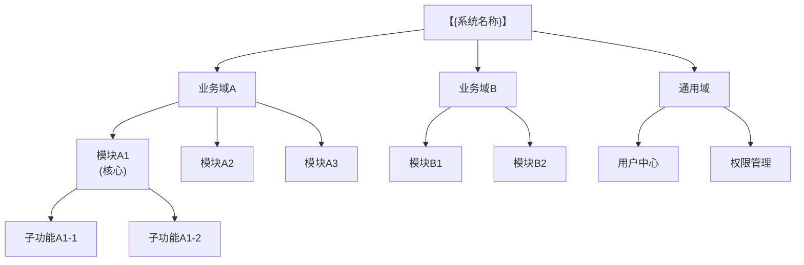
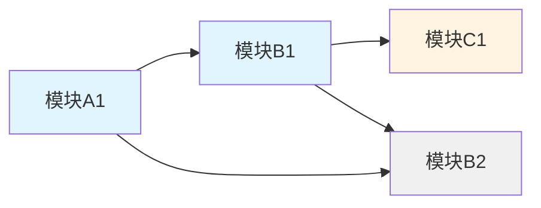
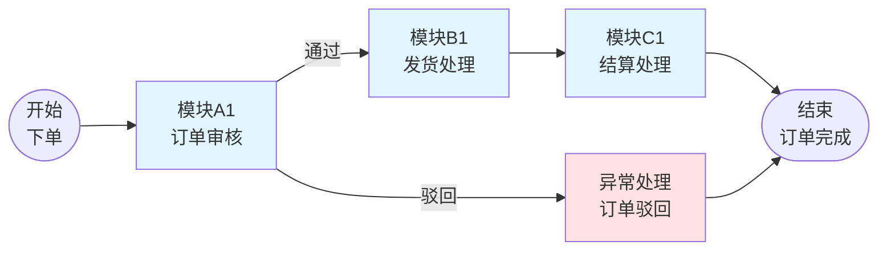
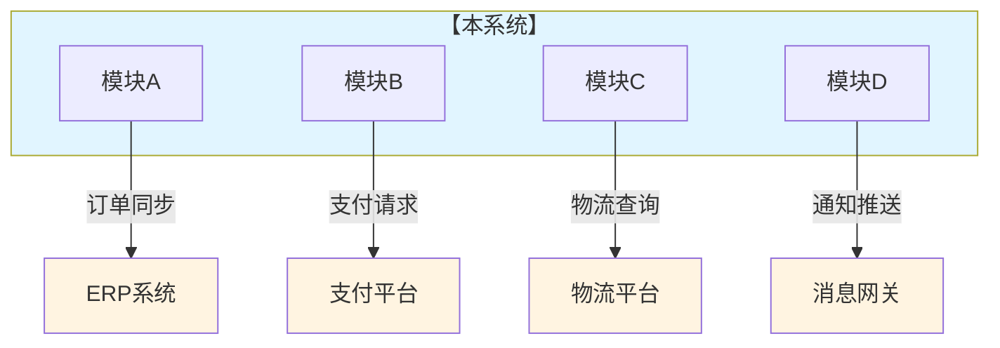

# 系统功能全景文档 - [系统名称]

> **适用场景**：ToB软件系统的功能全景地图，供AI Agent（PM Agent / Solution Agent）读取以理解系统结构、模块关系，辅助需求分析和方案规划
> **目标读者**：devcrew-product-manager, devcrew-solution-manager
> **更新频率**：随系统重大迭代更新
> 
> <!-- AI-TAG: SYSTEM_OVERVIEW -->
> <!-- AI-CONTEXT: 读取此文档以理解系统整体结构、模块划分、业务流程，用于需求影响范围判断和方案规划 -->

---

## 索引与概览

> **生成时间**：{{GeneratedAt}}  
> **技术栈**：{{TechStack}}  
> **源码路径**：`{{SourceRoot}}`

### 统计概览

| 指标 | 数量 |
|------|------|
| 业务模块 | {{ModuleCount}} |
| 数据实体 | {{EntityCount}} |
| API 接口 | {{ApiCount}} |
| 业务流程 | {{FlowCount}} |

### 模块快速索引

| 模块名称 | 所属业务域 | 模块职责 | 实体数 | API数 | 详细文档 |
|----------|------------|----------|--------|-------|----------|
{{#each modules}}
| {{name}} | {{domain}} | {{description}} | {{entityCount}} | {{apiCount}} | [查看](modules/MODULE-{{name}}/MODULE-{{name}}-OVERVIEW.md) |
{{/each}}

---

## 1. 系统概述

### 1.1 系统定位
| 项目 | 说明 |
|------|------|
| 系统名称 | {填写系统名称} |
| 核心定位 | {一句话描述系统解决什么业务问题} |
| 目标用户 | {主要用户群体，如：企业采购人员、仓储管理员} |
| 部署形态 | {BS/CS/移动端/混合} |

### 1.2 业务域划分

<!-- AI-TAG: DOMAIN_STRUCTURE -->
<!-- AI-NOTE: 业务域划分帮助AI理解系统边界和模块归属 -->

| 业务域 | 职责描述 | 核心模块 | 业务价值 |
|--------|----------|----------|----------|
| {业务域A} | {一句话描述} | {模块A1, A2, A3} | {解决什么问题} |
| {业务域B} | {一句话描述} | {模块B1, B2} | {解决什么问题} |

---

## 2. 功能模块拓扑

### 2.1 模块层级结构

<!-- AI-TAG: MODULE_HIERARCHY -->
<!-- AI-NOTE: 模块层级帮助AI理解功能组织关系 -->

### 2.2 模块依赖关系图

<!-- AI-TAG: MODULE_DEPENDENCIES -->
<!-- AI-NOTE: 模块依赖关系对Solution Agent进行方案规划至关重要，影响模块调用顺序和接口设计 -->

**依赖说明：**
- 箭头方向表示依赖关系（A → B 表示A依赖B）
- **核心模块**（蓝色）：{模块A1, B1} - 业务核心
- **外部依赖**（黄色）：{模块C1} - 外部系统
- **支撑模块**（灰色）：{模块B2} - 基础服务

### 2.3 模块清单索引

| 模块名称 | 所属业务域 | 模块职责 | 详细文档 | 状态 |
|----------|------------|----------|----------|------|
| {模块A1} | {业务域A} | {一句话职责} | [链接](module-A1.md) | ✅ 已上线 |
| {模块A2} | {业务域A} | {一句话职责} | [链接](module-A2.md) | 🚧 开发中 |
| {模块B1} | {业务域B} | {一句话职责} | [链接](module-B1.md) | ✅ 已上线 |

---

## 3. 端到端业务流程

### 3.1 核心业务流程清单

| 流程名称 | 涉及模块 | 流程描述 | 关键节点 |
|----------|----------|----------|----------|
| {流程1：如订单履约} | {模块A1→B1→C1} | {从下单到交付的全流程} | {下单→审核→发货→签收} |
| {流程2：如采购审批} | {模块A2→B2} | {从申请到采购完成} | {申请→审批→下单→入库} |

### 3.2 流程-模块映射矩阵

| 流程/模块 | 模块A1 | 模块A2 | 模块B1 | 模块B2 | 模块C1 |
|-----------|--------|--------|--------|--------|--------|
| 订单履约流程 | ✅ 创建 | - | ✅ 处理 | - | ✅ 结算 |
| 采购审批流程 | - | ✅ 申请 | - | ✅ 审批 | - |
| 库存盘点流程 | ✅ 触发 | - | - | ✅ 执行 | - |

> ✅ 表示该流程涉及此模块

### 3.3 典型业务流程图

<!-- AI-TAG: BUSINESS_FLOW -->
<!-- AI-NOTE: 业务流程帮助AI理解跨模块协作方式，对PM Agent判断需求影响范围和Solution Agent设计方案都很重要 -->

**流程示例：{订单履约流程}**

**流程说明：**
| 步骤 | 模块 | 处理内容 | 输出状态 |
|------|------|----------|----------|
| 1 | 模块A1 | 订单审核 | 通过/驳回 |
| 2 | 模块B1 | 发货处理 | 已发货 |
| 3 | 模块C1 | 结算处理 | 已结算 |

---

## 4. 系统边界与集成

### 4.1 外部系统集成图

<!-- AI-TAG: EXTERNAL_INTEGRATION -->
<!-- AI-NOTE: 外部集成信息对Solution Agent设计API和对接方案至关重要 -->

### 4.2 集成接口清单

| 集成方 | 集成类型 | 数据流向 | 集成内容 | 依赖模块 |
|--------|----------|----------|----------|----------|
| {ERP系统} | {API} | {本系统→ERP} | {订单同步} | {模块A1} |
| {支付平台} | {SDK} | {双向} | {支付/退款} | {模块C1} |

---

## 5. 需求评估指引

> **注意**：新需求评估请使用 `devcrew-pm-requirement-assess` skill

PM Agent 在收到新需求时，应：

1. **阅读本文档**理解系统结构和模块关系
2. **使用评估 Skill**进行标准化需求分析
3. **参考以下信息**定位影响范围：
   - 第1.2节：业务域划分
   - 第2.3节：模块清单索引
   - 第3.2节：流程-模块映射矩阵
   - 第4.2节：外部集成接口清单

---

## 6. 变更历史记录

| 日期 | 版本 | 变更内容 | 变更模块 | 变更类型 | 负责人 |
|------|------|----------|----------|----------|--------|
| {日期} | {v1.1} | {新增库存预警} | {模块B1} | {新增功能} | {张三} |
| {日期} | {v1.0} | {系统初始版本} | {全部} | {初始发布} | {李四} |

---

**文档状态：** 📝 草稿 / 👀 评审中 / ✅ 已发布  
**最后更新：** {日期}  
**维护人：** {姓名}
