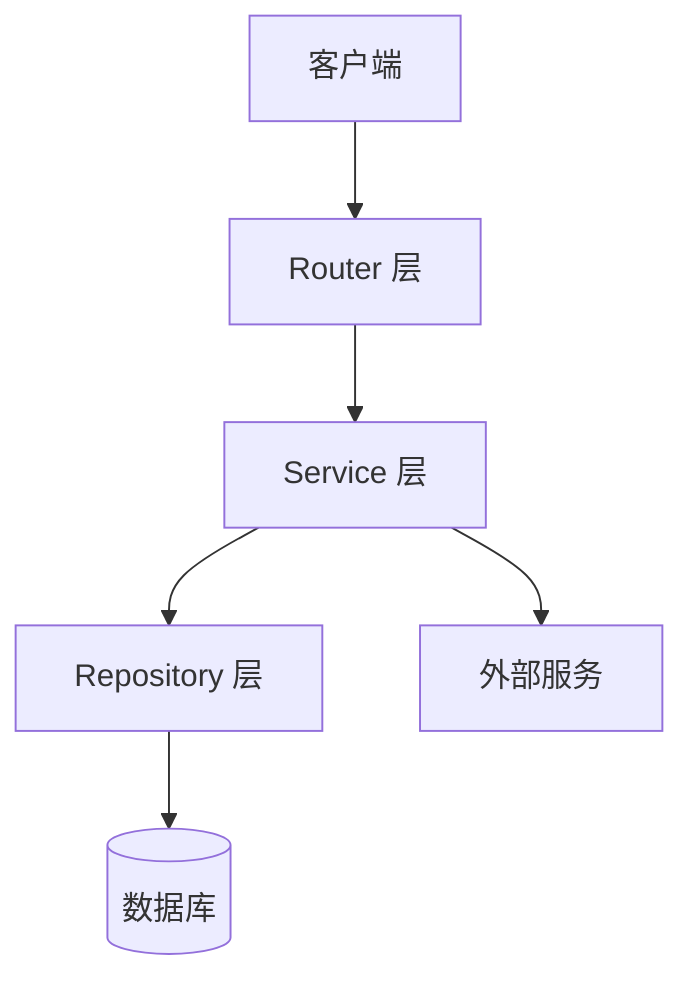
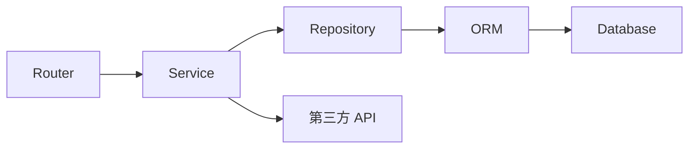

# 后端架构

> 使用者：后端设计 Agent（必须读）、后端开发 Agent（必须读）
> 维护者：amu-agent 初始化生成，后端架构调整时更新
> 数据来源：RepoWiki 后端架构章节 / 后端代码目录结构分析

---

## 引言

[描述后端技术选型背景、核心设计目标（如：高并发、流式响应、多租户隔离等）]

## 技术栈

| 技术 | 版本 | 用途 |
|------|------|------|
| [框架] | [版本] | [Web 框架 / 异步运行时 / ORM / 等] |

> 数据来源：`pyproject.toml` 依赖声明

## 项目结构

```
[后端根目录]/
├── [路由层目录]/     # 路由层（HTTP 入口）
├── [服务层目录]/     # 业务逻辑层
├── [数据层目录]/     # 数据访问层
├── [模型层目录]/     # 数据模型
├── [DTO层目录]/      # 请求/响应数据结构
└── [工具目录]/       # 工具函数
```

> 数据来源：项目目录结构分析

## 架构总览



> 图表来源：后端分层架构分析

## 分层规范

| 层 | 职责 | 禁止事项 |
|----|------|----------|
| Router 层 | 参数校验、路由分发、鉴权拦截 | 不写业务逻辑 |
| Service 层 | 业务逻辑处理、事务协调 | 不直接操作数据库 |
| Repository 层 | 数据库 CRUD 操作 | 不写业务规则 |

## 详细组件分析

### 接口规范

- **URL 命名**：[描述 URL 前缀、资源命名风格]
- **HTTP 方法**：[GET 查询 / POST 创建 / PUT 更新 / DELETE 删除]
- **统一响应结构**：

```json
{
  "code": 0,
  "data": {},
  "message": "success"
}
```

### 异常处理规范

[描述异常分类、错误码定义规则、统一异常处理中间件]

### 依赖注入规范

[描述依赖注入的使用方式（如 DI 框架或手动注入）、常用依赖项清单]

### 日志规范

[描述日志级别使用规则、日志格式、敏感信息脱敏要求]

## 依赖关系分析



> 图表来源：模块间依赖关系分析

## 性能考量

[描述异步处理策略、连接池配置、流式响应实现要点]

## 故障排查

| 症状 | 排查步骤 | 常见原因 |
|------|----------|----------|
| [症状描述] | [排查方法] | [常见原因] |

## 附录

- 后端代码规范详见：[`architecture/conventions/conventions.md`](../conventions/conventions.md)
- 数据层详见：[`architecture/data/data-arch.md`](../data/data-arch.md)
