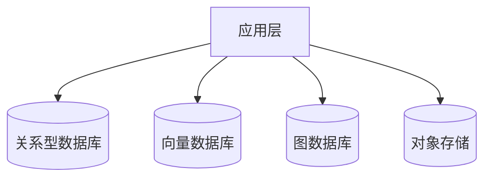
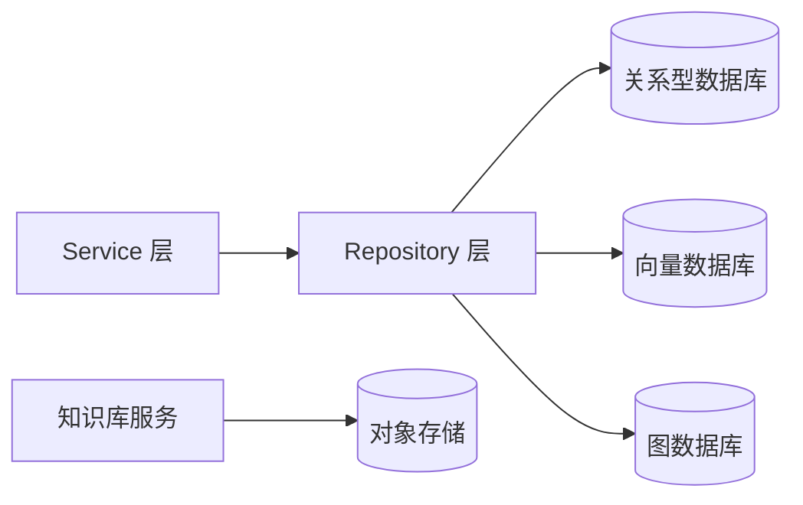

# 数据架构

> 使用者：Solution Agent（按需读，涉及数据库设计时）、后端设计 Agent（按需读）
> 维护者：amu-agent 初始化生成，数据库结构变更时更新
> 数据来源：RepoWiki 数据架构章节 / ORM 模型文件 / docker-compose.yml 服务声明

---

## 引言

[描述系统数据存储的整体设计思路，多存储协同方式，以及选型原因]

## 存储系统总览

| 存储 | 类型 | 版本 | 用途 |
|------|------|------|------|
| [存储名] | 关系型/向量/图/对象存储 | [版本] | [用途] |

> 数据来源：`docker-compose.yml` 服务声明

## 架构总览

> 图表来源：多存储架构分析

## 详细组件分析

### 关系型数据库

#### 核心表清单

| 表名 | 说明 | 关键字段 |
|------|------|----------|
| [表名] | [说明] | [字段列表] |

> 数据来源：ORM 模型文件分析

#### 命名规范

[描述表名、字段名的命名规则（如：snake_case、复数/单数、前缀约定等）]

#### 迁移规范

[描述数据库迁移工具使用方式、迁移文件命名规则、回滚策略]

### 向量数据库

[描述 Collection 设计、向量维度、索引类型、检索参数规范]

### 图数据库

[描述节点类型、关系类型、查询语言使用规范（如 Cypher）]

### 对象存储

[描述 Bucket 设计、文件命名规范、访问权限策略]

## 依赖关系分析

> 图表来源：Repository 层依赖关系分析

## 性能考量

[描述连接池大小配置、向量检索性能调优、大文件处理策略]

## 故障排查

| 症状 | 排查步骤 | 常见原因 |
|------|----------|----------|
| [症状描述] | [排查方法] | [常见原因] |

## 附录

- 后端 Repository 规范详见：[`architecture/backend/backend-arch.md`](../backend/backend-arch.md)
