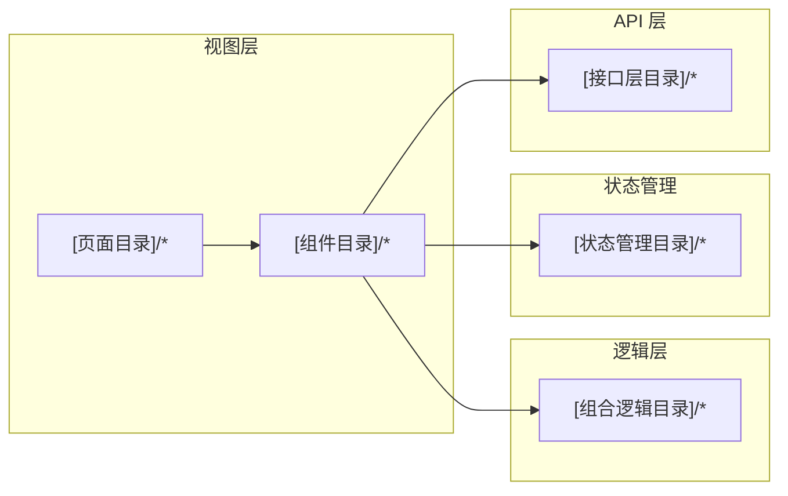

# 前端架构

> 使用者：前端设计 Agent（必须读）、前端开发 Agent（必须读）
> 数据来源：RepoWiki 前端架构章节 + 前端配置文件
> 维护者：amu-agent 初始化生成，前端架构调整时更新

---

## 技术栈

| 技术 | 版本 | 用途 |
|------|------|------|
| [框架] | [版本] | [用途] |

## 目录结构

```
[前端根目录]/src/
├── [接口层目录]/    # API 请求封装，按业务模块分文件
├── [静态资源目录]/  # 静态资源（图片、样式变量）
├── [公共组件目录]/  # 公共组件
├── [页面目录]/    # 页面级组件
├── [状态管理目录]/  # 全局状态管理
├── [路由目录]/    # 路由配置
├── [组合逻辑目录]/  # 可复用的组合式逻辑
└── [工具目录]/    # 工具函数
```

## 架构分层



## 路由规范

[描述路由命名规范、嵌套规则、权限控制方式（meta 字段）、全局前置守卫逻辑]

## 状态管理规范

[描述 Store 的命名、分模块规则、持久化策略、与组件的交互方式]

## API 调用规范

[描述 API 封装方式、统一错误处理、认证头处理、流式响应处理方式]

## 组件规范

[描述组件命名规范、Props 定义规范、事件命名规范、包括禁止的写法]

## 样式规范

[描述 CSS 变量使用规则、less/scss 规范、主题切换实现方式、禁止的样式写法]
