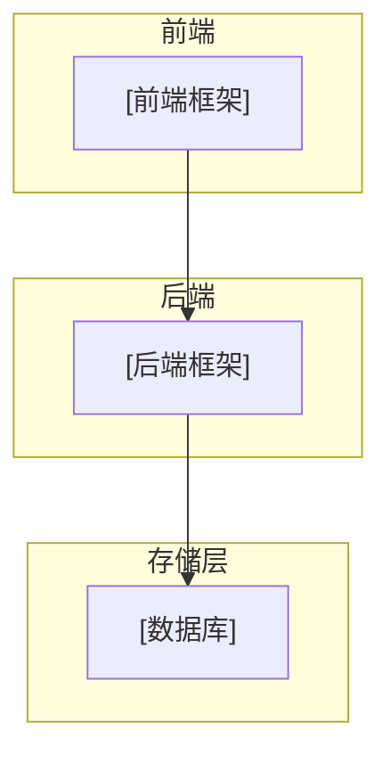

# 系统整体架构

> 使用者：Solution Agent（必须读）
> 数据来源：RepoWiki 架构设计章节 + 根目录配置文件
> 维护者：amu-agent 初始化生成，架构变更时更新

---

## 系统定位

[一句话描述系统是什么，解决什么问题]

## 技术栈

| 层 | 技术 | 版本 | 说明 |
|-----|------|------|---------|
| 前端 | [框架] | [版本] | [说明] |
| 后端 | [框架] | [版本] | [说明] |
| 存储 | [数据库] | [版本] | [用途] |

## 架构总览

## 核心模块

| 模块 | 技术 | 目录/入口 | 职责 |
|------|------|----------|------|
| [模块] | [技术] | [路径] | [职责] |

## 外部依赖

| 依赖 | 类型 | 用途 |
|------|------|------|
| [依赖名] | 数据库/对象存储/消息队列 | [用途] |

## 部署方式

[描述容器化/部署方式，如 Docker Compose 编排，开发环境与生产环境的差异]
