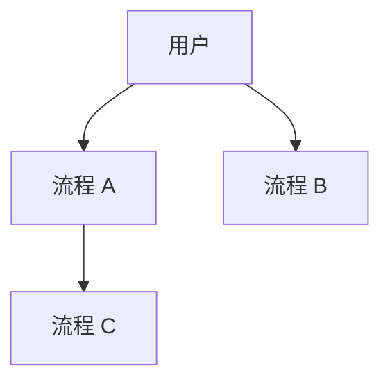

# 核心业务流程

> 使用者：PM Agent（按需读）、Solution Agent（按需读）
> 维护者：amu-agent 初始化自动生成，业务流程变化时更新
> 数据来源：RepoWiki 业务流程章节（优先）/ 前后端路由调用关系分析

---

## 引言

[描述系统核心业务场景和主要流程概览]

## 流程总览



> 图表来源：业务流程之间关系分析

## 流程清单

| 流程 | 涉及模块 | 详情文件 |
|------|----------|----------|
| [流程名] | [模块 1, 模块 2] | [文件链接] |

> 数据来源：RepoWiki 业务流程章节

---

## 流程详情文件规范

每个核心流程对应一个独立文件 `[flow-name].md`，格式如下：

```markdown
# [流程名]

> 数据来源：RepoWiki [流程相关章节] / [相关路由文件]

## 流程说明

[该流程描述的业务场景和触发条件]

## 流程图

​```mermaid
sequenceDiagram
    参与者A->>+参与者B: 操作描述
    参与者B-->>-参与者A: 返回描述
​```

## 关键节点说明

| 节点 | 说明 | 涉及系统 |
|------|------|----------|
| [节点] | [说明] | [系统/模块] |

## 异常路径

[描述流程中的异常分支和处理方式]

## 性能考量

[描述该流程的性能敏感点和优化策略]
```

## 附录

- 业务模块详见：[`bizs/modules/modules.md`](../modules/modules.md)
