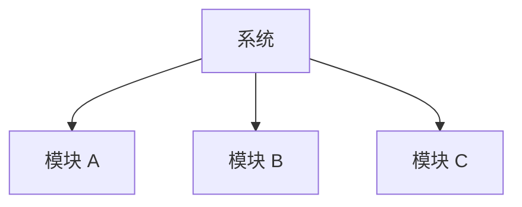

# 业务模块清单

> 使用者：PM Agent（必须读）、Solution Agent（必须读）
> 维护者：每次新功能上线后更新
> 数据来源：RepoWiki 核心功能模块章节 / `server/routers/` 路由分析 / 前端路由定义

---

## 引言

[描述系统整体业务范围和模块划分原则]

## 模块总览



> 图表来源：前后端路由模块划分分析

## 模块清单

| 模块 | 状态 | 简述 | 详情文件 |
|------|------|------|----------|
| [模块名] | 已上线 / 开发中 / 规划中 | [一句话描述] | [文件链接] |

> 数据来源：RepoWiki 核心功能模块章节

---

## 模块详情文件规范

每个业务模块对应一个独立文件 `[module-name].md`，格式如下：

```markdown
# [模块名]

> 数据来源：RepoWiki [模块名]章节 / [相关路由文件]

## 功能描述

[该模块提供什么能力]

## 架构总览

```mermaid
graph TB
    [模块内局部流转图]
```

## 核心流程

[主要业务流程描述，引用 bizs/flows/ 相关流程]

## 主要入口

| 类型 | 路径 |
|------|------|
| 前端路由 | [路由路径] |
| 后端接口 | [接口路径] |

## 数据范围

[涉及的主要数据表]

## 已知限制

[当前版本的已知局限或待优化点]
```

## 附录

- 业务流程详见：[`bizs/flows/flows.md`](../flows/flows.md)
