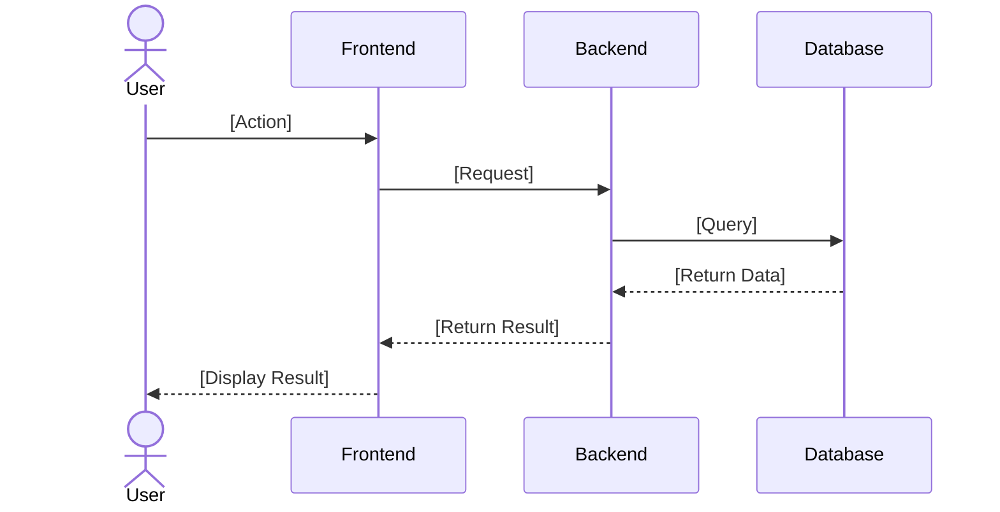
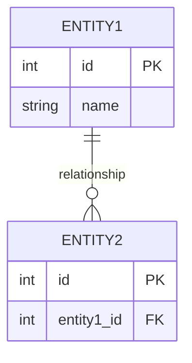

# Solution - [Feature Name]

> Based on PRD: [Link to corresponding PRD file]

## 1. Function Overview

### 1.1 Function Summary
[One sentence describing what this feature does]

### 1.2 Scope
- **Frontend Pages**: [List involved pages]
- **Backend Modules**: [List involved modules]
- **Database Tables**: [List involved tables]

## 2. Existing Reusable Modules

| Module | Location | Reuse Method |
|--------|----------|--------------|
| [Module Name] | [Path] | [Direct Reuse/Modified Reuse] |

## 3. New/Modified Modules

### 3.1 Frontend

| Module | Type | Path | Description |
|--------|------|------|-------------|
| [Component Name] | Component | `web/src/components/...` | [Description] |
| [API] | API | `web/src/apis/...` | [Description] |

### 3.2 Backend

| Module | Type | Path | Description |
|--------|------|------|-------------|
| [API] | Router | `server/routers/...` | [Description] |
| [Service] | Service | `src/services/...` | [Description] |

## 4. UI Prototype Description

### 4.1 Page List

| Page | Route | Main Elements | Interaction Description |
|------|-------|---------------|-------------------------|
| [Page 1] | `/xxx` | [Elements] | [Interaction] |

### 4.2 Core Interaction Flow
[Describe how users flow through this feature]

## 5. Sequence Diagram



## 6. Business Logic

### 6.1 Core Flow
[Describe the core business logic processed by backend]

### 6.2 Exception Handling

| Exception Scenario | Error Code | Handling Method |
|--------------------|------------|-----------------|
| [Scenario] | [Code] | [Handling] |

## 7. Data Model

### 7.1 ER Diagram



### 7.2 Field Description

| Table Name | Field | Type | Description |
|------------|-------|------|-------------|
| [Table] | [Field] | [Type] | [Description] |

## 8. API Contract

### 8.1 [API Name]

**URL:** `POST /api/v1/xxx`

**Request Parameters:**

| Field | Type | Required | Description |
|-------|------|----------|-------------|
| [Field] | [Type] | Yes/No | [Description] |

**Response Structure:**

```json
{
  "code": 0,
  "data": {
    "[field]": "[type]"
  }
}
```

---

**Solution Status:** 📝 Draft / 👀 In Review / ✅ Confirmed  
**Confirmation Date:** [Date]  
**Confirmed By:** [Name]
