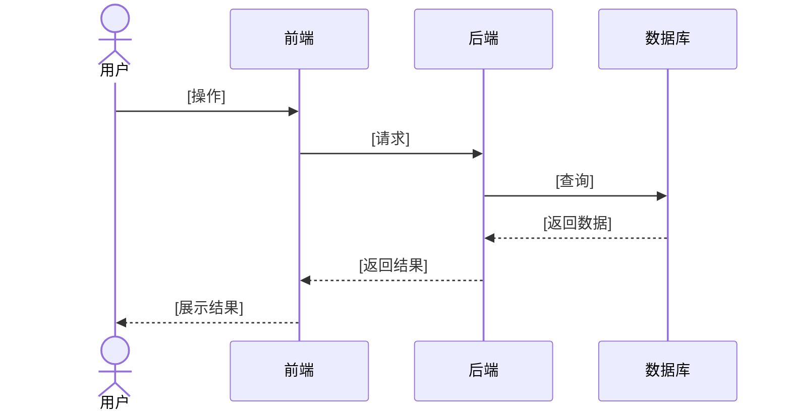
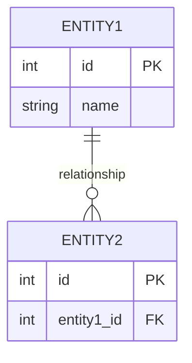

# Solution - [功能名称]

> 基于 PRD：[链接到对应 PRD 文件]

## 1. 功能概述

### 1.1 功能摘要
[一句话描述这个功能做什么]

### 1.2 涉及范围
- **前端页面**：[列出涉及的页面]
- **后端模块**：[列出涉及的模块]
- **数据库表**：[列出涉及的表]

## 2. 现有复用模块

| 模块 | 位置 | 复用方式 |
|------|------|----------|
| [模块名] | [路径] | [直接复用/修改复用] |

## 3. 新增/修改模块

### 3.1 前端

| 模块 | 类型 | 路径 | 说明 |
|------|------|------|------|
| [组件名] | 组件 | `web/src/components/...` | [说明] |
| [API] | API | `web/src/apis/...` | [说明] |

### 3.2 后端

| 模块 | 类型 | 路径 | 说明 |
|------|------|------|------|
| [接口] | Router | `server/routers/...` | [说明] |
| [服务] | Service | `src/services/...` | [说明] |

## 4. UI 原型描述

### 4.1 页面清单

| 页面 | 路由 | 主要元素 | 交互说明 |
|------|------|----------|----------|
| [页面1] | `/xxx` | [元素] | [交互] |

### 4.2 核心交互流
[描述用户如何在这个功能中流转]

## 5. 时序图



## 6. 业务逻辑

### 6.1 核心流程
[描述后端处理的核心业务逻辑]

### 6.2 异常处理

| 异常场景 | 错误码 | 处理方式 |
|----------|--------|----------|
| [场景] | [码] | [处理] |

## 7. 数据模型

### 7.1 ER 图



### 7.2 字段说明

| 表名 | 字段 | 类型 | 说明 |
|------|------|------|------|
| [表] | [字段] | [类型] | [说明] |

## 8. API 契约

### 8.1 [接口名称]

**URL：** `POST /api/v1/xxx`

**请求参数：**

| 字段 | 类型 | 必填 | 说明 |
|------|------|------|------|
| [字段] | [类型] | 是/否 | [说明] |

**响应结构：**

```json
{
  "code": 0,
  "data": {
    "[字段]": "[类型]"
  }
}
```

---

**Solution 状态：** ⬜ 草稿 / ⬜ 评审中 / ⬜ 已确认  
**确认日期：** [日期]  
**确认人：** [姓名]
