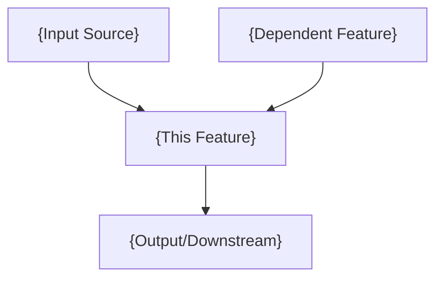
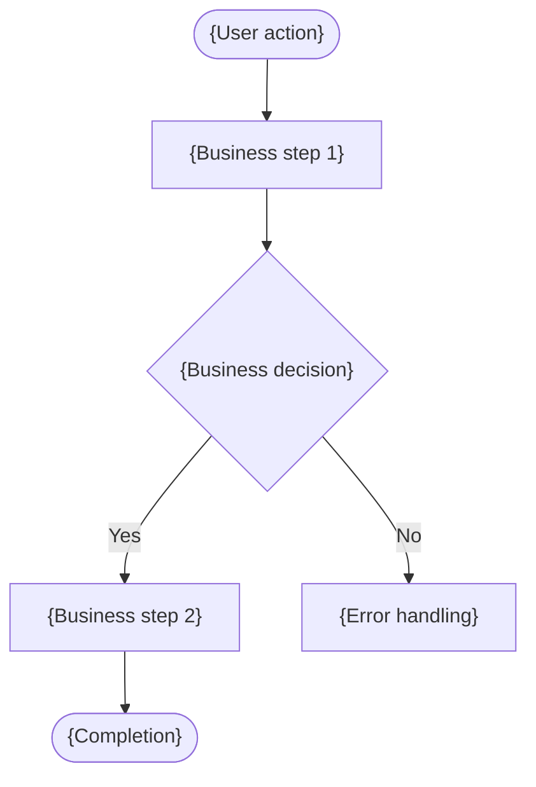

<!-- AI-NOTE: CRITICAL — Business Perspective Guidelines
This Feature Analysis is a PURE BUSINESS document. It describes WHAT the system needs to do, NOT HOW it will be implemented.

FORBIDDEN content (DO NOT include any of these):
- ❌ File paths (src/views/..., yudao-module-xxx/...)
- ❌ Framework/library names as implementation (MyBatis-Plus, MapStruct, Element Plus, wot-design-uni)
- ❌ Code snippets in any language (Java, SQL, Vue, TypeScript)
- ❌ Database table/column names (appointment_info, customer_id)
- ❌ Technical types (BIGINT, VARCHAR, Long, String)
- ❌ Component names (ElDatePicker, wd-cell, el-button)
- ❌ Framework annotations (@PreAuthorize, @TableLogic, @OperateLog)
- ❌ ASCII text flowcharts (use Mermaid instead)

REQUIRED:
- ✅ Business-level descriptions only
- ✅ Mermaid diagrams for all flows (flowchart TB, sequenceDiagram)
- ✅ [EXISTING]/[MODIFIED]/[NEW] system relationship markers
-->

# Feature Analysis: {feature-name}

## Feature Information

| Item | Value |
|------|-------|
| Feature ID | {feature_id} |
| Feature Name | {feature_name} |
| Feature Type | {Page+API / API / Page} |
| Source PRD | {prd_relative_path} |
| Iteration | {iteration_id} |
| Analysis Date | {date} |

---

## System Context Summary

<!-- AI-NOTE: Provide a business-level overview of how this feature fits into the system.
Describe existing system capabilities that this feature can leverage.
Use BUSINESS terms only — do NOT mention specific frameworks, libraries, or technical components.

✅ CORRECT: "Leverages existing user authentication and role-based access control"
❌ WRONG: "Uses Spring Security @PreAuthorize and yudao-module-system AuthController" -->

### System Overview

{Brief description of the system and how this feature relates to it}

### Existing Reusable Capabilities

| Capability | Relevance to This Feature |
|------------|--------------------------|
| {e.g., User Authentication} | {e.g., All operations require authenticated sessions} |
| {e.g., Role-based Access} | {e.g., Different data visibility per role} |

### Feature Dependencies

| Dependent Feature | Dependency Type | Description |
|-------------------|-----------------|-------------|
| {e.g., F-CUST-001 Customer Management} | Data | {e.g., Appointment links to customer records} |

### Business Data Flow

<!-- AI-NOTE: Use Mermaid flowchart to show data flow. NO ASCII text diagrams. -->

---

## Frontend Platforms

| Platform ID | Type | Description |
|-------------|------|-------------|
| {platform_id} | {Web/Mobile} | {Brief platform description} |

---

## Function Breakdown (Total: {N} functions)

<!-- AI-NOTE: List all functions identified from the PRD.
Each function should be a distinct business capability, NOT a technical component.
✅ CORRECT: "Appointment List with Search/Filter"
❌ WRONG: "AppointmentController REST endpoints" -->

| # | Function Name | Type | Related User Stories | System Relationship |
|---|--------------|------|---------------------|---------------------|
| F1 | {business function name} | {frontend/backend/both} | {user story references} | [NEW]/[EXISTING]/[MODIFIED] |

---

## Function Details

<!-- AI-NOTE: Repeat this section for each function.
ALL descriptions must be from BUSINESS perspective.
FORBIDDEN: file paths, class names, component names, database tables, SQL, code snippets.
Use Mermaid for any process flows. -->

### F1: {Function Name}

**Description**: {1-2 sentence business description of what this function does for the user}

- **Frontend Changes ({platform_id})**:
  <!-- AI-NOTE: Describe WHAT pages/screens/interactions are needed from a user perspective.
  ✅ "New appointment list page with multi-criteria search, role-based data filtering, and status indicators"
  ❌ "New AppointmentIndex.vue with ElDatePicker, v-hasPermi directive, el-button components" -->
  - {[NEW/MODIFIED]} {Business description of the page/interaction}

- **Backend Changes**:
  <!-- AI-NOTE: Describe WHAT business operations are needed, not HOW they're implemented.
  ✅ "Paginated query supporting customer name, date range, and status filters with role-based data isolation"
  ❌ "GET /appointment/page endpoint with @PreAuthorize, using BaseMapperX" -->
  - {[NEW/MODIFIED]} {Business description of the operation}

- **Data Changes**:
  <!-- AI-NOTE: Describe WHAT data entities are needed at a conceptual level.
  ✅ "New Appointment entity with: ID, customer reference, staff reference, date/time, status lifecycle"
  ❌ "New appointment_info table with customer_id BIGINT, staff_id BIGINT, CREATE TABLE..." -->
  - {[NEW/MODIFIED]} {Business description of data entities and key attributes}

- **System Relationship**: {[NEW]/[EXISTING]/[MODIFIED]} — {explanation of how this relates to existing system capabilities}

**Business Flow**:

---

## Name Discrepancy Notice (if applicable)

<!-- AI-NOTE: Only include this section if parameter feature_name differs from PRD feature name -->

| Item | Value |
|------|-------|
| Parameter feature_name | {feature_name} |
| PRD actual feature name | {prd_name} |
| Discrepancy | {description} |
| File naming follows | parameter value (as per Filename Lock Rule) |

---

## Summary Statistics

| Item | Count |
|------|-------|
| Total Functions | {N} |
| [NEW] Functions | {count} |
| [MODIFIED] Functions | {count} |
| [EXISTING] Reused Capabilities | {count} |
| Frontend Platforms | {count} |

---

## Decomposition Status

| Checkpoint | Status | Timestamp |
|------------|--------|-----------|
| Checkpoint A | {passed/pending} | {timestamp or null} |

---

## Checklist

- [ ] PRD read and all requirements covered
- [ ] System knowledge loaded
- [ ] Function breakdown complete with [NEW]/[EXISTING]/[MODIFIED] markers
- [ ] Function count within 3-8 range (Single Feature Mode)
- [ ] **CRITICAL — Business content only**: Zero file paths, framework names, code snippets, SQL, database artifacts, component names
- [ ] **CRITICAL — Mermaid diagrams**: All flows use Mermaid syntax, no ASCII flowcharts
- [ ] Checkpoint A passed
