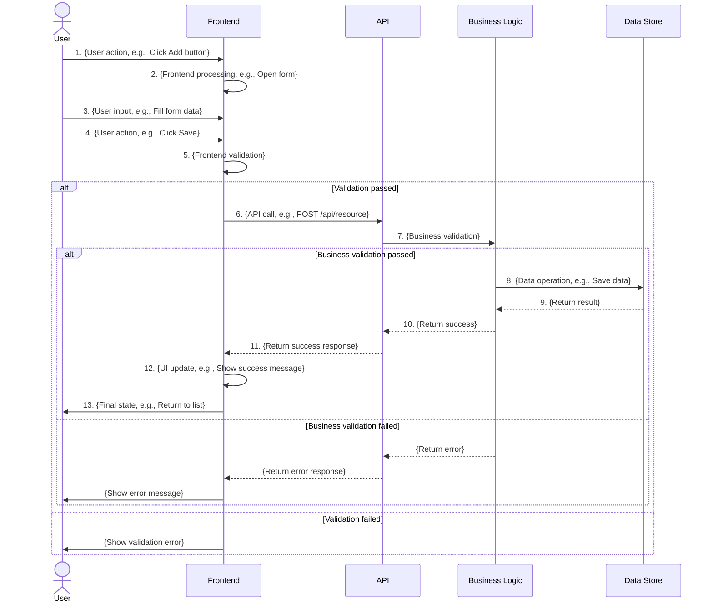
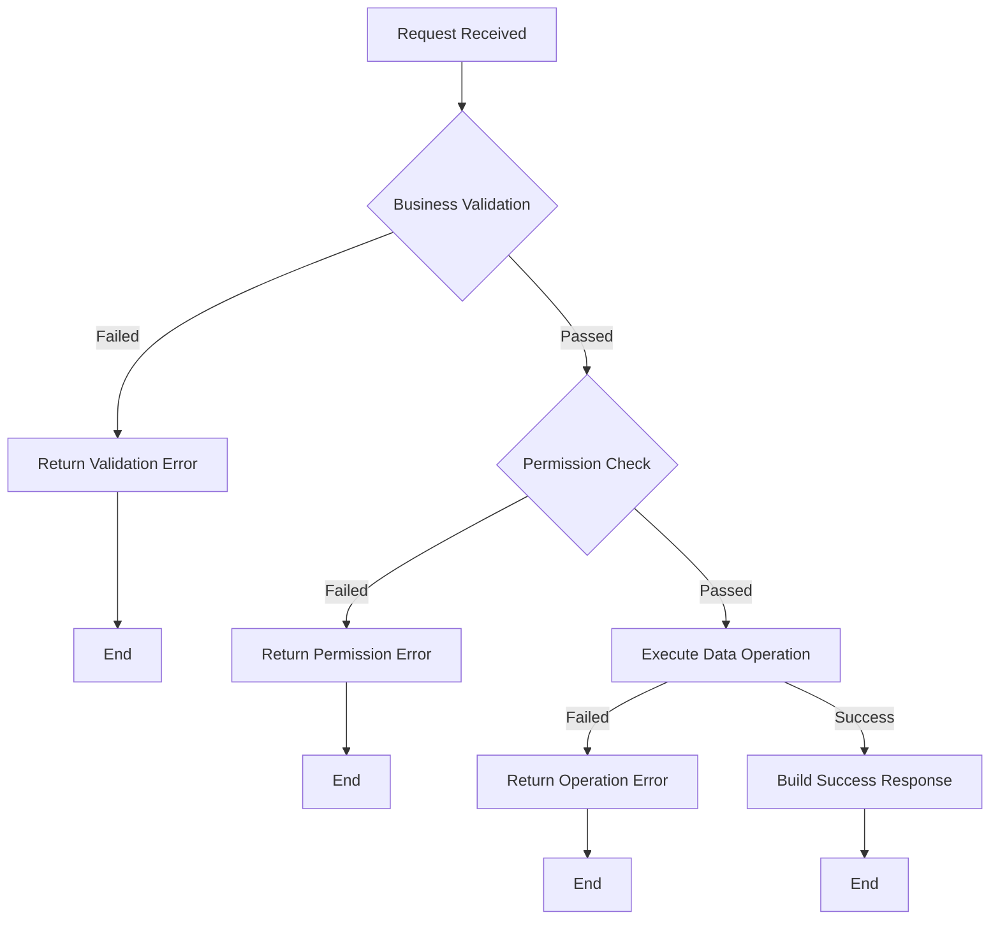
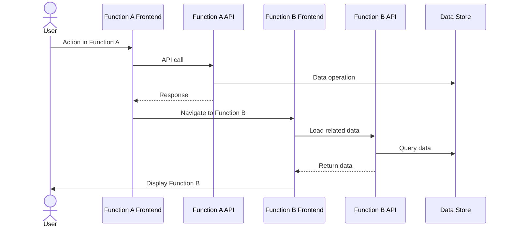

# Feature Specification - [Feature Name]

> **Applicable Scenario**: System feature specification for a single feature or module
> **Target Audience**: speccrew-feature-designer, speccrew-designer, speccrew-dev
> **Source PRD**: [Link to PRD document]

---

## 1. Overview

### 1.1 Basic Information

| Item | Description |
|------|-------------|
| Feature ID | {Feature ID, e.g., F-CRM-01} |
| Feature Name | {Feature Name} |
| Feature Type | {Page+API / API-only} |
| Source PRD | {Link to Sub-PRD document} |
| Module | {Module Name} |
| Core Function | {1-3 sentences describing core feature value} |
| Target Users | {Describe target user groups} |
| Applicable Scenario | {Describe core applicable business scenarios} |

### 1.2 Feature Scope

<!-- AI-NOTE: This specification covers a SINGLE Feature (business operation unit), not the entire module. Check all items that this specification covers. -->

- [ ] {Function 1} - Frontend prototype + Interaction flow + Backend interface + Data definition
- [ ] {Function 2} - Frontend prototype + Interaction flow + Backend interface + Data definition
- [ ] {Function 3} - Frontend prototype + Interaction flow + Backend interface + Data definition

### 1.3 Relationship to Existing System

| Module | Relationship Type | Description |
|--------|-------------------|-------------|
| {Module A} | EXISTING | {This module already exists, this feature reads data from it} |
| {Module B} | MODIFIED | {This module will be modified to support new functionality} |
| {Module C} | NEW | {This is a new module created for this feature} |

---

## 2. Function Details

<!-- AI-NOTE: Repeat Section 2.N for each function in the feature. Each function should include: frontend prototype, interaction flow, backend interface, and data definition. -->

### 2.1 Function: {Function Name}

#### 2.1.1 Frontend Prototype

<!-- AI-NOTE: If the project has multiple frontend platforms (e.g., web + mobile), create separate Frontend Prototype sub-sections for each platform. Use headers like "#### 2.1.1 Frontend Prototype - Web" and "#### 2.1.1b Frontend Prototype - Mobile". Each platform should have its own wireframes and element descriptions tailored to the platform's interaction patterns. -->

<!-- AI-NOTE: Use ASCII wireframes to show the UI layout. Choose the appropriate pattern below based on the interface type. -->

**Pattern A: List Page**

```
┌─────────────────────────────────────────────────────────────┐
│ [Page Title] {e.g., Product Management List}                │
├─────────────────────────────────────────────────────────────┤
│ ┌─────────────┬─────────────┬─────────────┬─────────────┐  │
│ │ Filter Area │ □ Checkbox  │ Input □     │ Dropdown ▼  │  │
│ │             │ Keyword:____|____________ │ Status:_____▼│  │
│ │             │ [Query]     [Reset]  [Add]                 │  │
│ └─────────────┴─────────────┴─────────────┴─────────────┘  │
│                                                             │
│ ┌─────────────────────────────────────────────────────────┐ │
│ │ No.  │ Field 1 │ Field 2 │ Field 3 │ Actions         │ │
│ ├──────┼─────────┼─────────┼─────────┼─────────────────┤ │
│ │ 1    │ {Value} │ {Value} │ {Value} │ [Edit][Delete]  │ │
│ │ 2    │ {Value} │ {Value} │ {Value} │ [Edit][Delete]  │ │
│ │ ...  │ ...     │ ...     │ ...     │ ...             │ │
│ └──────┴─────────┴─────────┴─────────┴─────────────────┘ │
│                                                             │
│ ┌─────────────────────────────────────────────────────────┐ │
│ │ Pagination: Total {X} records  Page [1][2][3]  {X}/page ▼│ │
│ └─────────────────────────────────────────────────────────┘ │
└─────────────────────────────────────────────────────────────┘
```

**Pattern B: Form Page**

```
┌─────────────────────────────────────────────────────────────┐
│ [Page Title] {e.g., Add Product}                            │
├─────────────────────────────────────────────────────────────┤
│ ┌─────────────────────────────────────────────────────────┐ │
│ │ Basic Information Area                                    │ │
│ │ ┌─────────────┬───────────────────────────────────────┐ │ │
│ │ │ Label       │ Input/Select                           │ │ │
│ │ │ Product:    │ ____|__________________________________ │ │ │
│ │ │ Code:       │ ____|__________________________________ │ │ │
│ │ │ Status:     │ □ Enable  □ Disable                   │ │ │
│ │ │ Category:   │ ______▼                               │ │ │
│ │ └─────────────┴───────────────────────────────────────┘ │ │
│ └─────────────────────────────────────────────────────────┘ │
│                                                             │
│ ┌─────────────────────────────────────────────────────────┐ │
│ │ [Save]                    [Cancel]                       │ │
│ └─────────────────────────────────────────────────────────┘ │
└─────────────────────────────────────────────────────────────┘
```

**Pattern C: Modal/Dialog**

```
┌─────────────────────────────────────────────────────────────┐
│ ┌─────────────────────────────────────────────────────────┐ │
│ │ [Modal Title] {e.g., Delete Confirmation}               │ │
│ ├─────────────────────────────────────────────────────────┤ │
│ │                                                         │ │
│ │ Message: {e.g., Are you sure to delete this product?    │ │
│ │           This action cannot be undone!}                │ │
│ │                                                         │ │
│ ├─────────────────────────────────────────────────────────┤ │
│ │            [Cancel]        [Confirm]                     │ │
│ └─────────────────────────────────────────────────────────┘ │
└─────────────────────────────────────────────────────────────┘
```

**Pattern M-A: Mobile Card List**

<!-- AI-NOTE: Use this pattern instead of Pattern A when designing for mobile platforms -->

```
+----------------------------------+
|  < Back     Title       [+ Add]  |
+----------------------------------+
|  [Search...]            [Filter] |
+----------------------------------+
|  +----------------------------+  |
|  | Title          Status Tag  |  |
|  | Subtitle / Key info        |  |
|  | Detail line      [Action]  |  |
|  +----------------------------+  |
|  +----------------------------+  |
|  | Title          Status Tag  |  |
|  | Subtitle / Key info        |  |
|  | Detail line      [Action]  |  |
|  +----------------------------+  |
|                                  |
|  [Load More / Pull to Refresh]   |
+----------------------------------+
|  [Tab1] [Tab2] [Tab3] [Tab4]    |
+----------------------------------+
```

**Pattern M-B: Mobile Form**

<!-- AI-NOTE: Use this pattern instead of Pattern B when designing for mobile platforms -->

```
+----------------------------------+
|  < Back     Title       [Save]   |
+----------------------------------+
|  Label                           |
|  [Full-width input          ]    |
|                                  |
|  Label                           |
|  [Full-width input          ]    |
|                                  |
|  Label                           |
|  [Picker / Selector         >]   |
|                                  |
|  Label                           |
|  [Switch toggle            O ]   |
+----------------------------------+
```

**Pattern M-C: Action Sheet**

<!-- AI-NOTE: Use this pattern instead of Pattern C when designing for mobile platforms -->

```
+----------------------------------+
| (dimmed background)              |
|                                  |
|  +----------------------------+  |
|  | Action Sheet Title         |  |
|  +----------------------------+  |
|  | Option 1                   |  |
|  +----------------------------+  |
|  | Option 2                   |  |
|  +----------------------------+  |
|  | Cancel                     |  |
|  +----------------------------+  |
+----------------------------------+
```

**Interface Element Description:**

| Area | Element | Type | Description | Interaction |
|------|---------|------|-------------|-------------|
| {Area Name} | {Element Name} | {Input/Button/Link/etc} | {Description of purpose} | {Click/Blur/Change behavior} |
| {Area Name} | {Element Name} | {Type} | {Description} | {Interaction} |

#### 2.1.2 Interaction Flow

<!-- AI-NOTE: Use Mermaid sequenceDiagram to show the flow: User → Frontend → Backend API → Data Store. NO style definitions allowed. NO HTML tags. CRITICAL: This section MUST contain mermaid syntax. Plain text or ASCII flowcharts are FORBIDDEN. -->



**Interaction Rules:**

| Trigger | Behavior | API Called | Exception Handling |
|---------|----------|------------|-------------------|
| {Trigger event} | {Behavior description} | {API name or -} | {Exception handling} |
| {Trigger} | {Behavior} | {API} | {Exception} |

#### 2.1.3 Backend Interface

**Interface List:**

| Interface Name | Method | Path Pattern | Description | Caller |
|----------------|--------|--------------|-------------|--------|
| {Interface Name} | GET/POST/PUT/DELETE | {/api/path/pattern} | {Description} | {Frontend/Other} |
| {Interface Name} | {Method} | {Path} | {Description} | {Caller} |

**Processing Logic:**

<!-- AI-NOTE: Use Mermaid flowchart TD to show the processing logic for each core interface. Show: business validation → data operation → response. NO style definitions allowed. CRITICAL: This section MUST contain mermaid syntax. Plain text or ASCII flowcharts are FORBIDDEN. -->



**Data Access:**

| Operation | Data Structure | Access Type | Description |
|-----------|----------------|-------------|-------------|
| {e.g., Query list} | {Structure name} | Read | {Description of access} |
| {e.g., Create record} | {Structure name} | Create | {Description} |
| {e.g., Update record} | {Structure name} | Write | {Description} |

#### 2.1.4 Data Definition

**Fields:**

| Field Name | Field Type | Data Format | Constraint Rules | New/Existing | Remarks |
|------------|------------|-------------|------------------|--------------|---------|
| {Field Name} | String/Number/Boolean/Date/Enum | {e.g., length ≤32, phone format} | {Required/Optional, Unique, Default value} | NEW/EXISTING | {Additional notes} |
| {Field Name} | {Type} | {Format} | {Constraints} | NEW/EXISTING | {Remarks} |

**Data Source:**

| Field Name | Data Source | Update Timing | Description |
|------------|-------------|---------------|-------------|
| {Field Name} | User input | On form submission | {Description} |
| {Field Name} | System generated | On record creation | {e.g., Auto-generated ID} |
| {Field Name} | Reference from {source} | {Timing} | {Description} |

---

### 2.2 Function: {Function Name}

<!-- AI-NOTE: Repeat the same structure as 2.1 for each additional function -->

#### 2.2.1 Frontend Prototype

<!-- AI-NOTE: If multi-platform, create separate wireframes per platform (Web + Mobile) -->

{ASCII wireframe and element description per platform}

#### 2.2.2 Interaction Flow

{Mermaid sequenceDiagram and interaction rules}

#### 2.2.3 Backend Interface

{Interface list, processing logic flowchart, data access}

#### 2.2.4 Data Definition

{Fields and data source}

---

## 3. Cross-Function Concerns

### 3.1 Shared Data Structures

<!-- AI-NOTE: List data structures used across multiple functions -->

| Structure Name | Used By Functions | Description |
|----------------|-------------------|-------------|
| {Structure Name} | {Function 1}, {Function 2} | {Description} |
| {Structure Name} | {Functions} | {Description} |

### 3.2 Cross-Function Flows

<!-- AI-NOTE: Use Mermaid sequenceDiagram for flows that span multiple functions. NO style definitions. NO HTML tags. -->



---

## 4. Business Rules & Constraints

### 4.1 Permission Rules

| Operation | Permission Requirement | No Permission Handling |
|-----------|----------------------|----------------------|
| {Operation name} | {Role/Permission required} | {How to handle - hide button, show error, etc.} |
| {Operation} | {Requirement} | {Handling} |

### 4.2 Business Logic Rules

<!-- AI-NOTE: Numbered list of business rules -->

1. **{Rule Name}**: {Detailed description of the rule}
2. **{Rule Name}**: {Detailed description}
3. **{Rule Name}**: {Detailed description}

### 4.3 Validation Rules

| Scenario | Rule | Prompt Message | Validation Timing |
|----------|------|----------------|-------------------|
| {Scenario} | {Validation rule} | {Error message to show} | {Frontend/Backend/Both} |
| {Scenario} | {Rule} | {Message} | {Timing} |

---

## 5. API Contract Summary

### 5.1 Complete API List

| API Name | Method | Path | Description | Related Function |
|----------|--------|------|-------------|------------------|
| {API Name} | GET/POST/PUT/DELETE | {/api/path} | {Description} | {Function Name} |
| {API Name} | {Method} | {Path} | {Description} | {Function Name} |

### 5.2 Shared Response Format

<!-- AI-NOTE: Standard response JSON structure used across all APIs in this feature -->

**Success Response:**

```json
{
  "code": 0,
  "message": "success",
  "data": {
    "{field1}": "{value1}",
    "{field2}": "{value2}"
  }
}
```

**Error Response:**

```json
{
  "code": {error_code},
  "message": "{error_message}",
  "data": null
}
```

### 5.3 Common Error Codes

| Error Code | HTTP Status | Description |
|------------|-------------|-------------|
| {Code} | {Status} | {Description} |
| {Code} | {Status} | {Description} |

---

## 6. Notes

### 6.1 Pending Confirmations

<!-- AI-NOTE: Checklist of items needing confirmation from stakeholders -->

- [ ] **{Item 1}**: {Description of what needs confirmation}
- [ ] **{Item 2}**: {Description}

### 6.2 Assumptions & Dependencies

<!-- AI-NOTE: List assumptions made and external dependencies -->

- **Assumption 1**: {Description of assumption}
- **Dependency 1**: {External system or module this feature depends on}

### 6.3 Extension Notes

<!-- AI-NOTE: Notes about future iterations or extensions -->

- {Note about potential future enhancements}
- {Note about scalability considerations}

---

**Document Status:** Draft / In Review / Published
**Last Updated:** {Date}
**Source PRD:** [PRD Document](link)
**Related Module:** [Module Overview](link)
