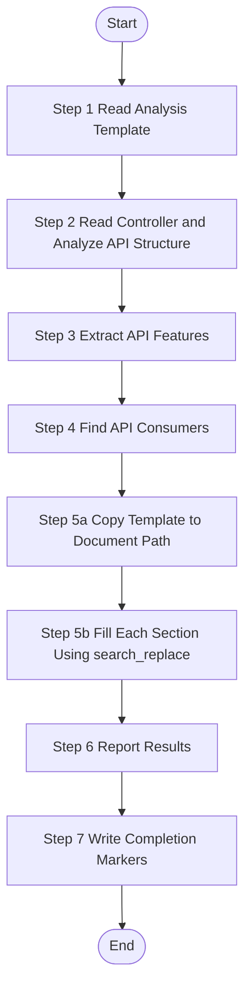

# API Feature Analysis - Single Controller

> **CRITICAL CONSTRAINT**: DO NOT create temporary scripts, batch files, or workaround code files (`.py`, `.bat`, `.sh`, `.ps1`, etc.) under any circumstances. If execution encounters errors, STOP and report the exact error. Fixes must be applied to the Skill definition or source scripts — not patched at runtime.

Analyze one specific API controller from source code, extract all business features (API endpoints), and generate feature documentation. This skill operates at controller granularity - one worker per controller file.

## Trigger Scenarios

- "Analyze API controller {fileName} from source code"
- "Extract API features from controller {fileName}"
- "Generate documentation for API controller {fileName}"
- "Analyze API feature from features.json"

## Input Variables

| Variable | Type | Description | Example |
|----------|------|-------------|---------|
| `{{feature}}` | object | Complete feature object from features.json | - |
| `{{fileName}}` | string | Controller file name | `"UserController"`, `"OrderController"` |
| `{{sourcePath}}` | string | Relative path to source file | `"yudao-module-system/yudao-module-system-biz/src/main/java/cn/iocoder/yudao/module/system/controller/admin/user/UserController.java"` |
| `{{documentPath}}` | string | Target path for generated document | `"speccrew-workspace/knowledges/bizs/admin-api/system/user/UserController.md"` |
| `{{module}}` | string | Business module name (from feature.module) | `"system"`, `"trade"`, `"_root"` |
| `{{analyzed}}` | boolean | Analysis status flag | `true` / `false` |
| `{{platform_type}}` | string | Platform type | `"admin-api"`, `"app-api"` |
| `{{platform_subtype}}` | string | Platform subtype | `"spring-boot"`, `"java"` |
| `{{tech_stack}}` | array | Platform tech stack | `["java", "spring-boot", "mybatis-plus"]` |

> **Note**: Additional parameters for completion markers (`completed_dir`, `sourceFile`, `language`) are defined in Step 7 and Language Adaptation section.

## Language Adaptation

**CRITICAL**: Generate all content in the language specified by the `{{language}}` parameter.

- `{{language}} == "zh"` → Generate all content in 中文
- `{{language}} == "en"` → Generate all content in English
- Other languages → Use the specified language

**All output content (feature names, descriptions, business rules) must be in the target language only.**

## Output Variables

| Variable | Type | Description |
|----------|------|-------------|
| `{{status}}` | string | Analysis status: `"success"`, `"partial"`, or `"failed"` |
| `{{feature_name}}` | string | Name of the analyzed controller |
| `{{generated_file}}` | string | Path to the generated documentation file |
| `{{message}}` | string | Summary message for status update |

## Execution Requirements

This skill operates in **strict sequential execution mode**:
- Execute steps in exact order (Step 1 → Step 2 → ... → Step 7)
- Output step status after each step completion
- Do NOT skip any step

## 🚫 ABSOLUTE PROHIBITIONS

- **NEVER** use `create_file` for documents - use template copy + `search_replace`
- **NEVER** delete generated files - fix with `search_replace`
- **NEVER** rewrite entire document - use targeted `search_replace`
- **ALWAYS** copy template (Step 5a) before filling sections (Step 5b)

## Output

**Generated Files:**
1. `{{documentPath}}` - Controller documentation file
2. `{{completed_dir}}/{module}-{subpath}-{fileName}.done.json` - Completion status marker

**Graph Data Generation:**
Graph data (nodes, edges) construction is handled by `speccrew-knowledge-bizs-api-graph` Skill.
After completing API analysis, dispatch will invoke the graph skill to generate `.graph.json` files.

**See Also:**
- `speccrew-knowledge-bizs-api-graph` - Constructs knowledge graph data from API analysis results

**Return Value:**
```json
{
  "status": "success|partial|failed",
  "feature": {
    "fileName": "UserController",
    "sourcePath": "yudao-module-system/.../controller/admin/user/UserController.java"
  },
  "platformType": "admin-api",
  "module": "system",
  "featureName": "user-management-api",
  "generatedFile": "speccrew-workspace/knowledges/bizs/admin-api/system/user/UserController.md",
  "message": "Successfully analyzed UserController with 8 API endpoints"
}
```

The return value is used by dispatch to update the feature status in `features-{platform}.json`.

## Execution Checklist

Before executing the workflow, verify the following inputs:

- Controller: `{{fileName}}` (`{{sourcePath}}`)
- Target: `{{documentPath}}`
- Language: `{{language}}`
- Module: `{{module}}`
- Platform: `{{platform_type}}`/`{{platform_subtype}}`

## Workflow



---

### Step 1: Read Analysis Template

**Step 1 Status: 🔄 IN PROGRESS**

1. **Check Analysis Status:**
   ```
   IF {{analyzed}} == true THEN
       Output "Step 1 Status: ⏭️ SKIPPED (already analyzed)"
       Skip to Step 6 with status="skipped"
   ELSE
       Proceed to next step
   END IF
   ```

2. **Read the appropriate template based on tech stack:**
   - Java/Spring Boot: Read `templates/FEATURE-DETAIL-TEMPLATE.md`
   - FastAPI: Read `templates/FEATURE-DETAIL-TEMPLATE-FASTAPI.md`
   - .NET: Read `templates/FEATURE-DETAIL-TEMPLATE-NET.md`
   - **Other/Unknown**: Default to `templates/FEATURE-DETAIL-TEMPLATE.md` (generic template)

3. **Understand template structure and required information dimensions:**
   - Review all sections in the template
   - Identify what information needs to be extracted from source code
   - Note the expected format for each section

**Template Analysis Scope:**

| Template Section | Information to Extract | Source |
|------------------|------------------------|--------|
| 1. Content Overview | Controller name, document path, source path, description | `{{fileName}}`, `{{documentPath}}`, `{{sourcePath}}` |
| 2. API Endpoints | All public API methods with HTTP methods and paths | Controller method annotations |
| 3. Business Flow | Request handling flow: validation → business logic → persistence | Controller → Service → Mapper/Repository |
| 4. Data Fields | Request DTOs, Response DTOs, Entity fields | DTO classes, Entity classes |
| 5. References | Services, Mappers, other controllers this controller uses | Field injections, imports |
| 6. Business Rules | Permission rules, validation rules, business logic rules | Code logic, annotations, comments |

**Handling VO/DTO Source Files:**
If the source file is a VO/DTO class (not a Controller), certain sections may be simplified, but ALL section headers and numbering must still be preserved:
- Section 2 (API Endpoint Definitions): Note "This is a VO/DTO class containing only data structure definitions, no API endpoints"
- Section 4 (References): Document fields and their types as the primary content
- Other sections: Use "N/A" or "Not applicable for VO/DTO classes"
- NEVER skip sections or reorganize the template structure

> ⚠️ CRITICAL: The template defines the EXACT output structure. You MUST:
> - Generate ALL sections listed in the template, in the SAME order
> - Fill ALL tables defined in the template (use "N/A" for unavailable data, never skip a table)
> - Follow the EXACT heading hierarchy and numbering from the template
> - Do NOT invent your own section structure or reorganize sections

**Output:** "Step 1 Status: ✅ COMPLETED - Template loaded, {{sectionCount}} sections identified for analysis"

### Step 2: Read Controller and Analyze API Structure

**Step 2 Status: 🔄 IN PROGRESS**

**Prerequisites:**
- Template has been loaded and understood from Step 1
- Controller file is a Java/Kotlin controller file (e.g., `UserController.java`)

**Actions:**
1. **Locate and Read the controller file:**
   - Use `{{sourcePath}}` as the relative file path from project root
   - Read the controller file content

2. **Analyze API handler structure based on template guidance:**
   - **Java**: Parse `@RestController`, `@RequestMapping`, `@GetMapping`, etc.
   - **FastAPI**: Parse `@router.get()`, `@router.post()`, Pydantic models
   - **.NET**: Parse `[ApiController]`, `[Route]`, `[HttpGet]`, etc.
   - **Other**: Parse based on common patterns (class/method definitions, decorators, attributes)

3. **Identify all public API endpoint methods**

4. **Extract method signatures, HTTP methods, and paths**

5. **Systematically gather information for EVERY section in the template:**
   - For each template section, identify what source code information is needed
   - If source code doesn't provide enough info for a section, note it for "N/A" filling later
   - Do NOT skip gathering info just because it seems minor

**Output:** "Step 2 Status: ✅ COMPLETED - Read {{sourcePath}} ({{lineCount}} lines), Analyzed {{endpointCount}} endpoints, {{serviceCount}} services"

### Step 3: Extract API Features

**Step 3 Status: 🔄 IN PROGRESS**

Each public API endpoint in the controller = one feature.

**CRITICAL - Analysis Scope Limitation:**

- **ONLY analyze the single controller file specified by `{{sourcePath}}`**
- **DO NOT analyze or generate documentation for other controllers in the same package**
- **DO NOT generate separate documents for internal/private methods**

**Extraction Guidelines:**

- Document ALL public API endpoints with their HTTP methods and paths
- For **internal service methods**: only record references, do not document as separate features
- Document business flows for each API endpoint: request validation → business logic → data persistence → response
- **Read Configuration**: Read `speccrew-workspace/docs/rules/mermaid-rule.md` for Mermaid diagram guidelines
- **Generate Mermaid flowcharts** following the configuration (see [Reference Guides > Mermaid Guide](#mermaid-guide) for quick reference)
- Use `{{language}}` for all extracted content naming

**Example Code Analysis:**

```java
// From controller file (UserController.java)
@RestController
@RequestMapping("/admin-api/system/user")
public class UserController {
    
    @GetMapping("/page")           → Feature: list-users (Paged Query)
    @PostMapping("/create")        → Feature: create-user (Create User)
    @PutMapping("/update")         → Feature: update-user (Update User)
    @DeleteMapping("/delete/{id}")  → Feature: delete-user (Delete User)
    @GetMapping("/get/{id}")       → Feature: get-user-detail (Get User Detail)
}
```

**For Each API Feature, Document:**

1. **Feature Identification:**
   - Feature name (from endpoint path and HTTP method)
   - API method and path
   - Entry point file path

2. **Request/Response Analysis:**
   - Request DTO fields with validation rules
   - Response DTO fields
   - Error response codes

3. **Deep Backend Business Flow Analysis** (per API endpoint):
   
   **CRITICAL**: Trace the complete call chain based on tech stack:
   
   **Java/Spring Boot**: Controller → Service → Mapper → Database
   **FastAPI**: Router → Service → CRUD/Repository → SQLAlchemy Model → Database
   **.NET**: Controller → Service → Repository → EF Core → Database
   
   - **API Handler Layer** (Controller/Router):
     - Request receiving and parameter extraction
     - Permission/role validation
     - DTO/Schema validation
     - Service method invocation
   
   - **Service Layer** (Business Logic):
     - Business rule validation
     - Data transformation/processing
     - Cross-module service calls (if any)
     - Transaction boundaries
     - Data access layer invocation
   
   - **Data Access Layer** (Mapper/CRUD/Repository):
     - SQL operations (SELECT/INSERT/UPDATE/DELETE)
     - Database table names
     - Join conditions and filters
   
   - **Database Layer**:
     - Table structure (fields, types, constraints)
     - Index usage
     - Relationships with other tables
   
   **MANDATORY Analysis for Template Sections 6-7:**
   - Trace the complete call chain to Service → Mapper/DAO → Database tables
   - Analyze transaction boundaries (methods with @Transactional or equivalent)
   - Analyze database operation types (SELECT/INSERT/UPDATE/DELETE) for each table
   - Identify service dependencies and cross-module calls for Dependency Analysis section
   - Note potential performance considerations (N+1 queries, large batch operations, missing indexes)

4. **Business Flow Visualization**:
   - Generate Mermaid flowchart for **each API endpoint**
   - Show complete flow: Request → Controller → Service → Mapper → Database → Response
   - Include detailed business logic steps in Service layer
   - Mark each step with source file reference (Controller/Service/Mapper)

**Output:** "Step 3 Status: ✅ COMPLETED - Extracted {{endpointCount}} API endpoints, {{flowCount}} business flows"

> **Note:** Graph data (nodes, edges) construction is handled by the `speccrew-knowledge-bizs-api-graph` Skill. This skill focuses on API analysis and documentation only.

### Step 4: Find API Consumers

**Step 4 Status: 🔄 IN PROGRESS**

Search frontend page files in the codebase to find which pages call the APIs in this controller.

**Search Methods:**
- Search for API client/service calls matching this controller's endpoints
- Search for imports of the API client class
- Search for HTTP requests to this controller's base path

**For Each Consumer Page, Record:**
| Field | Description |
|-------|-------------|
| Page Name | Name of the page that consumes this API |
| Function Description | How/why it uses this API (e.g., "Load user list on page init") |
| Source Path | Relative path to the consumer page source file |
| Document Path | Path to the consumer page's generated document |

**Output:** "Step 4 Status: ✅ COMPLETED - Found {{consumerCount}} API consumers"

---

### Step 5a: Copy Template to Document Path

**Step 5a Status: 🔄 IN PROGRESS**

Copy the appropriate template to the target document path and replace top-level placeholders.

**Template Selection:**

| Tech Stack | Template File | Description |
|------------|---------------|-------------|
| Java/Spring Boot/MyBatis | `templates/FEATURE-DETAIL-TEMPLATE.md` | Controller → Service → Mapper → Database |
| Python/FastAPI/SQLAlchemy | `templates/FEATURE-DETAIL-TEMPLATE-FASTAPI.md` | Router → Service → CRUD → SQLAlchemy Model |
| .NET/ASP.NET Core/EF Core | `templates/FEATURE-DETAIL-TEMPLATE-NET.md` | Controller → Service → Repository → EF Core |
| Other/Unknown | `templates/FEATURE-DETAIL-TEMPLATE.md` | Use as default/generic template |

**Actions:**

1. **Read the selected template file** based on `{{tech_stack}}`

2. **Replace top-level placeholders** with known variables:

| Placeholder | Replace With | Source |
|-------------|--------------|--------|
| `{Controller}` | `{{fileName}}` | Input variable |
| `{sourcePath}` | `{{sourcePath}}` | Input variable |
| `{documentPath}` | `{{documentPath}}` | Input variable |
| `{module}` | `{{module}}` | Input variable |
| `[Feature Name]` | `{{fileName}}` | Document title |

3. **Create the document file** using `create_file`:
   - Target path: `{{documentPath}}`
   - Content: Template with top-level placeholders replaced
   - Ensure parent directory exists

4. **Verify the document skeleton**:
   - Document should now have complete Section 1-10 structure
   - Each section should have placeholder content waiting to be filled

**Output:** "Step 5a Status: ✅ COMPLETED - Template copied to {{documentPath}}, ready for section filling"

---

### Step 5b: Fill Each Section Using search_replace

**Step 5b Status: 🔄 IN PROGRESS**

Fill each section of the document with actual data extracted from source code analysis.

> ⚠️ **CRITICAL CONSTRAINTS:**
> - **禁止使用 create_file 重写整个文档** - 会丢失模板结构
> - **必须使用 search_replace 逐块替换**
> - **每个 Section 的标题和编号必须保留**，不得删除或修改
> - 若某 Section 无对应源码信息，保留 Section 标题，将占位内容替换为 "N/A - No applicable data found in source code"

**Section Filling Order:**

Fill sections in order (1 → 10), using `search_replace` for each content block.

---

#### Section 1-10: Fill Template Sections

Fill each section using `search_replace` with extracted data from source code analysis.

**Template Anchors:**
| Section | Anchor |
|---------|--------|
| 1. Content Overview | `<!-- AI-TAG: OVERVIEW -->` |
| 2. API Endpoints | `<!-- AI-TAG: API_ENDPOINTS -->` |
| 3. Data Fields | `<!-- AI-TAG: DATA_DEFINITION -->` |
| 4. References | `<!-- AI-TAG: REFERENCES -->` |
| 5. Business Rules | `<!-- AI-TAG: BUSINESS_RULES -->` |
| 6. Dependencies | `<!-- AI-TAG: DEPENDENCIES -->` |
| 7. Performance | `<!-- AI-TAG: PERFORMANCE -->` |
| 8. Troubleshooting | `<!-- AI-TAG: TROUBLESHOOTING -->` |
| 9. Notes | `<!-- AI-TAG: ADDITIONAL_NOTES -->` |
| 10. Appendix | End of document |

**Filling Guidelines:**
- Replace placeholder text with actual data extracted from source code
- Use the template's existing table structure
- Fill ALL tables, use "N/A" for unavailable data
- Generate Mermaid business flow diagrams for each API endpoint
- Preserve section headers and numbering

---

**Link Format Rules:**

❌ **NEVER use `file://` protocol in links** - This breaks Markdown preview
✅ **ALWAYS use relative paths** - Markdown links work correctly

**⚠️ CRITICAL - Dynamic Path Depth Calculation:**

文档生成位置深度**不固定**，必须动态计算 `../` 层数：

**计算方法：**
1. 文档路径格式：`speccrew-workspace/knowledges/bizs/{platform_id}/{module_path}/{file}.md`
2. 计算从文档所在目录到项目根需要的 `../` 层数
3. 公式：`../` 层数 = 文档路径中目录层级数

**示例计算：**
- 文档路径 `speccrew-workspace/knowledges/bizs/admin-api/system/user/UserController.md`
  - 拆分：`speccrew-workspace/` + `knowledges/` + `bizs/` + `admin-api/` + `system/` + `user/` = 6层目录
  - 需要：`../../../../../` (6个`../`) 返回项目根
- 文档路径 `speccrew-workspace/knowledges/bizs/backend-ai/chat/ChatController.md`
  - 拆分：5层目录
  - 需要：`../../../../../` (5个`../`) 返回项目根

**Source Traceability Format:**
- Format: `[Source]({dynamic_prefix}{sourcePath})`
- 动态前缀：根据 `{{documentPath}}` 计算所需的 `../` 层数
- 示例（文档在 `speccrew-workspace/knowledges/bizs/admin-api/system/user/`）：
  - `[Source](../../../../../yudao-module-system/yudao-module-system-biz/src/main/java/cn/iocoder/yudao/module/system/controller/admin/user/UserController.java)`

**Source Column Rules:**
- Project source file: use `[Source](../../relative/path/to/file)` with valid relative path
- External framework/library class (e.g. Spring Security, MyBatis Plus): write plain text like `Spring Security` or `Framework` — do NOT wrap in link syntax

**Document Link Format:**
- Format: `[Doc]({dynamic_prefix}{documentPath})`
- 动态前缀：与 Source Link 使用相同计算方法
- 示例（文档在 `speccrew-workspace/knowledges/bizs/admin-api/system/user/`）：
  - `[Doc](../../../../../speccrew-workspace/knowledges/bizs/web-vue3/src/views/system/user/index.md)`

**实现步骤（AI Agent 执行时）：**
1. 获取 `{{documentPath}}` 变量
2. 提取文档所在目录路径（去除文件名）
3. 按 `/` 分割目录路径，统计目录层级数 N
4. 生成 N 个 `../` 作为链接前缀
5. 组合为完整链接：`[Text]({"../".repeat(N)}{targetPath})`

**N/A Handling Rule:**
If a section has no applicable data from source code:
1. Keep the section header and structure
2. Replace placeholder content with: "N/A - No applicable data found in source code"
3. DO NOT remove the section or change its numbering

**Output:** "Step 5b Status: ✅ COMPLETED - All sections filled at {{documentPath}} ({{fileSize}} bytes)"

### Step 6: Report Results

**Step 6 Status: 🔄 IN PROGRESS**

Return analysis result summary to dispatch:

```json
{
  "status": "{{status}}",
  "feature": {
    "fileName": "{{fileName}}",
    "sourcePath": "{{sourcePath}}"
  },
  "platformType": "{{platform_type}}",
  "module": "{{module}}",
  "featureName": "{{feature_name}}",
  "generatedFile": "{{generated_file}}",
  "message": "{{message}}"
}
```

Or in case of failure:

```json
{
  "status": "{{status}}",
  "feature": {
    "fileName": "{{fileName}}",
    "sourcePath": "{{sourcePath}}"
  },
  "message": "{{message}}"
}
```

**Output:** "Step 6 Status: ✅ COMPLETED - Analysis {{status}}: {{message}}"

---

### Step 7: Write Completion Markers

**Step 7 Status: 🔄 IN PROGRESS**

**⚠️ MANDATORY - This step MUST be executed. The task is NOT complete until marker files are written.**

Write analysis results to marker files for dispatch batch processing.

**Input Parameters (from dispatch):**
- `{{completed_dir}}` - **REQUIRED** - Marker files output directory (e.g., `speccrew-workspace/knowledges/base/sync-state/knowledge-bizs/completed`)
- `{{sourceFile}}` - **REQUIRED** - Source features JSON file name (e.g., `features-admin-api.json`)
- `{{language}}` - **REQUIRED** - Target language for content (see Language Adaptation section)

**Prerequisites:**
- Step 6 completed successfully

> **ASSUMPTION**: The `completed_dir` directory already exists (pre-created by dispatch Stage 2). If write fails, report error — do NOT attempt to create directories.

### Pre-write Checklist (VERIFY before writing each file):
- [ ] Filename follows `{module}-{subpath}-{fileName}` pattern (see naming convention below)
- [ ] File content is valid JSON (not empty)
- [ ] All required fields are present and non-empty
- [ ] File is written with UTF-8 encoding

**Pre-write Verification (MUST check before writing):**
- [ ] `.done.json` JSON: `fileName` does NOT contain file extension
- [ ] `.done.json` JSON: `sourceFile` matches `features-{platform}.json` pattern  
- [ ] `.done.json` JSON: `module` field is present and non-empty
- [ ] Valid JSON (no trailing commas, all strings quoted)

---

### Marker File Naming Convention

**Format:** `{completed_dir}/{module}-{subpath}-{fileName}.done.json`

**Components:**
- `module`: Use `{{module}}` input variable
- `subpath`: Extract from sourcePath, replace `/` with `-` (e.g., `controller/admin/user` → `controller-admin-user`)
- `fileName`: `{{fileName}}` WITHOUT extension

**Example:** `system-controller-admin-user-UserController.done.json`

> **Note:** Graph data (`.graph.json`) files are generated by `speccrew-knowledge-bizs-api-graph` Skill.

---

### Path Format Rules

**⚠️ CRITICAL: ALWAYS use relative paths in JSON content, NEVER absolute paths.**

---

**1. Write .done.json file:**

Create valid JSON file at `{completed_dir}/{module}-{subpath}-{fileName}.done.json`:

```json
{
  "fileName": "{{fileName}}",
  "sourcePath": "{{sourcePath}}",
  "sourceFile": "{{sourceFile}}",
  "module": "{{module}}",
  "documentPath": "{{documentPath}}",
  "status": "{{status}}",
  "analysisNotes": "{{message}}"
}
```

> **CRITICAL:** 
> - `fileName` MUST NOT include file extension
> - All paths MUST be relative, not absolute
> - Content MUST be valid JSON (not plain text)

**Output:** "Step 7 Status: ✅ COMPLETED - Marker file written to {{completed_dir}}"

> **Note:** Graph data (`.graph.json`) construction is handled by `speccrew-knowledge-bizs-api-graph` Skill. This step only writes the completion marker.

**⚠️ IMPORTANT: If this step fails, the dispatch script will NOT be able to process your analysis results. You MUST ensure the marker file is written successfully.**

## Reference Guides

### Mermaid Guide

When generating Mermaid diagrams, follow compatibility guidelines:
- Use `graph TB` or `graph LR` syntax (not `flowchart`)
- No parentheses `()` in node text
- No HTML tags like `<br/>`
- No `style` definitions

### Business Flow Guidelines

- One diagram per API request
- Focus on business operations
- Refer to `templates/FEATURE-DETAIL-TEMPLATE.md`

