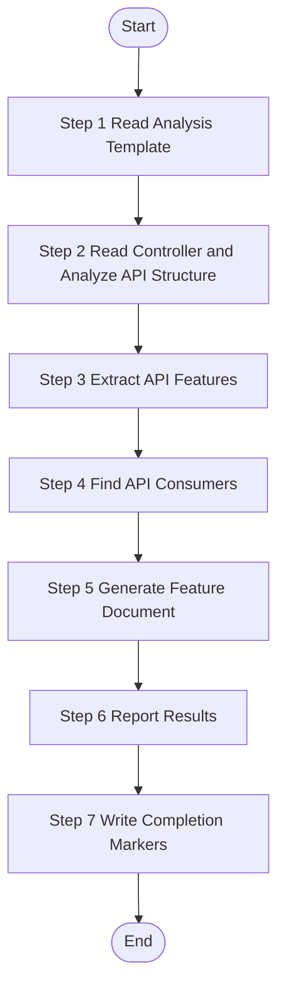

# API Feature Analysis - Single Controller

> **CRITICAL CONSTRAINT**: DO NOT create temporary scripts, batch files, or workaround code files (`.py`, `.bat`, `.sh`, `.ps1`, etc.) under any circumstances. If execution encounters errors, STOP and report the exact error. Fixes must be applied to the Skill definition or source scripts — not patched at runtime.

Analyze one specific API controller from source code, extract all business features (API endpoints), and generate feature documentation. This skill operates at controller granularity - one worker per controller file.

## Trigger Scenarios

- "Analyze API controller {fileName} from source code"
- "Extract API features from controller {fileName}"
- "Generate documentation for API controller {fileName}"
- "Analyze API feature from features.json"

## User

Worker Agent (speccrew-task-worker)

## Input Variables

| Variable | Type | Description | Example |
|----------|------|-------------|---------|
| `{{feature}}` | object | Complete feature object from features.json | - |
| `{{fileName}}` | string | Controller file name | `"UserController"`, `"OrderController"` |
| `{{sourcePath}}` | string | Relative path to source file | `"yudao-module-system/yudao-module-system-biz/src/main/java/cn/iocoder/yudao/module/system/controller/admin/user/UserController.java"` |
| `{{documentPath}}` | string | Target path for generated document | `"speccrew-workspace/knowledges/bizs/admin-api/system/user/UserController.md"` |
| `{{module}}` | string | Business module name (from feature.module) | `"system"`, `"trade"`, `"_root"` |
| `{{analyzed}}` | boolean | Analysis status flag | `true` / `false` |
| `{{platform_type}}` | string | Platform type | `"admin-api"`, `"app-api"` |
| `{{platform_subtype}}` | string | Platform subtype | `"spring-boot"`, `"java"` |
| `{{tech_stack}}` | array | Platform tech stack | `["java", "spring-boot", "mybatis-plus"]` |
| `{{completed_dir}}` | string | Directory for completion marker files (`sync_state_path/completed`) | `"speccrew-workspace/knowledges/base/sync-state/knowledge-bizs/completed"` |
| `{{sourceFile}}` | string | Source features JSON file name | `"features-admin-api.json"` |
| `{{language}}` | string | **REQUIRED** - Target language for generated content | `"zh"`, `"en"` |

## Language Adaptation

**CRITICAL**: Generate all content in the language specified by the `{{language}}` parameter.

- `{{language}} == "zh"` → Generate all content in 中文
- `{{language}} == "en"` → Generate all content in English
- Other languages → Use the specified language

**All output content (feature names, descriptions, business rules) must be in the target language only.**

## Output Variables

| Variable | Type | Description |
|----------|------|-------------|
| `{{status}}` | string | Analysis status: `"success"`, `"partial"`, or `"failed"` |
| `{{feature_name}}` | string | Name of the analyzed controller |
| `{{generated_file}}` | string | Path to the generated documentation file |
| `{{message}}` | string | Summary message for status update |

## Execution Requirements

This skill operates in **strict sequential execution mode**:
- Execute steps in exact order (Step 1 → Step 2 → ... → Step 7)
- Output step status after each step completion
- Do NOT skip any step

## Output

**Generated Files (MANDATORY - Task is NOT complete until all files are written):**
1. `{{documentPath}}` - Controller documentation file
2. `{{completed_dir}}/{{fileName}}.done` - Completion status marker
3. `{{completed_dir}}/{{fileName}}.graph.json` - Graph data marker

**Return Value (JSON format):**
```json
{
  "status": "success|partial|failed",
  "feature": {
    "fileName": "UserController",
    "sourcePath": "yudao-module-system/.../controller/admin/user/UserController.java"
  },
  "platformType": "admin-api",
  "module": "system",
  "featureName": "user-management-api",
  "generatedFile": "speccrew-workspace/knowledges/bizs/admin-api/system/user/UserController.md",
  "message": "Successfully analyzed UserController with 8 API endpoints"
}
```

The return value is used by dispatch to update the feature status in `features-{platform}.json`.

## Execution Checklist

Before executing the workflow, verify the following inputs:

- Controller: `{{fileName}}` (`{{sourcePath}}`)
- Target: `{{documentPath}}`
- Language: `{{language}}`
- Module: `{{module}}`
- Platform: `{{platform_type}}`/`{{platform_subtype}}`

## Workflow



---

### Step 1: Read Analysis Template

**Step 1 Status: 🔄 IN PROGRESS**

1. **Check Analysis Status:**
   - If `{{analyzed}}` is `true`, output "Step 1 Status: ⏭️ SKIPPED (already analyzed)" and skip to Step 6 with status="skipped"
   - If `{{analyzed}}` is `false`, proceed

2. **Read the appropriate template based on tech stack:**
   - Java/Spring Boot: Read `templates/FEATURE-DETAIL-TEMPLATE.md`
   - FastAPI: Read `templates/FEATURE-DETAIL-TEMPLATE-FASTAPI.md`
   - .NET: Read `templates/FEATURE-DETAIL-TEMPLATE-NET.md`
   - **Other/Unknown**: Default to `templates/FEATURE-DETAIL-TEMPLATE.md` (generic template)

3. **Understand template structure and required information dimensions:**
   - Review all sections in the template
   - Identify what information needs to be extracted from source code
   - Note the expected format for each section

**Template Analysis Scope:**

| Template Section | Information to Extract | Source |
|------------------|------------------------|--------|
| 1. Content Overview | Controller name, document path, source path, description | `{{fileName}}`, `{{documentPath}}`, `{{sourcePath}}` |
| 2. API Endpoints | All public API methods with HTTP methods and paths | Controller method annotations |
| 3. Business Flow | Request handling flow: validation → business logic → persistence | Controller → Service → Mapper/Repository |
| 4. Data Fields | Request DTOs, Response DTOs, Entity fields | DTO classes, Entity classes |
| 5. References | Services, Mappers, other controllers this controller uses | Field injections, imports |
| 6. Business Rules | Permission rules, validation rules, business logic rules | Code logic, annotations, comments |

**Output:** "Step 1 Status: ✅ COMPLETED - Template loaded, {{sectionCount}} sections identified for analysis"

### Step 2: Read Controller and Analyze API Structure

**Step 2 Status: 🔄 IN PROGRESS**

**Prerequisites:**
- Template has been loaded and understood from Step 1
- Controller file is a Java/Kotlin controller file (e.g., `UserController.java`)

**Actions:**
1. **Locate and Read the controller file:**
   - Use `{{sourcePath}}` as the relative file path from project root
   - Read the controller file content

2. **Analyze API handler structure based on template guidance:**
   - **Java**: Parse `@RestController`, `@RequestMapping`, `@GetMapping`, etc.
   - **FastAPI**: Parse `@router.get()`, `@router.post()`, Pydantic models
   - **.NET**: Parse `[ApiController]`, `[Route]`, `[HttpGet]`, etc.
   - **Other**: Parse based on common patterns (class/method definitions, decorators, attributes)

3. **Identify all public API endpoint methods**

4. **Extract method signatures, HTTP methods, and paths**

**Output:** "Step 2 Status: ✅ COMPLETED - Read {{sourcePath}} ({{lineCount}} lines), Analyzed {{endpointCount}} endpoints, {{serviceCount}} services"

### Step 3: Extract API Features

**Step 3 Status: 🔄 IN PROGRESS**

Each public API endpoint in the controller = one feature.

**CRITICAL - Analysis Scope Limitation:**

- **ONLY analyze the single controller file specified by `{{sourcePath}}`**
- **DO NOT analyze or generate documentation for other controllers in the same package**
- **DO NOT generate separate documents for internal/private methods**

**Extraction Guidelines:**

- Document ALL public API endpoints with their HTTP methods and paths
- For **internal service methods**: only record references, do not document as separate features
- Document business flows for each API endpoint: request validation → business logic → data persistence → response
- **Generate Mermaid flowcharts following `speccrew-workspace/docs/rules/mermaid-rule.md` guidelines:**
  - Use `graph TB` or `graph LR` syntax (not `flowchart`)
  - No parentheses `()` in node text (e.g., use `validate request` instead of `validate()`)
  - No HTML tags like `<br/>`
  - No `style` definitions
  - No nested `subgraph`
  - No special characters in node text
- Use `{{language}}` for all extracted content naming

**Example Code Analysis:**

```java
// From controller file (UserController.java)
@RestController
@RequestMapping("/admin-api/system/user")
public class UserController {
    
    @GetMapping("/page")           → Feature: list-users (Paged Query)
    @PostMapping("/create")        → Feature: create-user (Create User)
    @PutMapping("/update")         → Feature: update-user (Update User)
    @DeleteMapping("/delete/{id}")  → Feature: delete-user (Delete User)
    @GetMapping("/get/{id}")       → Feature: get-user-detail (Get User Detail)
}
```

**For Each API Feature, Document:**

1. **Feature Identification:**
   - Feature name (from endpoint path and HTTP method)
   - API method and path
   - Entry point file path

2. **Request/Response Analysis:**
   - Request DTO fields with validation rules
   - Response DTO fields
   - Error response codes

3. **Deep Backend Business Flow Analysis** (per API endpoint):
   
   **CRITICAL**: Trace the complete call chain based on tech stack:
   
   **Java/Spring Boot**: Controller → Service → Mapper → Database
   **FastAPI**: Router → Service → CRUD/Repository → SQLAlchemy Model → Database
   **.NET**: Controller → Service → Repository → EF Core → Database
   
   - **API Handler Layer** (Controller/Router):
     - Request receiving and parameter extraction
     - Permission/role validation
     - DTO/Schema validation
     - Service method invocation
   
   - **Service Layer** (Business Logic):
     - Business rule validation
     - Data transformation/processing
     - Cross-module service calls (if any)
     - Transaction boundaries
     - Data access layer invocation
   
   - **Data Access Layer** (Mapper/CRUD/Repository):
     - SQL operations (SELECT/INSERT/UPDATE/DELETE)
     - Database table names
     - Join conditions and filters
   
   - **Database Layer**:
     - Table structure (fields, types, constraints)
     - Index usage
     - Relationships with other tables

4. **Business Flow Visualization**:
   - Generate Mermaid flowchart for **each API endpoint**
   - Show complete flow: Request → Controller → Service → Mapper → Database → Response
   - Include detailed business logic steps in Service layer
   - Mark each step with source file reference (Controller/Service/Mapper)

5. **Build Graph Data** (per controller):
   
   While analyzing the controller, simultaneously extract graph nodes and edges:
   
   **Nodes to Extract:**
   
   | Node Type | Source | ID Format | Context Fields |
   |-----------|--------|-----------|----------------|
   | `api` | Each public API endpoint | `api-{module}-{name}` | `method`, `path`, `params`, `tables`, `permissions` |
   | `service` | Each injected service | `service-{module}-{name}` | `methods`, `dependencies` |
   | `table` | Each database table accessed | `table-{module}-{tableName}` | `fields`, `indexes`, `engine` |
   | `dto` | Each request/response DTO | `dto-{module}-{name}` | `fields`, `validation` |
   
   **Edges to Extract:**
   
   | Edge Type | Direction | When to Create |
   |-----------|-----------|----------------|
   | `operates` | api → table | API endpoint reads/writes a database table |
   | `invokes` | api → service | Controller calls a service method |
   | `references` | api → dto | API endpoint uses a request/response DTO |
   | `depends-on` | service → service | Service depends on another service |
   | `maps-to` | dto → table | DO/Entity maps to database table |
   
   **Node ID Naming Convention:**
   ```
   {type}-{module}-{name}
   Examples:
     api-system-user-list
     api-system-user-create
     service-system-user-service
     table-system-system_user
     dto-system-user-create-req
   ```
   
   **IMPORTANT:**
   - `module` comes from `{{module}}` input variable
   - `name` should be a short, readable slug derived from the entity name
   - Each node must include `sourcePath` and `documentPath` (if applicable)
   - Edge `metadata` should include operation details (method name, SQL operation type, etc.)

**Output:** "Step 3 Status: ✅ COMPLETED - Extracted {{endpointCount}} API endpoints, {{flowCount}} business flows, {{nodeCount}} graph nodes, {{edgeCount}} graph edges"

### Step 4: Find API Consumers

**Step 4 Status: 🔄 IN PROGRESS**

Search frontend page files in the codebase to find which pages call the APIs in this controller.

**Search Methods:**
- Search for API client/service calls matching this controller's endpoints
- Search for imports of the API client class
- Search for HTTP requests to this controller's base path

**For Each Consumer Page, Record:**
| Field | Description |
|-------|-------------|
| Page Name | Name of the page that consumes this API |
| Function Description | How/why it uses this API (e.g., "Load user list on page init") |
| Source Path | Relative path to the consumer page source file |
| Document Path | Path to the consumer page's generated document |

**Output:** "Step 4 Status: ✅ COMPLETED - Found {{consumerCount}} API consumers"

---

### Step 5: Generate Feature Document

**Step 5 Status: 🔄 IN PROGRESS**

Use the appropriate template based on `{{tech_stack}}` to generate the feature document:

**Template Selection:**

| Tech Stack | Template File | Description |
|------------|---------------|-------------|
| Java/Spring Boot/MyBatis | `templates/FEATURE-DETAIL-TEMPLATE.md` | Controller → Service → Mapper → Database |
| Python/FastAPI/SQLAlchemy | `templates/FEATURE-DETAIL-TEMPLATE-FASTAPI.md` | Router → Service → CRUD → SQLAlchemy Model |
| .NET/ASP.NET Core/EF Core | `templates/FEATURE-DETAIL-TEMPLATE-NET.md` | Controller → Service → Repository → EF Core |
| Other/Unknown | `templates/FEATURE-DETAIL-TEMPLATE.md` | Use as default/generic template |

Select the template that matches the `{{platform_subtype}}` and `{{tech_stack}}` parameters. If no specific template matches, default to `FEATURE-DETAIL-TEMPLATE.md` (Java template serves as the generic base).

**Template Variables:**
- `{Controller Name}`: Controller class name (e.g., "UserController")
- `{sourcePath}`: Source file path from feature object (relative to project root)
- `{documentPath}`: Target document path from feature object (relative to project root)
- `{endpointCount}`: Number of API endpoints in this controller

**Generation Checklist:**
- [ ] Section 1: Content Overview
- [ ] Section 2: API Endpoint Definitions (for each endpoint):
  - [ ] Method, Path, Description, Permission
  - [ ] Request/Response DTO fields
  - [ ] Error Codes
  - [ ] **Business Flow** (Mermaid graph TB showing Controller → Service → Mapper → DB)
  - [ ] **Detailed Call Chain** (with specific class/method names)
  - [ ] **Database Operations** (SQL types, table names)
  - [ ] **Transaction Boundaries**
- [ ] Section 3: Data Field Definitions:
  - [ ] **Database Table Structure** (fields, types, constraints, indexes)
  - [ ] Entity-Database Mapping
  - [ ] DTO/VO Definitions
- [ ] Section 4: References (Services, Mappers, DTOs, Entities, API Consumers)
- [ ] Section 5: Business Rules (Permission, Validation, Business Logic)
- [ ] Source traceability links in all sections (use relative paths, NO file://)

**CRITICAL - Link Format Rules:**

❌ **NEVER use `file://` protocol in links** - This breaks Markdown preview
✅ **ALWAYS use relative paths** - Markdown links work correctly

**Source Traceability Format:**
Use relative path from current document to source file:
- Format: `[Source](../../{sourcePath})`
- Example: `[Source](../../yudao-module-system/yudao-module-system-biz/src/main/java/cn/iocoder/yudao/module/system/controller/admin/user/UserController.java)`
- The `../../` goes from `speccrew-workspace/knowledges/bizs/admin-api/system/user/` to project root

**Document Link Format:**
Use relative path from current document:
- Format: `[Doc](../../{documentPath})`
- Example: `[Doc](../../speccrew-workspace/knowledges/bizs/web-vue3/src/views/system/user/index.md)`

**Output:** "Step 5 Status: ✅ COMPLETED - Document generated at {{documentPath}} ({{fileSize}} bytes)"

### Step 6: Report Results

**Step 6 Status: 🔄 IN PROGRESS**

Return analysis result summary to dispatch:

```json
{
  "status": "{{status}}",
  "feature": {
    "fileName": "{{fileName}}",
    "sourcePath": "{{sourcePath}}"
  },
  "platformType": "{{platform_type}}",
  "module": "{{module}}",
  "featureName": "{{feature_name}}",
  "generatedFile": "{{generated_file}}",
  "message": "{{message}}"
}
```

Or in case of failure:

```json
{
  "status": "{{status}}",
  "feature": {
    "fileName": "{{fileName}}",
    "sourcePath": "{{sourcePath}}"
  },
  "message": "{{message}}"
}
```

**Output:** "Step 6 Status: ✅ COMPLETED - Analysis {{status}}: {{message}}"

---

### Step 7: Write Completion Markers

**Step 7 Status: 🔄 IN PROGRESS**

**⚠️ MANDATORY - This step MUST be executed. The task is NOT complete until marker files are written.**

分析完成后，将结果写入标记文件，供 dispatch 批量处理。

**Prerequisites:**
- Step 6 completed successfully
- `{{completed_dir}}` - Marker files output directory (e.g., `speccrew-workspace/knowledges/base/sync-state/knowledge-bizs/completed`)
- `{{sourceFile}}` - Source features JSON file name

**CRITICAL - Ensure Directory Exists:**
Before writing files, ensure the `{{completed_dir}}` directory exists. If it doesn't exist, create it first using appropriate file system tools.

### Pre-write Checklist (VERIFY before writing each file):
- [ ] Filename follows `{fileName}` pattern (Java class name only)
- [ ] File content is valid JSON (not empty)
- [ ] All required fields are present and non-empty
- [ ] File is written with UTF-8 encoding

**1. Write .done file (MANDATORY):**

> **⚠️ CRITICAL FORMAT REQUIREMENT**: The `.done` file MUST be valid JSON. Do NOT write plain text, key=value pairs, or any other format. The file content MUST start with `{` and end with `}`. Non-JSON content will cause pipeline failure.

Use the Write tool to create file at `{{completed_dir}}/{{fileName}}.done`:

**Full path example:** `d:/dev/speccrew/speccrew-workspace/knowledges/base/sync-state/knowledge-bizs/completed/UserController.done`

```json
{
  "fileName": "{{fileName}}",
  "sourcePath": "{{sourcePath}}",
  "sourceFile": "{{sourceFile}}",
  "module": "{{module}}",
  "status": "{{status}}",
  "analysisNotes": "{{message}}"
}
```

> **⚠️ CRITICAL**: The `sourceFile` field is MANDATORY. It MUST be the features JSON filename (e.g., `features-admin-api.json`). Missing this field will cause pipeline failure.

⚠️ **CRITICAL NAMING RULE:** Filename MUST be `{fileName}.done`, where `fileName` is the Java class name (e.g., `UserController`, `AiKnowledgeDocumentCreateListReqVO`).
- ✅ CORRECT: `UserController.done` (using Java class name directly)
- ✅ CORRECT: `AiKnowledgeDocumentCreateListReqVO.done` (using Java class name directly)
- ❌ WRONG: `dict-UserController.done` (using old featureId format)
- ❌ WRONG: `system-UserController.done` (using module prefix)

⚠️ **CRITICAL:** The file MUST contain valid JSON content. Empty files or files with only whitespace will cause processing failures.

**2. Write .graph.json file (MANDATORY):**

> **⚠️ CRITICAL FORMAT REQUIREMENT**: The `.graph.json` file MUST be valid JSON and MUST include the top-level `"module"` field. Missing the `module` field will cause the graph merge pipeline to reject this file.

Use the Write tool to create file at `{{completed_dir}}/{{fileName}}.graph.json`:

**Full path example:** `d:/dev/speccrew/speccrew-workspace/knowledges/base/sync-state/knowledge-bizs/completed/UserController.graph.json`

```json
{
  "module": "{{module}}",
  "nodes": [
    {
      "id": "api-{{module}}-{{endpoint-name}}",
      "type": "api",
      "name": "<display name>",
      "module": "{{module}}",
      "sourcePath": "{{sourcePath}}",
      "documentPath": "{{documentPath}}",
      "description": "..."
    }
  ],
  "edges": [
    {
      "source": "api-...",
      "target": "service-... or table-...",
      "type": "operates|invokes|references|depends-on|maps-to",
      "metadata": { ... }
    }
  ]
}
```

⚠️ **CRITICAL NAMING RULE:** Filename MUST be `{fileName}.graph.json`, where `fileName` is the Java class name (e.g., `UserController`, `AiKnowledgeDocumentCreateListReqVO`).
- ✅ CORRECT: `UserController.graph.json` (using Java class name directly)
- ✅ CORRECT: `AiKnowledgeDocumentCreateListReqVO.graph.json` (using Java class name directly)
- ❌ WRONG: `dict-UserController.graph.json` (using old featureId format)
- ❌ WRONG: `system-UserController.graph.json` (using module prefix)

⚠️ **CRITICAL:** The file MUST contain valid JSON content. Empty files or files with only whitespace will cause processing failures.

**CRITICAL - API Endpoint Coverage Check:**
Before writing the graph.json file, verify:
- [ ] ALL public API endpoint methods in the controller are represented as `api` nodes
- [ ] Status update endpoints (updateStatus, toggleEnable) are included
- [ ] Special operation endpoints (resetPassword, export, import, batch operations) are included
- [ ] Each `api` node has proper metadata with HTTP method and path
- [ ] No public endpoint method is left without a corresponding node

**节点类型说明:**
- `api`: API端点
- `service`: Service类
- `table`: 数据库表
- `dto`: 数据传输对象

**Output:** "Step 7 Status: ✅ COMPLETED - Marker files written to {{completed_dir}}"

**⚠️ IMPORTANT: If this step fails, the dispatch script will NOT be able to process your analysis results. You MUST ensure both marker files are written successfully.**

## Checklist

- [ ] Input variables received (`{{feature}}`, `{{fileName}}`, `{{sourcePath}}`, `{{documentPath}}`, `{{module}}`, `{{analyzed}}`, `{{platform_type}}`, `{{completed_dir}}`, `{{sourceFile}}`, `{{language}}`)
- [ ] Skip if `{{analyzed}}` is `true`
- [ ] **Correct template selected** based on `{{tech_stack}}` (Java/FastAPI/.NET/Other)
  - [ ] Java/Spring Boot: Use `FEATURE-DETAIL-TEMPLATE.md`
  - [ ] FastAPI: Use `FEATURE-DETAIL-TEMPLATE-FASTAPI.md`
  - [ ] .NET: Use `FEATURE-DETAIL-TEMPLATE-NET.md`
  - [ ] Other/Unknown: Default to `FEATURE-DETAIL-TEMPLATE.md`
- [ ] Template read and understood
- [ ] Source file `{{sourcePath}}` read and analyzed
- [ ] **Section 1**: Content Overview filled with API handler metadata
- [ ] **Section 2**: API Endpoint Definitions for all public endpoints
  - [ ] **API Coverage Verification**: ALL public endpoint methods in the controller are documented
  - [ ] **Status Update Endpoints**: updateStatus, toggleEnable, setActive, etc.
  - [ ] **Special Operation Endpoints**: resetPassword, export, import, batchDelete, etc.
  - [ ] Method, Path, Request/Response DTOs, Error Codes
  - [ ] **Business Flow**: Mermaid graph TB showing complete call chain
    - **Java**: Controller → Service → Mapper → Database
    - **FastAPI**: Router → Service → CRUD → SQLAlchemy Model
    - **.NET**: Controller → Service → Repository → EF Core
  - [ ] **Detailed Call Chain**: Specific class/method names with source links
  - [ ] **Database Operations**: SQL types, table names
  - [ ] **Transaction Boundaries**: Transaction scope and isolation level
  - [ ] Use `graph TB/LR` syntax (not `flowchart`)
  - [ ] No parentheses `()` in node text
  - [ ] No HTML tags like `<br/>`
  - [ ] Follow `speccrew-workspace/docs/rules/mermaid-rule.md`
- [ ] **Section 3**: Data Field Definitions
  - [ ] **Database Table Structure**: Fields, types, constraints, indexes, relationships
  - [ ] Entity/Model-Database Mapping
  - [ ] DTO/Schema Definitions
- [ ] **Section 4**: References to Services/CRUD/Repositories, DTOs/Schemas, Entities/Models
- [ ] **Step 4**: Find API Consumers - search frontend pages for API usage
- [ ] **Section 4.4**: API Consumers - list all pages that call this API's endpoints
- [ ] **Section 5**: Business Rules documented (Permission, Validation, Business Logic)
- [ ] Source traceability links added to all sections (NO `file://` protocol)
- [ ] Document generated at `{{documentPath}}`
- [ ] **Step 7**: Write Completion Markers - **MANDATORY** - write `.done` and `.graph.json` files to `{{completed_dir}}` using Write tool
  - [ ] Ensure `{{completed_dir}}` directory exists before writing
  - [ ] Write `.done` file: `{{completed_dir}}/{{fileName}}.done`
  - [ ] Write `.graph.json` file: `{{completed_dir}}/{{fileName}}.graph.json`
  - [ ] Task is NOT complete until both marker files are written successfully

---

## Reference Guides

### Business Flow Diagram Guidelines

When generating business flow diagrams in feature documents, follow these principles:

**Business Flow vs Technical Call Chain:**

| Aspect | Business Flow (Target) | Technical Call Chain (Avoid) |
|--------|----------------------|---------------------------|
| Focus | What business operations happen | What technical components are involved |
| Audience | Product managers, solution architects | Developers, system architects |
| Content | Business rules, data transformations, decisions | Method names, class names, API endpoints |
| Example | "Validate inventory → Check permissions → Create order" | "OrderController.create() → OrderService.save()" |

**Key Principles:**

1. **One Diagram Per API Request**: Each API call triggered by the frontend should have its own business flow diagram
2. **Business Perspective**: Focus on business operations, not technical implementation details
3. **Source Traceability**: Add source file references for each business step

**Diagram Types by Scenario:**

| Scenario | Diagram Focus | Example Flow |
|----------|---------------|--------------|
| Page Initialization | Data loading sequence | Page Load → Parameter Fetch → Permission Check → Data Query → Render |
| User Action | Operation handling | Click Trigger → Data Validation → Business Check → Data Processing → Result Feedback |
| API Endpoint | Backend processing | Permission Check → Data Validation → Business Processing → Data Persistence |

**For detailed diagram examples and templates, refer to:**
- `templates/FEATURE-DETAIL-TEMPLATE.md` - Section 3 (Interaction Flow Description)

**Common Business Flow Patterns:**

1. **CRUD Operations:**
   - Create: Data Validation → Permission Check → Duplicate Check → Data Creation → Related Update → Log Recording
   - Read: Parameter Parsing → Permission Check → Data Query → Data Assembly → Return Result
   - Update: Data Validation → Permission Check → Existence Check → Data Update → Related Update → Log Recording
   - Delete: Permission Check → Existence Check → Dependency Check → Data Deletion → Log Recording

2. **Approval Workflows:**
   - Submit Application → Validate Data → Check Process Config → Create Approval Instance → Notify Approver → Record Log

