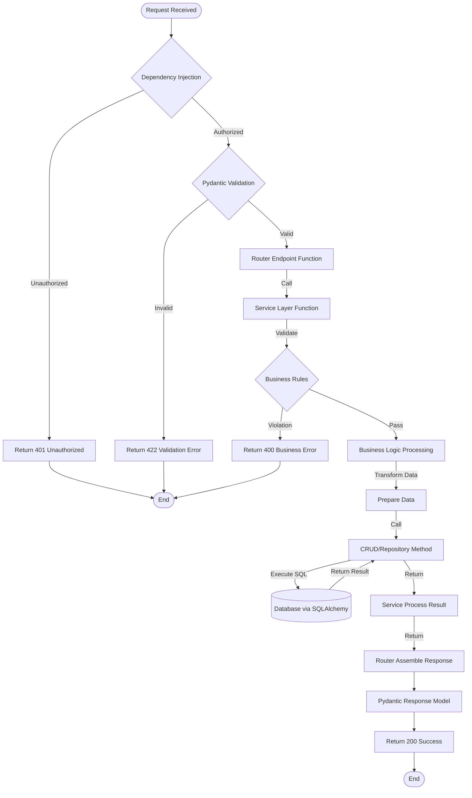
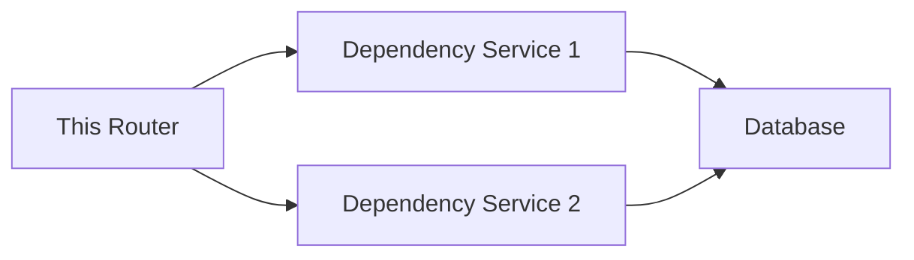

# API Feature Detail Template - [Feature Name]

> **Tech Stack**: FastAPI + SQLAlchemy + Pydantic
> **Target Audience**: devcrew-product-manager, devcrew-solution-manager, devcrew-developer
> **Related Document**: [Module Overview Document](../{{module-name}}-overview.md)
> 
> <!-- AI-TAG: FEATURE_DETAIL -->
> <!-- AI-CONTEXT: This document describes FastAPI endpoints, business logic flow, and data models. AI should fill all placeholders when generating. -->

**Files Referenced in This Document**

| # | File | Source |
|---|------|--------|
| 1 | {router} | [View](../../{routerSourcePath}) |
| 2 | {service} | [View](../../{serviceSourcePath}) |
| 3 | {model} | [View](../../{modelSourcePath}) |
| 4 | {schema} | [View](../../{schemaSourcePath}) |

---

## 1. Content Overview

<!-- AI-TAG: OVERVIEW -->

### 1.1 Basic Information

| Item | Description |
|------|-------------|
| Router Name | {Fill in router name} |
| Module | {e.g., Order Management Module} |
| Core Function | {1-3 sentences describing core API functionality} |
| Base Path | {e.g., /api/v1/users} |
| Tags | {e.g., ["users"]} |

### 1.2 API Scope

This router includes the following API endpoints:
- [ ] {GET /} - {List users with pagination}
- [ ] {POST /} - {Create new user}
- [ ] {GET /{id}} - {Get user by ID}
- [ ] {PUT /{id}} - {Update user}
- [ ] {DELETE /{id}} - {Delete user}

---

## 2. API Endpoint Definitions

<!-- AI-TAG: API_ENDPOINTS -->
<!-- AI-NOTE: Document all public API endpoints exposed by this router -->

### 2.1 {Endpoint Name} - {HTTP Method} {API Path}

**Endpoint Information:**

| Item | Description |
|------|-------------|
| Method | {GET/POST/PUT/DELETE} |
| Path | {/api/v1/users} |
| Description | {Brief description of what this endpoint does} |
| Dependencies | {e.g., get_current_user, get_db} |

**Request Parameters:**

| Parameter | Type | Required | Description | Validation Rules |
|-----------|------|----------|-------------|------------------|
| {param1} | {str/int} | {Yes/No} | {Description} | {e.g., min_length=1, max_length=50} |
| {param2} | {int} | {No} | {Description} | {e.g., ge=1, le=100} |
| {skip} | {int} | {No} | {Records to skip} | {Default 0} |
| {limit} | {int} | {No} | {Max records to return} | {Default 100, max 1000} |

**Response Data:**

| Field | Type | Description | Nullable |
|-------|------|-------------|----------|
| {id} | {int} | {Record ID} | {No} |
| {field1} | {str} | {Description} | {Yes} |
| {field2} | {int} | {Description} | {No} |
| {created_at} | {datetime} | {Creation time} | {No} |

**Response Example:**

```json
{
  "id": 1,
  "field1": "value1",
  "field2": 100,
  "created_at": "2024-01-01T12:00:00"
}
```

**Error Codes:**

| Error Code | Description | Trigger Condition |
|------------|-------------|-------------------|
| {400} | {Validation Error} | {Invalid request parameters} |
| {401} | {Unauthorized} | {Missing or invalid token} |
| {403} | {Forbidden} | {Insufficient permissions} |
| {404} | {Not Found} | {Resource not found} |

**Business Flow:**



**Flow Step Description:**

| Step | Operation | Layer | Component | Input | Output | Exception Handling |
|------|-----------|-------|-----------|-------|--------|-------------------|
| 1 | Dependency Injection | Router | {Depends} | Request + Token | Current user + DB session | Return 401 |
| 2 | Pydantic Validation | Router | {Pydantic Schema} | Request body/query | Validated model | Return 422 |
| 3 | Invoke Service | Router | {Router function} | Validated model | Service result | - |
| 4 | Business Rule Check | Service | {Service} | Business data | Validation result | Return 400 |
| 5 | Data Processing | Service | {Service} | Raw data | Processed data | - |
| 6 | Invoke CRUD | Service | {CRUD/Repository} | Processed data | DB result | - |
| 7 | SQL Execution | CRUD | {SQLAlchemy Model} | SQL parameters | DB result | Return 500 |
| 8 | Assemble Response | Router | {Router} | Service result | Pydantic response | Return 200 |

**Detailed Call Chain:**

| # | Layer | File | Function/Class | Responsibility | Source |
|---|-------|------|----------------|----------------|--------|
| 1 | Router | {users.py} | {create_user} | Receive request, validate params, call service | [Source](../../{routerSourcePath}) |
| 2 | Service | {user_service.py} | {create_user} | Business validation, data processing, call CRUD | [Source](../../{serviceSourcePath}) |
| 3 | Service | {user_service.py} | {validate_user_email} | Check email uniqueness | [Source](../../{serviceSourcePath}) |
| 4 | CRUD | {user_crud.py} | {create} | Execute INSERT via SQLAlchemy | [Source](../../{crudSourcePath}) |
| 5 | Model | {user.py} | {User model} | SQLAlchemy ORM model definition | [Source](../../{modelSourcePath}) |

**Database Operations:**

| Operation | Table | SQL Type | Description |
|-----------|-------|----------|-------------|
| {INSERT} | {users} | {INSERT} | {Insert new user record} |
| {SELECT} | {users} | {SELECT} | {Check email exists} |
| {UPDATE} | {users} | {UPDATE} | {Update user status} |

**Transaction Boundaries:**

| Method | Transaction Scope | Notes |
|--------|-------------------|-------|
| {user_service.create_user} | {Single DB session} | {Auto-commit by default} |

### 2.2 {Next Endpoint Name} - {HTTP Method} {API Path}

{Repeat the same structure for each API endpoint in the router}

---

## 3. Data Field Definition

<!-- AI-TAG: DATA_DEFINITION -->
<!-- AI-NOTE: Data definitions are important for Solution Agent to design APIs and databases -->

### 3.1 Database Table Structure

<!-- AI-NOTE: Analyze SQLAlchemy Model to extract database table structure -->

**Table Name:** {table_name}

**Table Description:** {Description of what this table stores}

| Field Name | Python Type | DB Type | Length | Nullable | Default | Constraint | Index | Description |
|------------|-------------|---------|--------|----------|---------|------------|-------|-------------|
| {id} | {int} | {INTEGER} | - | {No} | {Auto increment} | {PRIMARY KEY} | {PRIMARY} | {Primary key} |
| {field1} | {str} | {VARCHAR} | {255} | {No} | - | {UNIQUE} | {UNIQUE} | {Unique field} |
| {field2} | {int} | {INTEGER} | - | {Yes} | {0} | - | - | {Optional field} |
| {field3} | {datetime} | {TIMESTAMP} | - | {No} | {func.now()} | - | - | {Creation time} |
| {field4} | {bool/Enum} | {BOOLEAN/ENUM} | - | {No} | {True} | - | {INDEX} | {Status field} |

**Indexes:**

| Index Name | Index Type | Fields | Purpose |
|------------|------------|--------|---------|
| {ix_name} | {Index} | {field1} | {Query optimization} |
| {ix_status} | {Index} | {field4, created_at} | {Composite index for status query} |

**Relationships:**

| Related Table | Relationship | Foreign Key | Description |
|---------------|--------------|-------------|-------------|
| {related_table} | {One-to-Many} | {ForeignKey("related.id")} | {Relationship description} |
| {another_table} | {Many-to-One} | {ForeignKey("another.id")} | {Relationship description} |

**Source:** [Model](../../{modelSourcePath})

### 3.2 Model-Database Mapping

| Model Field | DB Column | Type Mapping | Notes |
|-------------|-----------|--------------|-------|
| {model.field1} | {column_name} | {str → VARCHAR(255)} | {Mapping notes} |
| {model.field2} | {column_name} | {int → INTEGER} | {Mapping notes} |
| {model.created_at} | {created_at} | {datetime → TIMESTAMP} | {Auto-filled by server_default} |

### 3.3 Pydantic Schema Definitions

**Request Schema:**

```python
class {UserCreate}(BaseModel):
    field1: str = Field(..., min_length=1, max_length=50)
    field2: int = Field(..., ge=1)
    
    class Config:
        from_attributes = True
```

**Response Schema:**

```python
class {UserResponse}(BaseModel):
    id: int
    field1: str
    field2: int
    created_at: datetime
    
    class Config:
        from_attributes = True
```

---

## 4. References

<!-- AI-TAG: REFERENCES -->
<!-- AI-NOTE: List all dependencies and references for this router -->

### 4.1 Internal Services

| Service Name | Purpose | Source Path |
|--------------|---------|-------------|
| {user_service} | {e.g., User business logic} | [Source](../../{serviceSourcePath}) |
| {auth_service} | {e.g., Authentication validation} | [Source](../../{serviceSourcePath}) |

### 4.2 Data Access Layer

| CRUD/Repository | Model | Purpose | Source Path |
|-----------------|-------|---------|-------------|
| {user_crud} | {User} | {e.g., User CRUD operations} | [Source](../../{crudSourcePath}) |
| {role_crud} | {Role} | {e.g., Role query} | [Source](../../{crudSourcePath}) |

### 4.3 Schemas and Models

| Class Name | Type | Purpose | Source Path |
|------------|------|---------|-------------|
| {UserCreate} | Request Schema | {e.g., Create user request} | [Source](../../{schemaSourcePath}) |
| {UserResponse} | Response Schema | {e.g., User detail response} | [Source](../../{schemaSourcePath}) |
| {User} | SQLAlchemy Model | {e.g., User database model} | [Source](../../{modelSourcePath}) |

### 4.4 API Consumers

<!-- AI-NOTE: List frontend pages that call this router's APIs -->

| Page Name | Function Description | Source Path | Document Path |
|-----------|---------------------|-------------|---------------|
| {PageName} | {e.g., User management list page} | [Source](../../{pageSourcePath}) | [Doc](../../{pageDocumentPath}) |
| {PageName} | {e.g., User form page} | [Source](../../{pageSourcePath}) | [Doc](../../{pageDocumentPath}) |

---

## 5. Business Rule Constraints

<!-- AI-TAG: BUSINESS_RULES -->

### 5.1 Permission Rules

| API Endpoint | Permission Requirement | No Permission Response |
|--------------|----------------------|----------------------|
| {GET /} | {Require authentication} | Return 401 Unauthorized |
| {POST /} | {Require admin role} | Return 403 Forbidden |
| {DELETE /{id}} | {Require admin role} | Return 403 Forbidden |

### 5.2 Business Logic Rules

1. **{Rule 1}**: {e.g., User email must be unique across system}
2. **{Rule 2}**: {e.g., Cannot delete user with active orders}
3. **{Rule 3}**: {e.g., Password must be hashed before storage}
4. **{Rule 4}**: {e.g., Admin user cannot be deleted}

### 5.3 Validation Rules

| Validation Scenario | Validation Rule | Error Response | Error Code |
|--------------------|-----------------|----------------|------------|
| Pydantic validation | {Field} must match schema | Return 422 Unprocessable Entity | - |
| Business validation | {Business rule violation} | Return 400 Bad Request | - |

---

## 6. Dependency Analysis

<!-- AI-TAG: DEPENDENCIES -->

### 6.1 Module Dependencies

| Dependency Module | Dependency Type | Purpose | Impact Scope |
|-------------------|-----------------|---------|--------------|
| {Module A} | Strong | {Purpose description} | {Impact when unavailable} |
| {Module B} | Weak | {Purpose description} | {Degraded functionality} |

### 6.2 Service Dependencies



**Diagram Source**
- [{Service}.py](../../{serviceSourcePath})

### 6.3 External Dependencies

| External System | Interface Type | Call Scenario | Degradation Strategy |
|-----------------|----------------|---------------|---------------------|
| {Payment Gateway} | REST API | {Payment processing} | {Queue and retry} |
| {SMS Service} | REST API | {Verification code} | {Skip and log} |

---

## 7. Performance Considerations

<!-- AI-TAG: PERFORMANCE -->

### 7.1 Performance Bottlenecks

| Scenario | Bottleneck Description | Optimization Suggestion | Priority |
|----------|----------------------|------------------------|----------|
| {List query} | {Large data volume} | {Add index, pagination} | High |
| {Batch operation} | {Database lock} | {Use async processing} | Medium |

### 7.2 Index Suggestions

| Table Name | Index Fields | Index Type | Scenario Description |
|------------|--------------|------------|---------------------|
| {table_name} | {field1, field2} | {COMPOSITE INDEX} | {Query optimization} |
| {table_name} | {field3} | {INDEX} | {Filter condition} |

### 7.3 Caching Strategy

| Cache Scenario | Cache Strategy | Expiration Time | Invalidation Strategy |
|----------------|----------------|-----------------|----------------------|
| {User info} | {Redis} | {30 minutes} | {Write-through} |
| {Configuration} | {Local cache} | {5 minutes} | {TTL expiration} |

---

## 8. Troubleshooting Guide

<!-- AI-TAG: TROUBLESHOOTING -->

### 8.1 Common Issues

| Issue Symptom | Possible Cause | Troubleshooting Steps | Solution |
|---------------|----------------|----------------------|----------|
| {Query timeout} | {Missing index} | {Check SQL execution plan} | {Add index} |
| {Data inconsistency} | {Transaction failure} | {Check transaction logs} | {Manual correction} |
| {Permission denied} | {Role not assigned} | {Check user roles} | {Assign correct role} |

### 8.2 Error Code Reference

| Error Code | Error Description | Trigger Condition | Handling Suggestion |
|------------|-------------------|-------------------|---------------------|
| {400} | {Bad Request} | {Validation failed} | {Check request parameters} |
| {422} | {Validation Error} | {Pydantic validation failed} | {Check field requirements} |
| {500} | {Internal Server Error} | {Unhandled exception} | {Check server logs} |

---

## 9. Notes and Additional Information

<!-- AI-TAG: ADDITIONAL_NOTES -->

### 9.1 Compatibility Adaptation

- **FastAPI Version**: Compatible with FastAPI 0.100+ and Pydantic v2
- **Python Version**: Requires Python 3.8+
- **ASGI Server**: Uvicorn or Hypercorn recommended

### 9.2 Pending Confirmations

- [ ] **{Pending 1}**: {e.g., Whether to add rate limiting for public endpoints}
- [ ] **{Pending 2}**: {e.g., Whether to implement soft delete vs hard delete}

---

## 10. Appendix

### 10.1 Best Practices

- {Best practice 1: e.g., Use async database drivers for better performance}
- {Best practice 2: e.g., Implement proper dependency injection}
- {Best practice 3: e.g., Add comprehensive API documentation with examples}

### 10.2 Configuration Examples

```python
# FastAPI app configuration
app = FastAPI(
    title="API Title",
    description="API Description",
    version="1.0.0",
    docs_url="/docs",
    redoc_url="/redoc"
)

# Router configuration
router = APIRouter(
    prefix="/api/v1/users",
    tags=["users"],
    dependencies=[Depends(get_current_user)]
)
```

### 10.3 Related Documents

- [API Documentation](link)
- [Database Design](link)
- [Module Overview](../{module-name}-overview.md)

---

**Document Status:** 📝 Draft / 👀 In Review / ✅ Published  
**Last Updated:** {Date}  
**Maintainer:** {Name}  
**Related Module Document:** [Module Overview Document](../{{module-name}}-overview.md)

**Section Source**
- [{Router}.py](../../{routerSourcePath})
- [{Service}.py](../../{serviceSourcePath})
- [{Model}.py](../../{modelSourcePath})
