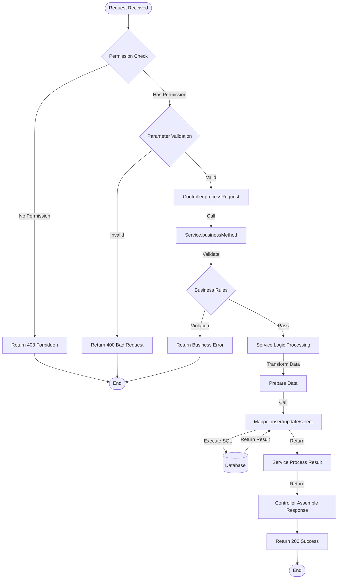
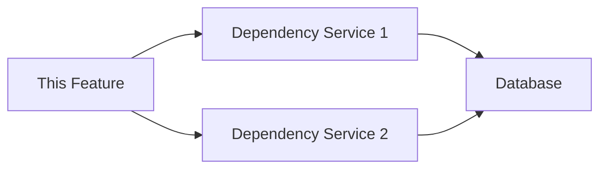

# Feature Detail Design Template - [Feature Name]

> **Applicable Scenario**: Detailed design for a single feature, including UI prototypes, interaction flows, and data definitions, for AI Agent generation and reading
> **Target Audience**: devcrew-product-manager, devcrew-solution-manager, devcrew-designer, devcrew-developer
> **Related Document**: [Module Overview Document](../{{module-name}}-overview.md)
> 
> <!-- AI-TAG: FEATURE_DETAIL -->
> <!-- AI-CONTEXT: This document describes the UI, interaction, and data rules of a single feature in detail. AI should fill all placeholders when generating. -->

**Files Referenced in This Document**

| # | File | Source |
|---|------|--------|
| 1 | {Controller} | [View](../../{controllerSourcePath}) |
| 2 | {Service} | [View](../../{serviceSourcePath}) |
| 3 | {Entity} | [View](../../{entitySourcePath}) |
| 4 | {DTO} | [View](../../{dtoSourcePath}) |

---

## 1. Content Overview

<!-- AI-TAG: OVERVIEW -->

### 1.1 Basic Information

| Item | Description |
|------|-------------|
| Controller Name | {Fill in controller name} |
| Module | {e.g., Order Management Module} |
| Core Function | {1-3 sentences describing core API functionality} |
| Base Path | {e.g., /admin-api/system/user} |

### 1.2 API Scope

This controller includes the following API endpoints:
- [ ] {GET /page} - {Description}
- [ ] {POST /create} - {Description}
- [ ] {PUT /update} - {Description}
- [ ] {DELETE /delete} - {Description}

---

## 2. API Endpoint Definitions

<!-- AI-TAG: API_ENDPOINTS -->
<!-- AI-NOTE: Document all public API endpoints exposed by this controller -->

### 2.1 {Endpoint Name} - {HTTP Method} {API Path}

**Endpoint Information:**

| Item | Description |
|------|-------------|
| Method | {GET/POST/PUT/DELETE} |
| Path | {/admin-api/system/user/page} |
| Description | {Brief description of what this endpoint does} |
| Permission | {Required permission code or role} |

**Request Parameters:**

| Parameter | Type | Required | Description | Validation Rules |
|-----------|------|----------|-------------|------------------|
| {param1} | {String/Integer/Long} | {Yes/No} | {Description} | {e.g., Length 1-50, Not blank} |
| {param2} | {Integer} | {No} | {Description} | {e.g., Min 1, Max 100} |
| {pageNo} | {Integer} | {No} | {Page number} | {Default 1, Min 1} |
| {pageSize} | {Integer} | {No} | {Page size} | {Default 10, Max 100} |

**Response Data:**

| Field | Type | Description | Nullable |
|-------|------|-------------|----------|
| {id} | {Long} | {Record ID} | {No} |
| {field1} | {String} | {Description} | {Yes} |
| {field2} | {Integer} | {Description} | {No} |
| {createTime} | {DateTime} | {Creation time} | {No} |

**Response Example:**

```json
{
  "code": 0,
  "message": "success",
  "data": {
    "list": [
      {
        "id": 1,
        "field1": "value1",
        "field2": 100,
        "createTime": "2024-01-01 12:00:00"
      }
    ],
    "total": 100
  }
}
```

**Error Codes:**

| Error Code | Description | Trigger Condition |
|------------|-------------|-------------------|
| {ERR_001} | {Error description} | {When this error occurs} |
| {ERR_002} | {Error description} | {When this error occurs} |

**Business Flow:**



**Flow Step Description:**

| Step | Operation | Layer | Component | Input | Output | Exception Handling |
|------|-----------|-------|-----------|-------|--------|-------------------|
| 1 | Permission Check | Controller | {Controller} | Request + Token | Permission result | Return 403 |
| 2 | Parameter Validation | Controller | {Controller}/{DTO} | Request parameters | Validated DTO | Return 400 |
| 3 | Invoke Service | Controller | {Controller} | Validated DTO | Service result | - |
| 4 | Business Rule Check | Service | {Service} | Business data | Validation result | Return business error |
| 5 | Data Processing | Service | {Service} | Raw data | Processed data | - |
| 6 | Invoke Mapper | Service | {Service} | Processed data | Mapper result | - |
| 7 | SQL Execution | Mapper | {Mapper}/{Mapper XML} | SQL parameters | DB result | Return 500 |
| 8 | Assemble Response | Controller | {Controller} | Service result | API response | Return 200 |

**Detailed Call Chain:**

| # | Layer | Class | Method | Responsibility | Source |
|---|-------|-------|--------|----------------|--------|
| 1 | Controller | {UserController} | {createUser} | Receive request, validate params, call service | [Source](../../{controllerSourcePath}) |
| 2 | Service | {UserService} | {createUser} | Business validation, data processing, call mapper | [Source](../../{serviceSourcePath}) |
| 3 | Service | {UserService} | {validateUserName} | Check user name uniqueness | [Source](../../{serviceSourcePath}) |
| 4 | Mapper | {UserMapper} | {insert} | Execute INSERT SQL | [Source](../../{mapperSourcePath}) |
| 5 | Mapper XML | {UserMapper.xml} | {insert} | SQL: INSERT INTO user (...) VALUES (...) | [Source](../../{mapperXmlSourcePath}) |

**Database Operations:**

| Operation | Table | SQL Type | Description |
|-----------|-------|----------|-------------|
| {INSERT} | {user} | {INSERT} | {Insert new user record} |
| {SELECT} | {user} | {SELECT COUNT} | {Check user name exists} |
| {UPDATE} | {user} | {UPDATE} | {Update user status} |

**Transaction Boundaries:**

| Method | Transaction Scope | Isolation Level | Notes |
|--------|-------------------|-----------------|-------|
| {UserService.createUser} | {User + UserRole} | {READ_COMMITTED} | {Atomic operation} |

### 2.2 {Next Endpoint Name} - {HTTP Method} {API Path}

{Repeat the same structure for each API endpoint in the controller}

---

## 3. Data Field Definition

<!-- AI-TAG: DATA_DEFINITION -->
<!-- AI-NOTE: Data definitions are important for Solution Agent to design APIs and databases -->

### 3.1 Database Table Structure

<!-- AI-NOTE: Analyze Entity/DO class and Mapper XML to extract database table structure -->

**Table Name:** {table_name}

**Table Description:** {Description of what this table stores}

| Field Name | Field Type | DB Type | Length | Nullable | Default | Constraint | Index | Description |
|------------|------------|---------|--------|----------|---------|------------|-------|-------------|
| {id} | {Long} | {BIGINT} | {20} | {No} | {Auto increment} | {PRIMARY KEY} | {PRIMARY} | {Primary key} |
| {field1} | {String} | {VARCHAR} | {64} | {No} | - | {UNIQUE} | {UNIQUE} | {Unique field} |
| {field2} | {Integer} | {INT} | - | {Yes} | {0} | - | - | {Optional field} |
| {field3} | {DateTime} | {DATETIME} | - | {No} | {CURRENT_TIMESTAMP} | - | - | {Creation time} |
| {field4} | {Enum} | {TINYINT} | {1} | {No} | {1} | - | {INDEX} | {Status field} |

**Indexes:**

| Index Name | Index Type | Fields | Purpose |
|------------|------------|--------|---------|
| {idx_name} | {INDEX} | {field1} | {Query optimization} |
| {idx_status} | {INDEX} | {field4, create_time} | {Composite index for status query} |

**Relationships:**

| Related Table | Relationship | Foreign Key | Description |
|---------------|--------------|-------------|-------------|
| {related_table} | {One-to-Many} | {this_table.related_id} | {Relationship description} |
| {another_table} | {Many-to-One} | {this_table.parent_id} | {Relationship description} |

**Source:** [Entity](../../{entitySourcePath}) | [Mapper XML](../../{mapperXmlSourcePath})

### 3.2 Entity-Database Mapping

| Entity Field | DB Column | Type Mapping | Notes |
|--------------|-----------|--------------|-------|
| {entity.field1} | {column_name} | {String → VARCHAR(64)} | {Mapping notes} |
| {entity.field2} | {column_name} | {Integer → INT} | {Mapping notes} |
| {entity.createTime} | {create_time} | {LocalDateTime → DATETIME} | {Auto-filled} |

### 3.3 DTO/VO Definitions

**Request Parameters:**

```json
{
  "{Field 1}": "{Example value}",
  "{Field 2}": "{Example value}",
  "{Field 3}": {Number},
  "{Field 4}": {Enum value}
}
```

**Response Data:**

```json
{
  "code": 0,
  "message": "success",
  "data": {
    "id": "{Record ID}",
    "{Field 1}": "{Return value}",
    "{Field 2}": "{Return value}",
    "createTime": "2024-01-01 12:00:00"
  }
}
```

---

## 4. References

<!-- AI-TAG: REFERENCES -->
<!-- AI-NOTE: List all dependencies and references for this controller -->

### 4.1 Internal Services

| Service Name | Purpose | Source Path |
|--------------|---------|-------------|
| {ServiceName} | {e.g., User business logic} | [Source](../../{serviceSourcePath}) |
| {ServiceName} | {e.g., Permission validation} | [Source](../../{serviceSourcePath}) |

### 4.2 Data Access Layer

| Mapper/Repository | Entity | Purpose | Source Path |
|-------------------|--------|---------|-------------|
| {MapperName} | {EntityName} | {e.g., User CRUD operations} | [Source](../../{mapperSourcePath}) |
| {MapperName} | {EntityName} | {e.g., Role query} | [Source](../../{mapperSourcePath}) |

### 4.3 DTOs and Entities

| Class Name | Type | Purpose | Source Path |
|------------|------|---------|-------------|
| {DTOClass} | Request DTO | {e.g., Create user request} | [Source](../../{dtoSourcePath}) |
| {VOClass} | Response VO | {e.g., User detail response} | [Source](../../{voSourcePath}) |
| {EntityClass} | Entity | {e.g., User database entity} | [Source](../../{entitySourcePath}) |

### 4.4 API Consumers

<!-- AI-NOTE: List frontend pages that call this controller's APIs -->

| Page Name | Function Description | Source Path | Document Path |
|-----------|---------------------|-------------|---------------|
| {PageName} | {e.g., User management list page} | [Source](../../{pageSourcePath}) | [Doc](../../{pageDocumentPath}) |
| {PageName} | {e.g., User form page} | [Source](../../{pageSourcePath}) | [Doc](../../{pageDocumentPath}) |

---

## 5. Business Rule Constraints

<!-- AI-TAG: BUSINESS_RULES -->

### 5.1 Permission Rules

| API Endpoint | Permission Requirement | No Permission Response |
|--------------|----------------------|----------------------|
| {GET /page} | Have {permission code} permission | Return 403 Forbidden |
| {POST /create} | Have {permission code} permission | Return 403 Forbidden |
| {DELETE /delete} | Have {permission code} permission | Return 403 Forbidden |

### 6.2 Business Logic Rules

1. **{Rule 1}**: {e.g., User name must be unique across system}
2. **{Rule 2}**: {e.g., Cannot delete user with active orders}
3. **{Rule 3}**: {e.g., Password must be encrypted before storage}
4. **{Rule 4}**: {e.g., Admin user cannot be deleted}

### 5.3 Validation Rules

| Validation Scenario | Validation Rule | Error Response | Error Code |
|--------------------|-----------------|----------------|------------|
| Parameter validation | {Field} cannot be empty | Return 400 Bad Request | ERR_001 |
| Format validation | {Field} must match {pattern} | Return 400 Bad Request | ERR_002 |
| Business validation | {Business rule violation} | Return 400 Business Error | ERR_003 |

---

## 6. Dependency Analysis

<!-- AI-TAG: DEPENDENCIES -->

### 6.1 Module Dependencies

| Dependency Module | Dependency Type | Purpose | Impact Scope |
|-------------------|-----------------|---------|--------------|
| {Module A} | Strong | {Purpose description} | {Impact when unavailable} |
| {Module B} | Weak | {Purpose description} | {Degraded functionality} |

### 6.2 Service Dependencies



**Diagram Source**
- [{Service}.java](../../{serviceSourcePath})

### 6.3 External Dependencies

| External System | Interface Type | Call Scenario | Degradation Strategy |
|-----------------|----------------|---------------|---------------------|
| {Payment Gateway} | REST API | {Payment processing} | {Queue and retry} |
| {SMS Service} | REST API | {Verification code} | {Skip and log} |

---

## 7. Performance Considerations

<!-- AI-TAG: PERFORMANCE -->

### 7.1 Performance Bottlenecks

| Scenario | Bottleneck Description | Optimization Suggestion | Priority |
|----------|----------------------|------------------------|----------|
| {List query} | {Large data volume} | {Add index, pagination} | High |
| {Batch operation} | {Database lock} | {Async processing} | Medium |

### 7.2 Index Suggestions

| Table Name | Index Fields | Index Type | Scenario Description |
|------------|--------------|------------|---------------------|
| {table_name} | {field1, field2} | {COMPOSITE INDEX} | {Query optimization} |
| {table_name} | {field3} | {INDEX} | {Filter condition} |

### 7.3 Caching Strategy

| Cache Scenario | Cache Strategy | Expiration Time | Invalidation Strategy |
|----------------|----------------|-----------------|----------------------|
| {User info} | {Redis} | {30 minutes} | {Write-through} |
| {Configuration} | {Local cache} | {5 minutes} | {TTL expiration} |

### 7.4 Transaction Boundaries

| Operation Scenario | Transaction Scope | Isolation Level | Timeout Setting |
|-------------------|-------------------|-----------------|-----------------|
| {Create order} | {Order + Details} | {READ_COMMITTED} | {30 seconds} |
| {Payment} | {Order + Payment} | {SERIALIZABLE} | {60 seconds} |

---

## 8. Troubleshooting Guide

<!-- AI-TAG: TROUBLESHOOTING -->

### 8.1 Common Issues

| Issue Symptom | Possible Cause | Troubleshooting Steps | Solution |
|---------------|----------------|----------------------|----------|
| {Query timeout} | {Missing index} | {Check execution plan} | {Add index} |
| {Data inconsistency} | {Transaction failure} | {Check transaction logs} | {Manual correction} |
| {Permission denied} | {Role not assigned} | {Check user roles} | {Assign correct role} |

### 8.2 Error Code Reference

| Error Code | Error Description | Trigger Condition | Handling Suggestion |
|------------|-------------------|-------------------|---------------------|
| ERR_001 | {Required field empty} | {Form submission} | {Check required fields} |
| ERR_002 | {Format validation failed} | {Data validation} | {Check data format} |
| ERR_003 | {Business rule violation} | {Business operation} | {Check business rules} |

### 8.3 Key Log Points

| Log Location | Log Level | Key Information | Troubleshooting Purpose |
|--------------|-----------|-----------------|------------------------|
| {Service layer} | ERROR | {Exception stack trace} | {Locate error root cause} |
| {Controller} | INFO | {Request parameters} | {Reproduce issue} |
| {Database} | DEBUG | {SQL statements} | {Performance analysis} |

---

## 9. Notes and Additional Information

<!-- AI-TAG: ADDITIONAL_NOTES -->

### 9.1 Compatibility Adaptation

- **Interface Adaptation**: Supports PC 1920×1080 resolution, responsive adaptation for 1366×768 and above
- **Interaction Adaptation**: Supports mouse click/Enter to trigger actions, supports keyboard Tab key to switch focus

### 9.2 Pending Confirmations

- [ ] **{Pending 1}**: {e.g., Whether product category dropdown needs to support fuzzy search}
- [ ] **{Pending 2}**: {e.g., Whether delete operation needs secondary confirmation}

### 9.3 Extension Notes

- This prototype is a simplified version of the core process, extended fields/features can be added in subsequent iterations
- ASCII wireframe prototype only expresses layout and interaction logic, visual styles (e.g., colors, fonts) should refer to product visual specifications

---

## 10. Appendix

### 10.1 Best Practices

- {Best practice 1: e.g., Use batch operations for large datasets}
- {Best practice 2: e.g., Implement idempotency for critical operations}
- {Best practice 3: e.g., Add proper logging for troubleshooting}

### 10.2 Configuration Examples

```yaml
# Configuration example
feature:
  enabled: true
  timeout: 30s
  retry:
    max_attempts: 3
    delay: 1s
```

### 10.3 Related Documents

- [API Documentation](link)
- [Database Design](link)
- [Module Overview](../{module-name}-overview.md)

---

**Document Status:** 📝 Draft / 👀 In Review / ✅ Published  
**Last Updated:** {Date}  
**Maintainer:** {Name}  
**Related Module Document:** [Module Overview Document](../{{module-name}}-overview.md)

**Section Source**
- [{Controller}.java](../../{controllerSourcePath})
- [{Service}.java](../../{serviceSourcePath})
- [{Entity}.java](../../{entitySourcePath})
