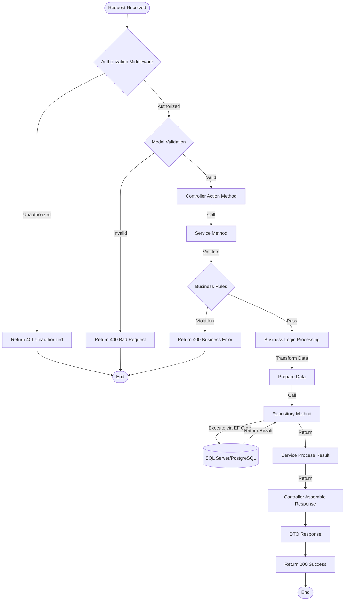
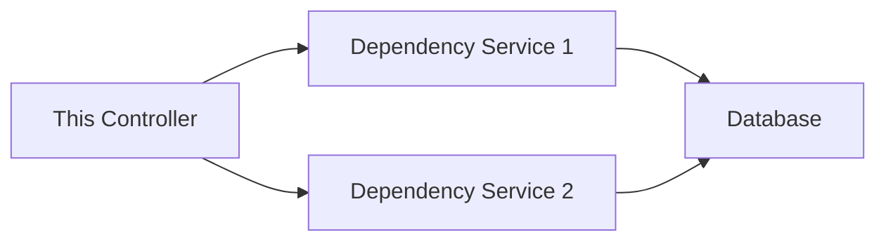

# API Feature Detail Template - [Feature Name]

> **Tech Stack**: ASP.NET Core + Entity Framework Core
> **Target Audience**: devcrew-product-manager, devcrew-solution-manager, devcrew-developer
> **Related Document**: [Module Overview Document](../{{module-name}}-overview.md)
> 
> <!-- AI-TAG: FEATURE_DETAIL -->
> <!-- AI-CONTEXT: This document describes ASP.NET Core API endpoints, business logic flow, and data models. AI should fill all placeholders when generating. -->

**Files Referenced in This Document**

| # | File | Source |
|---|------|--------|
| 1 | {Controller} | [View](../../../../../../{controllerSourcePath}) |
| 2 | {Service} | [View](../../../../../../{serviceSourcePath}) |
| 3 | {Repository} | [View](../../../../../../{repositorySourcePath}) |
| 4 | {Entity} | [View](../../../../../../{entitySourcePath}) |

---

## 1. Content Overview

<!-- AI-TAG: OVERVIEW -->

### 1.1 Basic Information

| Item | Description |
|------|-------------|
| Controller Name | {Fill in controller name} |
| Module | {e.g., Order Management Module} |
| Core Function | {1-3 sentences describing core API functionality} |
| Base Path | {e.g., /api/v1/users} |
| Area | {e.g., Admin} |

### 1.2 API Scope

This controller includes the following API endpoints:
- [ ] {GET /api/v1/users} - {List users with pagination}
- [ ] {POST /api/v1/users} - {Create new user}
- [ ] {GET /api/v1/users/{id}} - {Get user by ID}
- [ ] {PUT /api/v1/users/{id}} - {Update user}
- [ ] {DELETE /api/v1/users/{id}} - {Delete user}

---

## 2. API Endpoint Definitions

<!-- AI-TAG: API_ENDPOINTS -->
<!-- AI-NOTE: Document all public API endpoints exposed by this controller -->

### 2.1 {Endpoint Name} - {HTTP Method} {API Path}

**Endpoint Information:**

| Item | Description |
|------|-------------|
| Method | {GET/POST/PUT/DELETE} |
| Path | {/api/v1/users} |
| Description | {Brief description of what this endpoint does} |
| Authorization | {e.g., [Authorize(Roles = "Admin")]} |

**Request Parameters:**

| Parameter | Type | Required | Description | Validation Rules |
|-----------|------|----------|-------------|------------------|
| {param1} | {string/int} | {Yes/No} | {Description} | {e.g., [Required], [MaxLength(50)]} |
| {param2} | {int} | {No} | {Description} | {e.g., [Range(1, 100)]} |
| {pageNumber} | {int} | {No} | {Page number} | {Default 1} |
| {pageSize} | {int} | {No} | {Page size} | {Default 10, Max 100} |

**Response Data:**

| Field | Type | Description | Nullable |
|-------|------|-------------|----------|
| {id} | {Guid/int} | {Record ID} | {No} |
| {field1} | {string} | {Description} | {Yes} |
| {field2} | {int} | {Description} | {No} |
| {createdAt} | {DateTime} | {Creation time} | {No} |

**Response Example:**

```json
{
  "id": "550e8400-e29b-41d4-a716-446655440000",
  "field1": "value1",
  "field2": 100,
  "createdAt": "2024-01-01T12:00:00Z"
}
```

**Error Codes:**

| Error Code | Description | Trigger Condition |
|------------|-------------|-------------------|
| {400} | {Bad Request} | {Model validation failed} |
| {401} | {Unauthorized} | {Missing or invalid JWT token} |
| {403} | {Forbidden} | {Insufficient permissions} |
| {404} | {Not Found} | {Resource not found} |

**Business Flow:**



**Flow Step Description:**

| Step | Operation | Layer | Component | Input | Output | Exception Handling |
|------|-----------|-------|-----------|-------|--------|-------------------|
| 1 | Authorization | Middleware | {Auth Middleware} | Request + JWT Token | ClaimsPrincipal | Return 401 |
| 2 | Model Validation | Controller | {Data Annotations} | Request body | Validated DTO | Return 400 |
| 3 | Invoke Service | Controller | {Controller Action} | Validated DTO | Service result | - |
| 4 | Business Rule Check | Service | {Service} | Business data | Validation result | Return 400 |
| 5 | Data Processing | Service | {Service} | Raw data | Processed data | - |
| 6 | Invoke Repository | Service | {Repository} | Processed data | Entity result | - |
| 7 | SQL Execution | Repository | {EF Core DbContext} | LINQ/Query | DB result | Return 500 |
| 8 | Assemble Response | Controller | {Controller} | Service result | DTO response | Return 200 |

**Detailed Call Chain:**

| # | Layer | File | Method/Class | Responsibility | Source |
|---|-------|------|--------------|----------------|--------|
| 1 | Controller | {UsersController.cs} | {CreateUser} | Receive request, validate params, call service | [Source](../../../../../../{controllerSourcePath}) |
| 2 | Service | {UserService.cs} | {CreateUserAsync} | Business validation, data processing, call repository | [Source](../../../../../../{serviceSourcePath}) |
| 3 | Service | {UserService.cs} | {ValidateUserEmailAsync} | Check email uniqueness | [Source](../../../../../../{serviceSourcePath}) |
| 4 | Repository | {UserRepository.cs} | {AddAsync} | Execute Add via EF Core | [Source](../../../../../../{repositorySourcePath}) |
| 5 | Entity | {User.cs} | {User entity} | EF Core entity definition | [Source](../../../../../../{entitySourcePath}) |

**Database Operations:**

| Operation | Table | EF Core Method | Description |
|-----------|-------|----------------|-------------|
| {INSERT} | {Users} | {DbSet.AddAsync} | {Insert new user record} |
| {SELECT} | {Users} | {DbSet.FirstOrDefaultAsync} | {Check email exists} |
| {UPDATE} | {Users} | {DbSet.Update} | {Update user status} |

**Transaction Boundaries:**

| Method | Transaction Scope | Isolation Level | Notes |
|--------|-------------------|-----------------|-------|
| {UserService.CreateUserAsync} | {User + UserRoles} | {ReadCommitted} | {Using Unit of Work pattern} |

### 2.2 {Next Endpoint Name} - {HTTP Method} {API Path}

{Repeat the same structure for each API endpoint in the controller}

---

## 3. Data Field Definition

<!-- AI-TAG: DATA_DEFINITION -->
<!-- AI-NOTE: Data definitions are important for Solution Agent to design APIs and databases -->

### 3.1 Database Table Structure

<!-- AI-NOTE: Analyze EF Core Entity to extract database table structure -->

**Table Name:** {table_name}

**Table Description:** {Description of what this table stores}

| Field Name | C# Type | DB Type | Length | Nullable | Default | Constraint | Index | Description |
|------------|---------|---------|--------|----------|---------|------------|-------|-------------|
| {Id} | {Guid/int} | {uniqueidentifier/INT} | - | {No} | {NEWID()/IDENTITY} | {PRIMARY KEY} | {PRIMARY} | {Primary key} |
| {Field1} | {string} | {nvarchar} | {255} | {No} | - | {UNIQUE} | {UNIQUE} | {Unique field} |
| {Field2} | {int} | {INT} | - | {Yes} | {0} | - | - | {Optional field} |
| {Field3} | {DateTime} | {datetime2} | - | {No} | {GETUTCDATE()} | - | - | {Creation time} |
| {Field4} | {bool/Enum} | {bit/TINYINT} | - | {No} | {1} | - | {INDEX} | {Status field} |

**Indexes:**

| Index Name | Index Type | Fields | Purpose |
|------------|------------|--------|---------|
| {IX_Name} | {Index} | {Field1} | {Query optimization} |
| {IX_Status_CreatedAt} | {Index} | {Field4, CreatedAt} | {Composite index for status query} |

**Relationships:**

| Related Table | Relationship | Foreign Key | Description |
|---------------|--------------|-------------|-------------|
| {RelatedTable} | {One-to-Many} | {RelatedId} | {Relationship description} |
| {AnotherTable} | {Many-to-One} | {AnotherId} | {Relationship description} |

**Source:** [Entity](../../../../../../{entitySourcePath}) | [DbContext](../../../../../../{dbContextSourcePath})

### 3.2 Entity-Database Mapping

| Entity Property | DB Column | Type Mapping | Notes |
|-----------------|-----------|--------------|-------|
| {entity.Field1} | {ColumnName} | {string → nvarchar(255)} | {Mapping notes} |
| {entity.Field2} | {ColumnName} | {int → INT} | {Mapping notes} |
| {entity.CreatedAt} | {CreatedAt} | {DateTime → datetime2} | {Value generated on add} |

### 3.3 DTO Definitions

**Request DTO:**

```csharp
public class {CreateUserRequest}
{
    [Required]
    [MaxLength(50)]
    public string Field1 { get; set; }
    
    [Range(1, int.MaxValue)]
    public int Field2 { get; set; }
}
```

**Response DTO:**

```csharp
public class {UserResponse}
{
    public Guid Id { get; set; }
    public string Field1 { get; set; }
    public int Field2 { get; set; }
    public DateTime CreatedAt { get; set; }
}
```

---

## 4. References

<!-- AI-TAG: REFERENCES -->
<!-- AI-NOTE: List all dependencies and references for this controller -->

### 4.1 Internal Services

| Service Name | Purpose | Source Path |
|--------------|---------|-------------|
| {IUserService} | {e.g., User business logic interface} | [Source](../../../../../../{serviceInterfaceSourcePath}) |
| {UserService} | {e.g., User business logic implementation} | [Source](../../../../../../{serviceSourcePath}) |

### 4.2 Data Access Layer

| Repository | Entity | Purpose | Source Path |
|------------|--------|---------|-------------|
| {IUserRepository} | {User} | {e.g., User repository interface} | [Source](../../../../../../{repositoryInterfaceSourcePath}) |
| {UserRepository} | {User} | {e.g., User repository implementation} | [Source](../../../../../../{repositorySourcePath}) |

### 4.3 DTOs and Entities

| Class Name | Type | Purpose | Source Path |
|------------|------|---------|-------------|
| {CreateUserRequest} | Request DTO | {e.g., Create user request} | [Source](../../../../../../{dtoSourcePath}) |
| {UserResponse} | Response DTO | {e.g., User detail response} | [Source](../../../../../../{dtoSourcePath}) |
| {User} | EF Core Entity | {e.g., User database entity} | [Source](../../../../../../{entitySourcePath}) |

### 4.4 API Consumers

<!-- AI-NOTE: List frontend pages that call this controller's APIs -->

| Page Name | Function Description | Source Path | Document Path |
|-----------|---------------------|-------------|---------------|
| {PageName} | {e.g., User management list page} | [Source](../../../../../../{pageSourcePath}) | [Doc](../../../../../../{pageDocumentPath}) |
| {PageName} | {e.g., User form page} | [Source](../../../../../../{pageSourcePath}) | [Doc](../../../../../../{pageDocumentPath}) |

---

## 5. Business Rule Constraints

<!-- AI-TAG: BUSINESS_RULES -->

### 5.1 Permission Rules

| API Endpoint | Permission Requirement | No Permission Response |
|--------------|----------------------|----------------------|
| {GET /api/v1/users} | {Require authentication} | Return 401 Unauthorized |
| {POST /api/v1/users} | {Require Admin role} | Return 403 Forbidden |
| {DELETE /api/v1/users/{id}} | {Require Admin role} | Return 403 Forbidden |

### 5.2 Business Logic Rules

1. **{Rule 1}**: {e.g., User email must be unique across system}
2. **{Rule 2}**: {e.g., Cannot delete user with active orders}
3. **{Rule 3}**: {e.g., Password must be hashed before storage}
4. **{Rule 4}**: {e.g., Admin user cannot be deleted}

### 5.3 Validation Rules

| Validation Scenario | Validation Rule | Error Response | Error Code |
|--------------------|-----------------|----------------|------------|
| Data Annotations | {Field} validation attributes | Return 400 Bad Request | - |
| Business validation | {Business rule violation} | Return 400 Bad Request | - |

---

## 6. Dependency Analysis

<!-- AI-TAG: DEPENDENCIES -->

### 6.1 Module Dependencies

| Dependency Module | Dependency Type | Purpose | Impact Scope |
|-------------------|-----------------|---------|--------------|
| {Module A} | Strong | {Purpose description} | {Impact when unavailable} |
| {Module B} | Weak | {Purpose description} | {Degraded functionality} |

### 6.2 Service Dependencies



**Diagram Source**
- [{Service}.cs](../../../../../../{serviceSourcePath})

### 6.3 External Dependencies

| External System | Interface Type | Call Scenario | Degradation Strategy |
|-----------------|----------------|---------------|---------------------|
| {Payment Gateway} | REST API | {Payment processing} | {Queue and retry} |
| {SMS Service} | REST API | {Verification code} | {Skip and log} |

---

## 7. Performance Considerations

<!-- AI-TAG: PERFORMANCE -->

### 7.1 Performance Bottlenecks

| Scenario | Bottleneck Description | Optimization Suggestion | Priority |
|----------|----------------------|------------------------|----------|
| {List query} | {Large data volume} | {Add index, use IQueryable} | High |
| {Batch operation} | {Database lock} | {Use async processing} | Medium |

### 7.2 Index Suggestions

| Table Name | Index Fields | Index Type | Scenario Description |
|------------|--------------|------------|---------------------|
| {table_name} | {field1, field2} | {COMPOSITE INDEX} | {Query optimization} |
| {table_name} | {field3} | {INDEX} | {Filter condition} |

### 7.3 Caching Strategy

| Cache Scenario | Cache Strategy | Expiration Time | Invalidation Strategy |
|----------------|----------------|-----------------|----------------------|
| {User info} | {Redis/IDistributedCache} | {30 minutes} | {Write-through} |
| {Configuration} | {IMemoryCache} | {5 minutes} | {TTL expiration} |

---

## 8. Troubleshooting Guide

<!-- AI-TAG: TROUBLESHOOTING -->

### 8.1 Common Issues

| Issue Symptom | Possible Cause | Troubleshooting Steps | Solution |
|---------------|----------------|----------------------|----------|
| {Query timeout} | {Missing index} | {Check SQL execution plan} | {Add index} |
| {Data inconsistency} | {Transaction failure} | {Check transaction logs} | {Manual correction} |
| {Permission denied} | {Role not assigned} | {Check JWT claims} | {Assign correct role} |

### 8.2 Error Code Reference

| Error Code | Error Description | Trigger Condition | Handling Suggestion |
|------------|-------------------|-------------------|---------------------|
| {400} | {Bad Request} | {Model validation failed} | {Check request body} |
| {401} | {Unauthorized} | {Invalid or expired JWT} | {Refresh token} |
| {500} | {Internal Server Error} | {Unhandled exception} | {Check server logs} |

---

## 9. Notes and Additional Information

<!-- AI-TAG: ADDITIONAL_NOTES -->

### 9.1 Compatibility Adaptation

- **.NET Version**: Compatible with .NET 6/7/8
- **EF Core Version**: Compatible with EF Core 6/7/8
- **Database**: SQL Server, PostgreSQL, MySQL supported

### 9.2 Pending Confirmations

- [ ] **{Pending 1}**: {e.g., Whether to implement API versioning}
- [ ] **{Pending 2}**: {e.g., Whether to add OData support}

---

## 10. Appendix

### 10.1 Best Practices

- {Best practice 1: e.g., Use async/await for all I/O operations}
- {Best practice 2: e.g., Implement repository pattern for testability}
- {Best practice 3: e.g., Use DTOs to decouple API from domain models}

### 10.2 Configuration Examples

```csharp
// Program.cs configuration
builder.Services.AddControllers();
builder.Services.AddDbContext<ApplicationDbContext>(options =>
    options.UseSqlServer(builder.Configuration.GetConnectionString("DefaultConnection")));

builder.Services.AddScoped<IUserService, UserService>();
builder.Services.AddScoped<IUserRepository, UserRepository>();

// JWT Authentication
builder.Services.AddAuthentication(JwtBearerDefaults.AuthenticationScheme)
    .AddJwtBearer(options =>
    {
        options.Authority = builder.Configuration["Jwt:Authority"];
        options.Audience = builder.Configuration["Jwt:Audience"];
    });
```

### 10.3 Related Documents

- [API Documentation](link)
- [Database Design](link)
- [Module Overview](../{module-name}-overview.md)

---

**Document Status:** 📝 Draft / 👀 In Review / ✅ Published  
**Last Updated:** {Date}  
**Maintainer:** {Name}  
**Related Module Document:** [Module Overview Document](../{{module-name}}-overview.md)

**Section Source**
- [{Controller}.cs](../../../../../../{controllerSourcePath})
- [{Service}.cs](../../../../../../{serviceSourcePath})
- [{Entity}.cs](../../../../../../{entitySourcePath})
