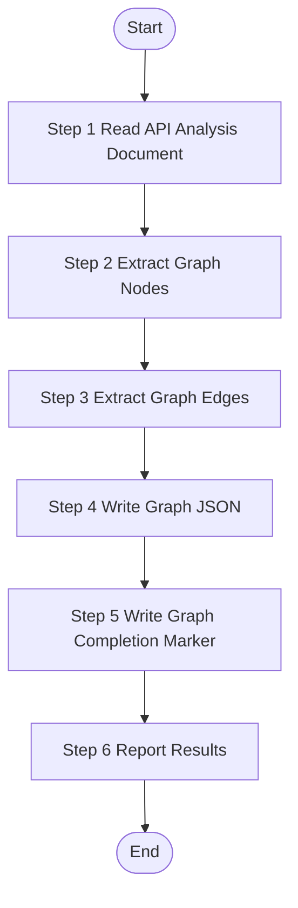

# API Knowledge Graph Constructor

> **CRITICAL CONSTRAINT**: DO NOT create temporary scripts, batch files, or workaround code files (`.py`, `.bat`, `.sh`, `.ps1`, etc.) under any circumstances. If execution encounters errors, STOP and report the exact error. Fixes must be applied to the Skill definition or source scripts — not patched at runtime.

Construct knowledge graph data structures (nodes and edges) from API analysis results. This skill transforms structured API documentation into graph JSON format for knowledge base integration.

## Trigger Scenarios

- "Construct graph data from API analysis results"
- "Generate knowledge graph nodes and edges for API feature"
- "Write graph JSON for API controller"

## Input Parameters

| Parameter | Required | Description | Example |
|-----------|----------|-------------|---------|
| `api_analysis_path` | Yes | Path to the API analysis document (from bizs-api-analyze) | `"speccrew-workspace/knowledges/bizs/admin-api/system/user/UserController.md"` |
| `platform_id` | Yes | Target platform identifier | `"admin-api"`, `"app-api"` |
| `output_dir` | Yes | Output directory for graph data | `"speccrew-workspace/knowledges/base/sync-state/knowledge-bizs/completed"` |
| `module` | Yes | Business module name | `"system"`, `"trade"`, `"ai"` |
| `fileName` | Yes | Controller class name (without extension) | `"UserController"` |
| `sourcePath` | Yes | Relative path to source file | `"yudao-module-system/.../UserController.java"` |
| `sourceFile` | Yes | Source features JSON filename | `"features-admin-api.json"` |
| `language` | Yes | Target language for content | `"zh"`, `"en"` |
| `subpath` | No | Subpath extracted from sourcePath (for marker naming) | `"controller-admin-user"` |

## Output Variables

| Variable | Type | Description |
|----------|------|-------------|
| `{{status}}` | string | Graph construction status: `"success"` or `"failed"` |
| `{{graph_file}}` | string | Path to the generated graph JSON file |
| `{{node_count}}` | integer | Number of nodes generated |
| `{{edge_count}}` | integer | Number of edges generated |

## Execution Requirements

This skill operates in **strict sequential execution mode**:
- Execute steps in exact order (Step 1 → Step 2 → ... → Step 5)
- Output step status after each step completion
- Do NOT skip any step

## Output

**Generated Files:**
1. `{{output_dir}}/{module}-{subpath}-{fileName}.graph.json` - Graph data with nodes and edges
2. `{{output_dir}}/{module}-{subpath}-{fileName}.graph-done.json` - Graph completion marker

**Return Value:**
```json
{
  "status": "success|failed",
  "module": "{{module}}",
  "fileName": "{{fileName}}",
  "graphFile": "{{output_dir}}/{module}-{subpath}-{fileName}.graph.json",
  "nodeCount": 15,
  "edgeCount": 23,
  "message": "Generated graph data with 15 nodes and 23 edges"
}
```

## Workflow



---

### Step 1: Read API Analysis Document

**Step 1 Status: 🔄 IN PROGRESS**

**Actions:**

1. **Read the API analysis document** from `{{api_analysis_path}}`

2. **Parse the document structure** to extract:
   - API endpoints (method, path, description)
   - Service references
   - Database tables accessed
   - DTOs used
   - Business rules and permissions

3. **Validate required information** is present for graph construction

**Output:** "Step 1 Status: ✅ COMPLETED - Read {{api_analysis_path}} ({{lineCount}} lines), Found {{endpointCount}} endpoints"

---

### Step 2: Extract Graph Nodes

**Step 2 Status: 🔄 IN PROGRESS**

Based on the API analysis document, extract graph nodes for each entity type.

**Node Types to Extract:**

| Node Type | Source | ID Format | Context Fields |
|-----------|--------|-----------|----------------|
| `api` | Each public API endpoint | `api-{module}-{name}` | `method`, `path`, `params`, `tables`, `permissions` |
| `service` | Each injected service | `service-{module}-{name}` | `methods`, `dependencies` |
| `table` | Each database table accessed | `table-{module}-{tableName}` | `fields`, `indexes`, `engine` |
| `dto` | Each request/response DTO | `dto-{module}-{name}` | `fields`, `validation` |

**Node ID Naming Convention:**
```
{type}-{module}-{name}

Examples:
  api-system-user-list
  api-system-user-create
  service-system-user-service
  table-system-system_user
  dto-system-user-create-req
```

**Node Structure:**
```json
{
  "id": "api-{module}-{endpoint-name}",
  "type": "api",
  "name": "<display name>",
  "module": "{{module}}",
  "sourcePath": "{{sourcePath}}",
  "documentPath": "{{api_analysis_path}}",
  "description": "...",
  "metadata": {
    "method": "GET",
    "path": "/admin-api/system/user/page",
    "permissions": ["system:user:query"]
  }
}
```

**Service Node Example:**
```json
{
  "id": "service-{module}-{service-name}",
  "type": "service",
  "name": "UserService",
  "module": "{{module}}",
  "sourcePath": "relative/path/to/UserService.java",
  "description": "User business logic service",
  "metadata": {
    "methods": ["getUserPage", "createUser", "updateUser"]
  }
}
```

**Table Node Example:**
```json
{
  "id": "table-{module}-{table-name}",
  "type": "table",
  "name": "system_user",
  "module": "{{module}}",
  "sourcePath": "",
  "description": "User table",
  "metadata": {
    "fields": ["id", "username", "password", "status"],
    "indexes": ["idx_username"]
  }
}
```

**DTO Node Example:**
```json
{
  "id": "dto-{module}-{dto-name}",
  "type": "dto",
  "name": "UserCreateReqVO",
  "module": "{{module}}",
  "sourcePath": "relative/path/to/UserCreateReqVO.java",
  "description": "Create user request DTO",
  "metadata": {
    "fields": ["username", "password", "nickname"],
    "validation": ["@NotBlank username", "@Size(max=50) nickname"]
  }
}
```

**IMPORTANT:**
- `module` comes from `{{module}}` input variable
- `name` should be a short, readable slug derived from the entity name
- Each node must include `sourcePath` and `documentPath` (if applicable)
- Convert class names to kebab-case for node IDs (e.g., `UserService` → `user-service`)

**Output:** "Step 2 Status: ✅ COMPLETED - Extracted {{nodeCount}} graph nodes ({{apiCount}} APIs, {{serviceCount}} services, {{tableCount}} tables, {{dtoCount}} DTOs)"

---

### Step 3: Extract Graph Edges

**Step 3 Status: 🔄 IN PROGRESS**

Based on the API analysis document, extract graph edges representing relationships between nodes.

**Edge Types to Extract:**

| Edge Type | Direction | When to Create |
|-----------|-----------|----------------|
| `operates` | api → table | API endpoint reads/writes a database table |
| `invokes` | api → service | Controller calls a service method |
| `references` | api → dto | API endpoint uses a request/response DTO |
| `depends-on` | service → service | Service depends on another service |
| `maps-to` | dto → table | DO/Entity maps to database table |

**Edge Structure:**
```json
{
  "source": "api-system-user-create",
  "target": "table-system-system_user",
  "type": "operates",
  "metadata": {
    "operation": "INSERT",
    "description": "Create new user record"
  }
}
```

**Edge Examples:**

1. **API → Table (operates):**
```json
{
  "source": "api-system-user-list",
  "target": "table-system-system_user",
  "type": "operates",
  "metadata": {
    "operation": "SELECT",
    "description": "Query user list with pagination"
  }
}
```

2. **API → Service (invokes):**
```json
{
  "source": "api-system-user-create",
  "target": "service-system-user-service",
  "type": "invokes",
  "metadata": {
    "method": "createUser",
    "description": "Create user business logic"
  }
}
```

3. **API → DTO (references):**
```json
{
  "source": "api-system-user-create",
  "target": "dto-system-user-create-req",
  "type": "references",
  "metadata": {
    "usage": "request",
    "description": "Create user request body"
  }
}
```

4. **Service → Service (depends-on):**
```json
{
  "source": "service-system-user-service",
  "target": "service-system-permission-service",
  "type": "depends-on",
  "metadata": {
    "description": "User service depends on permission service for role checks"
  }
}
```

5. **DTO → Table (maps-to):**
```json
{
  "source": "dto-system-user-do",
  "target": "table-system-system_user",
  "type": "maps-to",
  "metadata": {
    "description": "UserDO maps to system_user table"
  }
}
```

**Output:** "Step 3 Status: ✅ COMPLETED - Extracted {{edgeCount}} graph edges"

---

### Step 4: Write Graph JSON

**Step 4 Status: 🔄 IN PROGRESS**

Write the complete graph data to JSON file.

**Marker File Naming Convention:**
```
{output_dir}/{module}-{subpath}-{fileName}.graph.json
```

**How to Extract Each Component:**

1. **module**: Use `{{module}}` input variable directly (e.g., `system`, `trade`, `ai`)

2. **subpath**: Extract from `{{sourcePath}}`:
   - For Java: Remove package prefix up to the business layer (e.g., `controller/admin/`, `controller/app/`)
   - Remove the file name at the end
   - Replace path separators (`/`) with hyphens (`-`)
   - If the file is at module root, subpath will be empty → omit from filename

3. **fileName**: Use `{{fileName}}` input variable (class name WITHOUT extension)

**Examples:**

| sourcePath | module | subpath | fileName | Marker Filename |
|------------|--------|---------|----------|-----------------|
| `yudao-module-system/.../controller/admin/notify/NotifyMessageController.java` | `system` | `controller-admin-notify` | `NotifyMessageController` | `system-controller-admin-notify-NotifyMessageController.graph.json` |
| `yudao-module-system/.../controller/admin/user/UserController.java` | `system` | `controller-admin-user` | `UserController` | `system-controller-admin-user-UserController.graph.json` |
| `yudao-module-ai/.../controller/admin/chat/ChatConversationController.java` | `ai` | `controller-admin-chat` | `ChatConversationController` | `ai-controller-admin-chat-ChatConversationController.graph.json` |

**CRITICAL - API Endpoint Coverage Check:**
Before writing the graph.json file, verify:
- [ ] ALL public API endpoint methods in the controller are represented as `api` nodes
- [ ] Status update endpoints (updateStatus, toggleEnable) are included
- [ ] Special operation endpoints (resetPassword, export, import, batch operations) are included
- [ ] Each `api` node has proper metadata with HTTP method and path
- [ ] No public endpoint method is left without a corresponding node

**Pre-write Verification (MUST check before writing):**
- [ ] Root-level `module` field is present (MANDATORY)
- [ ] `nodes` and `edges` are arrays (can be empty)
- [ ] Valid JSON (no trailing commas, all strings quoted)
- [ ] All node IDs are unique
- [ ] All edge source/target references point to valid node IDs

**Complete JSON Template:**
```json
{
  "module": "{{module}}",
  "nodes": [
    {
      "id": "api-{module}-{endpoint-name}",
      "type": "api",
      "name": "<display name>",
      "module": "{{module}}",
      "sourcePath": "{{sourcePath}}",
      "documentPath": "{{api_analysis_path}}",
      "description": "...",
      "metadata": {
        "method": "GET",
        "path": "/admin-api/system/user/page",
        "permissions": ["system:user:query"]
      }
    }
  ],
  "edges": [
    {
      "source": "api-...",
      "target": "service-...",
      "type": "invokes",
      "metadata": { ... }
    }
  ]
}
```

**⚠️ CRITICAL - Module Field Requirement:**
- The `.graph.json` file **MUST** have a root-level `module` field
- Do NOT assume scripts will fall back to reading from `.done` file
- Missing `module` field will cause the graph merge pipeline to reject this file

**⚠️ CRITICAL - Path Format:**
- `sourcePath` in nodes: Relative path (as-is from input)
- `documentPath` in nodes: Relative path (as-is from input)
- NEVER convert relative paths to absolute paths in JSON content

**Full Path Example:**
`d:/dev/speccrew/speccrew-workspace/knowledges/base/sync-state/knowledge-bizs/completed/system-controller-admin-user-UserController.graph.json`

**Output:** "Step 4 Status: ✅ COMPLETED - Graph JSON written to {{output_dir}}/{module}-{subpath}-{fileName}.graph.json ({{fileSize}} bytes)"

---

### Step 5: Write Graph Completion Marker

**Step 5 Status: 🔄 IN PROGRESS**

Write the `.graph-done.json` completion marker file to signal successful graph data generation.

**Marker File Path:**

```
{output_dir}/{module}-{subpath}-{fileName}.graph-done.json
```

**Marker JSON Structure:**

```json
{
  "fileName": "{{fileName}}",
  "module": "{{module}}",
  "marker": "graph_completed",
  "graphFile": "{module}-{subpath}-{fileName}.graph.json",
  "nodeCount": {{node_count}},
  "edgeCount": {{edge_count}},
  "status": "completed"
}
```

**Field Descriptions:**

| Field | Description | Example |
|-------|-------------|---------|
| `fileName` | Feature file name WITHOUT extension | `"UserController"` |
| `module` | Business module name | `"system"` |
| `marker` | Fixed marker type | `"graph_completed"` |
| `graphFile` | Corresponding graph JSON filename | `"system-controller-admin-user-UserController.graph.json"` |
| `nodeCount` | Number of nodes in graph | `15` |
| `edgeCount` | Number of edges in graph | `23` |
| `status` | Completion status | `"completed"` |

**Pre-write Verification:**
- [ ] Filename follows `{module}-{subpath}-{fileName}.graph-done.json` pattern
- [ ] JSON is valid
- [ ] All required fields are present
- [ ] `nodeCount` and `edgeCount` match actual graph data

**Output:** "Step 5 Status: ✅ COMPLETED - Graph completion marker written to {{output_dir}}/{module}-{subpath}-{fileName}.graph-done.json"

---

### Step 6: Report Results

**Step 6 Status: 🔄 IN PROGRESS**

Return graph construction result summary to dispatch:

```json
{
  "status": "success",
  "module": "{{module}}",
  "fileName": "{{fileName}}",
  "graphFile": "{{output_dir}}/{module}-{subpath}-{fileName}.graph.json",
  "nodeCount": {{node_count}},
  "edgeCount": {{edge_count}},
  "message": "Generated graph data with {{node_count}} nodes and {{edge_count}} edges"
}
```

Or in case of failure:

```json
{
  "status": "failed",
  "module": "{{module}}",
  "fileName": "{{fileName}}",
  "message": "{{error_message}}"
}
```

**Output:** "Step 6 Status: ✅ COMPLETED - Graph construction {{status}}: {{message}}"

---

## Constraints

1. **Single Document Input**: This skill processes ONE API analysis document at a time
2. **JSON Format**: All output files MUST be valid JSON
3. **Module Field**: The root-level `module` field is MANDATORY in graph JSON
4. **Node Uniqueness**: Each node ID must be unique within the graph
5. **Edge Validity**: Edge source/target must reference existing node IDs
6. **Path Format**: Use relative paths, NEVER absolute paths in JSON content

## Node Type Reference

| Type | Description | Required Metadata |
|------|-------------|-------------------|
| `api` | API endpoint | `method`, `path`, `permissions` |
| `service` | Service class | `methods` |
| `table` | Database table | `fields`, `indexes` |
| `dto` | Data Transfer Object | `fields`, `validation` |

## Edge Type Reference

| Type | Description | Source → Target |
|------|-------------|-----------------|
| `operates` | API operates on table | api → table |
| `invokes` | API calls service | api → service |
| `references` | API uses DTO | api → dto |
| `depends-on` | Service dependency | service → service |
| `maps-to` | DTO maps to table | dto → table |
