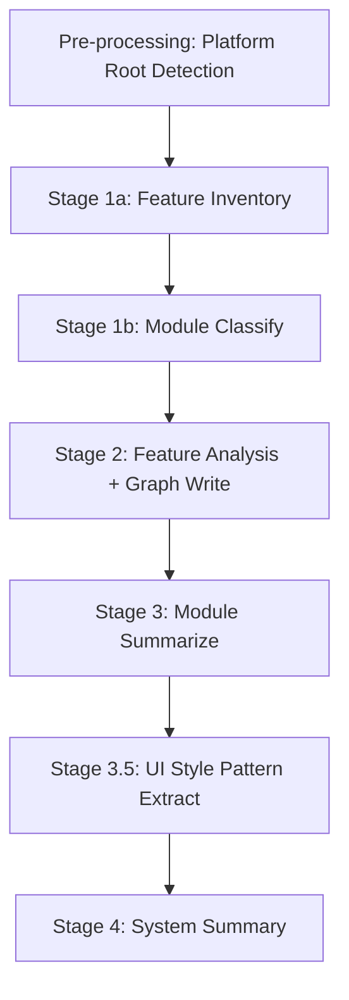

# Bizs Knowledge Dispatch

Orchestrate **bizs knowledge base generation** with a 5-stage pipeline: Feature Inventory → Feature Analysis + Graph Write → Module Summarize → UI Style Pattern Extract → System Summary.

## Language Adaptation

**CRITICAL**: All generated documents must match the user's language. Detect the language from the user's input and pass it to all downstream Worker Agents.

- User writes in 中文 → Generate Chinese documents, pass `language: "zh"` to workers
- User writes in English → Generate English documents, pass `language: "en"` to workers
- User writes in other languages → Use appropriate language code

**All downstream skills must receive the `language` parameter and generate content in that language only.**

## Trigger Scenarios

- "Initialize bizs knowledge base"
- "Generate business knowledge from source code"
- "Dispatch bizs knowledge generation"
- "Generate knowledge base from src/views directory"
- "Analyze this subdirectory for knowledge base"

## User

Leader Agent (speccrew-team-leader)

## Platform Naming Convention

Read `speccrew-workspace/docs/configs/platform-mapping.json` for standardized platform mapping rules.

| Concept | bizs-init (features.json) | Example (UniApp) |
|---------|--------------------------|------------------|
| **Category** | `platformType` | `mobile` |
| **Technology** | `platformSubtype` | `uniapp` |
| **Identifier** | `{platformType}/{platformSubtype}` | `mobile-uniapp` |

## Input

| Variable | Description | Default |
|----------|-------------|---------|
| `source_path` | Source code path (can be a subdirectory; auto-detects platform root by traversing upward) | project root |
| `language` | User's language code (e.g., "zh", "en") | **REQUIRED** |
| `sync_mode` | `"full"` or `"incremental"` | `"full"` |
| `base_commit` | (incremental only) Git base commit hash | — |
| `head_commit` | (incremental only) Git HEAD commit hash | `HEAD` |
| `changed_files` | (incremental only) Pre-computed changed file list | — |
| `max_concurrent_workers` | Maximum parallel Worker Agents | `5` |
| `graph_root` | Graph data output root path | `speccrew-workspace/knowledges/bizs/graph` |
| `graph_write_script_path` | Path to graph-write script file | `{graph_write_skill_path}/scripts/graph-write.js` |
| `completed_dir` | Marker file output directory for Worker results | `{sync_state_path}/completed` |

> **Note**: Ensure `graph_root` directory exists before first execution. If it does not exist, create it: `mkdir -p "{graph_root}"` (or equivalent on Windows: `New-Item -ItemType Directory -Path "{graph_root}" -Force`).

**Input Validation** (checked before pipeline starts):

| Parameter | Validation Rule |
|-----------|----------------|
| `source_path` | Must exist and be a directory |
| `language` | Must be a valid language code (e.g., "zh", "en", "ja") |
| `sync_mode` | Must be `"full"` or `"incremental"` |
| `max_concurrent_workers` | Must be a positive integer, recommended range: 1-20 |
| `base_commit` / `head_commit` | Required when `sync_mode` is `"incremental"` |

If any validation fails, abort pipeline immediately with a descriptive error message.

## Output

- Feature inventory: `speccrew-workspace/knowledges/base/sync-state/knowledge-bizs/features-{platform}.json`
- Feature docs: `speccrew-workspace/knowledges/bizs/{platform}/{module}/features/*.md`
- Module overviews: `speccrew-workspace/knowledges/bizs/{platform}/{module}/*-overview.md`
- UI style patterns: `speccrew-workspace/knowledges/techs/{platform_id}/ui-style/` (page-types/, components/, layouts/)
- System overview: `speccrew-workspace/knowledges/bizs/system-overview.md`
- Graph data: `speccrew-workspace/knowledges/bizs/graph/`

## Execution Model

This skill uses a **mixed execution model** due to platform constraints:

| Execution Mode | Used For | Reason |
|---------------|----------|--------|
| **Dispatch direct execution** (via `run_in_terminal`) | Script calls: inventory generation, status updates, graph writes | Worker Agents lack `run_in_terminal` capability (platform limitation) |
| **Worker Agent delegation** (via `speccrew-task-worker`) | Analysis tasks: feature analysis, module summarize, system summarize | Pure reasoning tasks using Read/Write/Grep tools |

**Per-Stage Execution**:

| Stage | Executor | What |
|-------|----------|------|
| Stage 1a | Dispatch (direct) | Execute `generate-inventory` scripts |
| Stage 1b | Worker Agent | Module reclassification (LLM reasoning) |
| Stage 2 Steps 1,3 | Dispatch (direct) | Script calls: batch-orchestrator.js (get-batch, process-results) |
| Stage 2 Step 2 | Worker Agent | Feature analysis (code understanding + doc generation; writes `.done` + `.graph.json` marker files) |
| Stage 3 | Worker Agent | Module summarization (doc aggregation) |
| Stage 3.5 | Worker Agent | UI style pattern extraction (cross-module pattern aggregation) |
| Stage 4 | Worker Agent | System summary generation |

## Referenced Skills

| Skill | Purpose | Invoked In |
|-------|---------|------------|
| [`speccrew-knowledge-bizs-init-features`](../speccrew-knowledge-bizs-init-features/SKILL.md) | Generate per-platform feature inventory | Stage 1a |
| [`speccrew-knowledge-bizs-module-classify`](../speccrew-knowledge-bizs-module-classify/SKILL.md) | Reclassify features into business modules | Stage 1b |
| [`speccrew-knowledge-bizs-ui-analyze`](../speccrew-knowledge-bizs-ui-analyze/SKILL.md) | Analyze UI features (web/mobile/desktop) | Stage 2 |
| [`speccrew-knowledge-bizs-api-analyze`](../speccrew-knowledge-bizs-api-analyze/SKILL.md) | Analyze API controllers (backend) | Stage 2 |
| [`speccrew-knowledge-graph-write`](../speccrew-knowledge-graph-write/SKILL.md) | Write graph data (nodes, edges) — Called by `process-batch-results` via dispatch | Stage 2 (via process-batch-results) |
| [`speccrew-knowledge-module-summarize`](../speccrew-knowledge-module-summarize/SKILL.md) | Generate module overview documents | Stage 3 |
| [`speccrew-knowledge-bizs-ui-style-extract`](../speccrew-knowledge-bizs-ui-style-extract/SKILL.md) | Extract UI style patterns from feature docs | Stage 3.5 |
| [`speccrew-knowledge-system-summarize`](../speccrew-knowledge-system-summarize/SKILL.md) | Generate system overview document | Stage 4 |

### Referenced Scripts

| Script | Purpose | Used In |
|--------|---------|--------|
| `batch-orchestrator.js` | Batch orchestration (get-batch, process-results) | Stage 2 |
| `update-feature-status.js` | Update individual feature status | Stage 2 |
| `mark-stale.js` | Mark features as stale for re-analysis | Manual incremental update |
| `get-pending-features.js` | Get all pending features | Utility |

## Workflow Overview



---

## Pre-processing: Platform Root Detection

**Goal**: When `source_path` is a subdirectory rather than the platform root, automatically detect the platform root directory by traversing upward.

> **IMPORTANT**: This pre-processing step is executed **directly by the dispatch agent**, NOT delegated to a Worker Agent. It requires file system access to traverse directories and read marker files.

**When to Execute**:
- Execute this step when `source_path` is suspected to be a subdirectory (not the platform root)
- This is a lightweight check that runs before Stage 1a

**Detection Logic**:

1. **Collect marker file definitions**: Read `speccrew-workspace/docs/configs/platform-mapping.json`, collect all `marker_files` from both `platform_categories` and `mappings` sections

2. **Traverse upward from `source_path`**:
   - Start from the provided `source_path` directory
   - For each parent directory, check for marker files using the following matching logic:

   **Marker Files Matching Logic**:
   - **Default behavior** (no `match_any` entries): ALL entries must match (AND logic)
   - **With `match_any: true` entries**: Split entries into two groups:
     - **Required group**: Entries without `match_any` → ALL must match
     - **Alternative group**: Entries with `match_any: true` → AT LEAST ONE must match
     - **Final result**: `required_group_match AND alternative_group_match`
   - **All entries have `match_any: true`**: No required group → at least one alternative must match (pure OR logic)

   **Marker Types**:
   - **Simple marker** (e.g., `{ "file": "manifest.json" }`): Check if file exists
   - **Dependency marker** (e.g., `{ "file": "package.json", "contains_dependency": "vue" }`): Read file and verify it contains the dependency
   - **Glob pattern marker** (e.g., `{ "file": "*.csproj" }`): Use wildcard matching to check for matching files

   **Examples**:
   ```json
   // All match_any - at least one must match (OR)
   [{ "file": "pom.xml", "match_any": true }, { "file": "build.gradle", "match_any": true }]
   // Result: matches if pom.xml OR build.gradle exists

   // Mixed - required AND at least one alternative
   [{ "file": "src/main/java" }, { "file": "pom.xml", "match_any": true }, { "file": "build.gradle", "match_any": true }]
   // Result: matches if src/main/java AND (pom.xml OR build.gradle)
   ```

3. **Termination conditions** (stop traversing when any is met):
   - Directory contains `speccrew-workspace` subdirectory (reached project root)
   - Reached file system root directory
   - Found a matching platform root directory

4. **Result handling**:
   - **If platform root found**: 
     - Log: `"Platform root detected: <detected_path> (platform: <platform_id>)"`
     - Update `source_path` to the detected platform root
     - Record detected `platform_type`, `platform_subtype`, and `platform_id` for use in Stage 1a
   - **If no platform root found**:
     - Log: `"No platform root detected from marker files, using original source_path: <original_path>"`
     - Continue with original `source_path` in Stage 1a

**Multi-Platform Matching Strategy**:

When multiple platforms match (e.g., `package.json` contains both `react` and `next`):

1. **Allow returning multiple platforms**: Pre-processing result is a list of matching platforms, not just a single platform
2. **Precise match priority**: `mappings`-level matches take precedence over `platform_categories`-level generic matches
3. **Subtype coverage**: If both `web-react` and `web-nextjs` match (where Next.js is built on React), retain both as candidates for Stage 1a to handle
4. **Multiple platforms = multiple features JSON**: Stage 1a generates `features-{platform}.json` for each detected platform

**Example**: `source_path` contains `package.json` with both `react` and `next` dependencies:
- Detected: `[web-nextjs]` (Next.js marker is more specific with `contains_dependency: "next"`)
- Stage 1a generates `features-web-nextjs.json`

**Example Detection Flow**:
```
source_path = "/project/frontend/src/views"

Check: /project/frontend/src/views/ → no marker files
Check: /project/frontend/src/ → no marker files
Check: /project/frontend/ → found "package.json" with "vue" dependency
Result: Platform root = /project/frontend/, platform = web-vue
```

---

## Stage 1a: Generate Feature Inventory (Direct Execution)

**Goal**: Scan source code, identify all platforms, and generate per-platform feature inventory files.

> **IMPORTANT**: This stage is executed **directly by the dispatch agent (Leader)**, NOT delegated to a Worker Agent.
> Worker Agents do not have `run_in_terminal` capability, which is required for script execution.

**Action** (dispatch executes directly via `run_in_terminal`):

1. **Detect platforms**: 
   - If Pre-processing already detected a specific platform type → use the pre-detected result, skip manual configuration
   - Otherwise → Read `speccrew-workspace/docs/configs/platform-mapping.json`, analyze `source_path` directory structure to identify all platforms
2. **Configure parameters**: For each detected platform, determine: `SourcePath`, `OutputFileName`, `PlatformName`, `PlatformType`, `PlatformSubtype`, `TechStack`, `FileExtensions`, `ExcludeDirs`
3. **Execute inventory script** for each platform:
   ```
   node "{init_features_skill_path}/scripts/generate-inventory.js" --sourcePath "<source_path>" --outputFileName "features-<platform>.json" --platformName "<platform_name>" --platformType "<platform_type>" --platformSubtype "<platform_subtype>" --techStack '["..."]' --fileExtensions '["..."]' --excludeDirs '["..."]'
   ```

> For complete parameter definitions and script usage, refer to `speccrew-knowledge-bizs-init-features/SKILL.md`

**Output**:
- `speccrew-workspace/knowledges/base/sync-state/knowledge-bizs/features-{platform}.json` — Per-platform feature inventory files
- Each file contains: platform metadata, modules list, and flat features array with `analyzed` status

---

## Stage 1b: Reclassify Feature Modules (Worker Agent)

**Goal**: Reclassify features from directory-based modules into semantically meaningful business modules.

**Prerequisite**: Stage 1a completed with `features-{platform}.json` files generated.

**File Discovery**: Scan `speccrew-workspace/knowledges/base/sync-state/knowledge-bizs/` directory for all `features-*.json` files. Each file corresponds to one platform detected in Stage 1a.

**Action**:
- For each `features-{platform}.json` file generated in Stage 1a:
  - Invoke 1 Worker Agent (`speccrew-task-worker.md`) with skill `speccrew-knowledge-bizs-module-classify/SKILL.md`
  - Parameters to pass to skill:
    - `features_file`: Full path to the `features-{platform}.json` file
    - `source_path`: Source code directory path (same as Stage 1a)
    - `language`: User's language — **REQUIRED**
- Multiple platform files can be reclassified in parallel (subject to `max_concurrent_workers` limit)

Expected Worker Return: `{ "status": "success|failed", "message": "...", "modules_reclassified": N }`

**Output**:
- Updated `features-{platform}.json` files with reclassified `module` fields
- Module names now reflect business domains instead of directory names

---

## Incremental Update Support

### Manual Path Marking

When source code changes occur outside of the automatic incremental sync flow, use the `mark-stale` script to manually mark specific features for re-analysis.

**Purpose**: Mark features under specified file/directory paths as pending re-analysis.

**When to Use**: After source code changes, when you need to re-analyze specific features without running a full pipeline.

**Call Pattern**:

```
node "{skill_path}/scripts/mark-stale.js" --syncStatePath "speccrew-workspace/knowledges/base/sync-state/knowledge-bizs" --paths "<path1>,<path2>"
```

**Parameters**:

| Parameter | Description |
|-----------|-------------|
| `SyncStatePath` | Path to directory containing features-*.json files |
| `Paths` | One or more source file or directory paths to mark as stale |

**Effect**: Marked features will be automatically picked up and re-analyzed during the next Stage 2 execution.

---

## Stage 2: Feature Analysis (Batch Processing)

**Overview**: Process all pending features in batches. Each batch gets a set of features, launches Worker Agents to analyze them, then processes the results.

> **Script execution rule**: All script calls in Stage 2 are executed **directly by the dispatch agent** via `run_in_terminal`. Only the analysis tasks are delegated to Worker Agents.

#### Execution Flow

Repeat the following 3 steps until all features are processed:

**Step 1: Get Next Batch**

Execute:
```
node "{skill_path}/scripts/batch-orchestrator.js" get-batch --syncStatePath "{sync_state_path}" --batchSize 5
```

- If output `action` is `"done"` → All features processed. Exit Stage 2, proceed to Stage 3.
- If output `action` is `"process"` → The `batch` array contains features to analyze. Proceed to Step 2.

**Step 2: Launch Workers and Wait**

For each feature in the `batch` array, launch a Worker Agent as a Task:

- **Skill routing**: Use `platformType` to select the analysis skill:
  - `platformType` is `"web"`, `"mobile"`, or `"desktop"` → use `speccrew-knowledge-bizs-ui-analyze`
  - `platformType` is `"backend"` → use `speccrew-knowledge-bizs-api-analyze`
- **Worker parameters**: Pass all feature fields plus `language`, `completed_dir`, `sourceFile`
- Launch ALL Workers for the current batch, then **wait for ALL to complete** before proceeding to Step 3
- Each Worker writes `.done` and `.graph.json` marker files to `completed_dir` upon completion

**Marker File Naming Convention**:

| Marker Type | File Name Format | Example |
|-------------|------------------|---------|
| Completion marker | `{featureId}.done` | `dict-index.done`, `dict-UserController.done` |
| Graph data | `{featureId}.graph.json` | `dict-index.graph.json`, `dict-UserController.graph.json` |

**Step 3: Process Batch Results**

Execute:
```
node "{skill_path}/scripts/batch-orchestrator.js" process-results --syncStatePath "{sync_state_path}" --graphRoot "{graph_root}" --graphWriteScript "{graph_write_script_path}"
```

This script:
- Scans `.done` files → updates feature status to `completed` in features-*.json
- Scans `.graph.json` files → writes graph data (nodes + edges) grouped by module
- Cleans up all marker files

After Step 3 completes, return to Step 1.

#### Context Recovery (Stateless Design)

Dispatch 采用完全无状态的文件驱动设计。如果执行过程中发生上下文压缩或中断：
- 无需记忆任何批次状态或 Worker 输出
- 重新执行循环：`get-batch` 会自动从文件状态恢复，跳过已完成和正在处理中的 features
- `process-results` 会处理所有未清理的标记文件
- 整个流程可安全重入

#### Stage 2 Output

- Generated by Workers: Feature documentation at `feature.documentPath` (one .md per feature); marker files (`.done` + `.graph.json`) in `completed_dir`
- Updated by `process-results`: Each `features-{platform}.json` updated with analysis timestamps and status; graph data written to `speccrew-workspace/knowledges/bizs/graph/`
- Marker files cleaned up after each batch

**Feature Status Flow**: `pending` → `in_progress` → `completed` / `failed`

### Large-Scale Scenario Guidance

When dealing with modules containing more than **20 features**, consider the following:

- **Single Agent Limit**: A single Worker Agent can reliably process ~20 features per session due to context window constraints. Beyond this, context degradation may cause incomplete document generation.
- **Multi-Worker Strategy**: For modules with >20 features, dispatch multiple Worker Agents in parallel, each handling a non-overlapping subset of features (e.g., by batch index range).
- **Resume Support**: The `get-next-batch` script naturally supports resume across sessions — it skips features that already have `.done` files. To resume after a session break, simply restart the Stage 2 loop.
- **Validation After Completion**: After all features are marked `analyzed=true`, run `process-batch-results` with `--validateDocs --syncStatePath "{sync_state_path}"` to verify document completeness.

---

## Stage 3: Module Summarize (Parallel)

**Goal**: Complete each module overview based on feature details.

**Prerequisite**: Stage 2 completed for the module (in full or incremental mode).

**Action (full mode)**:
- Read all `features-{platform}.json` files from `speccrew-workspace/knowledges/base/sync-state/knowledge-bizs/`
- For each platform, group features by `module` to identify unique modules
- For each module, invoke 1 Worker Agent (`speccrew-task-worker.md`) with skill `speccrew-knowledge-module-summarize/SKILL.md`
- Parameters to pass to skill:
  - `module_name`: Module code_name
  - `module_path`: Path to module directory (e.g., `speccrew-workspace/knowledges/bizs/{platform_type}/{module_name}/`)
  - `language`: User's language — **REQUIRED**

Expected Worker Return: `{ "status": "success|failed", "module_name": "...", "output_file": "...-overview.md", "message": "..." }`

**Action (incremental mode)**:
- Reuse module status from Stage 2 (NEW / CHANGED / DELETED / UNMODIFIED).
- Only dispatch Workers for modules with status **NEW** or **CHANGED**.

**Parallel Tasks** (grouped by platform):
```
Platform: Web Frontend (web)
  Worker 1: module="order",   module_path="speccrew-workspace/knowledges/bizs/web/order/"
  Worker 2: module="payment", module_path="speccrew-workspace/knowledges/bizs/web/payment/"

Platform: Mobile App (mobile-flutter)
  Worker 3: module="order",   module_path="speccrew-workspace/knowledges/bizs/mobile-flutter/order/"
  Worker 4: module="payment", module_path="speccrew-workspace/knowledges/bizs/mobile-flutter/payment/"
```

**Output per Module**:
- `{{module_name}}-overview.md` (complete version)

---

## Stage 3.5: UI Style Pattern Extract (Parallel by Platform)

**Goal**: Extract UI design patterns (page types, component patterns, layout patterns) from analyzed feature documents, aggregating cross-module patterns and outputting to the techs knowledge base `ui-style/` directory.

**Prerequisite**: All Stage 3 tasks completed.

**Platform Filter**: Only execute for frontend platforms (platformType = web, mobile, desktop). Backend platforms skip this stage.

**Directory Creation**: The `ui-style-extract` skill automatically creates the output directory (`knowledges/techs/{platform_id}/ui-style/`) if it does not exist. No pre-check required.

**Action**:
- Read all `features-{platform}.json` files
- Filter platforms where platformType is web/mobile/desktop
- Determine platform_id (format: `{platformType}-{platformSubtype}`, e.g., `web-vue`, `mobile-uniapp`)
- For each qualifying platform, launch 1 Worker Agent (`speccrew-task-worker`) with skill `speccrew-knowledge-bizs-ui-style-extract/SKILL.md`
- Parameters to pass:
  - `platform_id`: Platform identifier
  - `platform_type`: Platform type
  - `feature_docs_path`: Feature document base path for that platform
  - `features_manifest_path`: Path to the corresponding `features-{platform}.json`
  - `module_overviews_path`: **Parent directory** containing all module overview subdirectories for that platform (e.g., `knowledges/bizs/web-vue/`). This directory contains `{module}/module-overview.md` or `{module}/{module}-overview.md` files. **NOT** a specific module directory.
  - `output_path`: `speccrew-workspace/knowledges/techs/{platform_id}/ui-style/`
  - `language`: User's language

**Cross-Pipeline Output**:
- This stage writes to techs knowledge base, not bizs knowledge base
- Output location: `speccrew-workspace/knowledges/techs/{platform_id}/ui-style/`
- Subdirectories: `page-types/`, `components/`, `layouts/`
- `ui-style-guide.md` and `styles/` are managed by techs pipeline, this stage does not modify them

**Parallel Tasks**: One Worker per frontend platform, can execute in parallel.

**Output per Platform**:
```
speccrew-workspace/knowledges/techs/{platform_id}/ui-style/
├── page-types/
│   └── {pattern-name}.md
├── components/
│   └── {pattern-name}.md
└── layouts/
    └── {pattern-name}.md
```

---

## Stage 4: System Summarize (Single Task)

**Goal**: Generate complete system-overview.md aggregating all platforms and modules.

**Prerequisite**: All Stage 3 tasks completed.

**Action**:
- Read all `features-{platform}.json` files from `speccrew-workspace/knowledges/base/sync-state/knowledge-bizs/` to get platform structure
- Invoke 1 Worker Agent (`speccrew-task-worker.md`) with skill `speccrew-knowledge-system-summarize/SKILL.md`
- Parameters to pass to skill:
  - `modules_path`: Path to knowledge base directory containing all platform modules (e.g., `speccrew-workspace/knowledges/bizs/`)
  - `output_path`: Output path for system-overview.md (e.g., `speccrew-workspace/knowledges/bizs/`)
  - `language`: User's language — **REQUIRED**

Expected Worker Return: `{ "status": "success|failed", "output_file": "system-overview.md", "message": "..." }`

**Output**:
- `speccrew-workspace/knowledges/bizs/system-overview.md` (complete with platform index and module hierarchy)

---

## Execution Flow

```
0. Pre-processing: Platform Root Detection
   └─ If source_path is a subdirectory, traverse upward to find platform root
   └─ Update source_path and platform info if detected

1. Run Stage 1a (Feature Inventory)
   └─ Use pre-detected platform info if available, otherwise detect platforms
   └─ Wait for completion

2. Run Stage 1b (Module Classify)
   ├─ For each features-{platform}.json, dispatch 1 Worker for module reclassification
   └─ Wait for ALL module-classify Workers to complete

3. Run Stage 2 (Feature Analysis + Graph Write)
   ├─ LOOP: get-batch → launch Workers → wait all → process-results
   ├─ Each Worker writes `.done` + `.graph.json` marker files to completed_dir
   ├─ process-results handles status update + graph write + cleanup per batch
   └─ Loop until get-batch returns done

4. Run Stage 3 (Module Summarize)
   ├─ Group features by module
   ├─ Launch ALL module Workers in parallel
   └─ Wait for ALL Workers

4.5. Run Stage 3.5 (UI Style Pattern Extract)
   ├─ Filter frontend platforms (web/mobile/desktop)
   ├─ Check techs knowledge directory existence
   ├─ Launch Workers in parallel (one per platform)
   └─ Wait for ALL Workers

5. Run Stage 4 (System Summary)
   └─ Wait for completion
```

---

## Error Handling

| Stage | Failure Scenario | Handling | Retry |
|-------|-----------------|----------|-------|
| Stage 1a | Script execution fails | Abort pipeline, report error | No retry |
| Stage 1b | Worker fails for a platform | Abort that platform, continue others | Retry once |
| Stage 2 | Single Worker fails | Mark feature as `failed`, continue other Workers | No auto-retry |
| Stage 2 | Failure rate > 50% | Abort pipeline, report all failures | — |
| Stage 3 | Single Worker fails | Skip that module, continue others | Retry once |
| Stage 3.5 | Continue pipeline even if pattern extraction fails; report warning | — | — |
| Stage 4 | Worker fails | Abort, preserve all generated content | Retry once |

**Failure rate calculation** (Stage 2): `failed_count / total_features`. Evaluated after all Workers complete.

**Failed feature handling**: Features marked as `failed` via `update-feature-status` script retain their error details in `features-{platform}.json` for manual inspection or re-run.

---

## Checklist

- [ ] Stage 1: Feature inventory generated with `features-{platform}.json` files
- [ ] Stage 1b: Features reclassified into business modules (directory-based → semantic)
- [ ] Stage 2: All features across all platforms analyzed in parallel (batch mode)
- [ ] Stage 2: Skill routing correct (UI platforms → ui-analyze, API platforms → api-analyze)
- [ ] Stage 2: Workers write `.done` + `.graph.json` marker files to completed_dir
- [ ] Stage 2: `process-results` run after each batch (status update + graph write + cleanup)
- [ ] Stage 3: All modules across all platforms summarized in parallel
- [ ] Stage 3.5: UI style patterns extracted for all frontend platforms
- [ ] Stage 3.5: Pattern documents written to `knowledges/techs/{platform_id}/ui-style/`
- [ ] Stage 3.5: Backend platforms correctly skipped
- [ ] Stage 4: System overview generated with platform hierarchy

## Return

After all 5 stages complete, return a summary object to the caller:

```json
{
  "status": "completed",
  "pipeline": "bizs",
  "stages": {
    "stage1": { "status": "completed", "platforms": 2, "features": 32 },
    "stage2": { "status": "completed", "analyzed": 32, "failed": 0, "graphWritten": 32 },
    "stage3": { "status": "completed", "modules": 8, "failed": 0 },
    "stage3_5": { "status": "completed", "platforms": 2, "patterns": 15 },
    "stage4": { "status": "completed" }
  },
  "output": {
    "system_overview": "speccrew-workspace/knowledges/bizs/system-overview.md",
    "graph_root": "speccrew-workspace/knowledges/bizs/graph/"
  }
}
```
