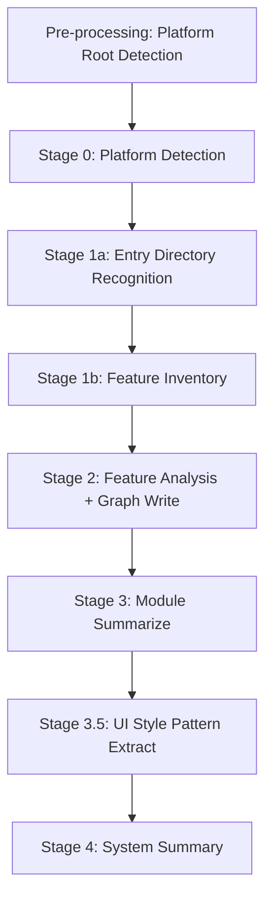

# Bizs Knowledge Dispatch

Orchestrate **bizs knowledge base generation** with a 5-stage pipeline: Feature Inventory → Feature Analysis + Graph Write → Module Summarize → UI Style Pattern Extract → System Summary.

## Language Adaptation

**CRITICAL**: All generated documents must match the user's language. Detect the language from the user's input and pass it to all downstream Worker Agents.

- User writes in 中文 → Generate Chinese documents, pass `language: "zh"` to workers
- User writes in English → Generate English documents, pass `language: "en"` to workers
- User writes in other languages → Use appropriate language code

**All downstream skills must receive the `language` parameter and generate content in that language only.**

## Trigger Scenarios

- "Initialize bizs knowledge base"
- "Generate business knowledge from source code"
- "Dispatch bizs knowledge generation"
- "Generate knowledge base from src/views directory"
- "Analyze this subdirectory for knowledge base"

## Input

| Variable | Description | Default |
|----------|-------------|---------|
| `source_path` | Source code path (can be a subdirectory; auto-detects platform root by traversing upward) | project root |
| `language` | User's language code (e.g., "zh", "en") | **REQUIRED** |
| `sync_mode` | `"full"` or `"incremental"` | `"full"` |
| `base_commit` | (incremental only) Git base commit hash | — |
| `head_commit` | (incremental only) Git HEAD commit hash | `HEAD` |
| `changed_files` | (incremental only) Pre-computed changed file list | — |
| `max_concurrent_workers` | Maximum parallel Worker Agents | `5` |
| `graph_root` | Graph data output root path | `speccrew-workspace/knowledges/bizs/graph` |
| `graph_write_script_path` | Path to graph-write script file | `{graph_write_skill_path}/scripts/graph-write.js` |
| `completed_dir` | Marker file output directory for Worker results | `{sync_state_path}/completed` |

> **Note**: Ensure `graph_root` directory exists before first execution. If it does not exist, create it: `mkdir -p "{graph_root}"` (or equivalent on Windows: `New-Item -ItemType Directory -Path "{graph_root}" -Force`).

## Output

- Entry directories: `speccrew-workspace/knowledges/base/sync-state/knowledge-bizs/entry-dirs-{platform}.json`
- Feature inventory: `speccrew-workspace/knowledges/base/sync-state/knowledge-bizs/features-{platform}.json`
- Feature docs: `speccrew-workspace/knowledges/bizs/{platform}/{module}/features/*.md`
- Module overviews: `speccrew-workspace/knowledges/bizs/{platform}/{module}/*-overview.md`
- UI style patterns: `speccrew-workspace/knowledges/techs/{platform_id}/ui-style-patterns/` (page-types/, components/, layouts/)
- System overview: `speccrew-workspace/knowledges/bizs/system-overview.md`
- Graph data: `speccrew-workspace/knowledges/bizs/graph/`

## Workflow Overview



---

## Stage 0: Platform Detection

**Objective**: Automatically discover ALL platforms in the project. Do NOT hardcode platform lists.

**Detection steps**:

1. **Scan for backend modules**:
   ```
   # Look for all backend module directories
   Get-ChildItem -Path "{project_root}" -Filter "yudao-module-*" -Directory
   # Or for other project structures:
   Get-ChildItem -Path "{project_root}" -Directory | Where-Object { $_.Name -match "^(module-|service-|api-)" }
   ```
   Each discovered module becomes a `backend-{module_name}` platform (e.g., `yudao-module-system` → `backend-system`).

2. **Scan for frontend projects**:
   ```
   # Look for UI/frontend directories
   Get-ChildItem -Path "{project_root}" -Directory | Where-Object { $_.Name -match "ui|frontend|web|app" }
   # Then check each for actual source code (package.json, src/ directory)
   ```
   Classify by tech stack: Vue → `web-vue`, UniApp → `mobile-uniapp`, React → `web-react`, etc.

3. **Validate each platform**:
   - Has actual source code files (not empty placeholder directories)
   - Has a recognizable project structure (package.json for frontend, pom.xml/build.gradle for backend)

4. **Present platform list to user for confirmation** before proceeding to Stage 1a.

**Output**: A confirmed list of platforms with:

| Platform ID | Source Path | Platform Type | Tech Stack |
|---|---|---|---|
| `web-vue` | `yudao-ui/yudao-ui-admin-vue3` | web | vue, vite, element-plus |
| `backend-system` | `yudao-module-system/src/main/java/.../system` | backend | spring-boot, mybatis-plus |
| ... | ... | ... | ... |

> **CRITICAL**: NEVER hardcode a fixed number of platforms. Always scan the project directory to discover ALL modules. Missing a platform means incomplete knowledge base generation.

---

## Stage 1a: Entry Directory Recognition (LLM-Driven)

**Goal**: For each detected platform, use LLM to analyze the source directory tree and identify all entry directories (API controllers for backend, views/pages for frontend), then classify them into business modules.

> **IMPORTANT**: This stage is executed **directly by the dispatch agent (Leader)** using LLM analysis capabilities (Read/ListDir/Grep), NOT delegated to a Worker Agent.

**Prerequisite**: Stage 0 completed. Platform list confirmed with `platformId`, `sourcePath`, `platformType`, `platformSubtype`, and `techIdentifier` for each platform.

**Execution Flow** (for each platform):

### Step 1: Read Directory Tree

Use `ListDir` or `Bash(tree)` to read the platform's `sourcePath` directory structure (3 levels deep):

```bash
# Windows (PowerShell)
tree /F /A "{sourcePath}" | Select-Object -First 100

# Unix/Linux/Mac
tree -L 3 "{sourcePath}"
```

### Step 2: LLM Analysis - Identify Entry Directories

Based on the directory tree and technology stack, analyze and identify entry directories:

**Backend (Spring/Java/Kotlin)**:
- Find all directories containing `*Controller.java` or `*Controller.kt` files
- These are API entry directories
- Module name = the business package name of the entry directory (e.g., `controller/admin/chat` → module `chat`)

**Frontend (Vue/React)**:
- Find `views/` or `pages/` directories
- First-level subdirectories under these directories are business modules
- Each subdirectory is an entry directory (e.g., `views/system/` → module `system`)

**Mobile (UniApp)**:
- Find first-level subdirectories under `pages/`
- Plus top-level `pages-*` directories (module name = directory name without `pages-` prefix, e.g., `pages-bpm` → module `bpm`)

**Mobile (Mini Program)**:
- Find first-level subdirectories under `pages/` as modules

**Exclusion Rules** (directories to ignore):
- Pure technical directories: `config`, `framework`, `enums`, `exception`, `util`, `utils`, `common`, `constant`, `constants`, `type`, `types`, `dto`, `vo`, `entity`, `model`, `mapper`, `repository`, `dao`, `service`, `impl`
- Build/output directories: `dist`, `build`, `target`, `out`, `node_modules`
- Test directories: `test`, `tests`, `spec`, `__tests__`, `e2e`
- Configuration directories: `.git`, `.idea`, `.vscode`, `.speccrew`

**Root Module Handling**:
- If an entry file is not under any subdirectory (directly under `sourcePath`), assign it to the `_root` module

### Step 3: Generate entry-dirs JSON

Output file: `{speccrew-workspace}/knowledges/base/sync-state/knowledge-bizs/entry-dirs-{platformId}.json`

**JSON Format**:
```json
{
  "platformId": "backend-ai",
  "platformName": "AI Module Backend",
  "platformType": "backend",
  "platformSubtype": "ai",
  "sourcePath": "yudao-module-ai/src/main/java/cn/iocoder/yudao/module/ai",
  "techStack": ["spring-boot", "mybatis-plus"],
  "modules": [
    { "name": "chat", "entryDirs": ["controller/admin/chat"] },
    { "name": "image", "entryDirs": ["controller/admin/image"] },
    { "name": "knowledge", "entryDirs": ["controller/admin/knowledge"] },
    { "name": "_root", "entryDirs": ["controller/admin"] }
  ]
}
```

**Field Definitions**:
- `platformId`: Platform identifier (e.g., `backend-ai`, `web-vue`, `mobile-uniapp`)
- `platformName`: (Optional) Human-readable platform name. Auto-generated as `{platformType}-{platformSubtype}` if missing
- `platformType`: (Optional) Platform type: `backend`, `web`, `mobile`, `desktop`. Inferred from platformId if missing
- `platformSubtype`: (Optional) Platform subtype (e.g., `ai`, `vue`, `uniapp`). Inferred from platformId if missing
- `sourcePath`: Absolute path to the platform source root
- `techStack`: (Optional) Array of tech stack names (e.g., `["spring-boot", "mybatis-plus"]`). Default inferred from platformType
- `modules`: Array of business modules
  - `name`: Module name (business-meaningful, e.g., `chat`, `system`, `order`)
  - `entryDirs`: Array of entry directory paths (relative to `sourcePath`)

**Path Rules**:
- All `entryDirs` paths must be relative to `sourcePath`
- Use forward slashes `/` as path separators (even on Windows)
- Do not include leading or trailing slashes

### Step 4: Validation

After generating the entry-dirs JSON:
1. Verify that `modules` array is not empty
2. Verify that each module has at least one entry directory
3. Verify that module names are business-meaningful (not technical terms like `config`, `util`)
4. If validation fails, re-analyze the directory tree

**Error handling**: If entry directory recognition fails for a platform, STOP and report the error with platform details. Do NOT proceed to Stage 1b for that platform.

---

## Stage 1b: Generate Feature Inventory (Direct Execution)

**Goal**: Based on the entry-dirs JSON generated in Stage 1a, generate per-platform feature inventory files.

> **IMPORTANT**: This stage is executed **directly by the dispatch agent (Leader)**, NOT delegated to a Worker Agent.
> Worker Agents do not have `run_in_terminal` capability, which is required for script execution.

**Prerequisite**: Stage 1a completed. `entry-dirs-{platformId}.json` files exist in `{sync_state_path}/knowledge-bizs/`.

**Action** (dispatch executes directly via `run_in_terminal`):

1. **Read platform mapping**: Read `speccrew-workspace/docs/configs/platform-mapping.json` and `tech-stack-mappings.json` for platform configuration
2. **Locate the inventory script**: Find `generate-inventory.js` in the `speccrew-knowledge-bizs-init-features` skill's scripts directory:
   - Script location: `{ide_skills_dir}/speccrew-knowledge-bizs-init-features/scripts/generate-inventory.js`
   - Where `{ide_skills_dir}` is the IDE-specific skills directory (e.g., `.qoder/skills/`, `.cursor/skills/`, `.vscode/skills/`, `.speccrew/skills/`)
   - Use `ListDir` to locate the script if the exact path is unknown
3. **Execute inventory script** for each platform:
   ```
   node "{path_to_generate_inventory_js}" --entryDirsFile "{entry_dirs_file_path}"
   ```

**Script Parameters**:
- `--entryDirsFile`: Path to the `entry-dirs-{platformId}.json` file generated in Stage 1a (required)

**Note**: `platformId` and `sourcePath` are read from the entry-dirs JSON file. Platform mapping and output directory are automatically derived by the script.

**Optional Parameters**:
- `--techIdentifier`: Technology identifier for tech-stack lookup (auto-detected from platform mapping if omitted)
- `--fileExtensions`: Comma-separated list of file extensions to include (e.g., `.java,.kt`)
- `--excludeDirs`: Additional directories to exclude

**Output**:
- `speccrew-workspace/knowledges/base/sync-state/knowledge-bizs/features-{platformId}.json` — Per-platform feature inventory files
- Each file contains: platform metadata, modules list, and flat features array with `analyzed` status

**Features JSON Structure**:
```json
{
  "platformId": "backend-ai",
  "platformName": "AI Module",
  "platformType": "backend",
  "platformSubtype": "ai",
  "techIdentifier": "spring",
  "sourcePath": "yudao-module-ai/src/main/java/cn/iocoder/yudao/module/ai",
  "modules": [
    { "name": "chat", "featureCount": 12 },
    { "name": "image", "featureCount": 8 },
    { "name": "knowledge", "featureCount": 15 }
  ],
  "features": [
    {
      "fileName": "ChatConversationController",
      "sourcePath": "controller/admin/chat/ChatConversationController.java",
      "module": "chat",
      "documentPath": "speccrew-workspace/knowledges/bizs/backend-ai/chat/ChatConversationController.md",
      "platformType": "backend",
      "platformSubtype": "ai",
      "analyzed": false
    }
  ]
}
```

**Error handling**: If the script exits with non-zero code, STOP and report the error. Do NOT create workaround scripts.

---

## Stage 2: Feature Analysis (Batch Processing)

**Overview**: Process all pending features in batches. Each batch gets a set of features, launches Worker Agents to analyze them, then processes the results.

> **Script execution rule**: All script calls in Stage 2 are executed **directly by the dispatch agent** via `run_in_terminal`. Only the analysis tasks are delegated to Worker Agents.

#### Execution Flow

Repeat the following 3 steps until all features are processed:

**Step 0: Ensure completed directory exists (MANDATORY)**

Before launching any Workers, you MUST create the `completed_dir` directory using Node.js (cross-platform compatible):

```bash
node -e "require('fs').mkdirSync('{completed_dir}', {recursive: true}); console.log('completed dir ready')"
```

> **Note**: Using Node.js ensures cross-platform compatibility (Windows/macOS/Linux).

> **⚠️ CRITICAL**: The `completed_dir` MUST be an **absolute path** (e.g., `d:/dev/speccrew/speccrew-workspace/knowledges/base/sync-state/knowledge-bizs/completed`). Relative paths will cause Worker marker file writes to fail silently.

**Step 1: Get Next Batch**

1. **Locate the script**: Find `batch-orchestrator.js` in the `speccrew-knowledge-bizs-dispatch` skill's scripts directory:
   - Script location: `{ide_skills_dir}/speccrew-knowledge-bizs-dispatch/scripts/batch-orchestrator.js`
   - Where `{ide_skills_dir}` is the IDE-specific skills directory (e.g., `.qoder/skills/`, `.cursor/skills/`, `.vscode/skills/`, `.speccrew/skills/`)
   - Use `ListDir` to locate the script if the exact path is unknown

2. **Execute get-batch**:
   ```
   node "{path_to_batch_orchestrator_js}" get-batch --syncStatePath "{sync_state_path}" --batchSize 5
   ```

- If output `action` is `"done"` → All features processed. Exit Stage 2, proceed to Stage 3.
- If output `action` is `"process"` → The `batch` array contains features to analyze. Proceed to Step 2.

**Step 2: Launch Workers — MUST BE PARALLEL**

⚠️ **CRITICAL**: You MUST launch ALL features in the current batch SIMULTANEOUSLY as parallel Worker Tasks. **FORBIDDEN**: sequential launch (start one Worker, wait, then start next).

For each feature in the `batch` array, prepare a Worker Task:
- **Skill routing** by `platformType`:
    - `"web"`, `"mobile"`, `"desktop"` → `skill_name: speccrew-knowledge-bizs-ui-analyze`
    - `"backend"` → `skill_name: speccrew-knowledge-bizs-api-analyze`
- **Worker parameters**: Pass all feature fields plus `language`, `completed_dir`, `sourceFile`, `skill_path`
- **Behavior constraint**: Worker MUST NOT create any temporary scripts. If execution fails, STOP and report error.

**Execution sequence**:
1. Prepare ALL Worker Tasks first (do NOT launch yet)
2. Launch ALL Workers at the SAME TIME in a single batch dispatch
3. Wait for ALL Workers to complete before proceeding to Step 3
4. Each Worker writes `.done` and `.graph.json` marker files to `completed_dir` upon completion

Example: If batch has 5 features → create and launch 5 Worker Tasks simultaneously, NOT one by one.

**Worker Task Prompt Format**:

```json
{
  "skill_name": "speccrew-knowledge-bizs-ui-analyze",
  "instructions": "请分析以下源代码文件，生成详细的功能文档。\n\n⚠️ CRITICAL - Template Fill-in Workflow (MANDATORY):\n1. First, copy the analysis template to documentPath (template structure = document skeleton)\n2. Then fill each Section using search_replace to replace placeholders with actual data\n3. NEVER use create_file to rewrite the entire document — this destroys template structure\n4. NEVER delete or skip any template Section — if no data available, fill with \"N/A\"\n5. NEVER create custom Section structures — use ONLY the template's predefined Sections\n\n要求:\n- 读取源代码文件，理解相关功能接口\n- 生成详细的文档到 documentPath\n- 创建两个标记文件到 completed_dir\n- 使用 {skill_name} 技能完成此任务",
  "context": {
    "fileName": "<feature.fileName>",
    "sourcePath": "<feature.sourcePath>",
    "module": "<feature.module>",
    "documentPath": "<feature.documentPath>",
    "platformType": "<feature.platformType>",
    "platformSubtype": "<feature.platformSubtype>",
    "language": "<user language>",
    "completed_dir": "<completed_dir_absolute_path>",
    "sourceFile": "<feature.sourceFile>"
  }
}
```

> **⚠️ CRITICAL - completed_dir must be ABSOLUTE path**: The `completed_dir` parameter passed to Worker MUST be an absolute path (e.g., `d:/dev/speccrew/speccrew-workspace/knowledges/base/sync-state/knowledge-bizs/completed`), NOT a relative path. Workers do not have context of the dispatch working directory.

> ⚠️ **CRITICAL - Marker File Format**:
> The `.done` file MUST be valid JSON format, NOT plain text.
>
> Required `.done` JSON structure:
> ```json
> {
>   "fileName": "<class name without extension>",
>   "sourcePath": "<relative source file path>",
>   "sourceFile": "<features JSON filename, e.g. features-backend-ai.json>",
>   "module": "<business module name>",
>   "status": "success|partial|failed",
>   "analysisNotes": "<brief notes>"
> }
> ```
>
> ❌ **WRONG**: Writing plain text like "COMPLETED" or "Analysis done"
> ✅ **CORRECT**: Writing valid JSON with all required fields

---

### **CRITICAL - Marker File Naming Convention (STRICT RULES)**

**✅ CORRECT Format - MUST USE:**
```
{completed_dir}/{fileName}.done.json     ← Completion status marker (JSON format)
{completed_dir}/{fileName}.graph.json    ← Graph data marker (JSON format)
```

**Examples:**
- `d:/dev/speccrew/speccrew-workspace/knowledges/base/sync-state/knowledge-bizs/completed/UserController.done.json`
- `d:/dev/speccrew/speccrew-workspace/knowledges/base/sync-state/knowledge-bizs/completed/UserController.graph.json`

**❌ WRONG Format - NEVER USE:**
```
{fileName}.completed.json    ← WRONG extension
{fileName}.done              ← WRONG extension (missing .json)
{fileName}.done.txt          ← WRONG extension
{fileName}_done.json         ← WRONG separator and extension
{fileName}-completed.json    ← WRONG separator and extension
```

**❌ WRONG Filename Examples - NEVER USE:**
- `UserController.completed.json` - WRONG: uses `.completed.json` instead of `.done.json`
- `UserController.done` - WRONG: uses `.done` instead of `.done.json`
- `UserController.done.txt` - WRONG: uses `.done.txt` instead of `.done.json`
- `UserController_done.json` - WRONG: uses underscore and wrong extension
- `dict-UserController.done.json` - WRONG: has module prefix
- `system-UserController.done.json` - WRONG: has module prefix

---

### **CRITICAL - Path Format Rules (STRICT RULES)**

**Path Variables:**
- `completed_dir` - Absolute path to marker files directory (passed to Worker)
- `sourcePath` - Relative path to source file (from features JSON, passed to Worker)
- `documentPath` - Relative path to generated document (from features JSON, passed to Worker)

**Path Format Requirements:**

| Field | Format | Example |
|-------|--------|---------|
| `sourcePath` in `.done` | Project-root-relative path | `yudao-module-system/yudao-module-system-biz/src/main/java/cn/iocoder/yudao/module/system/controller/admin/user/UserController.java` |
| `documentPath` in `.done` | Relative path (as-is from input) | `speccrew-workspace/knowledges/bizs/admin-api/system/user/UserController.md` |
| `sourcePath` in `.graph.json` nodes | Project-root-relative path | `yudao-module-system/yudao-module-system-biz/src/main/java/cn/iocoder/yudao/module/system/controller/admin/user/UserController.java` |
| `documentPath` in `.graph.json` nodes | Relative path (as-is from input) | `speccrew-workspace/knowledges/bizs/admin-api/system/user/UserController.md` |

**⚠️ CRITICAL - sourcePath Validation Rules:**
- `sourcePath` MUST be a project-root-relative path (e.g., `yudao-ui/yudao-ui-admin-uniapp/src/pages/bpm/index.vue`, `yudao-module-system/src/main/java/.../UserController.java`)
- NEVER use platform-source-relative short paths (e.g., `pages/bpm/index.vue`, `pages-bpm/category/index.vue`, `controller/admin/user/UserController.java`)
- Exception: `node_modules/` and third-party library paths are kept as-is (e.g., `node_modules/wot-design-uni/components/wd-icon/wd-icon.vue`)

**⚠️ CRITICAL - documentPath Rules:**
- When no corresponding document exists for a component/API, `documentPath` MUST be `"N/A"`
- NEVER use empty string `""` for `documentPath` — this causes downstream processing issues

**⚠️ CRITICAL: NEVER convert relative paths to absolute paths in the JSON content!**

**Correct vs Wrong Example:**
```json
// ✅ CORRECT - .done file content:
{
  "fileName": "UserController",
  "sourcePath": "yudao-module-system/yudao-module-system-biz/src/main/java/cn/iocoder/yudao/module/system/controller/admin/user/UserController.java",
  "sourceFile": "features-admin-api.json",
  "module": "system",
  "status": "success",
  "analysisNotes": "Successfully analyzed UserController"
}

// ❌ WRONG - .done file content (DO NOT DO THIS):
{
  "fileName": "UserController",
  "sourcePath": "d:/dev/project/yudao-module-system/.../UserController.java",  ← WRONG: absolute path
  "sourceFile": "features-admin-api.json",
  "module": "system",
  "status": "success"
}
```

---

**Marker File Naming Convention Summary:**

| Marker Type | File Name Format | Example |
|-------------|------------------|---------|
| Completion marker | `{fileName}.done.json` | `index.done.json`, `UserController.done.json`, `AiKnowledgeDocumentCreateListReqVO.done.json` |
| Graph data | `{fileName}.graph.json` | `index.graph.json`, `UserController.graph.json`, `AiKnowledgeDocumentCreateListReqVO.graph.json` |

**Worker Completion Requirements:**

- Worker MUST create **both** `.done.json` (JSON) and `.graph.json` (JSON) marker files
- **Both files must be valid JSON format** — plain text content will cause processing failures
- Task is considered **incomplete** if either file is missing or contains invalid JSON
- The `.done.json` file must include all required fields: `fileName`, `sourcePath`, `sourceFile`, `module`, `status`, `analysisNotes`
- The `.graph.json` file must follow the graph data schema defined in `speccrew-knowledge-graph-write/SKILL.md`
- **sourcePath and documentPath MUST be relative paths** (as received from features JSON), NEVER convert to absolute paths
- **documentPath MUST NOT be empty string** — use `"N/A"` when no corresponding document exists

**Step 3: Process Batch Results**

1. **Locate the script**: Find `batch-orchestrator.js` in the `speccrew-knowledge-bizs-dispatch` skill's scripts directory:
   - Script location: `{ide_skills_dir}/speccrew-knowledge-bizs-dispatch/scripts/batch-orchestrator.js`
   - Where `{ide_skills_dir}` is the IDE-specific skills directory (e.g., `.qoder/skills/`, `.cursor/skills/`, `.vscode/skills/`, `.speccrew/skills/`)
   - Use `ListDir` to locate the script if the exact path is unknown

2. **Execute process-results**:
   ```
   node "{path_to_batch_orchestrator_js}" process-results --syncStatePath "{sync_state_path}" --graphRoot "{graph_root}" --graphWriteScript "{graph_write_script_path}" --platformId "{platformId}"
   ```

This script:
- Scans `.done` files → updates feature status to `completed` in features-*.json
- Scans `.graph.json` files → writes graph data (nodes + edges) grouped by module
- Cleans up all marker files

After Step 3 completes, return to Step 1.

#### Context Recovery (Stateless Design)

Dispatch 采用完全无状态的文件驱动设计。如果执行过程中发生上下文压缩或中断：
- 无需记忆任何批次状态或 Worker 输出
- 重新执行循环：`get-batch` 会自动从文件状态恢复，跳过已完成和正在处理中的 features
- `process-results` 会处理所有未清理的标记文件
- 整个流程可安全重入

#### Stage 2 Output

- Generated by Workers: Feature documentation at `feature.documentPath` (one .md per feature); marker files (`.done` + `.graph.json`) in `completed_dir`
- Updated by `process-results`: Each `features-{platform}.json` updated with analysis timestamps and status; graph data written to `speccrew-workspace/knowledges/bizs/graph/`
- Marker files cleaned up after each batch

**Feature Status Flow**: `pending` → `in_progress` → `completed` / `failed`

### Large-Scale Scenario Guidance

When dealing with modules containing more than **20 features**, consider the following:

- **Single Agent Limit**: A single Worker Agent can reliably process ~20 features per session due to context window constraints. Beyond this, context degradation may cause incomplete document generation.
- **Multi-Worker Strategy**: For modules with >20 features, dispatch multiple Worker Agents in parallel, each handling a non-overlapping subset of features (e.g., by batch index range).
- **Resume Support**: The `get-next-batch` script naturally supports resume across sessions — it skips features that already have `.done` files. To resume after a session break, simply restart the Stage 2 loop.
- **Validation After Completion**: After all features are marked `analyzed=true`, run `process-batch-results` with `--validateDocs --syncStatePath "{sync_state_path}"` to verify document completeness.

---

## Stage 3: Module Summarize (Parallel)

**Goal**: Complete each module overview based on feature details.

**Prerequisite**: Stage 2 completed for the module (in full or incremental mode).

**Action (full mode)**:
- Read all `features-{platform}.json` files from `speccrew-workspace/knowledges/base/sync-state/knowledge-bizs/`
- For each platform, group features by `module` to identify unique modules
- For each module, invoke 1 Worker Agent (`speccrew-task-worker.md`) with `skill_name: speccrew-knowledge-module-summarize`
- Parameters to pass to skill:
  - `module_name`: Module code_name
  - `module_path`: Path to module directory (e.g., `speccrew-workspace/knowledges/bizs/{platform_id}/{module_name}/`)
  - `language`: User's language — **REQUIRED**
  - **Behavior constraint**: Worker MUST NOT create any temporary scripts or workaround files. If execution fails, STOP and report error immediately.

Expected Worker Return: `{ "status": "success|failed", "module_name": "...", "output_file": "...-overview.md", "message": "..." }`

**Action (incremental mode)**:
- Reuse module status from Stage 2 (NEW / CHANGED / DELETED / UNMODIFIED).
- Only dispatch Workers for modules with status **NEW** or **CHANGED**.

**Parallel Tasks** (grouped by platform):
```
Platform: Web Frontend (web)
  Worker 1: module="order",   module_path="speccrew-workspace/knowledges/bizs/web/order/"
  Worker 2: module="payment", module_path="speccrew-workspace/knowledges/bizs/web/payment/"

Platform: Mobile App (mobile-flutter)
  Worker 3: module="order",   module_path="speccrew-workspace/knowledges/bizs/mobile-flutter/order/"
  Worker 4: module="payment", module_path="speccrew-workspace/knowledges/bizs/mobile-flutter/payment/"
```

**Output per Module**:
- `{{module_name}}-overview.md` (complete version)

---

## Stage 3.5: UI Style Pattern Extract (Parallel by Platform)

**Goal**: Extract UI design patterns (page types, component patterns, layout patterns) from analyzed feature documents, aggregating cross-module patterns and outputting to the techs knowledge base `ui-style-patterns/` directory.

**Prerequisite**: All Stage 3 tasks completed.

**Platform Filter**: Only execute for frontend platforms (platformType = web, mobile, desktop). Backend platforms skip this stage.

**Directory Creation**: The `ui-style-extract` skill automatically creates the output directory (`knowledges/techs/{platform_id}/ui-style-patterns/`) if it does not exist. No pre-check required.

**Action**:
- Read all `features-{platform}.json` files
- Filter platforms where platformType is web/mobile/desktop
- Determine platform_id (format: `{platformType}-{platformSubtype}`, e.g., `web-vue`, `mobile-uniapp`, `backend-system`)
- For each qualifying platform, launch 1 Worker Agent (`speccrew-task-worker`) with `skill_name: speccrew-knowledge-bizs-ui-style-extract`
- Parameters to pass:
  - `platform_id`: Platform identifier
  - `platform_type`: Platform type
  - `feature_docs_path`: Feature document base path for that platform
  - `features_manifest_path`: Path to the corresponding `features-{platform}.json`
  - `module_overviews_path`: **Parent directory** containing all module overview subdirectories for that platform (e.g., `knowledges/bizs/web-vue/`). This directory contains `{module}/module-overview.md` or `{module}/{module}-overview.md` files. **NOT** a specific module directory.
  - `output_path`: `speccrew-workspace/knowledges/techs/{platform_id}/ui-style-patterns/`
  - `language`: User's language
  - **Behavior constraint**: Worker MUST NOT create any temporary scripts or workaround files. If execution fails, STOP and report error immediately.

**Cross-Pipeline Output**:
- This stage writes to techs knowledge base, not bizs knowledge base
- Output location: `speccrew-workspace/knowledges/techs/{platform_id}/ui-style-patterns/`
- Subdirectories: `page-types/`, `components/`, `layouts/`
- `ui-style-guide.md` and `styles/` are managed by techs pipeline, this stage does not modify them

**Parallel Tasks**: One Worker per frontend platform, can execute in parallel.

**Output per Platform**:
```
speccrew-workspace/knowledges/techs/{platform_id}/ui-style-patterns/
├── page-types/
│   └── {pattern-name}.md
├── components/
│   └── {pattern-name}.md
└── layouts/
    └── {pattern-name}.md
```

---

## Stage 4: System Summarize (Single Task)

**Goal**: Generate complete system-overview.md aggregating all platforms and modules.

**Prerequisite**: All Stage 3 tasks completed.

**Action**:
- Read all `features-{platform}.json` files from `speccrew-workspace/knowledges/base/sync-state/knowledge-bizs/` to get platform structure
- Invoke 1 Worker Agent (`speccrew-task-worker.md`) with `skill_name: speccrew-knowledge-system-summarize`
- Parameters to pass to skill:
  - `modules_path`: Path to knowledge base directory containing all platform modules (e.g., `speccrew-workspace/knowledges/bizs/`)
  - `output_path`: Output path for system-overview.md (e.g., `speccrew-workspace/knowledges/bizs/`)
  - `language`: User's language — **REQUIRED**
  - **Behavior constraint**: Worker MUST NOT create any temporary scripts or workaround files. If execution fails, STOP and report error immediately.

Expected Worker Return: `{ "status": "success|failed", "output_file": "system-overview.md", "message": "..." }`

**Output**:
- `speccrew-workspace/knowledges/bizs/system-overview.md` (complete with platform index and module hierarchy)

---

## Error Handling

| Stage | Failure Scenario | Handling | Retry |
|-------|-----------------|----------|-------|
| Stage 1a | Entry directory recognition fails | Abort pipeline, report error with platform details | No retry |
| Stage 1b | Script execution fails | Abort pipeline, report error | No retry |
| Stage 2 | Single Worker fails | Mark feature as `failed`, continue other Workers | No auto-retry |
| Stage 2 | Failure rate > 50% | Abort pipeline, report all failures | — |
| Stage 3 | Single Worker fails | Skip that module, continue others | Retry once |
| Stage 3.5 | Continue pipeline even if pattern extraction fails; report warning | — | — |
| Stage 4 | Worker fails | Abort, preserve all generated content | Retry once |

**Failed feature handling**: Features marked as `failed` via `update-feature-status` script retain their error details in `features-{platform}.json` for manual inspection or re-run.

---

## Return

After all 5 stages complete, return a summary object to the caller:

```json
{
  "status": "completed",
  "pipeline": "bizs",
  "stages": {
    "stage1a": { "status": "completed", "platforms": 2, "modules": 12 },
    "stage1b": { "status": "completed", "platforms": 2, "features": 32 },
    "stage2": { "status": "completed", "analyzed": 32, "failed": 0, "graphWritten": 32 },
    "stage3": { "status": "completed", "modules": 8, "failed": 0 },
    "stage3_5": { "status": "completed", "platforms": 2, "patterns": 15 },
    "stage4": { "status": "completed" }
  },
  "output": {
    "system_overview": "speccrew-workspace/knowledges/bizs/system-overview.md",
    "graph_root": "speccrew-workspace/knowledges/bizs/graph/"
  }
}
```
