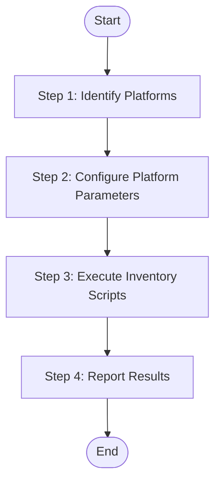

## Input

| Parameter | Type | Required | Description |
|-----------|------|----------|-------------|
| {source_path} | string | No | Source code directory path (default: project root) |
| {language} | string | Yes | Target language for generated content (e.g., "zh", "en") |

## Output

- `speccrew-workspace/knowledges/base/sync-state/knowledge-bizs/features-{platform}.json` - Platform-specific feature inventory files

## Workflow



### Step 1: Identify Platforms

**Detection Process:**

1. **Read Configuration:**
   - `speccrew-workspace/docs/configs/platform-mapping.json` - Platform type and subtype mappings
   - `speccrew-workspace/docs/configs/tech-stack-mappings.json` - Tech stack configurations and exclude directories

2. Scan `{source_path}` for platform-specific configuration files (e.g., package.json, pubspec.yaml, pom.xml)

3. Match detected files against `platform-mapping.json` → `platform_categories`

4. For each matched platform, extract `platform_type` and `platform_subtype`

5. Use `tech-stack-mappings.json` to determine:
   - `FileExtensions`: Which file extensions to scan
   - `ExcludeDirs`: Which directories to exclude
   - `TechStack`: Technology stack array

6. Each detected platform will generate one `features-{platform}.json` file

**Example Detection:**
- Found `frontend-web/package.json` with `"vue"` in dependencies
- Lookup `platform-mapping.json`: `web` + `vue` → `platform_type=web`, `platform_subtype=vue`
- Lookup `tech-stack-mappings.json`: vue → extensions=[".vue"], exclude_dirs=["components","utils"]

### Step 2: Configure Platform Parameters

For each detected platform, configure the following parameters:

| Parameter | Description | Example |
|-----------|-------------|---------|
| `SourcePath` | Source directory relative to project root | `frontend-web/src/views` |
| `OutputFileName` | Output file name | `features-web.json` |
| `PlatformName` | Human-readable platform name | `Web Frontend` |
| `PlatformType` | Platform category | `web`, `mobile`, `backend`, `desktop` |
| `PlatformSubtype` | Technology/framework | `vue`, `react`, `flutter`, `spring` |
| `TechStack` | Technology stack array | `["vue", "typescript"]` |
| `FileExtensions` | File extensions to scan | `[".vue", ".ts"]` |
| `ExcludeDirs` | Directories to exclude | `["components", "utils"]` |

### Step 3: Execute Inventory Scripts

> **MANDATORY**: You MUST execute the provided scripts via `run_in_terminal`. DO NOT use `read_file`, `search_codebase`, `Glob`, or any other tool to substitute script execution. DO NOT manually scan files and construct JSON output yourself.

Execute the inventory script for each platform:

**Prerequisites:**
- Node.js 14.0+

**Script Location (relative to this skill's directory):**
- All Platforms: `{skill_path}/scripts/generate-inventory.js`

**Example - Web Platform (Vue):**
```bash
node "scripts/generate-inventory.js" \
  --sourcePath "frontend-web/src/views" \
  --outputFileName "features-web.json" \
  --platformName "Web Frontend" \
  --platformType "web" \
  --platformSubtype "vue" \
  --techStack "vue,typescript" \
  --fileExtensions ".vue" \
  --excludeDirs "components,composables,hooks,utils"
```

**Example - Mobile Platform (UniApp):**
```bash
node "scripts/generate-inventory.js" \
  --sourcePath "frontend-mobile/pages" \
  --outputFileName "features-mobile.json" \
  --platformName "Mobile App" \
  --platformType "mobile" \
  --platformSubtype "uniapp" \
  --techStack "uniapp,vue" \
  --fileExtensions ".vue" \
  --excludeDirs "components,utils"
```

**Example - Backend Platform (Spring Single Module):**
```bash
node "scripts/generate-inventory.js" \
  --sourcePath "backend/src/main/java/com/example/controller" \
  --outputFileName "features-backend.json" \
  --platformName "Backend API" \
  --platformType "backend" \
  --platformSubtype "spring" \
  --techStack "spring-boot,java" \
  --fileExtensions ".java" \
  --excludeDirs ""
```

**Example - Backend Platform (Spring Multi-Module):**

> **IMPORTANT for Java/Kotlin backends**: Set `sourcePath` to the Java package root directory (e.g., `yudao-module-system/src/main/java/cn/iocoder/yudao/module/system`), NOT the module root. This ensures the `getModuleName` function extracts business module names (like `dept`, `auth`) instead of Java package segments (like `src`, `cn`).

For projects with multiple backend modules (e.g., ruoyi-vue-pro), execute the script once per module:

```bash
# Module 1: AI
node "scripts/generate-inventory.js" \
  --sourcePath "yudao-module-ai/src/main/java/cn/iocoder/yudao/module/ai" \
  --outputFileName "features-backend-ai.json" \
  --platformName "Backend API - AI Module" \
  --platformType "backend" \
  --platformSubtype "ai" \
  --techIdentifier "spring" \
  --techStack "spring-boot,java" \
  --fileExtensions ".java" \
  --excludeDirs ""

# Module 2: System
node "scripts/generate-inventory.js" \
  --sourcePath "yudao-module-system/src/main/java/cn/iocoder/yudao/module/system" \
  --outputFileName "features-backend-system.json" \
  --platformName "Backend API - System Module" \
  --platformType "backend" \
  --platformSubtype "system" \
  --techIdentifier "spring" \
  --techStack "spring-boot,java" \
  --fileExtensions ".java" \
  --excludeDirs ""
```

> **Note**: For multi-module backend projects, prefer per-module execution (above) over scan-all to get proper module-level directory isolation (e.g., `backend-ai/`, `backend-system/`).

**Alternative: Scan All Modules at Once**

If all modules share the same parent directory structure, you can scan from the project root:

```bash
node "scripts/generate-inventory.js" \
  --sourcePath "." \
  --outputFileName "features-backend-all.json" \
  --platformName "Backend API - All Modules" \
  --platformType "backend" \
  --platformSubtype "spring" \
  --techStack "spring-boot,java" \
  --fileExtensions ".java" \
  --excludeDirs "test,target,.git"
```

**Output: `features-{platform}.json` Structure:**
```json
{
  "platformName": "Web Frontend",
  "platformType": "web",
  "sourcePath": "frontend-web/src/views",
  "techStack": ["vue", "typescript"],
  "modules": ["system", "trade", "infra"],
  "totalFiles": 25,
  "analyzedCount": 0,
  "pendingCount": 25,
  "generatedAt": "2024-01-15-103000",
  "features": [
    {
      "fileName": "index",
      "sourcePath": "frontend-web/src/views/system/user/index.vue",
      "documentPath": "speccrew-workspace/knowledges/bizs/web-vue/src/views/system/user/index.md",
      "module": "system",
      "analyzed": false,
      "startedAt": null,
      "completedAt": null,
      "analysisNotes": null
    }
  ]
}
```

**Module Detection Rule:**
- The `module` field is automatically extracted from each file's relative directory path
- It uses the **first non-excluded directory level** as the module name
- Example: `system/user/index.vue` → module = `system`
- Example: `components/Table.vue` (excluded dir) → skipped by ExcludeDirs
- Files at root level (no subdirectory) → module = `_root`
- The top-level `modules` array lists all unique module names found

**Verification Checklist:**
- [ ] All `features-{platform}.json` files exist and are valid JSON
- [ ] Each file has correct platform metadata (platformName, platformType, techStack)
- [ ] All features have `analyzed: false` initially
- [ ] File paths are correct and accessible

### Step 4: Report Results

```
Feature Inventory Generated
- Platforms Found: [N]
  - Platform 1: [platform_name] ([platform_type]) - [feature_count] features
  - Platform 2: [platform_name] ([platform_type]) - [feature_count] features
- Total Features: [N]

Platform Inventory Files:
- Web Frontend:
  - Inventory File: speccrew-workspace/knowledges/base/sync-state/knowledge-bizs/features-web.json
  - Total Features: [N]
  - Status: Generated ✓
- Mobile App:
  - Inventory File: speccrew-workspace/knowledges/base/sync-state/knowledge-bizs/features-mobile.json
  - Total Features: [N]
  - Status: Generated ✓
- Backend API:
  - Inventory File: speccrew-workspace/knowledges/base/sync-state/knowledge-bizs/features-api.json
  - Total Features: [N]
  - Status: Generated ✓

Final Output:
- Platform Files:
  - speccrew-workspace/knowledges/base/sync-state/knowledge-bizs/features-web.json
  - speccrew-workspace/knowledges/base/sync-state/knowledge-bizs/features-mobile.json
  - speccrew-workspace/knowledges/base/sync-state/knowledge-bizs/features-api.json
```

## Checklist

### Platform Detection
- [ ] Platforms identified (Web, Mobile, Desktop, or API)
- [ ] Each platform has correct `platformName`, `platformType`, `techStack` configuration
- [ ] Source directories located for all platforms

### Inventory Generation
- [ ] **Inventory scripts executed**: Node.js script generated `features-{platform}.json` files
- [ ] **Inventory files valid**: JSON structure correct, all features listed
- [ ] **Total count verified**: `totalFiles` matches actual source file count per platform
- [ ] **File paths correct**: All `sourcePath` and `documentPath` values are accurate

### Output Generation
- [ ] All platform inventory files generated in `sync-state` directory
- [ ] Output path verified
- [ ] Results reported

