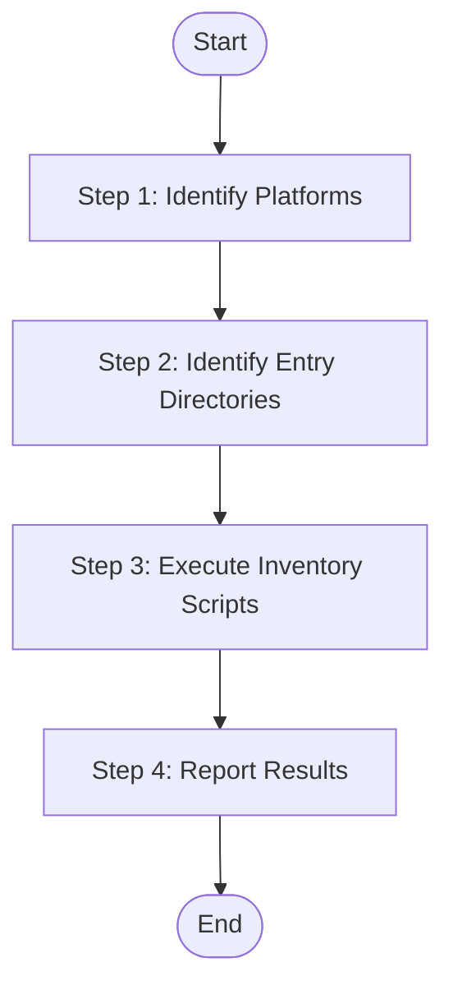

## Input

| Parameter | Type | Required | Description |
|-----------|------|----------|-------------|
| {source_path} | string | No | Source code directory path (default: project root) |
| {language} | string | Yes | Target language for generated content (e.g., "zh", "en") |

## Output

- `speccrew-workspace/knowledges/base/sync-state/knowledge-bizs/features-{platform}.json` - Platform-specific feature inventory files

## Workflow



### Step 1: Identify Platforms

**Detection Process:**

1. **Read Configuration:**
   - `speccrew-workspace/docs/configs/platform-mapping.json` - Platform type and subtype mappings
   - `speccrew-workspace/docs/configs/tech-stack-mappings.json` - Tech stack configurations and exclude directories

2. Scan `{source_path}` for platform-specific configuration files (e.g., package.json, pubspec.yaml, pom.xml)

3. Match detected files against `platform-mapping.json` → `platform_categories`

4. For each matched platform, extract `platform_type` and `platform_subtype`

5. Use `tech-stack-mappings.json` to determine:
   - `FileExtensions`: Which file extensions to scan
   - `ExcludeDirs`: Which directories to exclude
   - `TechStack`: Technology stack array

6. Each detected platform will generate one `features-{platform}.json` file

**Example Detection:**
- Found `frontend-web/package.json` with `"vue"` in dependencies
- Lookup `platform-mapping.json`: `web` + `vue` → `platform_type=web`, `platform_subtype=vue`
- Lookup `tech-stack-mappings.json`: vue → extensions=[".vue"], exclude_dirs=["components","utils"]

### Step 2: Identify Entry Directories

For each platform detected in Step 1, identify business module entry directories.

**Option A: Invoke Skill (Recommended)**

Dispatch Worker with `speccrew-knowledge-bizs-identify-entries` skill:

| Parameter | Value |
|-----------|-------|
| `platforms` | Platform list from Step 1 (each with platformId, sourcePath, platformType, platformSubtype, techStack) |
| `workspace_path` | `speccrew-workspace` |

Worker generates `entry-dirs-{platform_id}.json` files in `{workspace_path}/knowledges/base/sync-state/knowledge-bizs/`.

**Option B: Direct Execution**

If executing directly (without Worker dispatch), follow the same logic as the `speccrew-knowledge-bizs-identify-entries` skill:
1. Read each platform's directory tree (3 levels deep)
2. Identify entry directories based on platform type:
   - **Backend**: Find directories containing `*Controller.*` files, extract business package names
   - **Frontend**: Find `views/` or `pages/` directories, use first-level subdirectories as modules
   - **Mobile**: Find `pages/` subdirectories + top-level `pages-*` directories
3. Apply exclusion rules from `tech-stack-mappings.json`
4. Generate `entry-dirs-{platform_id}.json` files

**Verification**: Confirm each entry-dirs JSON has non-empty `modules` array with business-meaningful names.

### Step 3: Execute Inventory Scripts

> **MANDATORY**: You MUST execute the provided scripts via `run_in_terminal`. DO NOT use `read_file`, `search_codebase`, `Glob`, or any other tool to substitute script execution. DO NOT manually scan files and construct JSON output yourself.

Execute the inventory script for each platform using the entry-dirs JSON from Step 2:

**Prerequisites:**
- Node.js 14.0+

**Script Location (relative to this skill's directory):**
- All Platforms: `{skill_path}/scripts/generate-inventory.js`

**Execution Command:**
```bash
node "{skill_path}/scripts/generate-inventory.js" --entryDirsFile "{entry_dirs_file_path}"
```

Where `{entry_dirs_file_path}` is the full path to the `entry-dirs-{platform_id}.json` file generated in Step 2.

**Example:**
```bash
# Execute for each platform's entry-dirs file
node "scripts/generate-inventory.js" --entryDirsFile "d:/project/speccrew-workspace/knowledges/base/sync-state/knowledge-bizs/entry-dirs-backend-system.json"

node "scripts/generate-inventory.js" --entryDirsFile "d:/project/speccrew-workspace/knowledges/base/sync-state/knowledge-bizs/entry-dirs-web-vue.json"
```

**Script Parameters**:
- `--entryDirsFile`: (Required) Path to the `entry-dirs-{platform_id}.json` file generated in Step 2
- `--techIdentifier`: (Optional) Technology identifier for tech-stack lookup (auto-detected from platform mapping if omitted)
- `--fileExtensions`: (Optional) Comma-separated list of file extensions to include
- `--excludeDirs`: (Optional) Additional directories to exclude

**Output: `features-{platform}.json` Structure:**
```json
{
  "platformName": "Web Frontend",
  "platformType": "web",
  "sourcePath": "frontend-web/src/views",
  "techStack": ["vue", "typescript"],
  "modules": [
    { "name": "chat", "featureCount": 12 },
    { "name": "image", "featureCount": 8 }
  ],
  "totalFiles": 25,
  "analyzedCount": 0,
  "pendingCount": 25,
  "generatedAt": "2024-01-15-103000",
  "features": [
    {
      "fileName": "index",
      "sourcePath": "yudao-ui/yudao-ui-admin-uniapp/src/pages/bpm/index.vue",
      "documentPath": "speccrew-workspace/knowledges/bizs/web-vue/src/views/system/user/index.md",
      "module": "system",
      "analyzed": false,
      "startedAt": null,
      "completedAt": null,
      "analysisNotes": null
    }
  ]
}
```

**Module Detection Rule:**
- When using `--entryDirsFile` mode (recommended), the `module` field for each feature is determined by matching the file's path against the entry directories defined in the entry-dirs JSON
- Each file is assigned to the module whose `entryDirs` path matches the file's relative directory
- The top-level `modules` array lists all modules with their feature counts
- Files not matching any entry directory → module = `_root`

**sourcePath Format:**
- In both full-scan mode and entry-dirs mode, `sourcePath` is always a **project-root-relative path**
- Example: `yudao-ui/yudao-ui-admin-uniapp/src/pages/bpm/index.vue` (NOT `pages/bpm/index.vue`)
- Example: `yudao-module-system/src/main/java/cn/iocoder/yudao/module/system/controller/admin/user/UserController.java`

**Verification Checklist:**
- [ ] All `features-{platform}.json` files exist and are valid JSON
- [ ] Each file has correct platform metadata (platformName, platformType, techStack)
- [ ] All features have `analyzed: false` initially
- [ ] File paths are correct and accessible

### Step 4: Report Results

```
Feature Inventory Generated
- Platforms Found: [N]
  - Platform 1: [platform_name] ([platform_type]) - [feature_count] features
  - Platform 2: [platform_name] ([platform_type]) - [feature_count] features
- Total Features: [N]

Platform Inventory Files:
- Web Frontend:
  - Inventory File: speccrew-workspace/knowledges/base/sync-state/knowledge-bizs/features-web.json
  - Total Features: [N]
  - Status: Generated ✓
- Mobile App:
  - Inventory File: speccrew-workspace/knowledges/base/sync-state/knowledge-bizs/features-mobile.json
  - Total Features: [N]
  - Status: Generated ✓
- Backend API:
  - Inventory File: speccrew-workspace/knowledges/base/sync-state/knowledge-bizs/features-api.json
  - Total Features: [N]
  - Status: Generated ✓

Final Output:
- Platform Files:
  - speccrew-workspace/knowledges/base/sync-state/knowledge-bizs/features-web.json
  - speccrew-workspace/knowledges/base/sync-state/knowledge-bizs/features-mobile.json
  - speccrew-workspace/knowledges/base/sync-state/knowledge-bizs/features-api.json
```

## Checklist

### Platform Detection
- [ ] Platforms identified (Web, Mobile, Desktop, or API)
- [ ] Each platform has correct `platformName`, `platformType`, `techStack` configuration
- [ ] Source directories located for all platforms

### Entry Directory Identification
- [ ] Entry-dirs JSON files generated for all platforms
- [ ] Each platform has non-empty modules array
- [ ] Module names are business-meaningful (not technical terms like `config`, `util`, `controller`)
- [ ] Entry directory paths are correct and accessible

### Inventory Generation
- [ ] **Inventory scripts executed**: Node.js script generated `features-{platform}.json` files
- [ ] **Inventory files valid**: JSON structure correct, all features listed
- [ ] **Total count verified**: `totalFiles` matches actual source file count per platform
- [ ] **File paths correct**: All `sourcePath` and `documentPath` values are accurate (sourcePath MUST be project-root-relative path)

### Output Generation
- [ ] All platform inventory files generated in `sync-state` directory
- [ ] Output path verified
- [ ] Results reported

