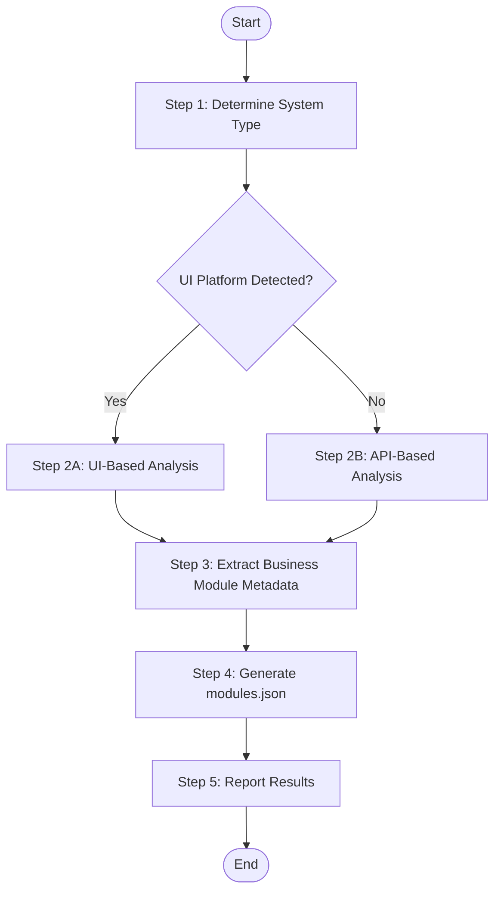

## User

Worker Agent (speccrew-task-worker)

## Input

- `source_path`: Source code directory path (default: project root)
- `output_path`: Output directory for modules.json (default: `speccrew-workspace/knowledges/base/sync-state/knowledge-bizs/`)
- `output_name`: Output file name (default: `modules.json`)
- `language`: Target language for generated content (e.g., "zh", "en") - **REQUIRED**
- `skill_path`: Path to skill directory containing scripts (default: `.speccrew/skills/speccrew-knowledge-bizs-init`)

## Output

- `{output_path}/{output_name}` - Business module list for pipeline orchestration
- `{output_path}/scan-result.json` - Intermediate scan result (UI-Based only)

## Workflow



### Step 1: Determine System Type

1. **Read Configuration**:
   - Read `speccrew-workspace/docs/configs/platform-mapping.json` - Map detected framework to standardized platform_id, platform_type, and platform_subtype
   - Read `speccrew-workspace/docs/configs/tech-stack-mappings.json` - Identify platform indicators by file extensions and project files

2. **Analyze project to determine if it has a UI layer**:

**Check for UI Indicators:**

| Platform Category | platform_type | platform_subtype | Indicators | Evidence |
|-------------------|---------------|------------------|------------|----------|
| **Web Frontend** | `web` | See `platform-mapping.json` | Frontend frameworks | React, Vue, Angular, Next.js, Nuxt in package.json |
| | | | Page directories | `pages/`, `views/`, `app/`, `routes/` |
| | | | Route config | `router/`, `routes.ts`, `router.config.js` |
| | | | UI components | `components/`, `ui/`, `antd/`, `material-ui/` |
| **Mobile** | `mobile` | See `platform-mapping.json` | Android projects | `build.gradle`, `AndroidManifest.xml`, `res/layout/`, `.kt`/`.java` files |
| | | | Jetpack Compose | `@Composable` functions, `setContent { }` blocks |
| | | | iOS projects | `.xcodeproj`, `Info.plist`, `Storyboard`, `.swift`/`.m` files |
| | | | SwiftUI | `SwiftUI` imports, `struct ContentView: View` |
| | | | Flutter | `pubspec.yaml`, `lib/main.dart`, `flutter/` directory |
| | | | React Native | `react-native` in package.json, `ios/`, `android/` directories |
| | | | UniApp | `manifest.json`, `pages.json`, `uni-app` in package.json |
| | | | Mini Programs | `app.json`, `project.config.json`, `pages/` directory |
| **Desktop Client** | `desktop` | See `platform-mapping.json` | WPF | `.csproj`, `.xaml` files, `App.xaml` |
| | | | WinForms | `.cs`/`.vb` files, `Form` classes, `Designer.cs` |
| | | | Electron | `electron` in package.json, `main.js`, `preload.js` |
| | | | Tauri | `tauri.conf.json`, `src-tauri/` directory |
| | | | Qt | `.pro`, `.qml`, `CMakeLists.txt` with Qt references |

> **Reference**: For complete platform type and subtype values, see `speccrew-workspace/docs/configs/platform-mapping.json` 

**Decision - Branch to Appropriate Analysis Flow:**

**IF** any UI platform detected:
- → Execute **Step 2A: UI-Based Analysis** below
- → **SKIP** Step 2B entirely
- → All modules will have `system_type: "ui"`

**IF** only backend indicators (no UI):
- → **SKIP** Step 2A entirely
- → Execute **Step 2B: API-Based Analysis** below
- → All modules will have `system_type: "api"`

---

### Step 2A: UI-Based Analysis (Systems with Frontend)

**Execute this step ONLY if UI platforms were detected in Step 1.**

For systems with UI, analyze from user-facing perspective:

#### Step 2A.1: Execute Scan Script (MANDATORY)

**CRITICAL**: Use the provided Node.js script to scan source code and identify ALL modules and files. This ensures 100% file coverage.

**Prerequisites:**
```bash
cd {skill_path}/scripts
npm install  # Install glob dependency
```

**Execute Scan:**
```bash
node {skill_path}/scripts/scan-ui-modules.js \
  --source {source_path} \
  --output {output_path}/scan-result.json \
  --platform {platform_type} \
  --extensions .vue,.tsx,.jsx
```

**Parameters:**
- `--source`: Source code directory path (from Input)
- `--output`: Temporary scan result file path
- `--platform`: Platform type (web, mobile, desktop)
- `--extensions`: File extensions to scan (comma-separated)

**Script Output Structure:**
```json
{
  "generatedAt": "2024-01-15T10:30:00Z",
  "scanConfig": { "sourcePath": "...", "platform": "web", ... },
  "summary": {
    "totalFiles": 25,
    "totalModules": 3,
    "fileTypes": { "list": 5, "form": 8, "modal": 6, ... }
  },
  "modules": {
    "system": {
      "name": "system",
      "codeName": "system",
      "path": "src/views/system",
      "subModules": {
        "user-list": {
          "name": "user-list",
          "path": "src/views/system/user",
          "files": [
            { "path": "...", "componentName": "UserList", "type": "list" },
            { "path": "...", "componentName": "UserForm", "type": "form" },
            ...
          ]
        }
      }
    }
  }
}
```

#### Step 2A.2: Verify Scan Results

**Read the scan-result.json file and verify:**

1. **File Count Check**:
   - Compare `summary.totalFiles` with actual file count in source
   - If mismatch, check scan logs for errors

2. **Module Coverage Check**:
   - Review each module in `modules` section
   - Ensure all business modules are identified
   - Check that sub-modules are logically grouped

3. **File Classification Review**:
   - Verify `file.type` classification is correct
   - Common types: `list`, `detail`, `form`, `modal`, `component`
   - Reclassify if needed during metadata extraction

#### Step 2A.3: Analyze Frontend Routes (Supplementary)

   **React Router Example:**
   ```typescript
   // routes.ts or App.tsx
   { path: '/orders', component: OrderListPage },     → Order Management Module
   { path: '/orders/:id', component: OrderDetailPage },
   { path: '/payments', component: PaymentListPage }, → Payment Module
   { path: '/users', component: UserManagementPage }, → User Management Module
   ```

   **Next.js Pages Router:**
   ```
   pages/
   ├── orders/
       ├── index.tsx      → Order List Page
       └── [id].tsx       → Order Detail Page
   ├── payments/
       └── index.tsx      → Payment Management Page
   └── users/
       └── index.tsx      → User Management Page
   ```

   **Vue Router Example:**
   ```typescript
   // router/index.ts
   {
     path: '/inventory',
     component: InventoryLayout,
     children: [
       { path: 'products', component: ProductList },  → Inventory Module
       { path: 'stock', component: StockManagement }
     ]
   }
   ```

2. **Analyze Navigation/Menu Structure**

   Look for menu configurations that reveal business modules:

   ```typescript
   // Typical menu config
   const menuItems = [
     { key: 'dashboard', label: 'Dashboard', icon: 'Home' },
     { key: 'orders', label: 'Order Management', icon: 'ShoppingCart' },  → Order Module
     { key: 'products', label: 'Product Catalog', icon: 'Package' },       → Product Module
     { key: 'customers', label: 'Customer Center', icon: 'Users' },        → Customer Module
     { key: 'reports', label: 'Reports & Analytics', icon: 'BarChart' },   → Report Module
   ];
   ```

3. **Map Pages to Business Modules**

   Group related pages into business modules:

   | Module Name | User Value | Pages/Routes |
   |-------------|------------|--------------|
   | Order Management | Handle customer orders from creation to fulfillment | /orders, /orders/:id, /order-create |
   | Product Catalog | Manage product information and categories | /products, /categories, /inventory |
   | Customer Center | Manage customer profiles and relationships | /customers, /customer/:id, /crm |
   | Payment & Billing | Process payments and manage invoices | /payments, /invoices, /billing |

---

### Step 2B: API-Based Analysis (Backend-Only Systems)

**Execute this step ONLY if NO UI platform was detected in Step 1.**

For systems without UI, analyze from API perspective:

1. **Identify API Controllers/Handlers**

   **NestJS Example:**
   ```typescript
   // Controllers represent business modules
   @Controller('orders')      → Order Management Module
   @Controller('payments')    → Payment Processing Module
   @Controller('users')       → User Management Module
   @Controller('inventory')   → Inventory Management Module
   ```

   **Spring Boot Example:**
   ```java
   @RestController
   @RequestMapping("/api/orders")     → Order Module
   @RequestMapping("/api/inventory")  → Inventory Module
   @RequestMapping("/api/customers")  → Customer Module
   ```

   **Express.js Example:**
   ```javascript
   // Route files represent modules
   app.use('/api/orders', orderRoutes);      → Order Module
   app.use('/api/products', productRoutes);  → Product Module
   app.use('/api/auth', authRoutes);         → Authentication Module
   ```

2. **Group APIs by Business Domain**

   Analyze API paths to identify business modules:

   ```
   API Pattern Analysis:

   /orders, /orders/:id, /orders/:id/cancel        → Order Management
   /payments, /payments/:id/refund, /invoices      → Payment & Billing
   /products, /categories, /inventory/stock        → Product & Inventory
   /users, /users/:id/profile, /auth/login         → User & Authentication
   /reports/sales, /reports/inventory              → Reporting & Analytics
   ```

3. **Map APIs to Business Modules**

   | Module Name | User Value | API Endpoints |
   |-------------|------------|---------------|
   | Order Management | Process and track customer orders | GET/POST/PUT /orders, /orders/:id/* |
   | Payment Processing | Handle payments and refunds | /payments, /invoices, /refunds |
   | Product Catalog | Manage products and categories | /products, /categories |
   | User Management | Handle user accounts and auth | /users, /auth/* |

---

### Step 3: Extract Business Module Metadata (Using Scan Results)

**Base on scan-result.json from Step 2A.1**, extract metadata for each module:

**Input:** `{output_path}/scan-result.json`

**Process for Each Module:**

| Field | Source | Example | Condition |
|-------|--------|---------|-----------|
| name | Business term from UI/API | "Order Management" | Always |
| code_name | Technical identifier | "order" | Always |
| user_value | What users accomplish | "Handle customer orders from creation to fulfillment" | Always |
| sub_modules | Array of sub-module objects | See format below | Only for `system_type: "ui"` |
| entry_points | Array of file paths | See format below | Only for `system_type: "api"` |
| system_type | UI or API-based | "ui" or "api" | Always |

**Module Structure by System Type:**

**For UI-Based Modules (`system_type: "ui"`):**

UI modules use `sub_modules` to organize related pages and components hierarchically:

```json
{
  "sub_modules": [
    {
      "name": "User List",
      "code_name": "user-list",
      "path": "src/views/system/user",
      "entry_points": [
        {
          "path": "src/views/system/user/index.vue",
          "event_functions": ["UserList_onInit", "UserList_onSearch", "UserList_onAdd"]
        },
        {
          "path": "src/views/system/user/UserForm.vue",
          "event_functions": ["UserForm_onSubmit", "UserForm_onValidate"]
        },
        {
          "path": "src/views/system/user/UserImportForm.vue",
          "event_functions": ["UserImportForm_onImport", "UserImportForm_onDownloadTemplate"]
        }
      ]
    }
  ]
}
```

**Sub-Module Organization Rules:**

1. **Group by Feature/Directory**: Each sub-module represents a cohesive feature area
   - Example: `user-list`, `user-detail`, `user-import` under `user` module
   - Example: `order-list`, `order-create`, `order-modal` under `order` module

2. **Sub-Module Fields:**
   - `name`: Human-readable sub-module name
   - `code_name`: Technical identifier (kebab-case)
   - `path`: Directory path containing the sub-module files
   - `entry_points`: Array of page/component files with event functions

3. **Entry Point Structure:**
   - `path`: Relative file path to the component/page
   - `event_functions`: Array of `{ComponentName}_{EventAction}` strings

**UI Entry Point Analysis Guide:**

1. **Identify Page Components:**
   - Main list pages (e.g., `index.tsx`, `list.tsx`)
   - Detail pages (e.g., `[id].tsx`, `detail.tsx`)
   - Create/Edit pages (e.g., `create.tsx`, `edit.tsx`)

2. **Identify Sub-Pages and Dialogs:**
   - Modal components (e.g., `*Modal.tsx`, `*Dialog.tsx`)
   - Drawer components (e.g., `*Drawer.tsx`)
   - Popover/Popup components

3. **Extract and Name Event Functions:**
   - **Naming Convention**: `{ComponentName}_{EventAction}`
   - Format: PascalCase component name + underscore + camelCase action
   - Examples:
     - `OrderListPage_onSearch`
     - `OrderDetailModal_onConfirm`
     - `PaymentForm_onSubmit`

   - **Comprehensive Event Coverage** (include ALL non-empty event handlers):
     - **Lifecycle Events**: `onInit`, `onMount`, `onUnmount`, `onLoad`
     - **User Interactions**: `onClick`, `onSubmit`, `onChange`, `onSelect`
     - **Data Operations**: `onSearch`, `onFilter`, `onSort`, `onRefresh`
     - **CRUD Actions**: `onCreate`, `onEdit`, `onDelete`, `onSave`
     - **Navigation**: `onNavigate`, `onBack`, `onClose`
     - **Async Callbacks**: `onSuccess`, `onError`, `onCancel`

   - **Extraction Process:**
     ```typescript
     // From OrderListPage component
     useEffect(() => { ... }, [])           → "OrderListPage_onInit"
     const handleSearch = () => { ... }     → "OrderListPage_onSearch"
     const onCreateClick = () => { ... }    → "OrderListPage_onCreate"
     <Button onClick={onDelete}>           → "OrderListPage_onDelete"
     
     // From OrderDetailModal component
     const handleOpen = () => { ... }       → "OrderDetailModal_onOpen"
     const handleClose = () => { ... }      → "OrderDetailModal_onClose"
     <Button onClick={onConfirm}>          → "OrderDetailModal_onConfirm"
     ```

   - **Why Component Prefix?**
     - Prevents naming conflicts across different pages/components
     - Enables precise traceability in business flow analysis
     - Supports same event name in different contexts (e.g., `onSearch` in both OrderListPage and PaymentListPage)

4. **Map Event to Business Logic:**
   - Each event function will be traced to:
     - Frontend: API client calls, state updates, navigation
     - Backend: Corresponding API endpoints, service methods
   - This mapping enables end-to-end business flow analysis

**For API-Based Modules (`system_type: "api"`):**

Entry points are simple file paths to controller/service files:

```json
{
  "entry_points": [
    "src/modules/order/order.controller.ts",
    "src/modules/order/order.service.ts"
  ]
}
```

### Step 4: Generate modules.json

1. **Read Configuration**:
   - Read `speccrew-workspace/docs/configs/validation-rules.json` - Validate platform_id, module names, and file naming conventions

2. **Get Timestamp**:
   - **CRITICAL**: Use the Skill tool to invoke `speccrew-get-timestamp` with parameter: `format=ISO`
   - Store the returned timestamp as `generated_at` value

3. **Create JSON file**:
   - Read `examples/modules.json` for output format reference
   - Generate file at `{output_path}/modules.json` following the exact structure

### Step 5: Report Results

```
Business Module List Generated
- Analysis Method: [UI-Based / API-Based]
- Scan Script Used: [Yes / No]
- Platforms Found: [N]
  - Platform 1: [platform_name] ([platform_type]) - [module_count] modules
  - Platform 2: [platform_name] ([platform_type]) - [module_count] modules
- Total Business Modules: [N]

Scan Script Results (if UI-Based):
- Scan Result File: {output_path}/scan-result.json
- Total Files Scanned: [N]
- Total Modules Identified: [N]
- File Type Distribution:
  - list: [N]
  - form: [N]
  - modal: [N]
  - detail: [N]
  - component: [N]

Per-Module Verification:
- Module: [module_name]
  - Directory: [path]
  - Files from Scan: [N]
  - Files in modules.json: [N]
  - Coverage: [100% / Mismatch: list differences]
  - Sub-Modules: [N]

- Output: {output_path}/{output_name}
```

**CRITICAL: If scan result file count != modules.json file count, STOP and reconcile before proceeding.**

## Checklist

### Platform Detection
- [ ] Platforms identified (Web, Mobile, Desktop, or API)
- [ ] Each platform has `platform_name`, `platform_type`, `source_path`, `tech_stack`
- [ ] Modules grouped by platform
- [ ] Business modules mapped from user/product perspective

### UI-Based Module Entry Points (Script-Assisted)
- [ ] **Scan script executed**: `scan-ui-modules.js` ran successfully with correct parameters
- [ ] **Scan result generated**: `{output_path}/scan-result.json` exists and is valid JSON
- [ ] **File count verified**: `summary.totalFiles` matches actual source file count
- [ ] **All modules identified**: Every business module from scan result is processed
- [ ] **Sub-modules mapped**: Script output sub-modules are logically grouped
- [ ] **Event functions extracted**: For each file in scan result, extracted all event handlers
- [ ] **Entry points format**: Each entry point has `path` and `event_functions` array
- [ ] **Event naming**: `{ComponentName}_{EventAction}` format (e.g., `UserList_onSearch`, `UserForm_onSubmit`)
- [ ] **Complete coverage**: ALL files from scan result are included in final modules.json

### API-Based Module Entry Points
- [ ] **Controllers identified**: `@Controller` decorated classes or route files
- [ ] **Services identified**: Business logic service files
- [ ] **Entry points format**: Array of file path strings

### Output Generation
- [ ] Module metadata extracted (name, code_name, user_value, entry_points, system_type)
- [ ] modules.json generated with unified platform-based structure
- [ ] Output path verified
- [ ] Results reported

