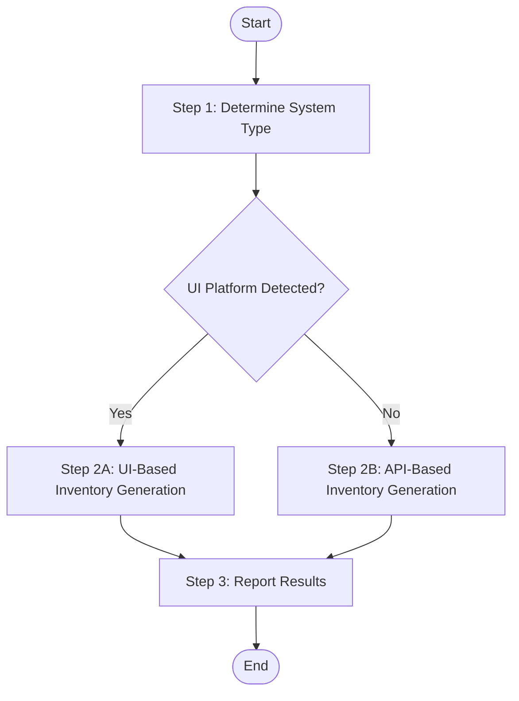

## User

Worker Agent (speccrew-task-worker)

## Input

- `source_path`: Source code directory path (default: project root)
- `output_path`: Output directory for modules.json (default: `speccrew-workspace/knowledges/base/sync-state/knowledge-bizs/`)
- `output_name`: Output file name (default: `modules.json`)
- `language`: Target language for generated content (e.g., "zh", "en") - **REQUIRED**
- `skill_path`: Path to skill directory containing scripts (default: `.speccrew/skills/speccrew-knowledge-bizs-init`)

## Output

- `{output_path}/{output_name}` - Final merged business module list for pipeline orchestration
- `{output_path}/modules-{platform}.json` - Platform-specific inventory files (intermediate)

**Intermediate Files Purpose:**
The `modules-{platform}.json` files serve as:
1. **Checklist**: Lists ALL entry points that need analysis per platform
2. **Progress Tracker**: `analyzed` flag and timestamps show completion status
3. **Data Source**: Contains all metadata for generating final modules.json
4. **Multi-Platform Support**: Each platform has its own tracking file

## Workflow



### Step 1: Determine System Type

1. **Read Configuration**:
   - Read `speccrew-workspace/docs/configs/platform-mapping.json` - Map detected framework to standardized platform_id, platform_type, and platform_subtype
   - Read `speccrew-workspace/docs/configs/tech-stack-mappings.json` - Identify platform indicators by file extensions and project files

2. **Analyze project to determine if it has a UI layer**:

**Check for UI Indicators:**

| Platform Category | platform_type | platform_subtype | Indicators | Evidence |
|-------------------|---------------|------------------|------------|----------|
| **Web Frontend** | `web` | See `platform-mapping.json` | Frontend frameworks | React, Vue, Angular, Next.js, Nuxt in package.json |
| | | | Page directories | `pages/`, `views/`, `app/`, `routes/` |
| | | | Route config | `router/`, `routes.ts`, `router.config.js` |
| | | | UI components | `components/`, `ui/`, `antd/`, `material-ui/` |
| **Mobile** | `mobile` | See `platform-mapping.json` | Android projects | `build.gradle`, `AndroidManifest.xml`, `res/layout/`, `.kt`/`.java` files |
| | | | Jetpack Compose | `@Composable` functions, `setContent { }` blocks |
| | | | iOS projects | `.xcodeproj`, `Info.plist`, `Storyboard`, `.swift`/`.m` files |
| | | | SwiftUI | `SwiftUI` imports, `struct ContentView: View` |
| | | | Flutter | `pubspec.yaml`, `lib/main.dart`, `flutter/` directory |
| | | | React Native | `react-native` in package.json, `ios/`, `android/` directories |
| | | | UniApp | `manifest.json`, `pages.json`, `uni-app` in package.json |
| | | | Mini Programs | `app.json`, `project.config.json`, `pages/` directory |
| **Desktop Client** | `desktop` | See `platform-mapping.json` | WPF | `.csproj`, `.xaml` files, `App.xaml` |
| | | | WinForms | `.cs`/`.vb` files, `Form` classes, `Designer.cs` |
| | | | Electron | `electron` in package.json, `main.js`, `preload.js` |
| | | | Tauri | `tauri.conf.json`, `src-tauri/` directory |
| | | | Qt | `.pro`, `.qml`, `CMakeLists.txt` with Qt references |

> **Reference**: For complete platform type and subtype values, see `speccrew-workspace/docs/configs/platform-mapping.json` 

**Decision - Branch to Appropriate Analysis Flow:**

**IF** any UI platform detected:
- → Execute **Step 2A: UI-Based Inventory Generation**
- → All modules will have `analysisMethod: "ui-based"`

**IF** only backend indicators (no UI):
- → Execute **Step 2B: API-Based Inventory Generation**
- → All modules will have `analysisMethod: "api-based"`

---

### Step 2A: UI-Based Inventory Generation

**Execute this step ONLY if UI platforms were detected in Step 1.**

#### Step 2A.1: Identify Frontend Page Directory

**CRITICAL**: Locate the root directory containing all frontend pages.

**Common Locations:**
- Vue: `src/views/` or `src/pages/`
- React: `src/pages/` or `src/app/`
- Next.js: `app/` or `pages/`

**Detection:**
Use `Glob` to find directories with `.vue`, `.tsx`, `.jsx` files, then identify the common parent directory.

#### Step 2A.2: Execute Inventory Script

**Execute the appropriate script for each platform to generate platform-specific inventory files:**

**Prerequisites:**
- Windows: PowerShell 5.0+ (included in Windows)
- Linux/Mac: `jq` JSON processor (`apt-get install jq` or `brew install jq`)

**Script Parameters:**

| Parameter | Description | Example |
|-----------|-------------|---------|
| SourcePath | Root directory containing source files | `src/views`, `lib/pages` |
| OutputFileName | Output file name (saved to sync-state) | `modules-web.json` |
| PlatformName | Platform name | `Web Frontend`, `Mobile App` |
| PlatformType | Platform type | `web`, `mobile`, `backend` |
| PlatformSubtype | Platform subtype (optional) | `vue`, `react`, `flutter` |
| TechStack | Technology stack as JSON array | `["vue","typescript"]` |
| FileExtensions | File extensions as JSON array | `[".vue",".ts"]` |
| AnalysisMethod | Analysis method (default: ui-based) | `ui-based`, `api-based` |

**Windows (PowerShell) - Example for Web Platform:**
```powershell
& "{skill_path}/scripts/generate-inventory.ps1" `
  -SourcePath "src/views" `
  -OutputFileName "modules-web.json" `
  -PlatformName "Web Frontend" `
  -PlatformType "web" `
  -PlatformSubtype "vue" `
  -TechStack '["vue","typescript"]' `
  -FileExtensions '[".vue",".ts"]' `
  -AnalysisMethod "ui-based"
```

**Linux/Mac (Bash) - Example for Web Platform:**
```bash
bash "{skill_path}/scripts/generate-inventory.sh" \
  "src/views" \
  "modules-web.json" \
  "Web Frontend" \
  "web" \
  "vue" \
  '["vue","typescript"]' \
  '[".vue",".ts"]' \
  "ui-based"
```

**Multi-Platform Projects:**

For projects with multiple platforms (e.g., Web + Mobile), execute the script once per platform:

```powershell
# Web Platform
& "{skill_path}/scripts/generate-inventory.ps1" `
  -SourcePath "src/views" `
  -OutputFileName "modules-web.json" `
  -PlatformName "Web Frontend" `
  -PlatformType "web" `
  -TechStack '["vue","typescript"]' `
  -FileExtensions '[".vue",".ts"]'

# Mobile Platform
& "{skill_path}/scripts/generate-inventory.ps1" `
  -SourcePath "lib/views" `
  -OutputFileName "modules-mobile.json" `
  -PlatformName "Mobile App" `
  -PlatformType "mobile" `
  -PlatformSubtype "flutter" `
  -TechStack '["flutter","dart"]' `
  -FileExtensions '[".dart"]'
```

**Script Locations:**
- Windows: `{skill_path}/scripts/generate-inventory.ps1`
- Linux/Mac: `{skill_path}/scripts/generate-inventory.sh`

**Output: `modules-{platform}.json` Structure:**
```json
{
  "generatedAt": "2024-01-15-103000",
  "analysisMethod": "ui-based",
  "platformCount": 1,
  "platforms": [
    {
      "platformName": "Web Frontend",
      "platformType": "web",
      "sourcePath": "src/views",
      "techStack": ["vue", "typescript"],
      "totalFiles": 25,
      "analyzedCount": 0,
      "pendingCount": 25,
      "modules": [
        {
          "modulePath": "src/views/system/user",
          "relativePath": "system/user",
          "entryPoints": [
            {
              "fileName": "index",
              "fullPath": "src/views/system/user/index.vue",
              "relativePath": "system/user/index.vue",
              "extension": ".vue",
              "analyzed": false,
              "startedAt": null,
              "completedAt": null,
              "analysisNotes": null
            }
          ]
        }
      ]
    }
  ]
}
```

#### Step 2A.3: Verify Inventory Files

**CRITICAL: Ensure all platform inventory files are generated correctly.**

**Verification Checklist:**
- [ ] All `modules-{platform}.json` files exist and are valid JSON
- [ ] Each file has correct platform metadata (platformName, platformType, techStack)
- [ ] Entry points are correctly grouped by module directory
- [ ] All entry points have `analyzed: false` initially
- [ ] File paths are correct and accessible

---

### Step 2B: API-Based Inventory Generation

**Execute this step ONLY if NO UI platform was detected in Step 1.**

#### Step 2B.1: Identify API Source Directory

**CRITICAL**: Locate the root directory containing API controllers/modules.

**Common Locations:**
- NestJS: `src/modules/` or `src/controllers/`
- Spring Boot: `src/main/java/com/*/controller/` or `src/main/java/com/*/modules/`
- Express.js: `src/routes/` or `src/api/`
- Django: `*/views.py` or `*/api/`

**Detection:**
Use `Glob` to find directories with controller files (`.controller.ts`, `Controller.java`, `.py`), then identify the common parent directory.

#### Step 2B.2: Execute Inventory Script

**Execute the script with `api-based` analysis method:**

**Windows (PowerShell) - Example for Backend API:**
```powershell
& "{skill_path}/scripts/generate-inventory.ps1" `
  -SourcePath "src/modules" `
  -OutputFileName "modules-api.json" `
  -PlatformName "Backend API" `
  -PlatformType "backend" `
  -PlatformSubtype "nestjs" `
  -TechStack '["nestjs","typescript"]' `
  -FileExtensions '[".controller.ts",".service.ts"]' `
  -AnalysisMethod "api-based"
```

**Linux/Mac (Bash) - Example for Backend API:**
```bash
bash "{skill_path}/scripts/generate-inventory.sh" \
  "src/modules" \
  "modules-api.json" \
  "Backend API" \
  "backend" \
  "nestjs" \
  '["nestjs","typescript"]' \
  '[".controller.ts",".service.ts"]' \
  "api-based"
```

#### Step 2B.3: Verify Inventory Files

Same verification as Step 2A.3.

---

### Step 3: Report Results

```
Business Module Inventory Generated
- Analysis Method: [UI-Based / API-Based]
- Platforms Found: [N]
  - Platform 1: [platform_name] ([platform_type]) - [module_count] modules, [entry_point_count] entry points
  - Platform 2: [platform_name] ([platform_type]) - [module_count] modules, [entry_point_count] entry points
- Total Business Modules: [N]

Platform Inventory Files:
- Web Frontend:
  - Inventory File: {sync-state}/modules-web.json
  - Total Entry Points: [N]
  - Status: Generated ✓
- Mobile App:
  - Inventory File: {sync-state}/modules-mobile.json
  - Total Entry Points: [N]
  - Status: Generated ✓
- Backend API:
  - Inventory File: {sync-state}/modules-api.json
  - Total Entry Points: [N]
  - Status: Generated ✓

Module Summary:
- Module: [module_name]
  - Entry Points: [N]
  - Status: [COMPLETE]

Final Output:
- Platform Files:
  - {sync-state}/modules-web.json
  - {sync-state}/modules-mobile.json
  - {sync-state}/modules-api.json
```

## Checklist

### Platform Detection
- [ ] Platforms identified (Web, Mobile, Desktop, or API)
- [ ] Each platform has correct `platformName`, `platformType`, `techStack` configuration
- [ ] Source directories located for all platforms

### Inventory Generation
- [ ] **Inventory scripts executed**: PowerShell/Bash scripts generated `modules-{platform}.json` files
- [ ] **Inventory files valid**: JSON structure correct, all entry points listed
- [ ] **Total count verified**: `totalFiles` matches actual source file count per platform
- [ ] **File paths correct**: All `fullPath` and `relativePath` values are accurate
- [ ] **Directory structure preserved**: Modules correctly grouped by directory hierarchy

### Output Generation
- [ ] All platform inventory files generated in `sync-state` directory
- [ ] Output path verified
- [ ] Results reported

