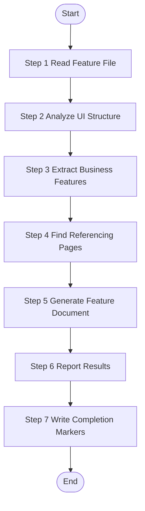

# UI Feature Analysis - Single Feature

Analyze one specific UI feature from source code, extract business functionality, and generate feature documentation. This skill operates at feature granularity - one worker per feature file.

## Trigger Scenarios

- "Analyze feature {fileName} from source code"
- "Extract UI functionality from feature {fileName}"
- "Generate documentation for feature {fileName}"
- "Analyze UI feature from features.json"

## User

Worker Agent (speccrew-task-worker)

## Input

## Input Variables

| Variable | Type | Description | Example |
|----------|------|-------------|---------|
| `{{feature}}` | object | Complete feature object from features.json | - |
| `{{fileName}}` | string | Feature file name | `"index"`, `"UserForm"` |
| `{{sourcePath}}` | string | Relative path to source file | `"frontend-web/src/views/system/user/index.vue"` |
| `{{documentPath}}` | string | Target path for generated document | `"speccrew-workspace/knowledges/bizs/web-vue/src/views/system/user/index.md"` |
| `{{module}}` | string | Business module name (from feature.module) | `"system"`, `"trade"`, `"_root"` |
| `{{analyzed}}` | boolean | Analysis status flag | `true` / `false` |
| `{{platform_type}}` | string | Platform type | `"web"`, `"mobile"` |
| `{{platform_subtype}}` | string | Platform subtype | `"vue"`, `"react"` |
| `{{tech_stack}}` | array | Platform tech stack | `["vue", "typescript"]` |
| `{{language}}` | string | **REQUIRED** - Target language for generated content | `"zh"`, `"en"` |
| `{{completed_dir}}` | string | Marker files output directory | `"speccrew-workspace/knowledges/base/sync-state/knowledge-bizs/completed"` |
| `{{sourceFile}}` | string | Source features JSON file name | `"features-web-vue.json"` |

## Language Adaptation

**CRITICAL**: Generate all content in the language specified by the `{{language}}` parameter.

- `{{language}} == "zh"` → Generate all content in 中文
- `{{language}} == "en"` → Generate all content in English
- Other languages → Use the specified language

**All output content (feature names, descriptions, business rules) must be in the target language only.**

## Output Variables

| Variable | Type | Description |
|----------|------|-------------|
| `{{status}}` | string | Analysis status: `"success"`, `"partial"`, or `"failed"` |
| `{{feature_name}}` | string | Name of the analyzed feature |
| `{{generated_file}}` | string | Path to the generated documentation file |
| `{{message}}` | string | Summary message for status update |

## Output

**Generated Files (MANDATORY - Task is NOT complete until all files are written):**
1. `{{documentPath}}` - Feature documentation file
2. `{{completed_dir}}/{{featureId}}.done` - Completion status marker
3. `{{completed_dir}}/{{featureId}}.graph.json` - Graph data marker

**Return Value (JSON format):**
```json
{
  "status": "success|partial|failed",
  "feature": {
    "fileName": "index",
    "sourcePath": "frontend-web/src/views/system/user/index.vue"
  },
  "platformType": "web",
  "module": "system",
  "featureName": "user-management",
  "generatedFile": "speccrew-workspace/knowledges/bizs/web-vue/src/views/system/user/index.md",
  "message": "Successfully analyzed user-management feature from index.vue"
}
```

The return value is used by dispatch to update the feature status in `features-{platform}.json`.

## Execution Requirements

This skill operates in **strict sequential execution mode**:
- Execute steps in exact order (Step 1 → Step 2 → ... → Step 7)
- Output step status after each step completion
- Do NOT skip any step

## Execution Checklist

Before executing the workflow, verify the following inputs:

- Feature: `{{fileName}}` (`{{sourcePath}}`)
- Target: `{{documentPath}}`
- Language: `{{language}}`
- Module: `{{module}}`
- Platform: `{{platform_type}}`/`{{platform_subtype}}`

## Workflow



---

### Step 1: Read Feature File

**Step 1 Status: 🔄 IN PROGRESS**

1. **Check Analysis Status:**
   - If `{{analyzed}}` is `true`, output "Step 1 Status: ⏭️ SKIPPED (already analyzed)" and skip to Step 6 with status="skipped"
   - If `{{analyzed}}` is `false`, proceed

2. **Locate and Read the feature file:**
   - Use `{{sourcePath}}` as the relative file path from project root
   - Read the feature file content
   - Output: "Step 1 Status: ✅ COMPLETED - Read {{sourcePath}} ({{lineCount}} lines)"

### Step 2: Analyze UI Structure

**Step 2 Status: 🔄 IN PROGRESS**

**Prerequisites:**
- Feature file is a page/component file (e.g., `frontend-web/src/views/system/user/index.vue`)

**Actions:**
1. **Read the appropriate template based on platform type:**
   
   **Template Selection:**
   
   | Platform Type | Template File | Description |
   |--------------|---------------|-------------|
   | Web (Vue/React/Angular) | `templates/FEATURE-DETAIL-TEMPLATE-UI.md` | Default/Generic web template |
   | Mobile Native (iOS/Android) | `templates/FEATURE-DETAIL-TEMPLATE-UI-MOBILE.md` | Swift/Kotlin/React Native/Flutter |
   | Mini Program | `templates/FEATURE-DETAIL-TEMPLATE-UI-MINIAPP.md` | WeChat/Alipay/ByteDance |
   | Desktop (WinForms/WPF) | `templates/FEATURE-DETAIL-TEMPLATE-UI-DESKTOP.md` | C# .NET Desktop |
   | Desktop (Electron) | `templates/FEATURE-DETAIL-TEMPLATE-UI-ELECTRON.md` | HTML/JS Desktop |
   | Unknown/Other | `templates/FEATURE-DETAIL-TEMPLATE-UI.md` | Default to generic web template |
   
   Select template based on `{{platform_type}}` and `{{platform_subtype}}` parameters.
   
2. Analyze page/screen/window structure, components, props, state management

**Analysis Scope:**

| Template Section | Information to Extract | Source |
|------------------|------------------------|--------|
| 1. Content Overview | Feature name, document path, source path, description | `{{fileName}}`, `{{documentPath}}`, `{{sourcePath}}` |
| 2. Interface Prototype | Main page and embedded modals ASCII wireframes, element descriptions | Component template, JSX/Vue template |
| 3. Business Flow | Page initialization, component events (onClick/onChange/etc), timer/websocket, page close flows; **MUST also include API call sequence analysis and boundary scenarios (see below)** | Event handlers, lifecycle hooks, timers |
| 4. Data Field Definition | Page state fields, form fields with validation; **MUST also include data binding mapping and reactive dependency chain (see below)** | State definitions, form schemas, v-model bindings, watch/computed |
| 5. References | APIs, shared methods, shared components, other pages this page references, pages that reference this page | API calls, imports, navigation, search other pages for references to this page |
| 6. Business Rules | Permission rules, business logic rules, validation rules | Code logic, comments |
| 7. Notes and Additional Info | Compatibility, pending confirmations, extension notes; **MUST also include performance and scalability analysis (see below)** | Full source analysis |

**Enhanced Analysis Requirements:**

#### A. API Call Sequence Analysis (MUST include in Section 3 Business Flow)

For EVERY business flow that involves multiple API calls, Worker MUST analyze:
- Whether API calls are executed **serially** or **in parallel** (Promise.all vs sequential await)
- The timing logic inside `try/catch/finally` blocks (e.g., when loading state is set and restored)
- Whether **race conditions** exist between multiple API calls
- If one API fails, whether subsequent APIs will still execute

Add a **时序分析 / Sequence Analysis** note block after each multi-API flow:
```markdown
**时序分析**：
- getUserRoleList 和 getSimpleRoleList 为串行调用
- formLoading 在 finally 中恢复，但 getSimpleRoleList 在 finally 之外执行
- ⚠️ 竞态风险：getUserRoleList 失败时，getSimpleRoleList 仍会执行
```
If a flow only has a single API call, SHOULD still note "单一 API 调用，无竞态风险" for clarity.

#### B. Boundary Scenario Flows (MUST include in Section 3 Business Flow)

Beyond the main happy-path flow, Worker MUST identify and document key boundary scenarios:
- **Empty data / empty list**: What is displayed when API returns empty results?
- **Error / exception branches**: What happens on API failure, network timeout, or server error?
- **State reset / cleanup**: When and how is form/state reset (e.g., dialog close, cancel button)?
- **Concurrent operation scenarios**: What happens on rapid consecutive clicks (double submit risk)?

Document these as additional sub-sections or a dedicated **边界场景 / Boundary Scenarios** table within the relevant flow:
```markdown
**边界场景**：
| 场景 | 触发条件 | 处理方式 |
|------|----------|----------|
| 空列表 | API 返回 data=[] | 展示空状态提示 |
| API 失败 | 网络超时/服务端报错 | ElMessage 提示错误信息 |
| 状态重置 | 关闭弹窗 | resetForm() 清空所有字段 |
| 重复提交 | 按钮未 disable | ⚠️ 存在重复提交风险 |
```
If no boundary scenarios are identifiable from code, SHOULD explicitly state "无明显边界场景处理".

#### C. Data Binding Relationship (MUST include in Section 4 Data Field Definition)

Beyond the static field definition tables, Worker MUST supplement:

**Data Binding Mapping Table** — for each reactive field, trace its full binding chain:

```markdown
**数据绑定映射**：
| 字段 | UI 绑定 | 数据流向 | 同步时机 |
|------|---------|----------|----------|
| formData.roleIds | `<el-transfer v-model>` | 组件内部 ↔ formData | 用户操作穿梭框时实时同步 |
| roleList | `<el-transfer :data>` | API → roleList | 弹窗打开时一次性加载 |
```

**Reactive Dependency Chain** — document all `watch` and `computed` dependencies:
```markdown
**响应式依赖链**：
- watch(props.userId) → 触发 getUserRoleList() → 更新 formData.roleIds
- computed: 无
```
If the component has no `watch` or `computed`, MUST explicitly state "无响应式依赖（无 watch / computed）".

#### D. Performance and Scalability Analysis (MUST include in Section 7 Notes)

Worker MUST proactively analyze and document in Section 7:
- **Full-load performance risks**: Identify any dropdown/selector that loads ALL records without pagination (e.g., `getSimpleRoleList` fetching all roles)
- **Large-data UI performance risks**: Assess UI component behavior under large datasets (e.g., el-transfer with thousands of items)
- **Scalability limitations**: Document any hardcoded assumptions that limit extensibility
- **Pending confirmations (design questions)**: SHOULD raise questions about design reasonability and suggest improvements

Example format:
```markdown
### 7.x 性能与可扩展性考量

- ⚠️ **全量加载风险**：getSimpleRoleList 全量加载角色列表，角色数量大时存在性能隐患
- ⚠️ **UI 渲染风险**：el-transfer 组件在角色数量超过 500 条时渲染性能明显下降
- **可扩展性限制**：当前设计不支持角色分页搜索

**待确认事项**：
- [ ] 是否需要对角色列表增加搜索过滤功能？
- [ ] 是否应将全量加载改为分页 + 搜索模式以支持大规模角色场景？
```
If no obvious performance risks exist, SHOULD explicitly note "当前数据规模下无明显性能风险".

**Output:** "Step 2 Status: ✅ COMPLETED - Analyzed {{componentCount}} components, {{eventCount}} events"

### Step 3: Extract Business Features

**Step 3 Status: 🔄 IN PROGRESS**

Each user interaction or page initialization in the feature file = one business feature.

**CRITICAL - Analysis Scope Limitation:**

- **ONLY analyze the single feature file specified by `{{sourcePath}}`**
- **DO NOT analyze or generate documentation for other files in the same directory**
- **DO NOT generate separate documents for embedded components/modals**

**Extraction Guidelines:**

- Draw ASCII wireframes for **main page only** and **embedded modals/dialogs that are defined within the same file**
- For **external pages/components** (imported from other files): 
  - Only add reference links in Section 5.4 (Other Pages) or 5.3 (Shared Components)
  - DO NOT draw wireframes for them
  - DO NOT analyze their internal implementation
- Document ALL business flows: page init, component events (onClick/onChange/onBlur/etc), timers, websocket, page close
- **MUST analyze API call sequences**: identify serial vs parallel calls, try/catch/finally timing, race conditions
- **MUST document boundary scenarios**: empty data, error branches, state reset, concurrent operations
- For APIs and shared methods in flowcharts: show name, type, and main function only (no deep analysis)
- **Generate Mermaid flowcharts following `speccrew-workspace/docs/rules/mermaid-rule.md` guidelines:**
  - Use `graph TB` or `graph LR` syntax (not `flowchart`)
  - No parentheses `()` in node text (e.g., use `open method` instead of `open()`)
  - No HTML tags like `<br/>`
  - No `style` definitions
  - No nested `subgraph`
  - No special characters in node text
- Use `{{language}}` for all extracted content naming

4. **Build Graph Data** (per feature file):
   
   While analyzing the feature, simultaneously extract graph nodes and edges:
   
   **Nodes to Extract:**
   
   | Node Type | Source | ID Format | Context Fields |
   |-----------|--------|-----------|----------------|
   | `page` | The analyzed page/screen | `page-{module}-{name}` | `route`, `components`, `events`, `platform` |
   | `component` | Embedded or local components used | `component-{module}-{name}` | `props`, `events`, `slots` |
   
   **Edges to Extract:**
   
   | Edge Type | Direction | When to Create |
   |-----------|-----------|----------------|
   | `calls` | page → api | Page calls an API endpoint (from API service imports / HTTP requests) |
   | `navigates-to` | page → page | Page navigates to another page (router.push, link, etc.) |
   | `uses` | page → component | Page uses a shared/local component |
   
   **CRITICAL - API Extraction Requirements (100% Coverage Mandatory):**
   
   To ensure complete API coverage in the graph data, you MUST follow these requirements:
   
   1. **Extract ALL Imported API Functions:**
      - Scan the entire source file for ALL `import { ... } from '@/api/...'` or similar API import statements
      - EVERY function imported from API modules MUST be extracted as a `calls` edge
      - Do NOT filter or select only "main" or "core" APIs - include ALL of them
   
   2. **API Call Categories to Cover:**
      | Category | Examples | Where to Look |
      |----------|----------|---------------|
      | Page Initialization | `getList`, `getDetail`, `getPage` | `onMounted`, `created`, `useEffect` |
      | Data Query | `getUserList`, `searchOrders` | Search forms, filter changes |
      | Create Operations | `createUser`, `addOrder` | Form submission handlers |
      | Update Operations | `updateUser`, `editOrder` | Edit form submissions |
      | **Status Update** | `updateUserStatus`, `toggleEnable`, `setActive` | Status switch handlers, toggle buttons |
      | **Special Operations** | `resetPassword`, `exportData`, `importData`, `batchDelete` | Action buttons, toolbar buttons |
      | Delete Operations | `deleteUser`, `removeOrder` | Delete confirmation handlers |
      | Dictionary/Options | `getDictList`, `getOptions` | Dropdown initialization |
   
   3. **How to Identify API Calls:**
      - Look for: `import { func1, func2 } from '@/api/xxx'` statements
      - Look for: Direct API function calls in event handlers (`@click="handleSubmit"` → `handleSubmit()` calls API)
      - Look for: API calls in lifecycle hooks (Vue: `onMounted`, React: `useEffect`)
      - Look for: API calls in watch/computed setters
   
   4. **API Coverage Verification Checklist:**
      - [ ] List ALL imported API functions from the source file
      - [ ] For each imported API, verify there is a corresponding `calls` edge
      - [ ] Check event handlers (button clicks, form submits) for API calls
      - [ ] Check lifecycle hooks for initialization API calls
      - [ ] Check status toggles, action buttons for special operation APIs
      - [ ] Verify no imported API is left unmapped
   
   5. **Edge Metadata Requirements:**
      - `trigger`: Event name (e.g., "onClick", "onMounted", "onSubmit")
      - `method`: The API function name being called
      - `context`: Brief description of when/why this API is called
   
   **Node ID Naming Convention:**
   ```
   {type}-{module}-{name}
   Examples:
     page-system-user-list
     page-system-user-detail
     component-system-user-form
     component-shared-delete-confirm
   ```
   
   **IMPORTANT:**
   - `module` comes from `{{module}}` input variable
   - `name` should be a short, readable slug derived from the page/component name
   - Each node must include `sourcePath` and `documentPath` (if applicable)
   - For `calls` edges: the `target` is the API node ID (format `api-{module}-{name}`), which will be matched with api-analyze output
   - Edge `metadata` should include trigger info (event name, lifecycle hook, etc.)

**Output:** "Step 3 Status: ✅ COMPLETED - Extracted {{wireframeCount}} wireframes, {{flowCount}} business flows, {{nodeCount}} graph nodes, {{edgeCount}} graph edges"

### Step 4: Find Referencing Pages

**Step 4 Status: 🔄 IN PROGRESS**

Search other page files in the codebase to find which pages reference/navigate to this page.

**Search Methods:**
- Search for router navigation calls containing this page's route path
- Search for imports of this page component
- Search for links/buttons that navigate to this page

**For Each Referencing Page, Record:**
| Field | Description |
|-------|-------------|
| Page Name | Name of the page that references this page |
| Function Description | How/why it references this page (e.g., "Click order ID to navigate to detail page") |
| Source Path | Relative path to the referencing page source file |
| Document Path | Path to the referencing page's generated document |

**Output:** "Step 4 Status: ✅ COMPLETED - Found {{referenceCount}} referencing pages"

### Step 5: Generate Feature Document

**Step 5 Status: 🔄 IN PROGRESS**

Use the selected template to generate the feature document:

**Template Variables by Platform:**

| Platform | Page/Screen Term | Event Terms | Lifecycle Terms |
|----------|-----------------|-------------|-----------------|
| Web | Page, Component | onClick, onChange, onBlur | mount, unmount |
| Mobile | Screen, View | onTap, onLongPress, onSwipe | viewDidLoad, onCreate |
| Mini Program | Page | bind:tap, bind:input | onLoad, onShow |
| Desktop (WinForms/WPF) | Window, Form | Click, DoubleClick | Form.Load, Initialized |
| Desktop (Electron) | Window, Renderer | click, IPC events | DOMContentLoaded

**Template Variables:**
- `{Feature Name}`: Human-readable feature name
- `{sourcePath}`: Source file path from feature object (relative to project root)
- `{documentPath}`: Target document path from feature object (relative to project root)
- `{line}`: Source code line number for traceability

**Generation Checklist:**
- [ ] Section 1: Content Overview
- [ ] Section 2: Interface Prototype (ASCII wireframes)
- [ ] Section 3: Business Flow (Mermaid diagrams)
  - [ ] **API call sequence analysis** added for all multi-API flows (serial/parallel, try/catch/finally timing, race conditions)
  - [ ] **Boundary scenarios** documented (empty data, error branches, state reset, concurrent operations)
- [ ] Section 4: Data Field Definition
  - [ ] **Data binding mapping table**: field → UI component (v-model/v-for) → data flow → sync timing
  - [ ] **Reactive dependency chain**: watch/computed dependencies documented (or explicitly stated "无响应式依赖")
- [ ] Section 5.1-5.4: References (APIs, methods, components, pages)
- [ ] Section 5.5: Referenced By
- [ ] Section 6: Business Rules
- [ ] Section 7: Notes — **performance and scalability analysis** included
  - [ ] Full-load performance risks identified (e.g., dropdown loading all records)
  - [ ] UI performance risks under large data volumes noted
  - [ ] Scalability limitations documented
  - [ ] Pending confirmations include design reasonability questions and improvement suggestions
- [ ] Source traceability links in all sections

**CRITICAL - Link Format Rules:**

❌ **NEVER use `file://` protocol in links** - This breaks Markdown preview
✅ **ALWAYS use relative paths** - Markdown links work correctly

**Source Traceability Format:**
Use relative path from current document to source file:
- Format: `[Source](../../{sourcePath})`
- Example: `[Source](../../yudao-ui/yudao-ui-admin-vue3/src/views/system/user/index.vue)`
- The `../../` goes from `speccrew-workspace/knowledges/bizs/web-vue3/src/views/system/user/` to project root

**Document Link Format:**
Use relative path from current document:
- Format: `[Doc](../../{documentPath})`
- Example: `[Doc](../../speccrew-workspace/knowledges/bizs/web-vue3/src/views/system/user/index.md)`

**Output:** "Step 5 Status: ✅ COMPLETED - Document generated at {{documentPath}} ({{fileSize}} bytes)"

### Step 6: Report Results

**Step 6 Status: 🔄 IN PROGRESS**

Return analysis result summary to dispatch:

```json
{
  "status": "{{status}}",
  "feature": {
    "fileName": "{{fileName}}",
    "sourcePath": "{{sourcePath}}"
  },
  "platformType": "{{platform_type}}",
  "module": "{{module}}",
  "featureName": "{{feature_name}}",
  "generatedFile": "{{generated_file}}",
  "message": "{{message}}"
}
```

Or in case of failure:

```json
{
  "status": "{{status}}",
  "feature": {
    "fileName": "{{fileName}}",
    "sourcePath": "{{sourcePath}}"
  },
  "message": "{{message}}"
}
```

---

### Step 7: Write Completion Markers

**Step 7 Status: 🔄 IN PROGRESS**

**⚠️ MANDATORY - This step MUST be executed. The task is NOT complete until marker files are written.**

After analysis is complete, write the results to marker files for dispatch to process.

**Prerequisites:**
- Step 6 completed successfully
- `{{completed_dir}}` - Marker files output directory (e.g., `speccrew-workspace/knowledges/base/sync-state/knowledge-bizs/completed`)
- `{{sourceFile}}` - Source features JSON file name

**CRITICAL - Ensure Directory Exists:**
Before writing files, ensure the `{{completed_dir}}` directory exists. If it doesn't exist, create it first using appropriate file system tools.

### Pre-write Checklist (VERIFY before writing each file):
- [ ] Filename follows `{featureId}` pattern (use feature's `id` field)
- [ ] File content is valid JSON (not empty)
- [ ] All required fields are present and non-empty
- [ ] File is written with UTF-8 encoding

**Actions:**

1. **Write .done file (MANDATORY):**

   > **⚠️ CRITICAL FORMAT REQUIREMENT**: The `.done` file MUST be valid JSON. Do NOT write plain text, key=value pairs, or any other format. The file content MUST start with `{` and end with `}`. Non-JSON content will cause pipeline failure.

   Use the Write tool to create file at `{{completed_dir}}/{{featureId}}.done`:
   
   **Full path example:** `d:/dev/speccrew/speccrew-workspace/knowledges/base/sync-state/knowledge-bizs/completed/dict-index.done`

   ```json
   {
     "fileName": "{{fileName}}",
     "sourcePath": "{{sourcePath}}",
     "sourceFile": "{{sourceFile}}",
     "module": "{{module}}",
     "status": "{{status}}",
     "analysisNotes": "{{message}}"
   }
   ```

   > **⚠️ CRITICAL**: The `sourceFile` field is MANDATORY. It MUST be the features JSON filename (e.g., `features-web-vue.json`). Missing this field will cause pipeline failure.

   ⚠️ **CRITICAL NAMING RULE:** Filename MUST be `{featureId}.done`, where `featureId` is the `id` field from the feature object (e.g., `dict-index`, `dict-DictTypeForm`).
   - ✅ CORRECT: `dict-index.done` (using feature's id field directly)
   - ❌ WRONG: `system-index.done` (using reclassified module - causes naming collision)

   ⚠️ **CRITICAL:** The file MUST contain valid JSON content. Empty files or files with only whitespace will cause processing failures.

2. **Write .graph.json file (MANDATORY):**

   > **⚠️ CRITICAL FORMAT REQUIREMENT**: The `.graph.json` file MUST be valid JSON and MUST include the top-level `"module"` field. Missing the `module` field will cause the graph merge pipeline to reject this file.

   Use the Write tool to create file at `{{completed_dir}}/{{featureId}}.graph.json`:
   
   **Full path example:** `d:/dev/speccrew/speccrew-workspace/knowledges/base/sync-state/knowledge-bizs/completed/dict-index.graph.json`

   ```json
   {
     "module": "{{module}}",
     "nodes": [
       {
         "id": "page-{{module}}-{{feature-name}}",
         "type": "page",
         "name": "<display name>",
         "module": "{{module}}",
         "sourcePath": "{{sourcePath}}",
         "documentPath": "{{documentPath}}",
         "description": "...",
         "tags": [...],
         "keywords": [...],
         "context": { "route": "...", "components": [...] }
       }
     ],
     "edges": [
       {
         "source": "page-...",
         "target": "api-... or component-...",
         "type": "calls|uses|navigates-to",
         "metadata": { "trigger": "...", "method": "..." }
       }
     ]
   }
   ```

   ⚠️ **CRITICAL NAMING RULE:** Filename MUST be `{featureId}.graph.json`, where `featureId` is the `id` field from the feature object (e.g., `dict-index`, `dict-DictTypeForm`).
   - ✅ CORRECT: `dict-index.graph.json` (using feature's id field directly)
   - ❌ WRONG: `system-index.graph.json` (using reclassified module - causes naming collision)

   ⚠️ **CRITICAL:** The file MUST contain valid JSON content. Empty files or files with only whitespace will cause processing failures.

   **CRITICAL - API Coverage Check:**
   Before writing the graph.json file, verify:
   - [ ] ALL imported API functions from `@/api/...` modules are represented as `calls` edges
   - [ ] Status update APIs (updateStatus, toggleEnable) are included
   - [ ] Special operation APIs (resetPassword, exportData, importData) are included
   - [ ] Each `calls` edge has proper metadata with trigger information
   - [ ] No API import is left without a corresponding edge

**Output:** "Step 7 Status: ✅ COMPLETED - Marker files written ({{completed_dir}}/{{module}}-{{fileName}}.done, .graph.json)"

**On Failure:** "Step 7 Status: ⚠️ PARTIAL - Marker file write failed, but analysis completed"

**⚠️ IMPORTANT: If this step fails, the dispatch script will NOT be able to process your analysis results. You MUST ensure both marker files are written successfully.**

## Checklist

- [ ] Input variables received (`{{feature}}`, `{{fileName}}`, `{{sourcePath}}`, `{{documentPath}}`, `{{module}}`, `{{analyzed}}`, `{{platform_type}}`, `{{platform_subtype}}`, `{{language}}`, `{{completed_dir}}`, `{{sourceFile}}`)
- [ ] Skip if `{{analyzed}}` is `true`
- [ ] **Correct template selected** based on `{{platform_type}}` and `{{platform_subtype}}`
  - [ ] Web (Vue/React): Use `FEATURE-DETAIL-TEMPLATE-UI.md`
  - [ ] Mobile Native: Use `FEATURE-DETAIL-TEMPLATE-UI-MOBILE.md`
  - [ ] Mini Program: Use `FEATURE-DETAIL-TEMPLATE-UI-MINIAPP.md`
  - [ ] Desktop (WinForms/WPF): Use `FEATURE-DETAIL-TEMPLATE-UI-DESKTOP.md`
  - [ ] Desktop (Electron): Use `FEATURE-DETAIL-TEMPLATE-UI-ELECTRON.md`
  - [ ] Unknown: Default to `FEATURE-DETAIL-TEMPLATE-UI.md`
- [ ] Template read and understood
- [ ] Source file `{{sourcePath}}` read and analyzed
- [ ] **Section 1**: Content Overview filled with feature metadata
- [ ] **Section 2**: Interface Prototype with ASCII wireframes for main page and embedded modals
- [ ] **Section 3**: Business Flow diagrams for page init, events, timers, websocket, page close
  - [ ] Use `graph TB/LR` syntax (not `flowchart`)
  - [ ] No parentheses `()` in node text
  - [ ] No HTML tags like `<br/>`
  - [ ] Follow `speccrew-workspace/docs/rules/mermaid-rule.md`
- [ ] **Section 4**: Data Field Definition with page state and form fields
  - [ ] **Data Binding Mapping Table**: field → UI component binding (v-model/v-for/etc) → data flow direction → sync timing
  - [ ] **Reactive Dependency Chain**: document all watch/computed dependencies; if none exist, explicitly state "无响应式依赖"
- [ ] **Section 5.1-5.4**: References to APIs, shared methods, shared components, other pages this page references
  - [ ] **API Coverage Verification**: ALL imported API functions from `@/api/...` are documented
  - [ ] **Status Update APIs**: updateStatus, toggleEnable, setActive, etc.
  - [ ] **Special Operation APIs**: resetPassword, exportData, importData, batchDelete, etc.
- [ ] **Step 4**: Find Referencing Pages - search other pages for references to this page
- [ ] **Section 5.5**: Referenced By - list all pages that reference this page (page name, function description, source path, document path)
- [ ] **Section 6**: Business Rules documented
- [ ] **Section 7**: Notes and Additional Information
  - [ ] **Performance Analysis** (MUST): full-load risks, large-data UI performance risks
  - [ ] **Scalability Analysis** (MUST): component extensibility limitations
  - [ ] **Pending Confirmations**: include design reasonability questions and improvement suggestions
- [ ] **Section 3 API Sequence** (MUST): serial/parallel analysis, try/catch/finally timing, race condition warnings
- [ ] **Section 3 Boundary Scenarios** (MUST): empty data, errors, state reset, concurrent operations
- [ ] Source traceability links added to all sections
- [ ] Document generated at `{{documentPath}}`
- [ ] Results reported in JSON format with `{{status}}`, `{{feature_name}}`, `{{message}}`
- [ ] **Step 7**: Write Completion Markers - **MANDATORY** - write `.done` and `.graph.json` files to `{{completed_dir}}` using Write tool
  - [ ] Ensure `{{completed_dir}}` directory exists before writing
  - [ ] Write `.done` file: `{{completed_dir}}/{{featureId}}.done`
  - [ ] Write `.graph.json` file: `{{completed_dir}}/{{featureId}}.graph.json`
  - [ ] Task is NOT complete until both marker files are written successfully


