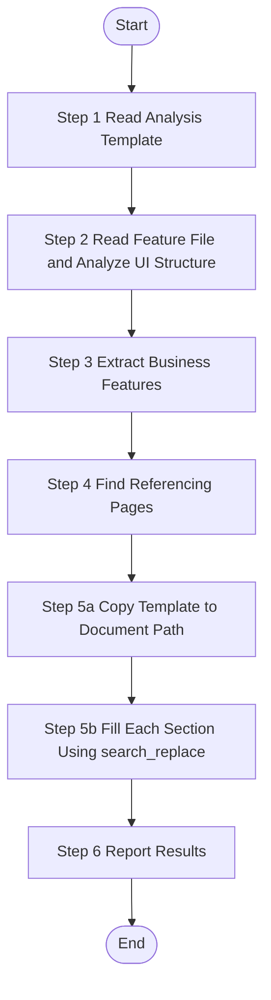

# UI Feature Analysis - Single Feature

> **CRITICAL CONSTRAINT**: DO NOT create temporary scripts, batch files, or workaround code files (`.py`, `.bat`, `.sh`, `.ps1`, etc.) under any circumstances. If execution encounters errors, STOP and report the exact error. Fixes must be applied to the Skill definition or source scripts — not patched at runtime.

Analyze one specific UI feature from source code, extract business functionality, and generate feature documentation. This skill operates at feature granularity - one worker per feature file.

## Trigger Scenarios

- "Analyze feature {fileName} from source code"
- "Extract UI functionality from feature {fileName}"
- "Generate documentation for feature {fileName}"
- "Analyze UI feature from features.json"

## Input Variables

| Variable | Type | Description | Example |
|----------|------|-------------|---------|
| `{{feature}}` | object | Complete feature object from features.json | - |
| `{{fileName}}` | string | Feature file name | `"index"`, `"UserForm"` |
| `{{sourcePath}}` | string | Relative path to source file | `"frontend-web/src/views/system/user/index.vue"` |
| `{{documentPath}}` | string | Target path for generated document | `"speccrew-workspace/knowledges/bizs/web-vue/src/views/system/user/index.md"` |
| `{{module}}` | string | Business module name (from feature.module) | `"system"`, `"trade"`, `"_root"` |
| `{{analyzed}}` | boolean | Analysis status flag | `true` / `false` |
| `{{platform_type}}` | string | Platform type | `"web"`, `"mobile"` |
| `{{platform_subtype}}` | string | Platform subtype | `"vue"`, `"react"` |
| `{{tech_stack}}` | array | Platform tech stack | `["vue", "typescript"]` |
| `{{language}}` | string | **REQUIRED** - Target language for generated content | `"zh"`, `"en"` |

## Language Adaptation

**CRITICAL**: Generate all content in the language specified by the `{{language}}` parameter.

- `{{language}} == "zh"` → Generate all content in 中文
- `{{language}} == "en"` → Generate all content in English
- Other languages → Use the specified language

**All output content (feature names, descriptions, business rules) must be in the target language only.**

## Output Variables

| Variable | Type | Description |
|----------|------|-------------|
| `{{status}}` | string | Analysis status: `"success"`, `"partial"`, or `"failed"` |
| `{{feature_name}}` | string | Name of the analyzed feature |
| `{{generated_file}}` | string | Path to the generated documentation file |
| `{{message}}` | string | Summary message for status update |

## Output

**Generated Files (MANDATORY - Task is NOT complete until all files are written):**
1. `{{documentPath}}` - Feature documentation file

**Return Value (JSON format):**
```json
{
  "status": "success|partial|failed",
  "feature": {
    "fileName": "index",
    "sourcePath": "frontend-web/src/views/system/user/index.vue"
  },
  "platformType": "web",
  "module": "system",
  "featureName": "user-management",
  "generatedFile": "speccrew-workspace/knowledges/bizs/web-vue/src/views/system/user/index.md",
  "message": "Successfully analyzed user-management feature from index.vue"
}
```

> **Note**: Graph data construction (nodes, edges, marker files) is handled by `speccrew-knowledge-bizs-ui-graph` Skill. This Skill only generates feature documentation.

## Workflow

> **⚠️ CRITICAL CONSTRAINTS (apply to ALL steps):**
> 1. **FORBIDDEN: `create_file` for documents** — Documents MUST be created by copying template (Step 5a) then filling with `search_replace` (Step 5b)
> 2. **FORBIDDEN: File deletion** — If a file is malformed, fix it with `search_replace`
> 3. **FORBIDDEN: Full-file rewrite** — Always use targeted `search_replace` on specific sections
> 4. **MANDATORY: Template-first workflow** — Step 5a MUST execute before Step 5b



---

### Step 1: Read Analysis Template (Required before workflow starts)

**Step 1 Status: 🔄 IN PROGRESS**

1. **Check Analysis Status:**
   ```
   IF {{analyzed}} == true THEN
       Output "Step 1 Status: ⏭️ SKIPPED (already analyzed)"
       Skip to Step 6 with status="skipped"
   ELSE
       Proceed to next step
   END IF
   ```

2. **Read the appropriate template based on platform type:**
   
   **Template Selection:**

   | Platform Type | Template File | Description |
   |--------------|---------------|-------------|
   | Web (Vue/React/Angular) | `templates/FEATURE-DETAIL-TEMPLATE-UI.md` | Default/Generic web template |
   | Mobile Native (iOS/Android) | `templates/FEATURE-DETAIL-TEMPLATE-UI-MOBILE.md` | Swift/Kotlin/React Native/Flutter |
   | Mini Program | `templates/FEATURE-DETAIL-TEMPLATE-UI-MINIAPP.md` | WeChat/Alipay/ByteDance |
   | Desktop (WinForms/WPF) | `templates/FEATURE-DETAIL-TEMPLATE-UI-DESKTOP.md` | C# .NET Desktop |
   | Desktop (Electron) | `templates/FEATURE-DETAIL-TEMPLATE-UI-ELECTRON.md` | HTML/JS Desktop |
   | Unknown/Other | `templates/FEATURE-DETAIL-TEMPLATE-UI.md` | Default to generic web template |
   
   Select template based on `{{platform_type}}` and `{{platform_subtype}}` parameters.
   
3. **Understand template structure:**
   - Read the template content
   - Understand the required information dimensions and sections
   - Note the analysis requirements for each section
   - Output: "Step 1 Status: ✅ COMPLETED - Read template for {{platform_type}}/{{platform_subtype}}"

   > ⚠️ CRITICAL: The template defines the EXACT output structure. You MUST:
   > - Generate ALL sections listed in the template, in the SAME order
   > - Fill ALL tables defined in the template (use "N/A" for unavailable data, never skip a table)
   > - Follow the EXACT heading hierarchy and numbering from the template
   > - Do NOT invent your own section structure or reorganize sections

### Step 2: Read Feature File and Analyze UI Structure

**Step 2 Status: 🔄 IN PROGRESS**

**Prerequisites:**
- Template has been read and understood
- Feature file is a page/component file (e.g., `frontend-web/src/views/system/user/index.vue`)

**Actions:**
1. **Locate and Read the feature file:**
   - Use `{{sourcePath}}` as the relative file path from project root
   - Read the feature file content

2. **Analyze page/screen/window structure, components, props, state management** guided by the template requirements

   > ⚠️ When analyzing, systematically gather information for EVERY section in the template:
   > - For each template section, identify what source code information is needed
   > - If source code doesn't provide enough info for a section, note it for "N/A" filling later
   > - Do NOT skip gathering info just because it seems minor

3. **Deep Analysis Requirements:**
   - Analyze complete component interfaces: props, events, slots
   - Trace API call chains and data flow paths
   - Analyze routing configuration and state management integration
   - Document component dependencies and injection patterns

**Analysis Scope:**

| Template Section | Information to Extract | Source |
|------------------|------------------------|--------|
| 1. Content Overview | Feature name, document path, source path, description | `{{fileName}}`, `{{documentPath}}`, `{{sourcePath}}` |
| 2. Interface Prototype | Main page and embedded modals ASCII wireframes, element descriptions | Component template, JSX/Vue template |
| 3. Business Flow | Page initialization, component events (onClick/onChange/etc), timer/websocket, page close flows | Event handlers, lifecycle hooks, timers |
| 4. Data Field Definition | Page state fields, form fields with validation | State definitions, form schemas, v-model bindings |
| 5. References | APIs, shared methods, shared components, other pages | API calls, imports, navigation |
| 6. Business Rules | Permission rules, business logic rules, validation rules | Code logic, comments |
| 7. Notes and Additional Info | Compatibility, pending confirmations, extension notes | Full source analysis |

**Enhanced Analysis Requirements:**

#### A. API Call Sequence Analysis (MUST include in Section 3 Business Flow)

For EVERY business flow that involves multiple API calls, analyze:
- Whether API calls are executed **serially** or **in parallel** (Promise.all vs sequential await)
- The timing logic inside `try/catch/finally` blocks
- Whether **race conditions** exist between multiple API calls
- If one API fails, whether subsequent APIs will still execute

Add a **Sequence Analysis** note block after each multi-API flow.

#### B. Boundary Scenario Flows (MUST include in Section 3 Business Flow)

Document key boundary scenarios:
- **Empty data / empty list**: What is displayed when API returns empty results?
- **Error / exception branches**: What happens on API failure, network timeout?
- **State reset / cleanup**: When and how is form/state reset?
- **Concurrent operation scenarios**: What happens on rapid consecutive clicks?

#### C. Data Binding Relationship (MUST include in Section 4 Data Field Definition)

**Data Binding Mapping Table** — trace full binding chain for each reactive field.
**Reactive Dependency Chain** — document all `watch` and `computed` dependencies.

#### D. Performance and Scalability Analysis (MUST include in Section 7 Notes)

- **Full-load performance risks**: Dropdowns/selectors that load ALL records without pagination
- **Large-data UI performance risks**: UI component behavior under large datasets
- **Scalability limitations**: Hardcoded assumptions that limit extensibility
- **Pending confirmations**: Design questions and improvement suggestions

**Output:** "Step 2 Status: ✅ COMPLETED - Read {{sourcePath}} ({{lineCount}} lines), Analyzed {{componentCount}} components, {{eventCount}} events"

### Step 3: Extract Business Features

**Step 3 Status: 🔄 IN PROGRESS**

Each user interaction or page initialization in the feature file = one business feature.

**CRITICAL - Analysis Scope Limitation:**

- **ONLY analyze the single feature file specified by `{{sourcePath}}`**
- **DO NOT analyze or generate documentation for other files in the same directory**
- **DO NOT generate separate documents for embedded components/modals**

**Extraction Guidelines:**

- Draw ASCII wireframes for **main page only** and **embedded modals/dialogs that are defined within the same file**
- For **external pages/components** (imported from other files): 
  - Only add reference links in Section 5.4 (Other Pages) or 5.3 (Shared Components)
  - DO NOT draw wireframes for them
  - DO NOT analyze their internal implementation
- Document ALL business flows: page init, component events, timers, websocket, page close
- **Read Configuration**: Read `speccrew-workspace/docs/rules/mermaid-rule.md` for Mermaid diagram guidelines
- **Generate Mermaid flowcharts** following the configuration:
  - Use `graph TB` or `graph LR` syntax (not `flowchart`)
  - No parentheses `()` in node text
  - No HTML tags like `<br/>`
  - No `style` definitions
  - No nested `subgraph`
- Use `{{language}}` for all extracted content naming

**Output:** "Step 3 Status: ✅ COMPLETED - Extracted {{wireframeCount}} wireframes, {{flowCount}} business flows"

### Step 4: Find Referencing Pages

**Step 4 Status: 🔄 IN PROGRESS**

Search other page files in the codebase to find which pages reference/navigate to this page.

**Search Methods:**
- Search for router navigation calls containing this page's route path
- Search for imports of this page component
- Search for links/buttons that navigate to this page

**For Each Referencing Page, Record:**
| Field | Description |
|-------|-------------|
| Page Name | Name of the page that references this page |
| Function Description | How/why it references this page |
| Source Path | Relative path to the referencing page source file |
| Document Path | Path to the referencing page's generated document |

**Output:** "Step 4 Status: ✅ COMPLETED - Found {{referenceCount}} referencing pages"

### Step 5a: Copy Template to Document Path

**Step 5a Status: 🔄 IN PROGRESS**

**Objective:** Copy the appropriate template file to the target document path, replacing top-level placeholders.

**Actions:**

1. **Select Template Based on Platform Type:**

   | Platform Type | Template File |
   |--------------|---------------|
   | `web` | `templates/FEATURE-DETAIL-TEMPLATE-UI.md` |
   | `mobile` | `templates/FEATURE-DETAIL-TEMPLATE-UI-MOBILE.md` |
   | `miniapp` | `templates/FEATURE-DETAIL-TEMPLATE-UI-MINIAPP.md` |
   | `desktop` | `templates/FEATURE-DETAIL-TEMPLATE-UI-DESKTOP.md` |
   | `electron` | `templates/FEATURE-DETAIL-TEMPLATE-UI-ELECTRON.md` |
   | Unknown/Other | `templates/FEATURE-DETAIL-TEMPLATE-UI.md` |

2. **Read the Selected Template File:**
   - Read the template file content from the skill's templates directory

3. **Replace Top-Level Placeholders:**
   
   | Placeholder | Replacement | Example |
   |-------------|-------------|---------|
   | `{Feature Name}` | Human-readable feature name | `"用户管理列表"` |
   | `{documentPath}` | `{{documentPath}}` input variable | `"speccrew-workspace/knowledges/bizs/web-vue/..."` |
   | `{sourcePath}` | `{{sourcePath}}` input variable | `"frontend-web/src/views/system/user/index.vue"` |
   | `{Date}` | Current date | `"2026-04-04"` |
   | `{FeatureFile}.vue` | `{{fileName}}` with appropriate extension | `"index.vue"` |

4. **Write the Document Using create_file:**
   Use `create_file` to write the placeholder-replaced template content to `{{documentPath}}`.

**Pre-write Checklist:**
- [ ] Template file selected based on `{{platform_type}}`
- [ ] Template content read successfully
- [ ] All top-level placeholders replaced
- [ ] Document path is valid

**Output:** "Step 5a Status: ✅ COMPLETED - Template copied to {{documentPath}}"

---

### Step 5b: Fill Each Section Using search_replace

**Step 5b Status: 🔄 IN PROGRESS**

**Objective:** Fill each section of the copied template document using `search_replace`, preserving section structure.

**CRITICAL Rules:**
- ⚠️ **NEVER use `create_file` to rewrite the entire document**
- ⚠️ **ALWAYS use `search_replace` to update specific sections**
- ⚠️ **Section titles and numbering MUST be preserved**
- ⚠️ **If a section has no corresponding information, replace placeholder content with "N/A"**

**Section Filling Order:**

#### 1. Section 1 - Content Overview
Replace the placeholder description with actual feature description.

#### 2. Section 2 - Interface Prototype
Replace the example ASCII wireframe with actual wireframe drawn in Step 3.

#### 3. Section 3 - Business Flow
Replace example Mermaid diagrams with actual flow diagrams from Step 3. Add **Sequence Analysis** and **Boundary Scenarios** tables.

#### 4. Section 4 - Data Field Definition
Replace example field rows with actual field definitions. Add **Data Binding Mapping** and **Reactive Dependency Chain**.

#### 5. Section 5 - References
Fill all reference tables (APIs, Shared Methods, Shared Components, Other Pages, Referenced By).

#### 6. Section 6 - Business Rule Constraints
Fill permission rules, business logic rules, and validation rules.

#### 7. Section 7 - Notes and Additional Information
Fill notes and add **Performance and Scalability Analysis** subsection.

**Section Filling Checklist:**
- [ ] Section 1: Content Overview — description filled
- [ ] Section 2: Interface Prototype — ASCII wireframes replaced
- [ ] Section 2: Interface Element Description table filled
- [ ] Section 3: All flows — diagrams and descriptions filled
- [ ] Section 3: API call sequence analysis added
- [ ] Section 3: Boundary scenarios documented
- [ ] Section 4: Page State Fields and Form Fields tables filled
- [ ] Section 4: Data binding mapping and reactive dependency chain added
- [ ] Section 5: All reference tables filled
- [ ] Section 6: All business rules tables filled
- [ ] Section 7: Notes and performance analysis filled

**Output:** "Step 5b Status: ✅ COMPLETED - All sections filled using search_replace"

---

**CRITICAL - Link Format Rules:**

❌ **NEVER use `file://` protocol in links** — This breaks Markdown preview
✅ **ALWAYS use relative paths** — Markdown links work correctly

**Dynamic Path Calculation:**
1. Count the number of directory separators in `{{documentPath}}` from project root
2. For each level, add one `../`
3. Construct the final link: `[Source]({pathPrefix}{sourcePath})`

### Step 6: Report Results

**Step 6 Status: 🔄 IN PROGRESS**

Return analysis result summary:

```json
{
  "status": "{{status}}",
  "feature": {
    "fileName": "{{fileName}}",
    "sourcePath": "{{sourcePath}}"
  },
  "platformType": "{{platform_type}}",
  "module": "{{module}}",
  "featureName": "{{feature_name}}",
  "generatedFile": "{{generated_file}}",
  "message": "{{message}}"
}
```

---

## Task Completion Report

When the task is complete, report the following:

**Status:** `success` | `partial` | `failed`

**Summary:**
- Feature analyzed: `{{feature_name}}`
- Document generated: `{{documentPath}}`
- Platform: `{{platform_type}}/{{platform_subtype}}`
- Module: `{{module}}`

**Files Generated:**
- `{{documentPath}}` - Feature documentation

**Note:** Graph data construction (nodes, edges, marker files) is handled by `speccrew-knowledge-bizs-ui-graph` Skill.

## Constraints

1. **DO NOT analyze files outside the specified `{{sourcePath}}`**
2. **DO NOT generate separate documents for embedded components**
3. **All content MUST be in the language specified by `{{language}}`**
4. **Use `search_replace` for section filling, NEVER rewrite entire document**
5. **Mermaid diagrams MUST follow the rules in `mermaid-rule.md`**
6. **All links MUST use relative paths, NEVER `file://` protocol**
