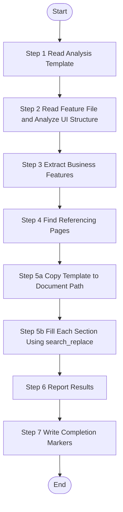

# UI Feature Analysis - Single Feature

> **CRITICAL CONSTRAINT**: DO NOT create temporary scripts, batch files, or workaround code files (`.py`, `.bat`, `.sh`, `.ps1`, etc.) under any circumstances. If execution encounters errors, STOP and report the exact error. Fixes must be applied to the Skill definition or source scripts — not patched at runtime.

Analyze one specific UI feature from source code, extract business functionality, and generate feature documentation. This skill operates at feature granularity - one worker per feature file.

## Trigger Scenarios

- "Analyze feature {fileName} from source code"
- "Extract UI functionality from feature {fileName}"
- "Generate documentation for feature {fileName}"
- "Analyze UI feature from features.json"

## Input Variables

| Variable | Type | Description | Example |
|----------|------|-------------|---------|
| `{{feature}}` | object | Complete feature object from features.json | - |
| `{{fileName}}` | string | Feature file name | `"index"`, `"UserForm"` |
| `{{sourcePath}}` | string | Relative path to source file | `"frontend-web/src/views/system/user/index.vue"` |
| `{{documentPath}}` | string | Target path for generated document | `"speccrew-workspace/knowledges/bizs/web-vue/src/views/system/user/index.md"` |
| `{{module}}` | string | Business module name (from feature.module) | `"system"`, `"trade"`, `"_root"` |
| `{{analyzed}}` | boolean | Analysis status flag | `true` / `false` |
| `{{platform_type}}` | string | Platform type | `"web"`, `"mobile"` |
| `{{platform_subtype}}` | string | Platform subtype | `"vue"`, `"react"` |
| `{{tech_stack}}` | array | Platform tech stack | `["vue", "typescript"]` |
| `{{language}}` | string | **REQUIRED** - Target language for generated content | `"zh"`, `"en"` |
| `{{completed_dir}}` | string | Marker files output directory | `"speccrew-workspace/knowledges/base/sync-state/knowledge-bizs/completed"` |
| `{{sourceFile}}` | string | Source features JSON file name | `"features-web-vue.json"` |

## Language Adaptation

**CRITICAL**: Generate all content in the language specified by the `{{language}}` parameter.

- `{{language}} == "zh"` → Generate all content in 中文
- `{{language}} == "en"` → Generate all content in English
- Other languages → Use the specified language

**All output content (feature names, descriptions, business rules) must be in the target language only.**

## Output Variables

| Variable | Type | Description |
|----------|------|-------------|
| `{{status}}` | string | Analysis status: `"success"`, `"partial"`, or `"failed"` |
| `{{feature_name}}` | string | Name of the analyzed feature |
| `{{generated_file}}` | string | Path to the generated documentation file |
| `{{message}}` | string | Summary message for status update |

## Output

## 🚫 ABSOLUTE PROHIBITIONS (ZERO TOLERANCE)

> **These rules apply to ALL steps. Violation = task failure.**

1. **FORBIDDEN: `create_file` for documents** — NEVER use `create_file` to write the analysis document (`{{documentPath}}`). Documents MUST be created by copying the template (Step 5a) then filling sections with `search_replace` (Step 5b). `create_file` produces truncated output on large files.

2. **FORBIDDEN: File deletion** — NEVER use `Remove-Item`, `del`, `rm`, `fs.unlinkSync`, or any delete command on generated files. If a file is malformed, fix it with `search_replace`.

3. **FORBIDDEN: Full-file rewrite** — NEVER replace the entire document content in a single operation. Always use targeted `search_replace` on specific sections.

4. **MANDATORY: Template-first workflow** — Step 5a (copy template) MUST execute before Step 5b (fill sections). Skipping Step 5a and writing content directly is FORBIDDEN.

## Output (Files)

**Generated Files (MANDATORY - Task is NOT complete until all files are written):**
1. `{{documentPath}}` - Feature documentation file
2. `{{completed_dir}}/{{fileName}}.done.json` - Completion status marker
3. `{{completed_dir}}/{{fileName}}.graph.json` - Graph data marker

**Return Value (JSON format):**
```json
{
  "status": "success|partial|failed",
  "feature": {
    "fileName": "index",
    "sourcePath": "frontend-web/src/views/system/user/index.vue"
  },
  "platformType": "web",
  "module": "system",
  "featureName": "user-management",
  "generatedFile": "speccrew-workspace/knowledges/bizs/web-vue/src/views/system/user/index.md",
  "message": "Successfully analyzed user-management feature from index.vue"
}
```

The return value is used by dispatch to update the feature status in `features-{platform}.json`.

## Workflow



---

### Step 1: Read Analysis Template

**Step 1 Status: 🔄 IN PROGRESS**

1. **Check Analysis Status:**
   - If `{{analyzed}}` is `true`, output "Step 1 Status: ⏭️ SKIPPED (already analyzed)" and skip to Step 6 with status="skipped"
   - If `{{analyzed}}` is `false`, proceed

2. **Read the appropriate template based on platform type:**
   
   **Template Selection:**
   
   | Platform Type | Template File | Description |
   |--------------|---------------|-------------|
   | Web (Vue/React/Angular) | `templates/FEATURE-DETAIL-TEMPLATE-UI.md` | Default/Generic web template |
   | Mobile Native (iOS/Android) | `templates/FEATURE-DETAIL-TEMPLATE-UI-MOBILE.md` | Swift/Kotlin/React Native/Flutter |
   | Mini Program | `templates/FEATURE-DETAIL-TEMPLATE-UI-MINIAPP.md` | WeChat/Alipay/ByteDance |
   | Desktop (WinForms/WPF) | `templates/FEATURE-DETAIL-TEMPLATE-UI-DESKTOP.md` | C# .NET Desktop |
   | Desktop (Electron) | `templates/FEATURE-DETAIL-TEMPLATE-UI-ELECTRON.md` | HTML/JS Desktop |
   | Unknown/Other | `templates/FEATURE-DETAIL-TEMPLATE-UI.md` | Default to generic web template |
   
   Select template based on `{{platform_type}}` and `{{platform_subtype}}` parameters.
   
3. **Understand template structure:**
   - Read the template content
   - Understand the required information dimensions and sections
   - Note the analysis requirements for each section
   - Output: "Step 1 Status: ✅ COMPLETED - Read template for {{platform_type}}/{{platform_subtype}}"

   > ⚠️ CRITICAL: The template defines the EXACT output structure. You MUST:
   > - Generate ALL sections listed in the template, in the SAME order
   > - Fill ALL tables defined in the template (use "N/A" for unavailable data, never skip a table)
   > - Follow the EXACT heading hierarchy and numbering from the template
   > - Do NOT invent your own section structure or reorganize sections

### Step 2: Read Feature File and Analyze UI Structure

**Step 2 Status: 🔄 IN PROGRESS**

**Prerequisites:**
- Template has been read and understood
- Feature file is a page/component file (e.g., `frontend-web/src/views/system/user/index.vue`)

**Actions:**
1. **Locate and Read the feature file:**
   - Use `{{sourcePath}}` as the relative file path from project root
   - Read the feature file content

2. **Analyze page/screen/window structure, components, props, state management** guided by the template requirements

   > ⚠️ When analyzing, systematically gather information for EVERY section in the template:
   > - For each template section, identify what source code information is needed
   > - If source code doesn't provide enough info for a section, note it for "N/A" filling later
   > - Do NOT skip gathering info just because it seems minor

3. **Deep Analysis Requirements:**
   - Analyze complete component interfaces: props, events, slots
   - Trace API call chains and data flow paths
   - Analyze routing configuration and state management integration
   - Document component dependencies and injection patterns

**Analysis Scope:**

| Template Section | Information to Extract | Source |
|------------------|------------------------|--------|
| 1. Content Overview | Feature name, document path, source path, description | `{{fileName}}`, `{{documentPath}}`, `{{sourcePath}}` |
| 2. Interface Prototype | Main page and embedded modals ASCII wireframes, element descriptions | Component template, JSX/Vue template |
| 3. Business Flow | Page initialization, component events (onClick/onChange/etc), timer/websocket, page close flows; **MUST also include API call sequence analysis and boundary scenarios (see below)** | Event handlers, lifecycle hooks, timers |
| 4. Data Field Definition | Page state fields, form fields with validation; **MUST also include data binding mapping and reactive dependency chain (see below)** | State definitions, form schemas, v-model bindings, watch/computed |
| 5. References | APIs, shared methods, shared components, other pages this page references, pages that reference this page | API calls, imports, navigation, search other pages for references to this page |
| 6. Business Rules | Permission rules, business logic rules, validation rules | Code logic, comments |
| 7. Notes and Additional Info | Compatibility, pending confirmations, extension notes; **MUST also include performance and scalability analysis (see below)** | Full source analysis |

**Enhanced Analysis Requirements:**

#### A. API Call Sequence Analysis (MUST include in Section 3 Business Flow)

For EVERY business flow that involves multiple API calls, Worker MUST analyze:
- Whether API calls are executed **serially** or **in parallel** (Promise.all vs sequential await)
- The timing logic inside `try/catch/finally` blocks (e.g., when loading state is set and restored)
- Whether **race conditions** exist between multiple API calls
- If one API fails, whether subsequent APIs will still execute

Add a **时序分析 / Sequence Analysis** note block after each multi-API flow:
```markdown
**时序分析**：
- getUserRoleList 和 getSimpleRoleList 为串行调用
- formLoading 在 finally 中恢复，但 getSimpleRoleList 在 finally 之外执行
- ⚠️ 竞态风险：getUserRoleList 失败时，getSimpleRoleList 仍会执行
```
If a flow only has a single API call, SHOULD still note "单一 API 调用，无竞态风险" for clarity.

#### B. Boundary Scenario Flows (MUST include in Section 3 Business Flow)

Beyond the main happy-path flow, Worker MUST identify and document key boundary scenarios:
- **Empty data / empty list**: What is displayed when API returns empty results?
- **Error / exception branches**: What happens on API failure, network timeout, or server error?
- **State reset / cleanup**: When and how is form/state reset (e.g., dialog close, cancel button)?
- **Concurrent operation scenarios**: What happens on rapid consecutive clicks (double submit risk)?

Document these as additional sub-sections or a dedicated **边界场景 / Boundary Scenarios** table within the relevant flow:
```markdown
**边界场景**：
| 场景 | 触发条件 | 处理方式 |
|------|----------|----------|
| 空列表 | API 返回 data=[] | 展示空状态提示 |
| API 失败 | 网络超时/服务端报错 | ElMessage 提示错误信息 |
| 状态重置 | 关闭弹窗 | resetForm() 清空所有字段 |
| 重复提交 | 按钮未 disable | ⚠️ 存在重复提交风险 |
```
If no boundary scenarios are identifiable from code, SHOULD explicitly state "无明显边界场景处理".

#### C. Data Binding Relationship (MUST include in Section 4 Data Field Definition)

Beyond the static field definition tables, Worker MUST supplement:

**Data Binding Mapping Table** — for each reactive field, trace its full binding chain:

```markdown
**数据绑定映射**：
| 字段 | UI 绑定 | 数据流向 | 同步时机 |
|------|---------|----------|----------|
| formData.roleIds | `<el-transfer v-model>` | 组件内部 ↔ formData | 用户操作穿梭框时实时同步 |
| roleList | `<el-transfer :data>` | API → roleList | 弹窗打开时一次性加载 |
```

**Reactive Dependency Chain** — document all `watch` and `computed` dependencies:
```markdown
**响应式依赖链**：
- watch(props.userId) → 触发 getUserRoleList() → 更新 formData.roleIds
- computed: 无
```
If the component has no `watch` or `computed`, MUST explicitly state "无响应式依赖（无 watch / computed）".

#### D. Performance and Scalability Analysis (MUST include in Section 7 Notes)

Worker MUST proactively analyze and document in Section 7:
- **Full-load performance risks**: Identify any dropdown/selector that loads ALL records without pagination (e.g., `getSimpleRoleList` fetching all roles)
- **Large-data UI performance risks**: Assess UI component behavior under large datasets (e.g., el-transfer with thousands of items)
- **Scalability limitations**: Document any hardcoded assumptions that limit extensibility
- **Pending confirmations (design questions)**: SHOULD raise questions about design reasonability and suggest improvements

Example format:
```markdown
### 7.x 性能与可扩展性考量

- ⚠️ **全量加载风险**：getSimpleRoleList 全量加载角色列表，角色数量大时存在性能隐患
- ⚠️ **UI 渲染风险**：el-transfer 组件在角色数量超过 500 条时渲染性能明显下降
- **可扩展性限制**：当前设计不支持角色分页搜索

**待确认事项**：
- [ ] 是否需要对角色列表增加搜索过滤功能？
- [ ] 是否应将全量加载改为分页 + 搜索模式以支持大规模角色场景？
```
If no obvious performance risks exist, SHOULD explicitly note "当前数据规模下无明显性能风险".

**Output:** "Step 2 Status: ✅ COMPLETED - Read {{sourcePath}} ({{lineCount}} lines), Analyzed {{componentCount}} components, {{eventCount}} events"

### Step 3: Extract Business Features

**Step 3 Status: 🔄 IN PROGRESS**

Each user interaction or page initialization in the feature file = one business feature.

**CRITICAL - Analysis Scope Limitation:**

- **ONLY analyze the single feature file specified by `{{sourcePath}}`**
- **DO NOT analyze or generate documentation for other files in the same directory**
- **DO NOT generate separate documents for embedded components/modals**

**Extraction Guidelines:**

- Draw ASCII wireframes for **main page only** and **embedded modals/dialogs that are defined within the same file**
- For **external pages/components** (imported from other files): 
  - Only add reference links in Section 5.4 (Other Pages) or 5.3 (Shared Components)
  - DO NOT draw wireframes for them
  - DO NOT analyze their internal implementation
- Document ALL business flows: page init, component events (onClick/onChange/onBlur/etc), timers, websocket, page close
- **MUST analyze API call sequences**: identify serial vs parallel calls, try/catch/finally timing, race conditions
- **MUST document boundary scenarios**: empty data, error branches, state reset, concurrent operations
- For APIs and shared methods in flowcharts: show name, type, and main function only (no deep analysis)
- **Generate Mermaid flowcharts following `speccrew-workspace/docs/rules/mermaid-rule.md` guidelines:**
  - Use `graph TB` or `graph LR` syntax (not `flowchart`)
  - No parentheses `()` in node text (e.g., use `open method` instead of `open()`)
  - No HTML tags like `<br/>`
  - No `style` definitions
  - No nested `subgraph`
  - No special characters in node text
- Use `{{language}}` for all extracted content naming

4. **Build Graph Data** (per feature file):
   
   While analyzing the feature, simultaneously extract graph nodes and edges:
   
   **Nodes to Extract:**
   
   | Node Type | Source | ID Format | Context Fields |
   |-----------|--------|-----------|----------------|
   | `page` | The analyzed page/screen | `page-{module}-{name}` | `route`, `components`, `events`, `platform` |
   | `component` | Embedded or local components used | `component-{module}-{name}` | `props`, `events`, `slots` |
   
   **Edges to Extract:**
   
   | Edge Type | Direction | When to Create |
   |-----------|-----------|----------------|
   | `calls` | page → api | Page calls an API endpoint (from API service imports / HTTP requests) |
   | `navigates-to` | page → page | Page navigates to another page (router.push, link, etc.) |
   | `uses` | page → component | Page uses a shared/local component |
   
   **CRITICAL - API Extraction Requirements (100% Coverage Mandatory):**
   
   To ensure complete API coverage in the graph data, you MUST follow these requirements:
   
   1. **Extract ALL Imported API Functions:**
      - Scan the entire source file for ALL `import { ... } from '@/api/...'` or similar API import statements
      - EVERY function imported from API modules MUST be extracted as a `calls` edge
      - Do NOT filter or select only "main" or "core" APIs - include ALL of them
   
   2. **API Call Categories to Cover:**
      | Category | Examples | Where to Look |
      |----------|----------|---------------|
      | Page Initialization | `getList`, `getDetail`, `getPage` | `onMounted`, `created`, `useEffect` |
      | Data Query | `getUserList`, `searchOrders` | Search forms, filter changes |
      | Create Operations | `createUser`, `addOrder` | Form submission handlers |
      | Update Operations | `updateUser`, `editOrder` | Edit form submissions |
      | **Status Update** | `updateUserStatus`, `toggleEnable`, `setActive` | Status switch handlers, toggle buttons |
      | **Special Operations** | `resetPassword`, `exportData`, `importData`, `batchDelete` | Action buttons, toolbar buttons |
      | Delete Operations | `deleteUser`, `removeOrder` | Delete confirmation handlers |
      | Dictionary/Options | `getDictList`, `getOptions` | Dropdown initialization |
   
   3. **How to Identify API Calls:**
      - Look for: `import { func1, func2 } from '@/api/xxx'` statements
      - Look for: Direct API function calls in event handlers (`@click="handleSubmit"` → `handleSubmit()` calls API)
      - Look for: API calls in lifecycle hooks (Vue: `onMounted`, React: `useEffect`)
      - Look for: API calls in watch/computed setters
   
   4. **API Coverage Verification Checklist:**
      - [ ] List ALL imported API functions from the source file
      - [ ] For each imported API, verify there is a corresponding `calls` edge
      - [ ] Check event handlers (button clicks, form submits) for API calls
      - [ ] Check lifecycle hooks for initialization API calls
      - [ ] Check status toggles, action buttons for special operation APIs
      - [ ] Verify no imported API is left unmapped
   
   5. **Edge Metadata Requirements:**
      - `trigger`: Event name (e.g., "onClick", "onMounted", "onSubmit")
      - `method`: The API function name being called
      - `context`: Brief description of when/why this API is called
   
   **Node ID Naming Convention:**
   ```
   {type}-{module}-{name}
   Examples:
     page-system-user-list
     page-system-user-detail
     component-system-user-form
     component-shared-delete-confirm
   ```
   
   **IMPORTANT:**
   - `module` comes from `{{module}}` input variable
   - `name` should be a short, readable slug derived from the page/component name
   - Each node must include `sourcePath` and `documentPath` (if applicable)
   - For `calls` edges: the `target` is the API node ID (format `api-{module}-{name}`), which will be matched with api-analyze output
   - Edge `metadata` should include trigger info (event name, lifecycle hook, etc.)

**Output:** "Step 3 Status: ✅ COMPLETED - Extracted {{wireframeCount}} wireframes, {{flowCount}} business flows, {{nodeCount}} graph nodes, {{edgeCount}} graph edges"

### Step 4: Find Referencing Pages

**Step 4 Status: 🔄 IN PROGRESS**

Search other page files in the codebase to find which pages reference/navigate to this page.

**Search Methods:**
- Search for router navigation calls containing this page's route path
- Search for imports of this page component
- Search for links/buttons that navigate to this page

**For Each Referencing Page, Record:**
| Field | Description |
|-------|-------------|
| Page Name | Name of the page that references this page |
| Function Description | How/why it references this page (e.g., "Click order ID to navigate to detail page") |
| Source Path | Relative path to the referencing page source file |
| Document Path | Path to the referencing page's generated document |

**Output:** "Step 4 Status: ✅ COMPLETED - Found {{referenceCount}} referencing pages"

### Step 5a: Copy Template to Document Path

**Step 5a Status: 🔄 IN PROGRESS**

**Objective:** Copy the appropriate template file to the target document path, replacing top-level placeholders.

**Actions:**

1. **Select Template Based on Platform Type:**

   | Platform Type | Template File |
   |--------------|---------------|
   | `web` | `templates/FEATURE-DETAIL-TEMPLATE-UI.md` |
   | `mobile` | `templates/FEATURE-DETAIL-TEMPLATE-UI-MOBILE.md` |
   | `miniapp` | `templates/FEATURE-DETAIL-TEMPLATE-UI-MINIAPP.md` |
   | `desktop` | `templates/FEATURE-DETAIL-TEMPLATE-UI-DESKTOP.md` |
   | `electron` | `templates/FEATURE-DETAIL-TEMPLATE-UI-ELECTRON.md` |
   | Unknown/Other | `templates/FEATURE-DETAIL-TEMPLATE-UI.md` |

2. **Read the Selected Template File:**
   - Read the template file content from the skill's templates directory
   - Example path: `d:/dev/speccrew/.speccrew/skills/speccrew-knowledge-bizs-ui-analyze/templates/FEATURE-DETAIL-TEMPLATE-UI.md`

3. **Replace Top-Level Placeholders:**
   
   Replace the following placeholders in the template content:
   
   | Placeholder | Replacement | Example |
   |-------------|-------------|---------|
   | `{Feature Name}` | Human-readable feature name extracted from analysis | `"用户管理列表"` |
   | `{documentPath}` | `{{documentPath}}` input variable | `"speccrew-workspace/knowledges/bizs/web-vue/src/views/system/user/index.md"` |
   | `{sourcePath}` | `{{sourcePath}}` input variable | `"frontend-web/src/views/system/user/index.vue"` |
   | `{Date}` | Current date | `"2026-04-04"` |
   | `{FeatureFile}.vue` | `{{fileName}}` with appropriate extension | `"index.vue"` |

4. **Write the Document Using create_file:**
   
   Use `create_file` to write the placeholder-replaced template content to `{{documentPath}}`.
   
   **Example:**
   ```
   create_file(
     file_path: "{{documentPath}}",
     file_content: "<template content with top-level placeholders replaced>"
   )
   ```

**Pre-write Checklist:**
- [ ] Template file selected based on `{{platform_type}}`
- [ ] Template content read successfully
- [ ] All top-level placeholders replaced
- [ ] Document path is valid

**Output:** "Step 5a Status: ✅ COMPLETED - Template copied to {{documentPath}}"

---

### Step 5b: Fill Each Section Using search_replace

**Step 5b Status: 🔄 IN PROGRESS**

**Objective:** Fill each section of the copied template document using `search_replace`, preserving section structure.

**CRITICAL Rules:**
- ⚠️ **NEVER use `create_file` to rewrite the entire document** — this defeats the purpose of template-based generation
- ⚠️ **ALWAYS use `search_replace` to update specific sections**
- ⚠️ **Section titles and numbering MUST be preserved**
- ⚠️ **If a section has no corresponding information, replace placeholder content with "N/A"**

**Section Filling Order:**

#### 1. Section 1 - Content Overview

**Anchor:** The `description:` line under Section 1 header

**Operation:** Replace the placeholder description with actual feature description:

```markdown
# Before (template)
description: Feature overview.

# After (filled)
description: 用户管理列表页面，提供用户查询、新增、编辑、删除、状态切换等功能。
```

**search_replace Example:**
```
original_text: "description: Feature overview."
new_text: "description: 用户管理列表页面，提供用户查询、新增、编辑、删除、状态切换等功能。"
```

---

#### 2. Section 2 - Interface Prototype

**Anchor:** The ASCII wireframe block under each `### 2.x` subsection

**Operation:** Replace the example ASCII wireframe with actual wireframe drawn in Step 3

**search_replace Example:**
```
original_text: |
  ```
  ┌─────────────────────────────────────────────────────────────┐
  │ [Page Title] {e.g., Product Management List}                │
  ├─────────────────────────────────────────────────────────────┤
  ... (entire example wireframe block)
  └─────────────────────────────────────────────────────────────┘
  ```

new_text: |
  ```
  ┌─────────────────────────────────────────────────────────────┐
  │ 用户管理                                                    │
  ├─────────────────────────────────────────────────────────────┤
  │ 昵称: [________] 用户名: [________] 状态: [全部 ▼]          │
  │ [查询] [重置] [新增]                                        │
  ...
  ```
```

**For Interface Element Description table:**
- Replace each example row with actual element descriptions
- Use `search_replace` to replace the entire table content

---

#### 3. Section 3 - Business Flow

**Anchors:** Each `### 3.x` and `#### 3.x.x` subsection with its Mermaid diagram

**Operation:** Replace example Mermaid diagrams with actual flow diagrams from Step 3

**Required Flow Types (from template):**
- `3.1` Page Initialization Flow
- `3.2.x` Component Event Flows (onClick, onChange, etc.)
- `3.3.x` Timer/WebSocket Flows (if applicable)
- `3.4` Page Close/Cleanup Flow (if applicable)

**search_replace Example:**
```
original_text: |
  ```mermaid
  graph TB
      Start([Page Load]) --> Init[Initialize Page State]
      Init --> CheckParams[Parse URL Parameters]
      ... (example flow)
  ```

new_text: |
  ```mermaid
  graph TB
      Start([页面加载]) --> Init[初始化页面状态]
      Init --> GetUserList[获取用户列表]
      GetUserList --> API1[API getUserList - 查询API - 获取用户列表]
      ...
  ```
```

**Flow Description Table:** Replace the example table with actual step descriptions

**Referenced Items Table:** Replace with actual API/method references

**MANDATORY Additions for Section 3:**

After each multi-API flow, add **时序分析 / Sequence Analysis**:

```markdown
**时序分析**：
- getUserRoleList 和 getSimpleRoleList 为串行调用
- formLoading 在 finally 中恢复
- ⚠️ 竞态风险：getUserRoleList 失败时，getSimpleRoleList 仍会执行
```

After flow descriptions, add **边界场景 / Boundary Scenarios** table:

```markdown
**边界场景**：
| 场景 | 触发条件 | 处理方式 |
|------|----------|----------|
| 空列表 | API 返回 data=[] | 展示空状态提示 |
| API 失败 | 网络超时/服务端报错 | ElMessage 提示错误信息 |
| 状态重置 | 关闭弹窗 | resetForm() 清空所有字段 |
```

---

#### 4. Section 4 - Data Field Definition

**Anchors:** 
- `### 4.1 Page State Fields` table
- `### 4.2 Form Fields` table

**Operation:** Replace example field rows with actual field definitions from Step 2 analysis

**search_replace Example:**
```
original_text: |
  | Field Name | Field Type | Description | Source |
  |------------|------------|-------------|--------|
  | {Field 1} | String/Number/Boolean/Array/Object | {Description} | [Source](../../{sourcePath}) |
  | {Field 2} | String | {Description} | [Source](../../{sourcePath}) |

new_text: |
  | Field Name | Field Type | Description | Source |
  |------------|------------|-------------|--------|
  | userList | Array | 用户列表数据 | [Source](../../frontend-web/src/views/system/user/index.vue) |
  | loading | Boolean | 列表加载状态 | [Source](../../frontend-web/src/views/system/user/index.vue) |
  | queryParams | Object | 查询参数对象 | [Source](../../frontend-web/src/views/system/user/index.vue) |
```

**MANDATORY Additions for Section 4:**

After the field tables, add **数据绑定映射 / Data Binding Mapping** table:

```markdown
**数据绑定映射**：
| 字段 | UI 绑定 | 数据流向 | 同步时机 |
|------|---------|----------|----------|
| formData.roleIds | `<el-transfer v-model>` | 组件内部 ↔ formData | 用户操作穿梭框时实时同步 |
| roleList | `<el-transfer :data>` | API → roleList | 弹窗打开时一次性加载 |
```

Add **响应式依赖链 / Reactive Dependency Chain**:

```markdown
**响应式依赖链**：
- watch(props.userId) → 触发 getUserRoleList() → 更新 formData.roleIds
- computed: 无
```

---

#### 5. Section 5 - References

**Anchors:** Tables under `### 5.1` through `### 5.5`

**Operation:** Replace each reference table with actual references found in analysis

**Subsections to Fill:**
- `5.1 APIs` — All API functions imported and called
- `5.2 Frontend Shared Methods` — Utility functions used
- `5.3 Shared Components` — External components used
- `5.4 Other Pages (This Page References)` — Pages navigated to
- `5.5 Referenced By (Other Pages Reference This Page)` — From Step 4 results

**search_replace Example:**
```
original_text: |
  | API Name | Type | Main Function | Source | Document Path |
  |----------|------|---------------|--------|---------------|
  | {API Name} | Query/Mutation | {Brief description} | [Source](../../{apiSourcePath}) | [API Doc](../../apis/{api-name}.md) |

new_text: |
  | API Name | Type | Main Function | Source | Document Path |
  |----------|------|---------------|--------|---------------|
  | getUserList | Query | 获取用户列表 | [Source](../../frontend-web/src/api/system/user.ts) | [API Doc](../../apis/system/user/getUserList.md) |
  | updateUserStatus | Mutation | 更新用户状态 | [Source](../../frontend-web/src/api/system/user.ts) | [API Doc](../../apis/system/user/updateUserStatus.md) |
```

---

#### 6. Section 6 - Business Rule Constraints

**Anchors:** Tables and lists under `### 6.1`, `### 6.2`, `### 6.3`

**Operation:** Replace with actual business rules extracted from code

**Subsections to Fill:**
- `6.1 Permission Rules` — Role/permission requirements
- `6.2 Business Logic Rules` — Domain rules and constraints
- `6.3 Validation Rules` — Form validation rules

---

#### 7. Section 7 - Notes and Additional Information

**Anchors:** Content under `### 7.1`, `### 7.2`, `### 7.3`

**Operation:** Replace with actual notes from analysis

**MANDATORY Addition for Section 7:**

Add **性能与可扩展性考量** subsection:

```markdown
### 7.x 性能与可扩展性考量

- ⚠️ **全量加载风险**：getSimpleRoleList 全量加载角色列表，角色数量大时存在性能隐患
- ⚠️ **UI 渲染风险**：el-transfer 组件在角色数量超过 500 条时渲染性能明显下降
- **可扩展性限制**：当前设计不支持角色分页搜索

**待确认事项**：
- [ ] 是否需要对角色列表增加搜索过滤功能？
- [ ] 是否应将全量加载改为分页 + 搜索模式？
```

---

**Section Filling Checklist:**
- [ ] Section 1: Content Overview — description filled
- [ ] Section 2: Interface Prototype — ASCII wireframes replaced
- [ ] Section 2: Interface Element Description table filled
- [ ] Section 3.1: Page Initialization Flow — Mermaid diagram replaced
- [ ] Section 3.2.x: All Component Event Flows — diagrams and descriptions filled
- [ ] Section 3: **API call sequence analysis** added for multi-API flows
- [ ] Section 3: **Boundary scenarios** documented
- [ ] Section 4.1: Page State Fields table filled
- [ ] Section 4.2: Form Fields table filled
- [ ] Section 4: **Data binding mapping** table added
- [ ] Section 4: **Reactive dependency chain** documented
- [ ] Section 5.1-5.4: All reference tables filled
- [ ] Section 5.5: Referenced By table filled (from Step 4)
- [ ] Section 6.1-6.3: All business rules tables filled
- [ ] Section 7.1-7.3: Notes filled
- [ ] Section 7: **Performance and scalability analysis** added

**Output:** "Step 5b Status: ✅ COMPLETED - All sections filled using search_replace"

---

**CRITICAL - Link Format Rules:**

❌ **NEVER use `file://` protocol in links** — This breaks Markdown preview
✅ **ALWAYS use relative paths** — Markdown links work correctly

**Source Traceability Format:**
Use relative path from current document to source file:
- Format: `[Source](../../{sourcePath})`
- Example: `[Source](../../yudao-ui/yudao-ui-admin-vue3/src/views/system/user/index.vue)`
- The `../../` goes from `speccrew-workspace/knowledges/bizs/web-vue3/src/views/system/user/` to project root

**Document Link Format:**
Use relative path from current document:
- Format: `[Doc](../../{documentPath})`
- Example: `[Doc](../../speccrew-workspace/knowledges/bizs/web-vue3/src/views/system/user/index.md)`

### Step 6: Report Results

**Step 6 Status: 🔄 IN PROGRESS**

Return analysis result summary to dispatch:

```json
{
  "status": "{{status}}",
  "feature": {
    "fileName": "{{fileName}}",
    "sourcePath": "{{sourcePath}}"
  },
  "platformType": "{{platform_type}}",
  "module": "{{module}}",
  "featureName": "{{feature_name}}",
  "generatedFile": "{{generated_file}}",
  "message": "{{message}}"
}
```

Or in case of failure:

```json
{
  "status": "{{status}}",
  "feature": {
    "fileName": "{{fileName}}",
    "sourcePath": "{{sourcePath}}"
  },
  "message": "{{message}}"
}
```

---

### Step 7: Write Completion Markers

**Step 7 Status: 🔄 IN PROGRESS**

**⚠️ MANDATORY - This step MUST be executed. The task is NOT complete until marker files are written.**

After analysis is complete, write the results to marker files for dispatch to process.

**Prerequisites:**
- Step 6 completed successfully
- `{{completed_dir}}` - Marker files output directory (e.g., `speccrew-workspace/knowledges/base/sync-state/knowledge-bizs/completed`)
- `{{sourceFile}}` - Source features JSON file name

> **ASSUMPTION**: The `completed_dir` directory already exists (pre-created by dispatch Stage 2). If write fails, report error — do NOT attempt to create directories.

### Pre-write Checklist (VERIFY before writing each file):
- [ ] Filename follows `{fileName}` pattern (file name only)
- [ ] File content is valid JSON (not empty)
- [ ] All required fields are present and non-empty
- [ ] File is written with UTF-8 encoding

**Actions:**

**Pre-write Verification (MUST check before writing):**
- [ ] `.done.json` JSON: `fileName` does NOT contain file extension
- [ ] `.done.json` JSON: `sourceFile` matches `features-{platform}.json` pattern  
- [ ] `.done.json` JSON: `module` field is present and non-empty
- [ ] `.graph.json` JSON: root-level `module` field is present (MANDATORY)
- [ ] `.graph.json` JSON: `nodes` and `edges` are arrays (can be empty)
- [ ] Both files: valid JSON (no trailing commas, all strings quoted)

---

### **CRITICAL - Marker File Naming Convention (STRICT RULES)**

**✅ CORRECT Format - MUST USE:**
```
{completed_dir}/{fileName}.done.json     ← Completion status marker (JSON format)
{completed_dir}/{fileName}.graph.json    ← Graph data marker (JSON format)
```

**Examples:**
- `d:/dev/speccrew/speccrew-workspace/knowledges/base/sync-state/knowledge-bizs/completed/index.done.json`
- `d:/dev/speccrew/speccrew-workspace/knowledges/base/sync-state/knowledge-bizs/completed/index.graph.json`

**❌ WRONG Format - NEVER USE:**
```
{fileName}.completed.json    ← WRONG extension
{fileName}.done              ← WRONG extension (missing .json)
{fileName}.done.txt          ← WRONG extension
{fileName}_done.json         ← WRONG separator and extension
{fileName}-completed.json    ← WRONG separator and extension
```

**❌ WRONG Filename Examples - NEVER USE:**
- `index.completed.json` - WRONG: uses `.completed.json` instead of `.done.json`
- `index.done` - WRONG: uses `.done` instead of `.done.json`
- `index.done.txt` - WRONG: uses `.done.txt` instead of `.done.json`
- `index_done.json` - WRONG: uses underscore and wrong extension
- `dict-index.done.json` - WRONG: has module prefix
- `system-index.done.json` - WRONG: has module prefix

---

### **CRITICAL - Path Format Rules (STRICT RULES)**

**Path Variables:**
- `{{completed_dir}}` - Absolute path to marker files directory (passed from dispatch)
- `{{sourcePath}}` - Relative path to source file (from features JSON)
- `{{documentPath}}` - Relative path to generated document (from features JSON)

**Path Format Requirements:**

| Field | Format | Example |
|-------|--------|---------|
| `sourcePath` in `.done` | Relative path (as-is from input) | `frontend-web/src/views/system/user/index.vue` |
| `documentPath` in `.done` | Relative path (as-is from input) | `speccrew-workspace/knowledges/bizs/web-vue/src/views/system/user/index.md` |
| `sourcePath` in `.graph.json` nodes | Relative path (as-is from input) | `frontend-web/src/views/system/user/index.vue` |
| `documentPath` in `.graph.json` nodes | Relative path (as-is from input) | `speccrew-workspace/knowledges/bizs/web-vue/src/views/system/user/index.md` |

**⚠️ CRITICAL: NEVER convert relative paths to absolute paths in the JSON content!**

**Correct vs Wrong Example:**
```json
// ✅ CORRECT - .done file content:
{
  "fileName": "index",
  "sourcePath": "frontend-web/src/views/system/user/index.vue",
  "sourceFile": "features-web-vue.json",
  "module": "system",
  "status": "success",
  "analysisNotes": "Successfully analyzed user management page"
}

// ❌ WRONG - .done file content (DO NOT DO THIS):
{
  "fileName": "index",
  "sourcePath": "d:/dev/project/frontend-web/src/views/system/user/index.vue",  ← WRONG: absolute path
  "sourceFile": "features-web-vue.json",
  "module": "system",
  "status": "success"
}
```

---

1. **Write .done.json file (MANDATORY):**

   > **🚨 CRITICAL - JSON FORMAT MANDATORY**: The `.done.json` file **MUST** be valid JSON. Writing plain text, status messages, or progress updates into this file is **STRICTLY FORBIDDEN**.
   >
   > **❌ FORBIDDEN - NEVER DO THIS:**
   > ```
   > Scanning files...
   > Analysis complete
   > ```
   >
   > **✅ CORRECT - ONLY VALID JSON:**
   > ```json
   > {"fileName": "index", "status": "success", ...}
   > ```

   Use the Write tool to create file at `{{completed_dir}}/{{fileName}}.done.json`:
   
   **Full path example:** `d:/dev/speccrew/speccrew-workspace/knowledges/base/sync-state/knowledge-bizs/completed/index.done.json`

   **Complete JSON Template (ALL fields required):**
   ```json
   {
     "fileName": "{{fileName}}",
     "sourcePath": "{{sourcePath}}",
     "sourceFile": "{{sourceFile}}",
     "module": "{{module}}",
     "documentPath": "{{documentPath}}",
     "status": "{{status}}",
     "analysisNotes": "{{message}}"
   }
   ```

   **Field Descriptions:**
   | Field | Required | Description | Example |
   |-------|----------|-------------|---------|
   | `fileName` | ✅ YES | Feature file name **WITHOUT extension** | `"index"` |
   | `sourcePath` | ✅ YES | Relative path to source file | `"frontend-web/src/views/system/user/index.vue"` |
   | `sourceFile` | ✅ YES | Source features JSON filename | `"features-web-vue.json"` |
   | `module` | ✅ YES | Business module name | `"system"` |
   | `documentPath` | ✅ YES | Path to generated document (same as Step 5a) | `"speccrew-workspace/knowledges/bizs/web-vue/src/views/system/user/index.md"` |
   | `status` | ✅ YES | Analysis status | `"success"`, `"partial"`, or `"failed"` |
   | `analysisNotes` | ✅ YES | Summary message | `"Successfully analyzed user management page"` |

   > **⚠️ CRITICAL - fileName Field Rules:**
   > - The `fileName` field MUST contain only the feature file name **WITHOUT file extension**
   > - ✅ CORRECT: `"fileName": "index"`
   > - ✅ CORRECT: `"fileName": "UserForm"`
   > - ❌ WRONG: `"fileName": "index.vue"` (includes extension)
   > - ❌ WRONG: `"fileName": "UserForm.tsx"` (includes extension)

   > **⚠️ CRITICAL**: The `sourceFile` field is MANDATORY. It MUST be the features JSON filename (e.g., `features-web-vue.json`). Missing this field will cause pipeline failure.

   > **⚠️ CRITICAL**: The `documentPath` field is MANDATORY. It MUST match the `{{documentPath}}` variable from Step 5a. This is used to verify the document was created successfully.

   ⚠️ **CRITICAL NAMING RULE:** Filename MUST be `{fileName}.done.json`, where `fileName` is the feature file name (e.g., `index`, `UserForm`, `AiKnowledgeDocumentCreateListReqVO`).
   - ✅ CORRECT: `index.done.json` (using file name directly)
   - ✅ CORRECT: `UserForm.done.json` (using file name directly)
   - ❌ WRONG: `index.done` (missing .json extension)
   - ❌ WRONG: `dict-index.done.json` (using old featureId format)
   - ❌ WRONG: `system-index.done.json` (using module prefix)

   ⚠️ **CRITICAL:** The file MUST contain valid JSON content. Empty files or files with only whitespace will cause processing failures.

2. **Write .graph.json file (MANDATORY):**

   > **⚠️ CRITICAL FORMAT REQUIREMENT**: The `.graph.json` file MUST be valid JSON and **MUST include the root-level `module` field**. Do NOT rely on scripts to infer the module from `.done` file - the `module` field MUST be explicitly present at the root level of `.graph.json`.

   Use the Write tool to create file at `{{completed_dir}}/{{fileName}}.graph.json`:
   
   **Full path example:** `d:/dev/speccrew/speccrew-workspace/knowledges/base/sync-state/knowledge-bizs/completed/index.graph.json`

   ```json
   {
     "module": "{{module}}",
     "nodes": [
       {
         "id": "page-{{module}}-{{feature-name}}",
         "type": "page",
         "name": "<display name>",
         "module": "{{module}}",
         "sourcePath": "{{sourcePath}}",
         "documentPath": "{{documentPath}}",
         "description": "...",
         "tags": [...],
         "keywords": [...],
         "context": { "route": "...", "components": [...] }
       }
     ],
     "edges": [
       {
         "source": "page-...",
         "target": "api-... or component-...",
         "type": "calls|uses|navigates-to",
         "metadata": { "trigger": "...", "method": "..." }
       }
     ]
   }
   ```

   > **⚠️ CRITICAL - module Field Requirement:**
   > - The `.graph.json` file **MUST** have a root-level `module` field
   > - Do NOT assume scripts will fall back to reading from `.done` file
   > - Missing `module` field will cause the graph merge pipeline to reject this file

   ⚠️ **CRITICAL NAMING RULE:** Filename MUST be `{fileName}.graph.json`, where `fileName` is the feature file name (e.g., `index`, `UserForm`, `AiKnowledgeDocumentCreateListReqVO`).
   - ✅ CORRECT: `index.graph.json` (using file name directly)
   - ✅ CORRECT: `UserForm.graph.json` (using file name directly)
   - ❌ WRONG: `dict-index.graph.json` (using old featureId format)
   - ❌ WRONG: `system-index.graph.json` (using module prefix)

   ⚠️ **CRITICAL:** The file MUST contain valid JSON content. Empty files or files with only whitespace will cause processing failures.

   **CRITICAL - API Coverage Check:**
   Before writing the graph.json file, verify:
   - [ ] ALL imported API functions from `@/api/...` modules are represented as `calls` edges
   - [ ] Status update APIs (updateStatus, toggleEnable) are included
   - [ ] Special operation APIs (resetPassword, exportData, importData) are included
   - [ ] Each `calls` edge has proper metadata with trigger information
   - [ ] No API import is left without a corresponding edge

**Output:** "Step 7 Status: ✅ COMPLETED - Marker files written ({{completed_dir}}/{{fileName}}.done, .graph.json)"

**On Failure:** "Step 7 Status: ⚠️ PARTIAL - Marker file write failed, but analysis completed"

**⚠️ IMPORTANT: If this step fails, the dispatch script will NOT be able to process your analysis results. You MUST ensure both marker files are written successfully.**

