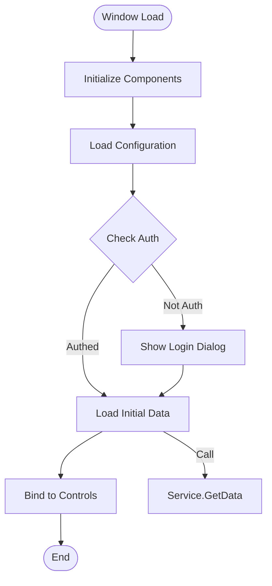
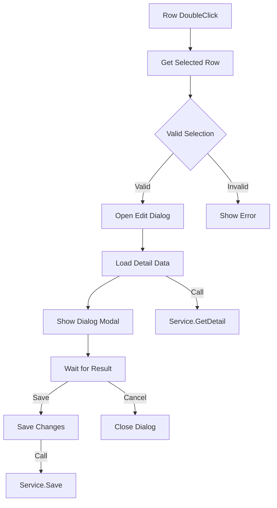
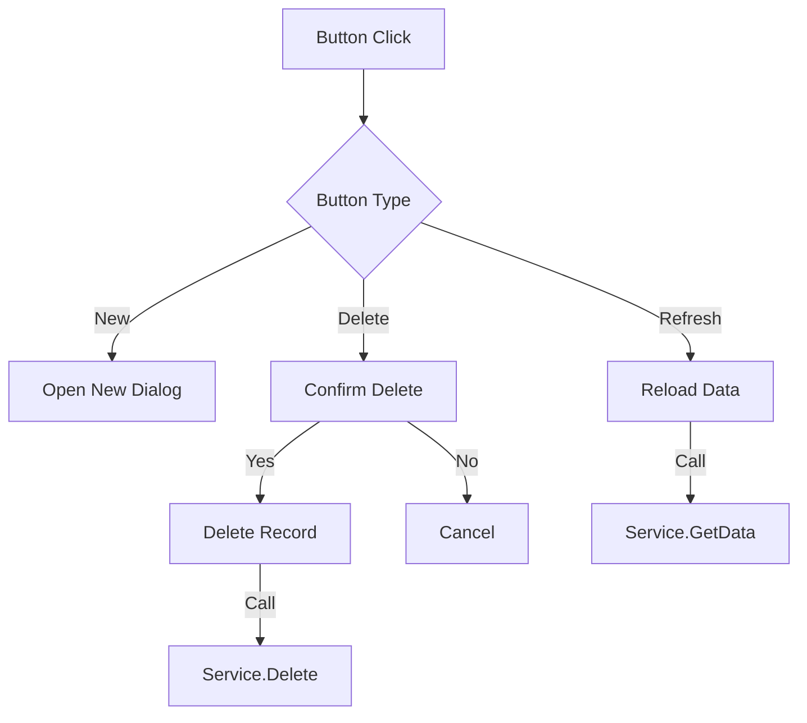
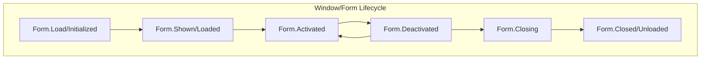

# Feature Detail Design Template - [Feature Name]

> **Platform**: Desktop Application (WinForms/WPF/WinUI)
> **Tech Stack**: C# / .NET / XAML

## 1. Content Overview

name: {Feature Name}

description: Feature overview.

document-path: {documentPath}
source-path: {sourcePath}

## 2. Interface Prototype

<!-- AI-TAG: UI_PROTOTYPE -->
<!-- AI-NOTE: Desktop UI uses wider ASCII wireframes for window layout -->
<!-- AI-NOTE: Typical window size: 1024×768 or 1366×768 -->
<!-- AI-NOTE: ONLY draw prototype for the MAIN WINDOW defined in {{sourcePath}} -->

### 2.1 {Main Window Name}

```
┌─────────────────────────────────────────────────────────────────────┐
│ □ [Window Title]                                    ─ □ ✕          │  ← Title Bar
├─────────────────────────────────────────────────────────────────────┤
│ File  Edit  View  Tools  Help                                       │  ← Menu Bar
├─────────────────────────────────────────────────────────────────────┤
│ ┌──────────┬──────────────────────────────────────────────────────┐ │
│ │          │  [Toolbar: New] [Open] [Save] [Delete] [Refresh]      │ │  ← Toolbar
│ │          ├──────────────────────────────────────────────────────┤ │
│ │          │  Filter: [Keyword:________] [Status:▼] [Search]       │ │  ← Filter Area
│ │          ├──────────────────────────────────────────────────────┤ │
│ │          │                                                      │ │
│ │  Tree    │  ┌────────────────────────────────────────────────┐ │ │
│ │  Panel   │  │ No.  │ Name    │ Status  │ Date      │ Actions │ │ │
│ │          │  ├──────┼─────────┼─────────┼───────────┼─────────┤ │ │  ← Data Grid
│ │          │  │ 1    │ {Value} │ {Value} │ {Value}   │ [Edit]  │ │ │
│ │          │  │ 2    │ {Value} │ {Value} │ {Value}   │ [Edit]  │ │ │
│ │          │  │ ...  │ ...     │ ...     │ ...       │ ...     │ │ │
│ │          │  └────────────────────────────────────────────────┘ │ │
│ │          │                                                      │ │
│ │          │  Page: [1] [2] [3] ...  Total: {X} records           │ │  ← Pagination
│ │          │                                                      │ │
│ └──────────┴──────────────────────────────────────────────────────┘ │
├─────────────────────────────────────────────────────────────────────┤
│ Status: Ready                                    [Progress]        │  ← Status Bar
└─────────────────────────────────────────────────────────────────────┘
```

**Modal Dialog Layout:**

```
┌─────────────────────────────────────────┐
│ [Dialog Title]                    [✕]  │
├─────────────────────────────────────────┤
│                                         │
│  Field 1:  [____________________]       │
│                                         │
│  Field 2:  [____________________] [▼]   │
│                                         │
│  Field 3:  [☑] Checkbox                 │
│                                         │
│  Notes:    ┌────────────────────┐       │
│            │                    │       │
│            │   Text Area        │       │
│            │                    │       │
│            └────────────────────┘       │
│                                         │
├─────────────────────────────────────────┤
│              [Cancel]    [Save]         │
└─────────────────────────────────────────┘
```

**Interface Element Description:**

| Area | Element | Control | Description | Interaction | Source Link |
|------|---------|---------|-------------|-------------|-------------|
| Menu | File Menu | MenuStrip | {Application menu} | Click | [Source](../../{sourcePath}) |
| Toolbar | New Button | ToolStripButton | {Create new} | Click | [Source](../../{sourcePath}) |
| Tree | Navigation | TreeView | {Navigate sections} | NodeClick | [Source](../../{sourcePath}) |
| Grid | Data Grid | DataGridView | {Display data} | CellClick/DoubleClick | [Source](../../{sourcePath}) |
| Status | Status Label | StatusStrip | {Show status} | - | [Source](../../{sourcePath}) |

**Desktop-Specific Interactions:**

| Interaction | Action | Description | Source |
|-------------|--------|-------------|--------|
| Click | Select/Activate | Mouse click | [Source](../../{sourcePath}) |
| DoubleClick | Open/Edit | Double click row | [Source](../../{sourcePath}) |
| RightClick | Context Menu | Show context menu | [Source](../../{sourcePath}) |
| DragDrop | Reorder | Drag and drop items | [Source](../../{sourcePath}) |
| Keyboard | Shortcut | Ctrl+S, Ctrl+N, etc. | [Source](../../{sourcePath}) |

---

## 3. Business Flow Description

<!-- AI-TAG: BUSINESS_FLOW -->
<!-- AI-NOTE: Desktop events: Click, DoubleClick, SelectedIndexChanged, TextChanged -->

### 3.1 Window Initialization Flow



**Flow Description:**

| Step | Business Operation | Event | Source |
|------|-------------------|-------|--------|
| 1 | Initialize UI components | Form_Load/OnInitialized | [Source](../../{sourcePath}) |
| 2 | Load app configuration | After init | [Source](../../{sourcePath}) |
| 3 | Check authentication | After config load | [Source](../../{sourcePath}) |
| 4 | Load data from service | Auth passed | [Source](../../{sourcePath}) |
| 5 | Bind data to controls | Data loaded | [Source](../../{sourcePath}) |

### 3.2 User Interaction Flows

#### 3.2.1 {Event Name: e.g., Grid Row DoubleClick}



**Flow Description:**

| Step | Business Operation | Event | Source |
|------|-------------------|-------|--------|
| 1 | Get selected row | DoubleClick | [Source](../../{sourcePath}) |
| 2 | Validate selection | After get | [Source](../../{sourcePath}) |
| 3 | Open edit dialog | Validation passed | [Source](../../{sourcePath}) |
| 4 | Load detail data | Dialog opened | [Source](../../{sourcePath}) |
| 5 | Handle save/cancel | Dialog closed | [Source](../../{sourcePath}) |

#### 3.2.2 {Event Name: e.g., Toolbar Button Click}



### 3.3 Window Lifecycle



**Lifecycle Events:**

| Event | WPF | WinForms | Purpose | Source |
|-------|-----|----------|---------|--------|
| Initialized | ✅ | - | Component init | [Source](../../{sourcePath}) |
| Loaded | ✅ | Load | Window loaded | [Source](../../{sourcePath}) |
| Shown | - | Shown | Window visible | [Source](../../{sourcePath}) |
| Activated | ✅ | Activated | Window focused | [Source](../../{sourcePath}) |
| Closing | ✅ | FormClosing | About to close | [Source](../../{sourcePath}) |
| Closed | ✅ | FormClosed | Window closed | [Source](../../{sourcePath}) |

---

## 4. Data Field Definition

### 4.1 Window State Fields

| Field Name | Type | Description | Binding | Source |
|------------|------|-------------|---------|--------|
| {Field 1} | string/int/bool | {Description} | {OneWay/TwoWay} | [Source](../../{sourcePath}) |
| {SelectedItem} | Object | {Current selection} | {OneWayToSource} | [Source](../../{sourcePath}) |
| {DataSource} | Collection | {List data} | {OneWay} | [Source](../../{sourcePath}) |
| {IsBusy} | bool | {Loading state} | {OneWay} | [Source](../../{sourcePath}) |

### 4.2 Form Fields (if applicable)

| Field Name | Type | Validation | Control | Source |
|------------|------|------------|---------|--------|
| {Field 1} | string | {Required} | TextBox | [Source](../../{sourcePath}) |
| {Field 2} | int | {Range} | NumericUpDown | [Source](../../{sourcePath}) |
| {Field 3} | DateTime | {Not null} | DateTimePicker | [Source](../../{sourcePath}) |

---

## 5. References

### 5.1 Services

| Service | Type | Main Function | Source | Document Path |
|---------|------|---------------|--------|---------------|
| {Service Name} | Business | {Description} | [Source](../../{serviceSourcePath}) | [Service Doc](../../services/{service-name}.md) |

### 5.2 UI Components

| Component | Framework | Type | Main Function | Source | Document Path |
|-----------|-----------|------|---------------|--------|---------------|
| {UserControl} | WPF/WinForms | Custom | {Reusable UI} | [Source](../../{componentSourcePath}) | [Component Doc](../../components/{component-name}.md) |

### 5.3 Other Windows

| Window Name | Relation Type | Description | Source | Document Path |
|-------------|---------------|-------------|--------|---------------|
| {Window Name} | Dialog/Child | {Relation description} | [Source](../../{windowSourcePath}) | [Window Doc](../{window-path}.md) |

### 5.4 Referenced By

| Window Name | Function Description | Source Path | Document Path |
|-------------|---------------------|-------------|---------------|
| {Referencing Window} | {e.g., "Open this window from main menu"} | {source-path} | [Window Doc](../{window-path}.md) |

---

## 6. Business Rule Constraints

### 6.1 Permission Rules

| Operation | Permission Requirement | No Permission Handling | Source |
|-----------|----------------------|----------------------|--------|
| View window | {Role required} | Hide menu item / Show message | [Source](../../{sourcePath}) |
| Edit data | {Permission required} | Disable edit button | [Source](../../{sourcePath}) |
| Delete record | {Admin role} | Disable delete button | [Source](../../{sourcePath}) |

### 6.2 Desktop-Specific Rules

1. **Auto-save**: {e.g., Auto-save draft every 5 minutes} | [Source](../../{sourcePath})
2. **Keyboard Shortcuts**: {e.g., Ctrl+S save, Ctrl+F find} | [Source](../../{sourcePath})
3. **Window State**: {e.g., Remember window size and position} | [Source](../../{sourcePath})

### 6.3 Validation Rules

| Scenario | Rule | Error Handling | Source |
|----------|------|----------------|--------|
| Form submit | {Validation rule} | Show error provider / MessageBox | [Source](../../{sourcePath}) |

---

## 7. Notes and Additional Information

### 7.1 Platform Adaptation

- **WinForms**: Traditional Windows desktop, simple data binding
- **WPF**: Modern UI, XAML, MVVM pattern, powerful data binding
- **WinUI 3**: Latest Windows UI, Fluent Design, modern controls

### 7.2 Performance Considerations

- **Large Data**: Use virtualization for large lists
- **Async Operations**: Use async/await for I/O operations
- **UI Freezing**: Use BackgroundWorker or async for long operations

### 7.3 Pending Confirmations

- [ ] **{Pending 1}**: {e.g., Whether to support dark theme}
- [ ] **{Pending 2}**: {e.g., Whether to add print functionality}

---

**Document Status:** 📝 Draft / 👀 In Review / ✅ Published  
**Last Updated:** {Date}  
**Maintainer:** {Name}  
**Related Module Document:** [Module Overview Document](../{{module-name}}-overview.md)

**Section Source**
- [{Window}.xaml.cs/{Form}.cs](../../{sourcePath})
- [{ViewModel}.cs](../../{viewModelPath})
