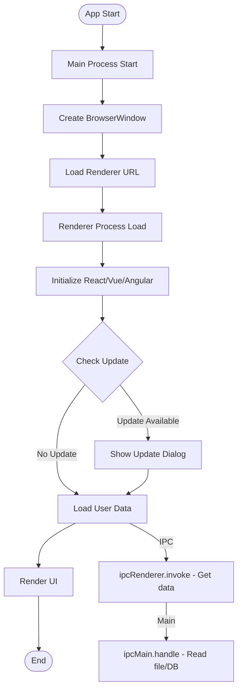
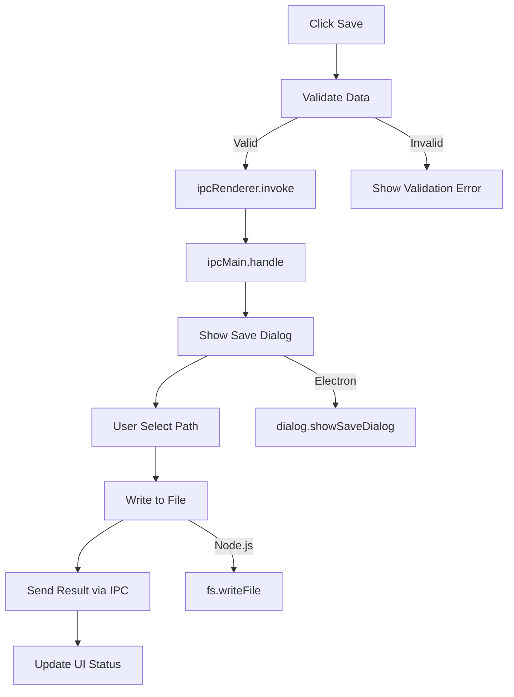
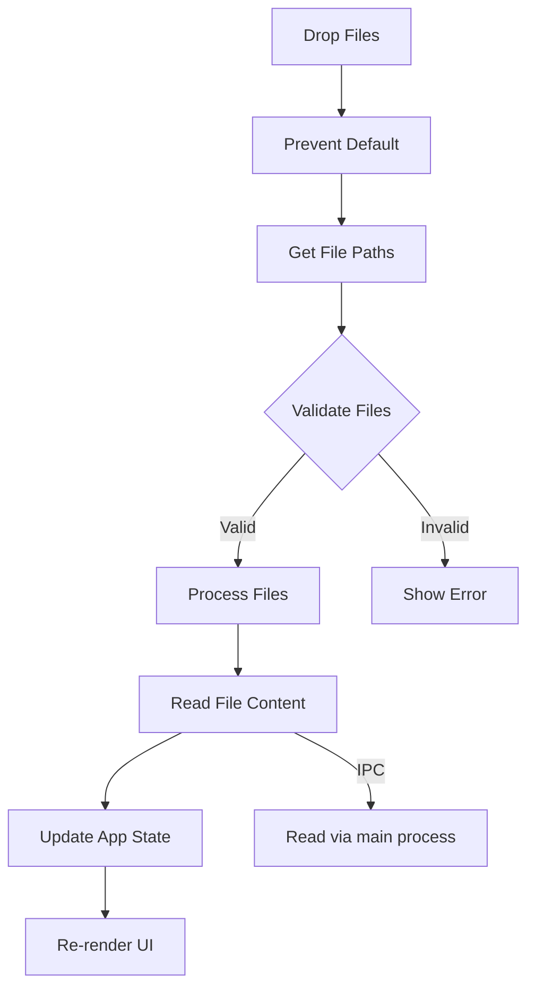
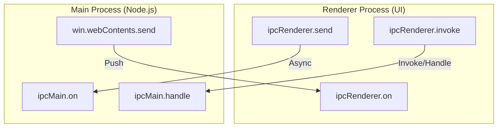

# Feature Detail Design Template - [Feature Name]

> **Platform**: Desktop Application (Electron)
> **Tech Stack**: HTML/CSS/JavaScript + Electron APIs + Node.js

## 1. Content Overview

name: {Feature Name}

description: Feature overview.

document-path: {documentPath}
source-path: {sourcePath}

## 2. Interface Prototype

<!-- AI-TAG: UI_PROTOTYPE -->
<!-- AI-NOTE: Electron UI uses web-based ASCII wireframes -->
<!-- AI-NOTE: Window can be frameless or with native frame -->
<!-- AI-NOTE: ONLY draw prototype for the MAIN RENDERER PROCESS defined in {{sourcePath}} -->

### 2.1 {Main Window Name}

**Frameless Window with Custom Title Bar:**

```
┌─────────────────────────────────────────────────────────────────────┐
│ ● ● ●  [App Title]                              ─ □ ✕              │  ← Custom Title Bar
├─────────────────────────────────────────────────────────────────────┤
│ ┌──────────┬──────────────────────────────────────────────────────┐ │
│ │          │  ≡ Menu  [New] [Open] [Save] 🔍 Search...    [⚙]    │ │  ← Toolbar
│ │          ├──────────────────────────────────────────────────────┤ │
│ │          │  📁 Home  /  📂 Project  /  📄 Current File          │ │  ← Breadcrumb
│ │          ├──────────────────────────────────────────────────────┤ │
│ │  Sidebar │                                                      │ │
│ │  ┌────┐  │  ┌────────────────────────────────────────────────┐ │ │
│ │  │ 📁 │  │  │  Content Area                                  │ │ │
│ │  │ 📄 │  │  │                                                │ │ │
│ │  │ 🖼  │  │  │  ┌─────────┐ ┌─────────┐ ┌─────────┐         │ │ │
│ │  │ ⚙  │  │  │  │ Card 1  │ │ Card 2  │ │ Card 3  │         │ │ │
│ │  └────┘  │  │  └─────────┘ └─────────┘ └─────────┘         │ │ │
│ │          │  │                                                │ │ │
│ │          │  │  ┌────────────────────────────────────────┐   │ │ │
│ │          │  │  │  Data Table                            │   │ │ │
│ │          │  │  │  ┌────┬────────┬────────┬────────┐     │   │ │ │
│ │          │  │  │  │ ID │ Name   │ Status │ Action │     │   │ │ │
│ │          │  │  │  ├────┼────────┼────────┼────────┤     │   │ │ │
│ │          │  │  │  │ 1  │ Item 1 │ Active │ [Edit] │     │   │ │ │
│ │          │  │  │  │ 2  │ Item 2 │ Draft  │ [Edit] │     │   │ │ │
│ │          │  │  │  └────┴────────┴────────┴────────┘     │   │ │ │
│ │          │  │  └────────────────────────────────────────┘   │ │ │
│ └──────────┴──────────────────────────────────────────────────────┘ │
├─────────────────────────────────────────────────────────────────────┤
│ [Status] Ready  |  [Sync] ✓  |  [User] John Doe          [⚡] [🔔] │  ← Status Bar
└─────────────────────────────────────────────────────────────────────┘
```

**With Native Frame:**

```
┌─────────────────────────────────────────────────────────────────────┐
│ [App Title]                                    ─ □ ✕               │
├─────────────────────────────────────────────────────────────────────┤
│ File  Edit  View  Window  Help                                      │  ← Native Menu
├─────────────────────────────────────────────────────────────────────┤
│ [Toolbar content same as above]                                     │
└─────────────────────────────────────────────────────────────────────┘
```

**Interface Element Description:**

| Area | Element | Type | Description | Interaction | Source Link |
|------|---------|------|-------------|-------------|-------------|
| Title Bar | Window Controls | Button | {Minimize/Maximize/Close} | Click | [Source](../../../../../../{sourcePath}) |
| Menu | App Menu | Menu | {Application menu} | Click | [Source](../../../../../../{sourcePath}) |
| Toolbar | Action Buttons | Button | {Primary actions} | Click | [Source](../../../../../../{sourcePath}) |
| Sidebar | Navigation | Nav | {Section navigation} | Click | [Source](../../../../../../{sourcePath}) |
| Content | Cards/Tables | Component | {Display content} | Click/Right-click | [Source](../../../../../../{sourcePath}) |
| Status Bar | Status Info | Status | {App status} | - | [Source](../../../../../../{sourcePath}) |

**Electron-Specific Interactions:**

| Interaction | Action | Description | Source |
|-------------|--------|-------------|--------|
| Click | Select/Activate | Mouse click | [Source](../../../../../../{sourcePath}) |
| RightClick | Context Menu | Show native/context menu | [Source](../../../../../../{sourcePath}) |
| Drag | File Drop | Drag files into window | [Source](../../../../../../{sourcePath}) |
| Keyboard | Shortcut | Cmd/Ctrl+ shortcuts | [Source](../../../../../../{sourcePath}) |
| IPC | Main ↔ Renderer | Communication between processes | [Source](../../../../../../{sourcePath}) |

---

## 3. Business Flow Description

<!-- AI-TAG: BUSINESS_FLOW -->
<!-- AI-NOTE: Electron has Main Process and Renderer Process -->
<!-- AI-NOTE: Events: DOM events + Electron IPC events -->

### 3.1 Window Initialization Flow



**Flow Description:**

| Step | Business Operation | Process | Source |
|------|-------------------|---------|--------|
| 1 | Main process starts | Main | [Source](../../../../../../{mainSourcePath}) |
| 2 | Create browser window | Main | [Source](../../../../../../{mainSourcePath}) |
| 3 | Renderer process loads | Renderer | [Source](../../../../../../{sourcePath}) |
| 4 | Initialize frontend framework | Renderer | [Source](../../../../../../{sourcePath}) |
| 5 | Check for updates | Main → Renderer | [Source](../../../../../../{sourcePath}) |
| 6 | Load user data via IPC | Renderer → Main | [Source](../../../../../../{sourcePath}) |

### 3.2 User Interaction Flows

#### 3.2.1 {Event Name: e.g., Save File}



**Flow Description:**

| Step | Business Operation | Process | Source |
|------|-------------------|---------|--------|
| 1 | Validate form data | Renderer | [Source](../../../../../../{sourcePath}) |
| 2 | Send IPC message | Renderer | [Source](../../../../../../{sourcePath}) |
| 3 | Handle IPC call | Main | [Source](../../../../../../{mainSourcePath}) |
| 4 | Show native dialog | Main | [Source](../../../../../../{mainSourcePath}) |
| 5 | Write file | Main | [Source](../../../../../../{mainSourcePath}) |
| 6 | Return result | Main → Renderer | [Source](../../../../../../{sourcePath}) |

#### 3.2.2 {Event Name: e.g., File Drop}



### 3.3 IPC Communication Patterns



**IPC Methods:**

| Direction | Method | Use Case | Source |
|-----------|--------|----------|--------|
| Renderer → Main | ipcRenderer.send | Fire-and-forget | [Source](../../../../../../{sourcePath}) |
| Renderer → Main | ipcRenderer.invoke | Request/Response | [Source](../../../../../../{sourcePath}) |
| Main → Renderer | webContents.send | Push notification | [Source](../../../../../../{mainSourcePath}) |

---

## 4. Data Field Definition

### 4.1 Component State Fields

| Field Name | Type | Description | Framework | Source |
|------------|------|-------------|-----------|--------|
| {Field 1} | string/number/boolean | {Description} | React/Vue/Angular | [Source](../../../../../../{sourcePath}) |
| {files} | Array | {Dropped files} | React/Vue/Angular | [Source](../../../../../../{sourcePath}) |
| {isProcessing} | boolean | {Processing state} | React/Vue/Angular | [Source](../../../../../../{sourcePath}) |
| {settings} | Object | {App settings} | React/Vue/Angular | [Source](../../../../../../{sourcePath}) |

### 4.2 Form Fields (if applicable)

| Field Name | Type | Validation | Component | Source |
|------------|------|------------|-----------|--------|
| {Field 1} | string | {Required} | Input | [Source](../../../../../../{sourcePath}) |
| {Field 2} | string | {File path} | Input + File picker | [Source](../../../../../../{sourcePath}) |

---

## 5. References

### 5.1 Main Process APIs

| API | Module | Purpose | Source | Document Path |
|-----|--------|---------|--------|---------------|
| {Handler Name} | ipcMain | {IPC handler description} | [Source](../../../../../../{mainSourcePath}) | [Main Doc](../../../../../../main/{handler-name}.md) |

### 5.2 Electron APIs

| API | Process | Purpose | Usage | Source |
|-----|---------|---------|-------|--------|
| dialog | Main | Native dialogs | Open/Save dialogs | [Source](../../../../../../{mainSourcePath}) |
| shell | Both | Open external | Open file manager/browser | [Source](../../../../../../{sourcePath}) |
| clipboard | Renderer | Clipboard ops | Copy/paste | [Source](../../../../../../{sourcePath}) |
| notification | Renderer | Native notifications | Show notification | [Source](../../../../../../{sourcePath}) |

### 5.3 Node.js Modules

| Module | Purpose | Usage | Source |
|--------|---------|-------|--------|
| fs | File system | Read/write files | [Source](../../../../../../{mainSourcePath}) |
| path | Path operations | Handle file paths | [Source](../../../../../../{mainSourcePath}) |
| os | System info | Get platform info | [Source](../../../../../../{mainSourcePath}) |

### 5.4 Other Windows

| Window Name | Relation Type | Description | Source | Document Path |
|-------------|---------------|-------------|--------|---------------|
| {Window Name} | Modal/Child | {Relation description} | [Source](../../../../../../{windowSourcePath}) | [Window Doc](../{window-path}.md) |

### 5.5 Referenced By

| Window Name | Function Description | Source Path | Document Path |
|-------------|---------------------|-------------|---------------|
| {Referencing Window} | {e.g., "Open from main menu"} | {source-path} | [Window Doc](../../../../../../{window-path}.md) |

---

## 6. Business Rule Constraints

### 6.1 Permission Rules

| Operation | Permission | No Permission Handling | Source |
|-----------|------------|----------------------|--------|
| File system access | {User consent} | Show permission dialog | [Source](../../../../../../{sourcePath}) |
| External links | {N/A} | Open in system browser | [Source](../../../../../../{sourcePath}) |

### 6.2 Electron-Specific Rules

1. **Security**: {e.g., Enable contextIsolation, use IPC not remote} | [Source](../../../../../../{sourcePath})
2. **Auto-update**: {e.g., Check updates on startup} | [Source](../../../../../../{sourcePath})
3. **Window State**: {e.g., Restore window position/size} | [Source](../../../../../../{sourcePath})

### 6.3 Validation Rules

| Scenario | Rule | Error Handling | Source |
|----------|------|----------------|--------|
| File type | {Allowed extensions} | Show error dialog | [Source](../../../../../../{sourcePath}) |

---

## 7. Notes and Additional Information

### 7.1 Process Architecture

- **Main Process**: Node.js environment, system access, window management
- **Renderer Process**: Chromium environment, UI rendering, limited system access
- **Preload Script**: Bridge between Main and Renderer for secure IPC

### 7.2 Security Best Practices

- Enable `contextIsolation` and `sandbox`
- Use `preload.js` for IPC exposure
- Don't enable `nodeIntegration` in renderer
- Validate all IPC inputs

### 7.3 Platform Considerations

- **Windows**: Use native menus, support Windows notifications
- **macOS**: Follow HIG, support TouchBar, native menus
- **Linux**: Test on major distributions

### 7.4 Pending Confirmations

- [ ] **{Pending 1}**: {e.g., Whether to support auto-updater}
- [ ] **{Pending 2}**: {e.g., Whether to add system tray integration}

---

**Document Status:** 📝 Draft / 👀 In Review / ✅ Published  
**Last Updated:** {Date}  
**Maintainer:** {Name}  
**Related Module Document:** [Module Overview Document](../{{module-name}}-overview.md)

**Section Source**
- [{Component}.jsx/.vue](../../../../../../{sourcePath})
- [main.js/main.ts](../../../../../../{mainSourcePath})
- [preload.js](../../../../../../{preloadSourcePath})
