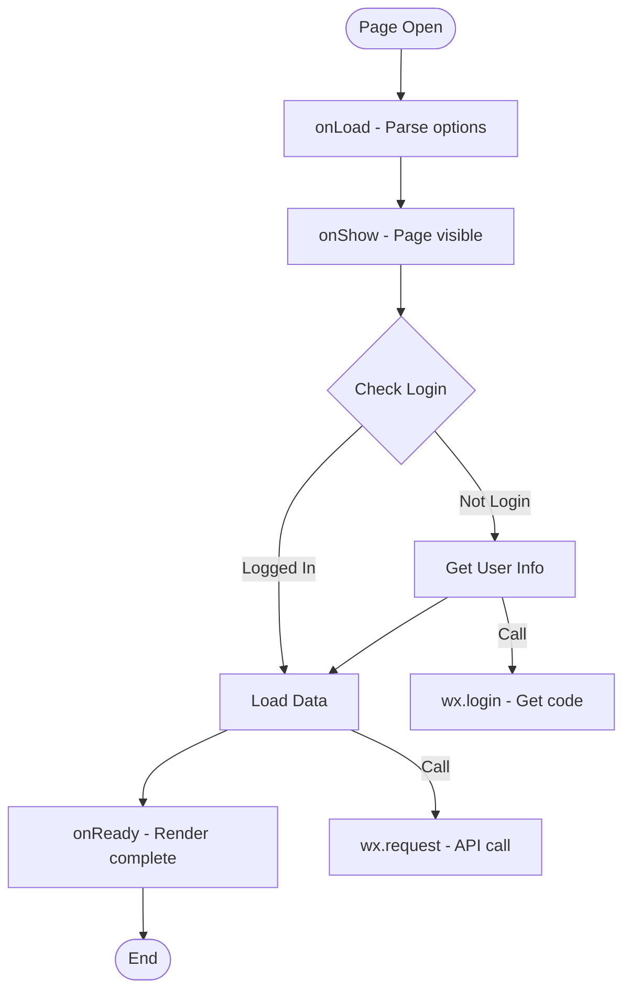
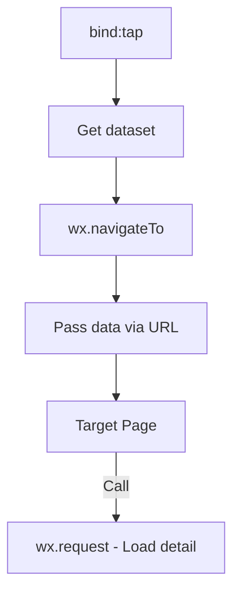
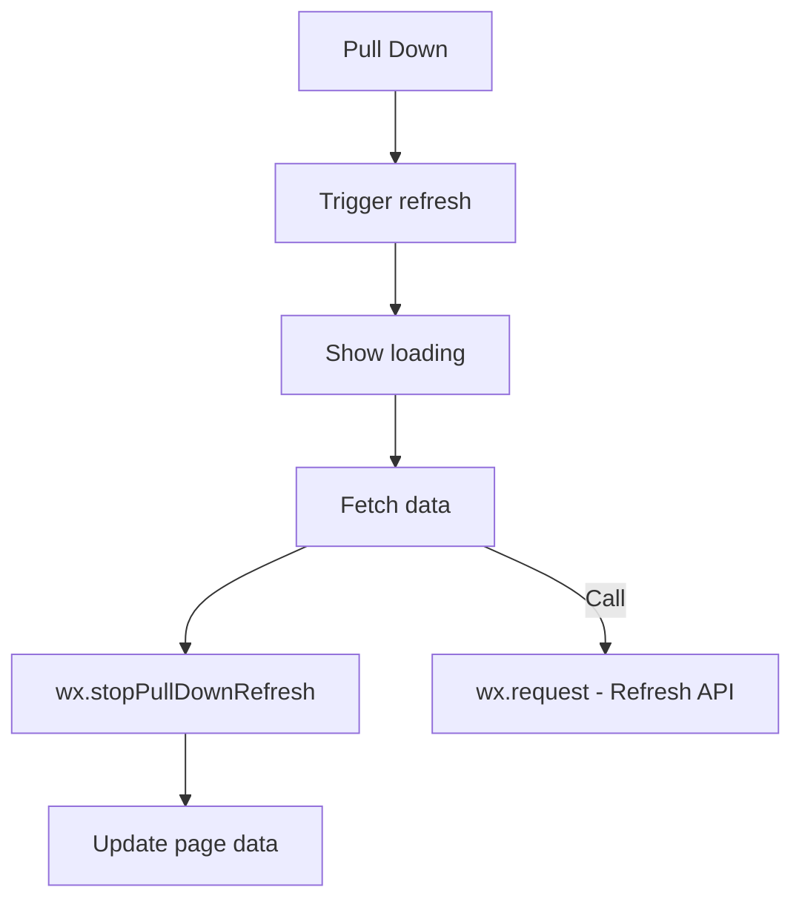
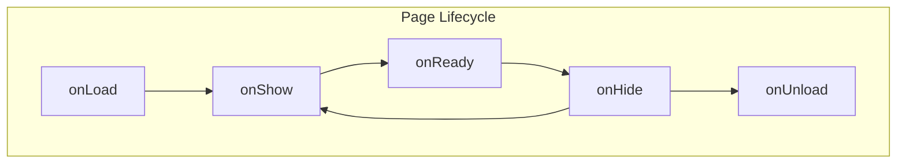

# Feature Detail Design Template - [Feature Name]

> **Platform**: Mini Program (WeChat/Alipay/ByteDance)
> **Tech Stack**: WXML/AXML/TTML + WXSS/ACSS/TTSS + JavaScript

## 1. Content Overview

name: {Feature Name}

description: Feature overview.

document-path: {documentPath}
source-path: {sourcePath}

## 2. Interface Prototype

<!-- AI-TAG: UI_PROTOTYPE -->
<!-- AI-NOTE: Mini Program UI uses mobile-first ASCII wireframes -->
<!-- AI-NOTE: Screen width: 750rpx (responsive unit) -->
<!-- AI-NOTE: ONLY draw prototype for the MAIN PAGE defined in {{sourcePath}} -->

### 2.1 {Main Page Name}

```
┌─────────────────────────┐
│ Navigation Bar Title    │  ← System Navigation Bar
├─────────────────────────┤
│                         │
│  ┌─────────────────┐   │
│  │  Search Bar 🔍  │   │  ← Search Component
│  └─────────────────┘   │
│                         │
│  ┌─────────────────┐   │
│  │                 │   │
│  │   Content       │   │  ← Scroll View
│  │   Area          │   │
│  │                 │   │
│  │                 │   │
│  └─────────────────┘   │
│                         │
│  ┌─────────────────┐   │
│  │  [ + Action ]   │   │  ← Floating Button
│  └─────────────────┘   │
│                         │
├─────────────────────────┤
│ 🏠  📋  💬  👤          │  ← Tab Bar (if configured)
└─────────────────────────┘
```

**Card Component Layout:**

```
┌─────────────────────────┐
│ ┌────┐ Title        ▸  │
│ │Img │ Description      │
│ └────┘ [Tag1] [Tag2]    │
├─────────────────────────┤
│ ┌────┐ Title        ▸  │
│ │Img │ Description      │
│ └────┘ [Tag1] [Tag2]    │
└─────────────────────────┘
```

**Interface Element Description:**

| Area | Element | Component | Description | Interaction | Source Link |
|------|---------|-----------|-------------|-------------|-------------|
| Nav | Title | NavigationBar | {Page title} | - | [Source](../../../../../../{sourcePath}) |
| Search | Search Input | search | {Search input} | bind:input/bind:confirm | [Source](../../../../../../{sourcePath}) |
| Content | Card | view + image + text | {Display item} | bind:tap | [Source](../../../../../../{sourcePath}) |
| Action | FAB | button | {Primary action} | bind:tap | [Source](../../../../../../{sourcePath}) |

**Mini Program Specific Interactions:**

| Event | Trigger | Description | Source |
|-------|---------|-------------|--------|
| bind:tap | Tap | Click element | [Source](../../../../../../{sourcePath}) |
| bind:longpress | Long press | Long press element | [Source](../../../../../../{sourcePath}) |
| bind:touchstart | Touch start | Start touch | [Source](../../../../../../{sourcePath}) |
| bind:touchend | Touch end | End touch | [Source](../../../../../../{sourcePath}) |
| bind:scrolltolower | Scroll to bottom | Load more | [Source](../../../../../../{sourcePath}) |
| bind:pullDownRefresh | Pull down | Refresh page | [Source](../../../../../../{sourcePath}) |

---

## 3. Business Flow Description

<!-- AI-TAG: BUSINESS_FLOW -->
<!-- AI-NOTE: Mini Program lifecycle: onLoad → onShow → onReady → onHide → onUnload -->

### 3.1 Page Initialization Flow



**Flow Description:**

| Step | Business Operation | Lifecycle | Source |
|------|-------------------|-----------|--------|
| 1 | Parse page options | onLoad | [Source](../../../../../../{sourcePath}) |
| 2 | Page becomes visible | onShow | [Source](../../../../../../{sourcePath}) |
| 3 | Check/get user info | onShow | [Source](../../../../../../{sourcePath}) |
| 4 | Load page data | onShow | [Source](../../../../../../{sourcePath}) |
| 5 | Page render complete | onReady | [Source](../../../../../../{sourcePath}) |

### 3.2 User Interaction Flows

#### 3.2.1 {Event Name: e.g., Card onTap}



**Flow Description:**

| Step | Business Operation | Event | Source |
|------|-------------------|-------|--------|
| 1 | Get data from dataset | bind:tap | [Source](../../../../../../{sourcePath}) |
| 2 | Navigate to detail | wx.navigateTo | [Source](../../../../../../{sourcePath}) |
| 3 | Pass data via URL | query parameter | [Source](../../../../../../{sourcePath}) |

#### 3.2.2 {Event Name: e.g., Pull Down Refresh}



### 3.3 Mini Program Lifecycle



**Lifecycle Functions:**

| Function | Trigger | Purpose | Source |
|----------|---------|---------|--------|
| onLoad | Page created | Parse options, init | [Source](../../../../../../{sourcePath}) |
| onShow | Page visible | Refresh data | [Source](../../../../../../{sourcePath}) |
| onReady | Render done | DOM operations | [Source](../../../../../../{sourcePath}) |
| onHide | Page hidden | Pause operations | [Source](../../../../../../{sourcePath}) |
| onUnload | Page closed | Cleanup | [Source](../../../../../../{sourcePath}) |
| onPullDownRefresh | Pull down | Refresh data | [Source](../../../../../../{sourcePath}) |
| onReachBottom | Scroll bottom | Load more | [Source](../../../../../../{sourcePath}) |
| onShareAppMessage | Share | Custom share | [Source](../../../../../../{sourcePath}) |

---

## 4. Data Field Definition

### 4.1 Page Data Fields

| Field Name | Type | Description | Source |
|------------|------|-------------|--------|
| {Field 1} | String/Number/Boolean/Array/Object | {Description} | [Source](../../../../../../{sourcePath}) |
| {loading} | Boolean | {Loading state} | [Source](../../../../../../{sourcePath}) |
| {list} | Array | {List data} | [Source](../../../../../../{sourcePath}) |
| {hasMore} | Boolean | {Has more data} | [Source](../../../../../../{sourcePath}) |

### 4.2 Form Fields (if applicable)

| Field Name | Type | Validation | Component | Source |
|------------|------|------------|-----------|--------|
| {Field 1} | String | {Required} | input | [Source](../../../../../../{sourcePath}) |
| {Field 2} | String | {Phone format} | input type=digit | [Source](../../../../../../{sourcePath}) |

---

## 5. References

### 5.1 APIs

| API Name | Type | Main Function | Source | Document Path |
|----------|------|---------------|--------|---------------|
| {API Name} | Query/Mutation | {Brief description} | [Source](../../../../../../{apiSourcePath}) | [API Doc](../../../../../../apis/{api-name}.md) |

### 5.2 Mini Program APIs

| API | Purpose | Usage | Source |
|-----|---------|-------|--------|
| wx.request | HTTP request | Call backend API | [Source](../../../../../../{sourcePath}) |
| wx.navigateTo | Page navigation | Navigate to page | [Source](../../../../../../{sourcePath}) |
| wx.showToast | Show toast | Display message | [Source](../../../../../../{sourcePath}) |
| wx.getUserInfo | Get user info | Authentication | [Source](../../../../../../{sourcePath}) |

### 5.3 Components

| Component | Type | Main Function | Source | Document Path |
|-----------|------|---------------|--------|---------------|
| {Custom Component} | UI | {Description} | [Source](../../../../../../{componentSourcePath}) | [Component Doc](../../../../../../components/{component-name}.md) |

### 5.4 Other Pages

| Page Name | Relation Type | Description | Source | Document Path |
|-----------|---------------|-------------|--------|---------------|
| {Page Name} | navigateTo | {Navigation description} | [Source](../../../../../../{pageSourcePath}) | [Page Doc](../{page-path}.md) |

### 5.5 Referenced By

| Page Name | Function Description | Source Path | Document Path |
|-------------|---------------------|-------------|---------------|
| {Referencing Page} | {e.g., "Navigate to this page"} | {source-path} | [Page Doc](../../../../../../{page-path}.md) |

---

## 6. Business Rule Constraints

### 6.1 Permission Rules

| Operation | Permission | No Permission Handling | Source |
|-----------|------------|----------------------|--------|
| View page | {None/Login} | Show login modal | [Source](../../../../../../{sourcePath}) |
| Use feature | {Scope required} | Guide to authorize | [Source](../../../../../../{sourcePath}) |

### 6.2 Mini Program Specific Rules

1. **Package Size**: {e.g., Main package ≤ 2MB} | [Source](../../../../../../{sourcePath})
2. **API Limit**: {e.g., Concurrent request limit} | [Source](../../../../../../{sourcePath})
3. **Storage**: {e.g., Use wx.setStorage for cache} | [Source](../../../../../../{sourcePath})

### 6.3 Validation Rules

| Scenario | Rule | Handling | Source |
|----------|------|----------|--------|
| Form submit | {Validation} | wx.showToast / showModal | [Source](../../../../../../{sourcePath}) |

---

## 7. Notes and Additional Information

### 7.1 Platform Differences

- **WeChat**: wx.* APIs, WXML/WXSS
- **Alipay**: my.* APIs, AXML/ACSS
- **ByteDance**: tt.* APIs, TTML/TTSS
- **Universal**: Use framework like uni-app/Taro for multi-platform

### 7.2 Performance Considerations

- **List Rendering**: Use wx:key for list items
- **Image Optimization**: Use lazy-load, appropriate size
- **setData**: Minimize data size, avoid frequent calls
- **Subpackages**: Use for large applications

### 7.3 Pending Confirmations

- [ ] **{Pending 1}**: {e.g., Whether to support share to moments}
- [ ] **{Pending 2}**: {e.g., Whether to add subscription message}

---

**Document Status:** 📝 Draft / 👀 In Review / ✅ Published  
**Last Updated:** {Date}  
**Maintainer:** {Name}  
**Related Module Document:** [Module Overview Document](../{{module-name}}-overview.md)

**Section Source**
- [{page}.js/{page}.wxml](../../../../../../{sourcePath})
- [{page}.json](../../../../../../{configPath})
