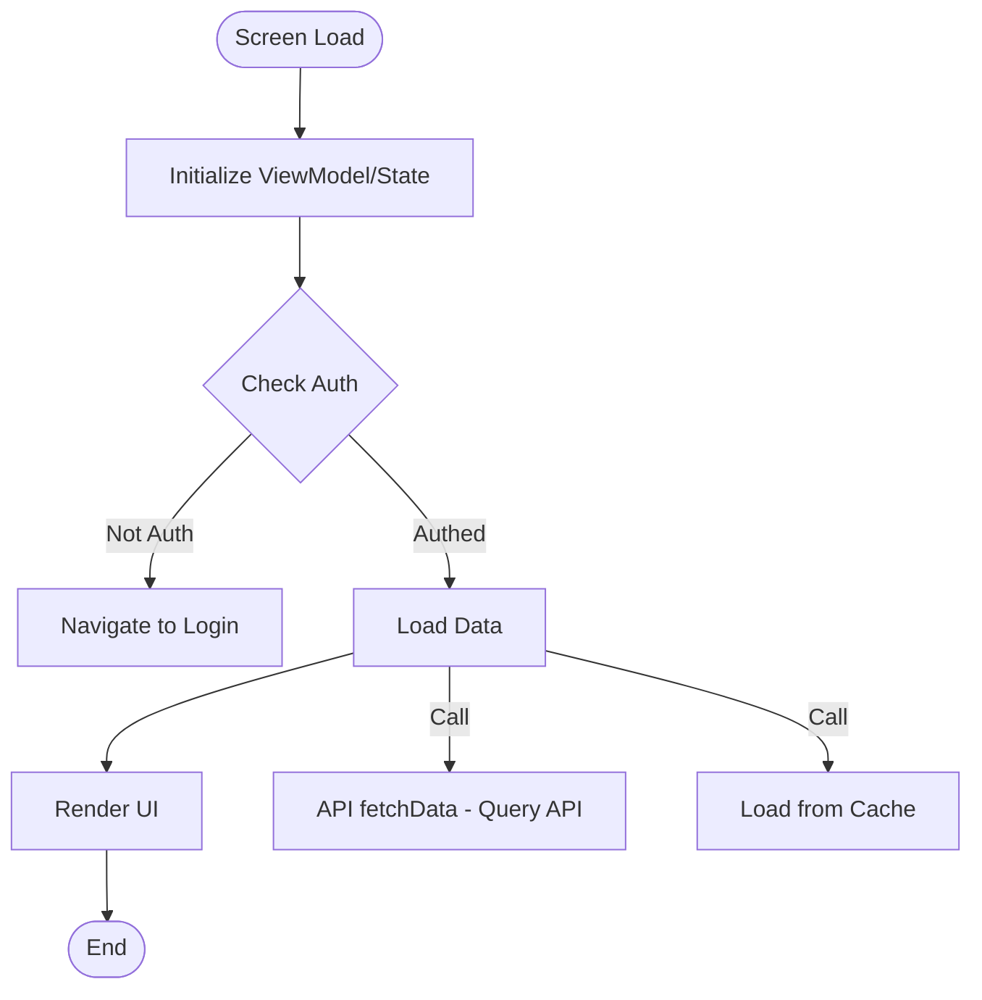
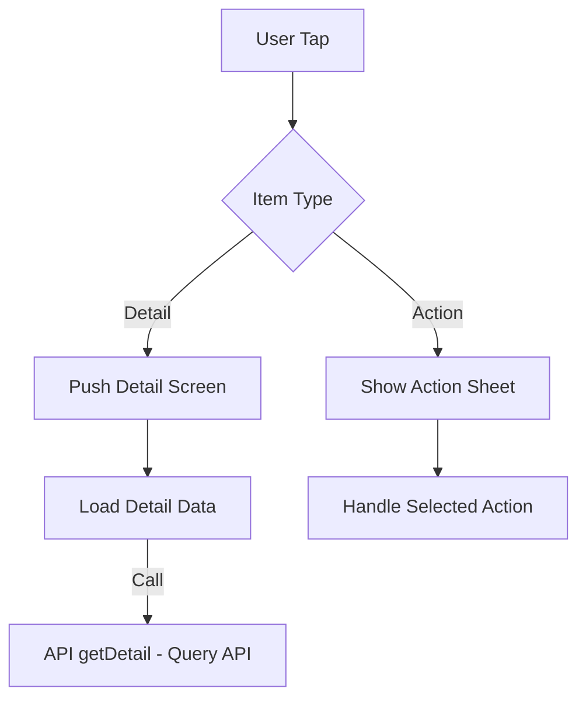
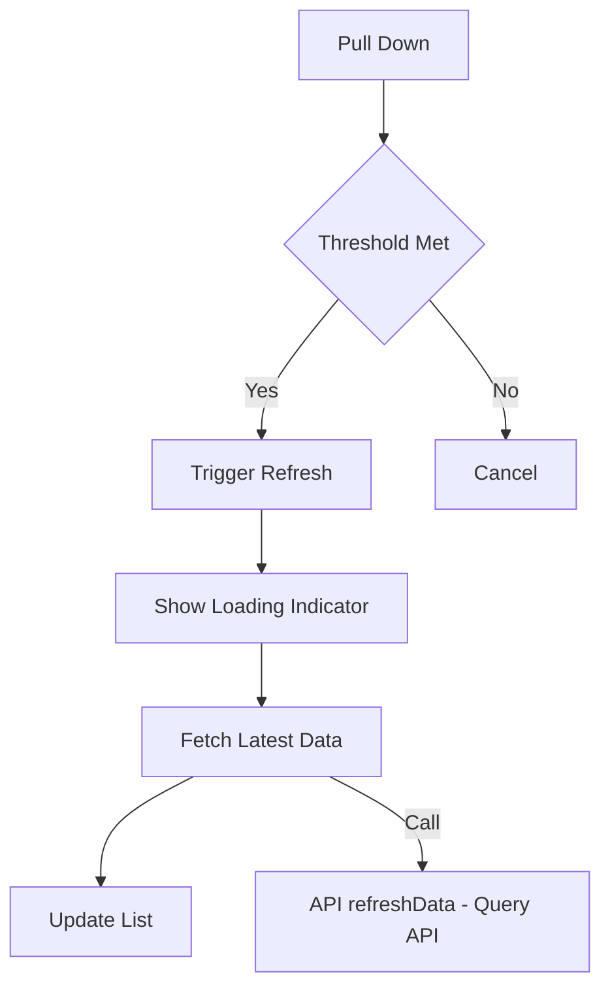
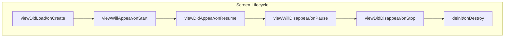

# Feature Detail Design Template - [Feature Name]

> **Platform**: Mobile Native (iOS/Android)
> **Tech Stack**: Swift/Kotlin/React Native/Flutter

## 1. Content Overview

name: {Feature Name}

description: Feature overview.

document-path: {documentPath}
source-path: {sourcePath}

## 2. Interface Prototype

<!-- AI-TAG: UI_PROTOTYPE -->
<!-- AI-NOTE: Mobile UI prototype uses vertical ASCII wireframes for phone screen layout -->
<!-- AI-NOTE: Screen size reference: 375×812pt (iPhone X) or 360×640dp (Android) -->
<!-- AI-NOTE: ONLY draw prototype for the MAIN SCREEN defined in {{sourcePath}} -->

### 2.1 {Main Screen Name}

```
┌─────────────────────────┐
│ Status Bar              │
├─────────────────────────┤
│ ←  Title          [⋯]  │  ← Navigation Bar
├─────────────────────────┤
│                         │
│  ┌─────────────────┐   │
│  │  Search Bar     │   │  ← Search/Filter Area
│  └─────────────────┘   │
│                         │
│  ┌─────────────────┐   │
│  │                 │   │
│  │   Content       │   │  ← Main Content
│  │   Area          │   │     (List/Grid/Form)
│  │                 │   │
│  │                 │   │
│  └─────────────────┘   │
│                         │
│  ┌─────────────────┐   │
│  │  [Action Btn]   │   │  ← Floating Action Button
│  └─────────────────┘   │
│                         │
├─────────────────────────┤
│ [Tab1] [Tab2] [Tab3]   │  ← Tab Bar (if applicable)
└─────────────────────────┘
```

**List Item Layout:**

```
┌─────────────────────────┐
│ ┌────┐  Title        > │
│ │Icon│  Subtitle        │
│ └────┘  [Tag]           │
├─────────────────────────┤
│ ┌────┐  Title        > │
│ │Img │  Subtitle        │
│ └────┘  [Tag]           │
└─────────────────────────┘
```

**Interface Element Description:**

| Area | Element | Type | Description | Interaction | Source Link |
|------|---------|------|-------------|-------------|-------------|
| Nav Bar | Back Button | Button | {Return to previous screen} | Tap to navigate back | [Source](../../{sourcePath}) |
| Nav Bar | Title | Label | {Screen title} | - | [Source](../../{sourcePath}) |
| Nav Bar | More Menu | Button | {Show action sheet} | Tap to show options | [Source](../../{sourcePath}) |
| Content | List Item | Cell | {Display data item} | Tap to view detail | [Source](../../{sourcePath}) |
| Content | Pull Refresh | Gesture | {Pull down to refresh} | Pull down gesture | [Source](../../{sourcePath}) |
| FAB | Action Button | Button | {Primary action} | Tap to create/add | [Source](../../{sourcePath}) |

**Mobile-Specific Interactions:**

| Gesture | Action | Description | Source |
|---------|--------|-------------|--------|
| Tap | Select item | Navigate to detail | [Source](../../{sourcePath}) |
| Long Press | Context menu | Show action sheet | [Source](../../{sourcePath}) |
| Swipe Left | Delete/Reveal | Show delete/edit actions | [Source](../../{sourcePath}) |
| Pull Down | Refresh | Reload data | [Source](../../{sourcePath}) |
| Infinite Scroll | Load more | Pagination | [Source](../../{sourcePath}) |

---

## 3. Business Flow Description

<!-- AI-TAG: BUSINESS_FLOW -->
<!-- AI-NOTE: Document ALL business flows triggered by user interactions -->
<!-- AI-NOTE: Mobile events: onTap, onLongPress, onSwipe, onScroll, onRefresh -->

### 3.1 Screen Initialization Flow



**Flow Description:**

| Step | Business Operation | Trigger | Source |
|------|-------------------|---------|--------|
| 1 | Initialize ViewModel | viewDidLoad/onCreate | [Source](../../{sourcePath}) |
| 2 | Check authentication | After init | [Source](../../{sourcePath}) |
| 3 | Load data | Auth passed | [Source](../../{sourcePath}) |
| 4 | Render UI | Data loaded | [Source](../../{sourcePath}) |

### 3.2 User Interaction Flows

#### 3.2.1 {Event Name: e.g., List Item onTap}



**Flow Description:**

| Step | Business Operation | Trigger | Source |
|------|-------------------|---------|--------|
| 1 | Detect tap | onTap | [Source](../../{sourcePath}) |
| 2 | Check item type | Tap detected | [Source](../../{sourcePath}) |
| 3 | Navigate or show actions | Based on type | [Source](../../{sourcePath}) |

#### 3.2.2 {Event Name: e.g., Pull to Refresh}



### 3.3 Lifecycle Events



**Lifecycle Handlers:**

| Event | Platform | Handler | Purpose | Source |
|-------|----------|---------|---------|--------|
| Create | iOS | viewDidLoad | Initial setup | [Source](../../{sourcePath}) |
| Create | Android | onCreate | Initial setup | [Source](../../{sourcePath}) |
| Appear | iOS | viewWillAppear | Prepare data | [Source](../../{sourcePath}) |
| Appear | Android | onStart | Prepare data | [Source](../../{sourcePath}) |
| Destroy | iOS | deinit | Cleanup | [Source](../../{sourcePath}) |
| Destroy | Android | onDestroy | Cleanup | [Source](../../{sourcePath}) |

---

## 4. Data Field Definition

### 4.1 Screen State Fields

| Field Name | Field Type | Description | Platform | Source |
|------------|------------|-------------|----------|--------|
| {Field 1} | String/Int/Boolean | {Description} | iOS/Android | [Source](../../{sourcePath}) |
| {isLoading} | Boolean | {Loading state} | iOS/Android | [Source](../../{sourcePath}) |
| {dataList} | Array | {List data source} | iOS/Android | [Source](../../{sourcePath}) |

### 4.2 Form Fields (if applicable)

| Field Name | Field Type | Validation | Input Type | Source |
|------------|------------|------------|------------|--------|
| {Field 1} | String | {Required} | TextField/EditText | [Source](../../{sourcePath}) |
| {Field 2} | String | {Email format} | Keyboard: Email | [Source](../../{sourcePath}) |

---

## 5. References

### 5.1 APIs

| API Name | Type | Main Function | Source | Document Path |
|----------|------|---------------|--------|---------------|
| {API Name} | Query/Mutation | {Brief description} | [Source](../../{apiSourcePath}) | [API Doc](../../apis/{api-name}.md) |

### 5.2 Native Components/Views

| Component | Platform | Type | Main Function | Source | Document Path |
|-----------|----------|------|---------------|--------|---------------|
| {UITableView/RecyclerView} | iOS/Android | List | {Display scrollable list} | [Source](../../{componentSourcePath}) | [Component Doc](../../components/{component-name}.md) |
| {UICollectionView} | iOS | Grid | {Display grid layout} | [Source](../../{componentSourcePath}) | [Component Doc](../../components/{component-name}.md) |

### 5.3 Other Screens

| Screen Name | Relation Type | Description | Source | Document Path |
|-------------|---------------|-------------|--------|---------------|
| {Screen Name} | Push/Modal | {Navigation description} | [Source](../../{screenSourcePath}) | [Screen Doc](../{screen-path}.md) |

### 5.4 Referenced By

| Screen Name | Function Description | Source Path | Document Path |
|-------------|---------------------|-------------|---------------|
| {Referencing Screen} | {e.g., "Tap item to navigate to this screen"} | {source-path} | [Screen Doc](../{screen-path}.md) |

---

## 6. Business Rule Constraints

### 6.1 Permission Rules

| Operation | Permission Requirement | No Permission Handling | Source |
|-----------|----------------------|----------------------|--------|
| View screen | {Authentication required} | Navigate to login | [Source](../../{sourcePath}) |
| Perform action | {Role/Permission required} | Hide button / Show alert | [Source](../../{sourcePath}) |

### 6.2 Mobile-Specific Rules

1. **Offline Support**: {e.g., Cache data for offline viewing} | [Source](../../{sourcePath})
2. **Network Detection**: {e.g., Show offline banner when no connection} | [Source](../../{sourcePath})
3. **Loading States**: {e.g., Show skeleton screens during load} | [Source](../../{sourcePath})

### 6.3 Validation Rules

| Scenario | Rule | Error Handling | Source |
|----------|------|----------------|--------|
| Form input | {Validation rule} | Show inline error / Toast | [Source](../../{sourcePath}) |

---

## 7. Notes and Additional Information

### 7.1 Platform Adaptation

- **iOS**: Follow Human Interface Guidelines, support Dynamic Type
- **Android**: Follow Material Design, support different screen densities
- **Safe Area**: Handle notch, home indicator, status bar

### 7.2 Performance Considerations

- **List Optimization**: Use cell reuse, lazy loading
- **Image Loading**: Use placeholder, progressive loading
- **Memory Management**: Release resources on screen close

### 7.3 Pending Confirmations

- [ ] **{Pending 1}**: {e.g., Whether to support dark mode}
- [ ] **{Pending 2}**: {e.g., Whether to add haptic feedback}

---

**Document Status:** 📝 Draft / 👀 In Review / ✅ Published  
**Last Updated:** {Date}  
**Maintainer:** {Name}  
**Related Module Document:** [Module Overview Document](../{{module-name}}-overview.md)

**Section Source**
- [{ViewController}.swift/{Activity}.kt](../../{sourcePath})
- [{ViewModel}.swift/{ViewModel}.kt](../../{viewModelPath})
