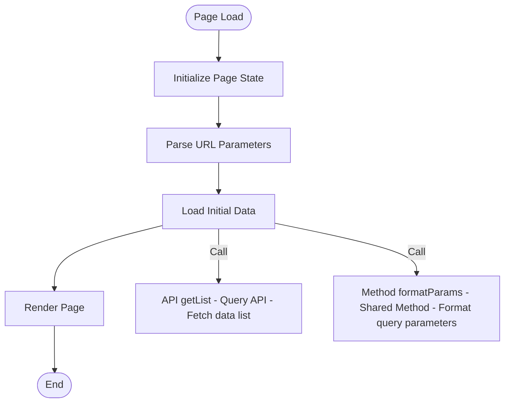
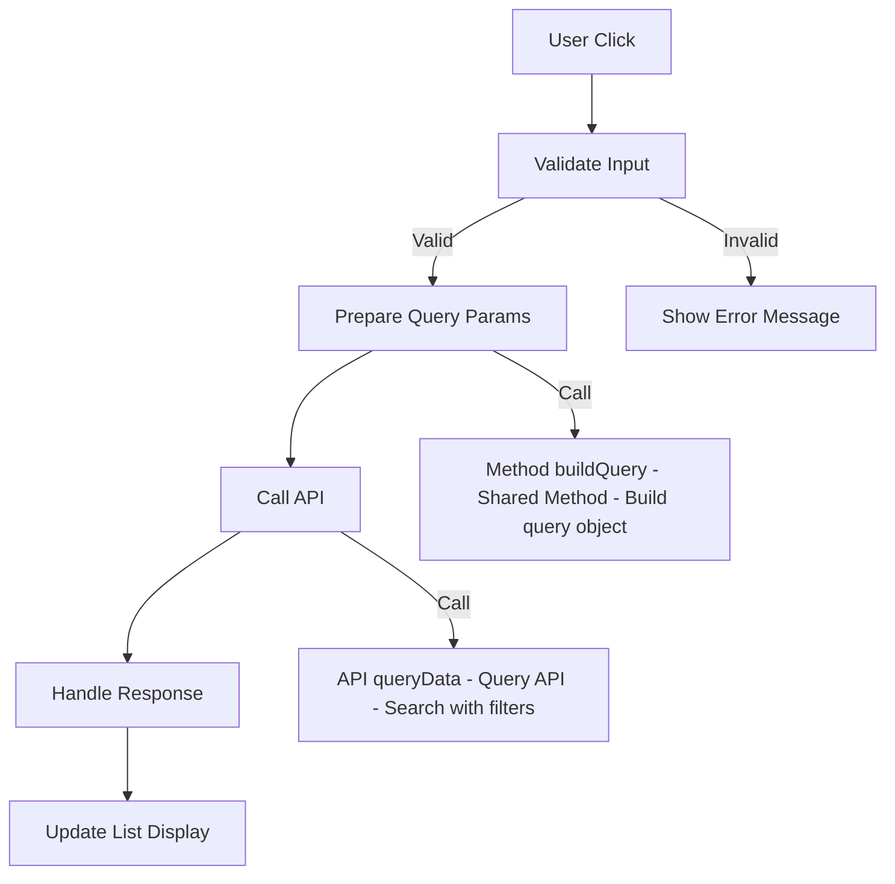
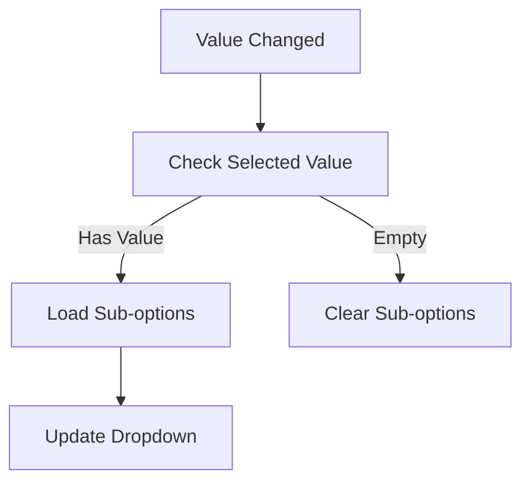
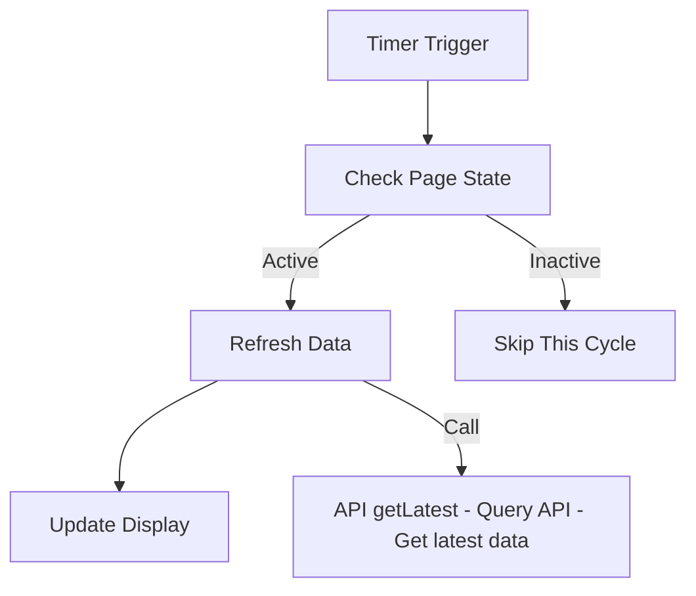
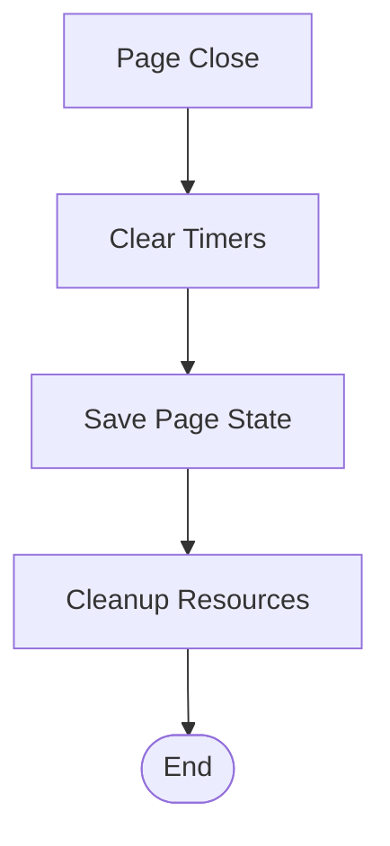

# Feature Detail Design Template - [Feature Name]

## 1. Content Overview

name: {Feature Name}

description: Feature overview.

document-path: {documentPath}
source-path: {sourcePath}

## 2. Interface Prototype

<!-- AI-TAG: UI_PROTOTYPE -->
<!-- AI-NOTE: UI prototype uses ASCII wireframes to visually display page layout, elements and their positions -->
<!-- AI-NOTE: ONLY draw prototype for the MAIN PAGE defined in {{sourcePath}} -->
<!-- AI-NOTE: DO NOT draw prototypes for external components/modals defined in other files -->
<!-- AI-NOTE: For external pages or shared components, only add reference links in Section 5, no prototypes -->

### 2.1 {Main Page Name}

```
┌─────────────────────────────────────────────────────────────┐
│ [Page Title] {e.g., Product Management List}                │
├─────────────────────────────────────────────────────────────┤
│ ┌─────────────┬─────────────┬─────────────┬─────────────┐  │
│ │ Filter Area │ □ Checkbox  │ Input □     │ Dropdown ▼  │  │
│ │             │ Keyword:____|____________ │ Status:_____▼│  │
│ │             │ [Query]     [Reset]  [Add]                 │  │
│ └─────────────┴─────────────┴─────────────┴─────────────┘  │
│                                                             │
│ ┌─────────────────────────────────────────────────────────┐ │
│ │ No.  │ Field 1 │ Field 2 │ Field 3 │ Actions         │ │
│ ├──────┼─────────┼─────────┼─────────┼─────────────────┤ │
│ │ 1    │ {Value} │ {Value} │ {Value} │ [Edit][Delete]  │ │
│ │ 2    │ {Value} │ {Value} │ {Value} │ [Edit][Delete]  │ │
│ │ ...  │ ...     │ ...     │ ...     │ ...             │ │
│ └──────┴─────────┴─────────┴─────────┴─────────────────┘ │ │
│                                                             │
│ ┌─────────────────────────────────────────────────────────┐ │
│ │ Pagination: Total {X} records  Page [1][2][3]  {X}/page ▼│ │
│ └─────────────────────────────────────────────────────────┘ │
└─────────────────────────────────────────────────────────────┘
```

**Interface Element Description:**

| Area | Element | Type | Description | Interaction | Source Link |
|------|---------|------|-------------|-------------|-------------|
| Filter Area | Keyword | Input | {Fuzzy search product name/code} | Enter to trigger query | [Source](../../{sourcePath}) |
| Filter Area | Status Dropdown | Dropdown | {Filter product status} | Change triggers query | [Source](../../{sourcePath}) |
| Filter Area | Query Button | Button | {Execute query} | Click to refresh list | [Source](../../{sourcePath}) |
| List Area | Edit Link | Link | {Open edit page} | Click to navigate | [Source](../../{sourcePath}) |
| List Area | Delete Link | Link | {Delete record} | Click to confirm deletion | [Source](../../{sourcePath}) |

**External References:**
- Edit page: Navigate to [Edit Page](./edit.md) (external page, not drawn here)
- Delete confirmation: Uses [DeleteConfirm Component](../../components/DeleteConfirm.md) (shared component)

<!-- AI-NOTE: DO NOT draw prototypes for external components/modals defined in other files -->
<!-- AI-NOTE: Only document embedded modals that are defined within the same source file -->
<!-- AI-NOTE: For external components, only add reference links in Section 5.3 or 5.4 -->


## 3. Business Flow Description

<!-- AI-TAG: BUSINESS_FLOW -->
<!-- AI-NOTE: Document ALL business flows triggered by user interactions in this page -->
<!-- AI-NOTE: Include: page initialization, component events (onChange, onClick, etc.), timers, websocket, page close -->
<!-- AI-NOTE: For backend APIs and frontend shared methods: only show name, type and main function, NO deep analysis -->
<!-- AI-NOTE: Follow speccrew-workspace/docs/rules/mermaid-rule.md guidelines: use graph TB/LR, no parentheses in node text, no HTML tags, no style -->

### 3.1 Page Initialization Flow

<!-- AI-NOTE: Document the business flow when page loads -->



**Flow Description:**

| Step | Business Operation | Trigger | Source |
|------|-------------------|---------|--------|
| 1 | Initialize page state | Page mount | [Source](../../{sourcePath}) |
| 2 | Parse URL parameters | Route change | [Source](../../{sourcePath}) |
| 3 | Load initial data | After params parsed | [Source](../../{sourcePath}) |
| 4 | Render page | Data loaded | [Source](../../{sourcePath}) |

**Referenced Items:**
| Name | Type | Main Function | Document Path |
|------|------|---------------|---------------|
| getList | API | Fetch data list | [API Doc](../../apis/getList.md) |
| formatParams | Shared Method | Format query parameters | [Method Doc](../../utils/formatParams.md) |

### 3.2 Component Event Flows

<!-- AI-NOTE: Document business flows for each component event (onClick, onChange, onBlur, etc.) -->

#### 3.2.1 {Event Name: e.g., Query Button onClick}



**Flow Description:**

| Step | Business Operation | Trigger | Source |
|------|-------------------|---------|--------|
| 1 | Validate input | onClick | [Source](../../{sourcePath}) |
| 2 | Prepare query params | Validation passed | [Source](../../{sourcePath}) |
| 3 | Call API | Params ready | [Source](../../{sourcePath}) |
| 4 | Handle response | API returned | [Source](../../{sourcePath}) |
| 5 | Update UI | Data processed | [Source](../../{sourcePath}) |

**Referenced Items:**
| Name | Type | Main Function | Document Path |
|------|------|---------------|---------------|
| queryData | API | Search with filters | [API Doc](../../apis/queryData.md) |
| buildQuery | Shared Method | Build query object | [Method Doc](../../utils/buildQuery.md) |

#### 3.2.2 {Event Name: e.g., Dropdown onChange}



**Flow Description:**

| Step | Business Operation | Trigger | Source |
|------|-------------------|---------|--------|
| 1 | Check selected value | onChange | [Source](../../{sourcePath}) |
| 2 | Load/Clear sub-options | Based on value | [Source](../../{sourcePath}) |
| 3 | Update UI | Options ready | [Source](../../{sourcePath}) |

### 3.3 Timer/WebSocket Flows (if applicable)

<!-- AI-NOTE: Document flows triggered by timers or websocket events -->

#### 3.3.1 {Timer/WebSocket Event Name}



**Flow Description:**

| Step | Business Operation | Trigger | Source |
|------|-------------------|---------|--------|
| 1 | Check page state | Timer interval | [Source](../../{sourcePath}) |
| 2 | Refresh data | Page is active | [Source](../../{sourcePath}) |
| 3 | Update UI | Data received | [Source](../../{sourcePath}) |

**Referenced Items:**
| Name | Type | Main Function | Document Path |
|------|------|---------------|---------------|
| getLatest | API | Get latest data | [API Doc](../../apis/getLatest.md) |

### 3.4 Page Close/Cleanup Flow (if applicable)

<!-- AI-NOTE: Document cleanup operations when page closes -->



**Flow Description:**

| Step | Business Operation | Trigger | Source |
|------|-------------------|---------|--------|
| 1 | Clear timers | beforeUnmount | [Source](../../{sourcePath}) |
| 2 | Save page state | Cleanup start | [Source](../../{sourcePath}) |
| 3 | Cleanup resources | State saved | [Source](../../{sourcePath}) |

## 4. Data Field Definition

<!-- AI-TAG: DATA_DEFINITION -->
<!-- AI-NOTE: Document data fields used in this page only -->

### 4.1 Page State Fields

| Field Name | Field Type | Description | Source |
|------------|------------|-------------|--------|
| {Field 1} | String/Number/Boolean/Array/Object | {Description} | [Source](../../{sourcePath}) |
| {Field 2} | String | {Description} | [Source](../../{sourcePath}) |

### 4.2 Form Fields (if applicable)

| Field Name | Field Type | Validation Rules | Default Value | Source |
|------------|------------|------------------|---------------|--------|
| {Form Field 1} | String | {Required, length 1-100} | - | [Source](../../{sourcePath}) |
| {Form Field 2} | Number | {≥0} | 0 | [Source](../../{sourcePath}) |


## 5. References

<!-- AI-TAG: REFERENCES -->
<!-- AI-NOTE: List all external references used in this page -->
<!-- AI-NOTE: Follow bizs document path convention for all reference links -->

### 5.1 APIs

| API Name | Type | Main Function | Source | Document Path |
|----------|------|---------------|--------|---------------|
| {API Name} | Query/Mutation | {Brief description} | [Source](../../{apiSourcePath}) | [API Doc](../../apis/{api-name}.md) |

### 5.2 Frontend Shared Methods

| Method Name | Type | Main Function | Source | Document Path |
|-------------|------|---------------|--------|---------------|
| {Method Name} | Utils/Helpers | {Brief description} | [Source](../../{methodSourcePath}) | [Method Doc](../../utils/{method-name}.md) |

### 5.3 Shared Components

| Component Name | Type | Main Function | Source | Document Path |
|----------------|------|---------------|--------|---------------|
| {Component Name} | UI Component | {Brief description} | [Source](../../{componentSourcePath}) | [Component Doc](../../components/{component-name}.md) |

### 5.4 Other Pages (This Page References)

<!-- AI-NOTE: List external pages/components that this page references/uses -->
<!-- AI-NOTE: DO NOT analyze these external files, only record their paths for reference -->
<!-- AI-NOTE: Each external page will have its own separate document generated by another worker -->

| Page Name | Relation Type | Description | Source | Document Path |
|-----------|---------------|-------------|--------|---------------|
| {Page Name} | Navigate/Embed | {Relation description} | [Source](../../{pageSourcePath}) | [Page Doc](../{page-path}.md) |

### 5.5 Referenced By (Other Pages Reference This Page)

<!-- AI-NOTE: List all pages that reference/navigate to this page -->
<!-- AI-NOTE: Search through other page files to find references to this page -->

| Page Name | Function Description | Source Path | Document Path |
|-----------|---------------------|-------------|---------------|
| {Referencing Page Name} | {e.g., "Click order ID to navigate to this detail page"} | {source-path} | [Page Doc](../{page-path}.md) |


## 6. Business Rule Constraints

<!-- AI-TAG: BUSINESS_RULES -->

### 6.1 Permission Rules

| Operation | Permission Requirement | No Permission Handling | Source |
|-----------|----------------------|----------------------|--------|
| Add/Edit/Delete | Have {role name} role or {permission code} permission | Hide operation button, show "No permission" when clicked | [Source](../../{sourcePath}) |
| View sensitive fields | Have {data permission} scope | Display sensitive fields as "***" | [Source](../../{sourcePath}) |

### 6.2 Business Logic Rules

1. **{Rule 1}**: {e.g., Product code generation rule is "SP+YYMMDD+6 random digits"} | [Source](../../{sourcePath})
2. **{Rule 2}**: {e.g., When stock is 0, product status automatically changes to "Off-shelf"} | [Source](../../{sourcePath})

### 6.3 Validation Rules

| Validation Scenario | Validation Rule | Prompt Message | Validation Timing | Source |
|--------------------|-----------------|----------------|-------------------|--------|
| Form submission | Product name cannot be empty | Please enter product name | Frontend blur + Backend submit | [Source](../../{sourcePath}) |
| Form submission | Product code format error (must start with SP) | Product code must start with SP, please check | Backend submit | [Source](../../{sourcePath}) |


## 7. Notes and Additional Information

<!-- AI-TAG: ADDITIONAL_NOTES -->

### 7.1 Compatibility Adaptation

- **Interface Adaptation**: Supports PC 1920×1080 resolution, responsive adaptation for 1366×768 and above
- **Interaction Adaptation**: Supports mouse click/Enter to trigger actions, supports keyboard Tab key to switch focus

### 7.2 Pending Confirmations

- [ ] **{Pending 1}**: {e.g., Whether product category dropdown needs to support fuzzy search}
- [ ] **{Pending 2}**: {e.g., Whether delete operation needs secondary confirmation}

### 7.3 Extension Notes

- This prototype is a simplified version of the core process, extended fields/features can be added in subsequent iterations
- ASCII wireframe prototype only expresses layout and interaction logic, visual styles (e.g., colors, fonts) should refer to product visual specifications

---

**Document Status:** 📝 Draft / 👀 In Review / ✅ Published  
**Last Updated:** {Date}  
**Maintainer:** {Name}  
**Related Module Document:** [Module Overview Document](../{{module-name}}-overview.md)

**Section Source**
- [{FeatureFile}.vue](../../{sourcePath})
- [{StoreFile}.ts](../../{store-path})
- [{ComponentFile}.vue](../../{component-path})
