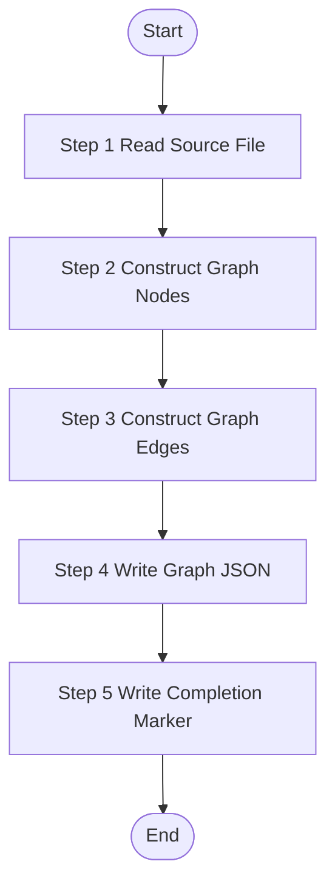

# UI Knowledge Graph Constructor

> **CRITICAL CONSTRAINT**: DO NOT create temporary scripts, batch files, or workaround code files (`.py`, `.bat`, `.sh`, `.ps1`, etc.) under any circumstances.

Construct knowledge graph data (nodes, edges, relationships) from UI feature analysis results and write completion marker files for the bizs knowledge pipeline.

## Trigger Scenarios

- "Construct graph data for UI feature {fileName}"
- "Generate graph nodes and edges from UI analysis"
- "Write completion markers for feature {fileName}"

## Input Variables

| Variable | Type | Description | Example |
|----------|------|-------------|---------|
| `{{feature}}` | object | Complete feature object from features.json | - |
| `{{fileName}}` | string | Feature file name | `"index"`, `"UserForm"` |
| `{{sourcePath}}` | string | Relative path to source file | `"frontend-web/src/views/system/user/index.vue"` |
| `{{documentPath}}` | string | Path to generated documentation | `"speccrew-workspace/knowledges/bizs/..."` |
| `{{module}}` | string | Business module name | `"system"`, `"trade"`, `"_root"` |
| `{{platform_type}}` | string | Platform type | `"web"`, `"mobile"` |
| `{{platform_subtype}}` | string | Platform subtype | `"vue"`, `"react"` |
| `{{completed_dir}}` | string | Marker files output directory | `"speccrew-workspace/knowledges/base/sync-state/knowledge-bizs/completed"` |
| `{{sourceFile}}` | string | Source features JSON file name | `"features-web-vue.json"` |
| `{{status}}` | string | Analysis status from UI analysis | `"success"`, `"partial"`, `"failed"` |
| `{{analysisNotes}}` | string | Analysis notes from UI analysis | `"Successfully analyzed..."` |

## Output

**Generated Files (MANDATORY):**
1. `{{completed_dir}}/{module}-{subpath}-{fileName}.graph.json` - Graph data with nodes and edges
2. `{{completed_dir}}/{module}-{subpath}-{fileName}.graph-done.json` - Graph completion marker

## Workflow



---

### Step 1: Read Source File

**Step 1 Status: 🔄 IN PROGRESS**

1. **Locate and Read the source file:**
   - Use `{{sourcePath}}` as the relative file path from project root
   - Read the feature file content to extract API imports, component usage, and navigation patterns

2. **Extract API imports:**
   - Scan for `import { ... } from '@/api/...'` or similar API import statements
   - List ALL imported API functions

3. **Extract component usage:**
   - Scan for component registrations and usage in templates
   - Identify shared/local components used

4. **Extract navigation patterns:**
   - Scan for `router.push`, `router.replace`, `<router-link>`, `navigate()` calls
   - Identify target pages for navigation

**Output:** "Step 1 Status: ✅ COMPLETED - Read {{sourcePath}}, found {{apiCount}} APIs, {{componentCount}} components, {{navCount}} navigations"

---

### Step 2: Construct Graph Nodes

**Step 2 Status: 🔄 IN PROGRESS**

Construct nodes for the analyzed UI feature.

**Node Types to Construct:**

| Node Type | Source | ID Format | Context Fields |
|-----------|--------|-----------|----------------|
| `page` | The analyzed page/screen | `page-{module}-{name}` | `route`, `components`, `events`, `platform` |
| `component` | Embedded or local components | `component-{module}-{name}` | `props`, `events`, `slots` |

**Node Structure:**

```json
{
  "id": "page-{module}-{feature-name}",
  "type": "page",
  "name": "<display name>",
  "module": "{{module}}",
  "sourcePath": "{{sourcePath}}",
  "documentPath": "{{documentPath}}",
  "description": "...",
  "tags": [...],
  "keywords": [...],
  "context": {
    "route": "...",
    "components": [...],
    "platform": "{{platform_type}}-{{platform_subtype}}"
  }
}
```

**Node ID Naming Convention:**

```
{type}-{module}-{name}

Examples:
  page-system-user-list
  page-system-user-detail
  component-system-user-form
  component-shared-delete-confirm
```

**IMPORTANT:**
- `module` comes from `{{module}}` input variable
- `name` should be a short, readable slug derived from the page/component name
- Each node must include `sourcePath` and `documentPath`
- For pages, include route information and used components in context

**Output:** "Step 2 Status: ✅ COMPLETED - Constructed {{nodeCount}} nodes"

---

### Step 3: Construct Graph Edges

**Step 3 Status: 🔄 IN PROGRESS**

Construct edges representing relationships between the UI feature and other entities.

**Edge Types to Construct:**

| Edge Type | Direction | When to Create |
|-----------|-----------|----------------|
| `calls` | page → api | Page calls an API endpoint |
| `navigates-to` | page → page | Page navigates to another page |
| `uses` | page → component | Page uses a shared/local component |

**Edge Structure:**

```json
{
  "source": "page-{module}-{name}",
  "target": "api-{module}-{api-name}",
  "type": "calls",
  "metadata": {
    "trigger": "onClick|onMounted|onSubmit|...",
    "method": "getUserList",
    "context": "Page initialization - load user list"
  }
}
```

**CRITICAL - API Coverage Requirements (100% Coverage Mandatory):**

1. **Extract ALL Imported API Functions:**
   - Scan the entire source file for ALL API import statements
   - EVERY function imported from API modules MUST be extracted as a `calls` edge

2. **API Call Categories to Cover:**

   | Category | Examples | Where to Look |
   |----------|----------|---------------|
   | Page Initialization | `getList`, `getDetail`, `getPage` | `onMounted`, `created`, `useEffect` |
   | Data Query | `getUserList`, `searchOrders` | Search forms, filter changes |
   | Create Operations | `createUser`, `addOrder` | Form submission handlers |
   | Update Operations | `updateUser`, `editOrder` | Edit form submissions |
   | Status Update | `updateUserStatus`, `toggleEnable` | Status switch handlers |
   | Special Operations | `resetPassword`, `exportData`, `importData` | Action buttons |
   | Delete Operations | `deleteUser`, `removeOrder` | Delete confirmation handlers |
   | Dictionary/Options | `getDictList`, `getOptions` | Dropdown initialization |

3. **How to Identify API Calls:**
   - Look for: `import { func1, func2 } from '@/api/xxx'` statements
   - Look for: Direct API function calls in event handlers
   - Look for: API calls in lifecycle hooks (Vue: `onMounted`, React: `useEffect`)
   - Look for: API calls in watch/computed setters

4. **API Coverage Verification Checklist:**
   - [ ] List ALL imported API functions from the source file
   - [ ] For each imported API, verify there is a corresponding `calls` edge
   - [ ] Check event handlers for API calls
   - [ ] Check lifecycle hooks for initialization API calls
   - [ ] Check status toggles, action buttons for special operation APIs
   - [ ] Verify no imported API is left unmapped

5. **Edge Metadata Requirements:**
   - `trigger`: Event name (e.g., "onClick", "onMounted", "onSubmit")
   - `method`: The API function name being called
   - `context`: Brief description of when/why this API is called

**Target Node ID Format for APIs:**
- `api-{module}-{name}` (will be matched with api-analyze output)

**Output:** "Step 3 Status: ✅ COMPLETED - Constructed {{edgeCount}} edges ({{apiEdgeCount}} API calls, {{navEdgeCount}} navigations, {{useEdgeCount}} component uses)"

---

### Step 4: Write Graph JSON

**Step 4 Status: 🔄 IN PROGRESS**

Write the graph data to the `.graph.json` marker file.

**Marker File Naming Convention:**

```
{completed_dir}/{module}-{subpath}-{fileName}.graph.json
```

**Naming Rule Explanation:**

The marker filename MUST follow the composite naming pattern `{module}-{subpath}-{fileName}` to prevent conflicts between same-named source files.

**How to Extract Each Component from `{{sourcePath}}`:**

1. **module**: Use `{{module}}` input variable directly (e.g., `system`, `trade`, `bpm`)

2. **subpath**: Extract the middle path between the platform source root and the file name:
   - Remove the top-level directory prefix (e.g., `yudao-ui/yudao-ui-admin-vue3/src/views/`)
   - Remove the file name at the end
   - Replace path separators (`/`) with hyphens (`-`)
   - If the file is at the module root directory, subpath will be empty → omit from filename

3. **fileName**: Use `{{fileName}}` input variable (file name WITHOUT extension)

**Examples:**

| sourcePath | module | subpath | fileName | Marker Filename |
|------------|--------|---------|----------|-----------------|
| `yudao-ui/.../system/notify/message/index.vue` | `system` | `notify-message` | `index` | `system-notify-message-index.graph.json` |
| `yudao-ui/.../system/user/index.vue` | `system` | `user` | `index` | `system-user-index.graph.json` |
| `yudao-ui/.../bpm/process-instance/index.vue` | `bpm` | `process-instance` | `index` | `bpm-process-instance-index.graph.json` |

**Special Case - Empty subpath:**
- If the file is directly in the module root directory: `{module}-{fileName}.graph.json`
- Example: `yudao-ui/.../system/index.vue` → `system-index.graph.json`

**Complete JSON Structure:**

```json
{
  "module": "{{module}}",
  "nodes": [
    {
      "id": "page-{{module}}-{{feature-name}}",
      "type": "page",
      "name": "<display name>",
      "module": "{{module}}",
      "sourcePath": "{{sourcePath}}",
      "documentPath": "{{documentPath}}",
      "description": "...",
      "tags": [...],
      "keywords": [...],
      "context": { "route": "...", "components": [...] }
    }
  ],
  "edges": [
    {
      "source": "page-...",
      "target": "api-...",
      "type": "calls",
      "metadata": { "trigger": "...", "method": "..." }
    }
  ]
}
```

> **⚠️ CRITICAL - module Field Requirement:**
> - The `.graph.json` file **MUST** have a root-level `module` field
> - Missing `module` field will cause the graph merge pipeline to reject this file

**Pre-write Verification:**
- [ ] Filename follows `{module}-{subpath}-{fileName}.graph.json` pattern
- [ ] JSON is valid (no trailing commas, all strings quoted)
- [ ] Root-level `module` field is present
- [ ] `nodes` and `edges` are arrays
- [ ] ALL imported API functions are represented as `calls` edges

**Output:** "Step 4 Status: ✅ COMPLETED - Graph JSON written to {{completed_dir}}/{marker-filename}.graph.json"

---

### Step 5: Write Graph Completion Marker

**Step 5 Status: 🔄 IN PROGRESS**

Write the `.graph-done.json` completion marker file to signal successful graph data generation.

**Marker File Path:**

```
{completed_dir}/{module}-{subpath}-{fileName}.graph-done.json
```

**Complete JSON Template (ALL fields required):**

```json
{
  "fileName": "{{fileName}}",
  "sourcePath": "{{sourcePath}}",
  "sourceFile": "{{sourceFile}}",
  "module": "{{module}}",
  "documentPath": "{{documentPath}}",
  "marker": "graph_completed",
  "graphFile": "{module}-{subpath}-{fileName}.graph.json",
  "nodeCount": {{node_count}},
  "edgeCount": {{edge_count}},
  "status": "{{status}}",
  "analysisNotes": "{{analysisNotes}}"
}
```

**Field Descriptions:**

| Field | Required | Description | Example |
|-------|----------|-------------|---------|
| `fileName` | ✅ YES | Feature file name **WITHOUT extension** | `"index"` |
| `sourcePath` | ✅ YES | Relative path to source file | `"frontend-web/src/views/system/user/index.vue"` |
| `sourceFile` | ✅ YES | Source features JSON filename | `"features-web-vue.json"` |
| `module` | ✅ YES | Business module name | `"system"` |
| `documentPath` | ✅ YES | Path to generated document | `"speccrew-workspace/knowledges/..."` |
| `marker` | ✅ YES | Fixed marker type | `"graph_completed"` |
| `graphFile` | ✅ YES | Corresponding graph JSON filename | `"system-notify-message-index.graph.json"` |
| `nodeCount` | ✅ YES | Number of nodes in graph | `5` |
| `edgeCount` | ✅ YES | Number of edges in graph | `12` |
| `status` | ✅ YES | Analysis status | `"success"`, `"partial"`, or `"failed"` |
| `analysisNotes` | ✅ YES | Summary message | `"Successfully analyzed..."` |

> **⚠️ CRITICAL - fileName Field Rules:**
> - The `fileName` field MUST contain only the feature file name **WITHOUT file extension**
> - ✅ CORRECT: `"fileName": "index"`
> - ❌ WRONG: `"fileName": "index.vue"` (includes extension)

> **⚠️ CRITICAL - sourcePath Validation:**
> - `sourcePath` MUST be a project-root-relative path
> - NEVER use platform-source-relative short paths

> **⚠️ CRITICAL - documentPath Rules:**
> - When no corresponding document exists, `documentPath` MUST be `"N/A"`
> - NEVER use empty string `""` for `documentPath`

**Pre-write Verification:**
- [ ] Filename follows `{module}-{subpath}-{fileName}.graph-done.json` pattern
- [ ] JSON is valid
- [ ] `fileName` does NOT contain file extension
- [ ] `sourceFile` matches `features-{platform}.json` pattern
- [ ] `module` field is present and non-empty
- [ ] `documentPath` is `"N/A"` when no document exists (not empty string)
- [ ] `nodeCount` and `edgeCount` match actual graph data

**Output:** "Step 5 Status: ✅ COMPLETED - Graph completion marker written to {{completed_dir}}/{marker-filename}.graph-done.json"

---

## Task Completion Report

When the task is complete, report the following:

**Status:** `success` | `partial` | `failed`

**Summary:**
- Feature: `{{fileName}}`
- Module: `{{module}}`
- Nodes constructed: `{{nodeCount}}`
- Edges constructed: `{{edgeCount}}`

**Files Generated:**
- `{{completed_dir}}/{marker-filename}.graph.json`
- `{{completed_dir}}/{marker-filename}.graph-done.json`

## Constraints

1. **100% API coverage** - ALL imported API functions MUST be represented as `calls` edges
2. **Valid JSON format** - Both `.graph.json` and `.graph-done.json` MUST be valid JSON
3. **Root-level module field** - `.graph.json` MUST include `module` at root level
4. **Correct filename pattern** - Use `{module}-{subpath}-{fileName}` composite naming
5. **No file extension in fileName** - The `fileName` field in `.graph-done.json` MUST NOT include extension
6. **documentPath as N/A** - Use `"N/A"` when no document exists, never empty string
