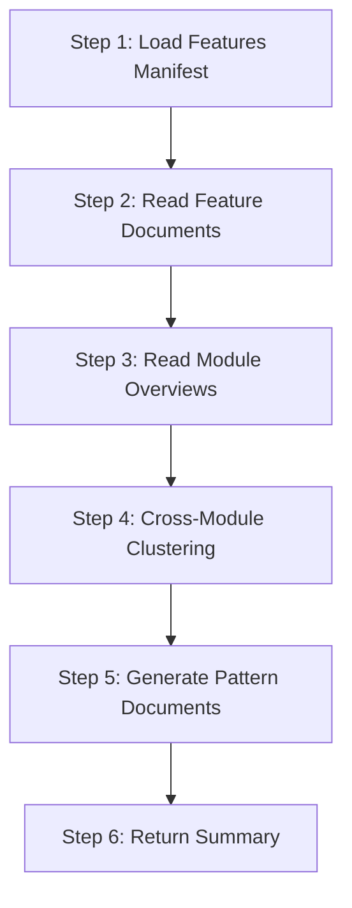

# Bizs UI Style Extract

Extract and aggregate **UI design patterns** from bizs pipeline analyzed feature documents. Through cross-module clustering analysis, identify common page types, component patterns, and layout patterns, then output them to the techs knowledge base `ui-style-patterns/` subdirectory.

## Language Adaptation

**CRITICAL**: All generated documents must match the user's language. Detect the language from the user's input and generate content accordingly.

- User writes in 中文 → Generate Chinese documents, use `language: "zh"`
- User writes in English → Generate English documents, use `language: "en"`
- User writes in other languages → Use appropriate language code

**All generated pattern documents must be in the language specified by the `language` parameter.**

## Trigger Scenarios

- Called by `speccrew-knowledge-bizs-dispatch` Stage 3.5 (after Module Summarize, before System Summary)
- "Extract UI patterns from bizs features"
- "Aggregate UI design patterns"

## Input

| Variable | Description | Required |
|----------|-------------|----------|
| `platform_id` | Platform identifier (e.g., web-vue, mobile-uniapp), used to locate output directory | Yes |
| `platform_type` | Platform type (web, mobile, desktop), only execute for frontend platforms | Yes |
| `feature_docs_path` | Completed feature documents base path, e.g., `speccrew-workspace/knowledges/bizs/{platform-type}/{module}/features/` | Yes |
| `features_manifest_path` | Path to features-{platform}.json, used to get completed feature list | Yes |
| `module_overviews_path` | **Parent directory** containing all module overview subdirectories. Example: `knowledges/bizs/web-vue/` (this directory contains `system/system-overview.md`, `user/user-overview.md`, etc.). **NOT** a specific module directory like `knowledges/bizs/web-vue/system/`. | Yes |
| `output_path` | Output directory, e.g., `speccrew-workspace/knowledges/techs/{platform_id}/ui-style-patterns/` | Yes |
| `language` | User language code | Yes |

## Output

> **Directory Separation**: This skill outputs to `ui-style-patterns/` (NOT `ui-style/`).
> - `ui-style/` is managed by techs pipeline (framework-level design system, existing components/pages)
> - `ui-style-patterns/` is managed by bizs pipeline (business pattern aggregation from feature docs)
> This separation prevents file conflicts between the two pipelines.

```
{output_path}/
├── page-types/          # Page type pattern documents
│   ├── {pattern-name}.md
│   └── ...
├── components/          # Component pattern documents
│   ├── {pattern-name}.md
│   └── ...
└── layouts/             # Layout pattern documents
    ├── {pattern-name}.md
    └── ...
```

## Absolute Constraints

> **These rules apply to ALL document generation steps. Violation = task failure.**

1. **FORBIDDEN: `create_file` for pattern documents** — NEVER use `create_file` to write pattern documents. Each document MUST be created by copying the appropriate template then filling sections with `search_replace`.

2. **FORBIDDEN: Full-file rewrite** — NEVER replace the entire document content in a single operation. Always use targeted `search_replace` on specific sections.

3. **MANDATORY: Template-first workflow** — Copy template MUST execute before filling sections for every pattern document.

## Workflow Overview



---

## Step 1: Load Features Manifest

**Goal**: Read the features manifest to identify all completed features.

**Input Validation**:
- If `platform_type` is NOT `web`, `mobile`, or `desktop` → Skip this skill (backend platforms do not have UI patterns)
- Verify `features_manifest_path` exists and is valid JSON
- Verify `feature_docs_path` exists and is a directory
- Create `output_path` directory if it does not exist

**Action**:
- Read `{features_manifest_path}` (e.g., `speccrew-workspace/knowledges/base/sync-state/knowledge-bizs/features-{platform}.json`)
- Filter features where `status === "completed"`
- Collect feature metadata: `featureId`, `module`, `documentPath`

**Output**: List of completed features with their document paths.

---

## Step 2: Read Feature Documents

**Goal**: Extract UI-related information from all completed feature documents.

**Action**:
- For each completed feature, read the `.md` document from `documentPath`
- Extract the following sections:
  - **Interface Prototype**: ASCII wireframe diagrams
  - **Page Elements Table**: Component list with types and responsibilities
  - **Business Flow Description**: Interaction patterns

**Extraction Focus**:
| Section | What to Extract |
|---------|-----------------|
| Interface Prototype | ASCII wireframe structure, layout regions |
| Page Elements Table | Component names, types, responsibilities, interactions |
| Business Flow Description | User interaction sequences, navigation patterns |

---

## Step 3: Read Module Overviews

**Goal**: Gather module-level aggregated information for context.

**Action**:
- Read all `module-overview.md` files from `{module_overviews_path}`
- Extract module-level summaries about:
  - Common page structures
  - Shared components
  - Navigation patterns

**Output**: Module-level context for pattern clustering.

---

## Step 4: Cross-Module Clustering Analysis

**Goal**: Identify recurring UI patterns across modules through clustering analysis.

**Action**:
- Analyze all extracted UI information from Steps 2-3
- Cluster similar patterns into categories:
  - **Page Types**: Pages with similar structure and purpose
  - **Component Patterns**: Reusable component combinations
  - **Layout Patterns**: Repeating structural layouts

**Clustering Strategy**:
- Adopt dynamic discovery strategy — Agent automatically identifies and categorizes pattern types based on actual analysis results
- Templates only standardize output format, do not limit pattern types
- Common patterns include but are not limited to:

| Category | Common Patterns |
|----------|-----------------|
| Page Types | list-page, form-page, detail-page, tree-list-page, dashboard-page, wizard-page |
| Component Patterns | search-filter-bar, data-table-pagination, modal-form, drawer-detail, tab-panel |
| Layout Patterns | sidebar-content, topbar-sidebar-content, full-screen |

**Pattern Recognition Criteria**:
- **Frequency**: Pattern appears in 2+ features (stronger signal if across different modules)
- **Similarity**: Structural similarity in ASCII wireframes
- **Semantic alignment**: Similar business purpose and interaction flow

> **Note**: Cross-module occurrence is a strong signal but not required. Patterns appearing in multiple features within a single module are also valid for extraction.

---

## Step 5: Generate Pattern Documents

**Goal**: Create pattern documents for each identified pattern using template-fill workflow.

### 5.1 Template Selection

| Pattern Category | Template File | Output Directory |
|-----------------|---------------|------------------|
| Page types | `templates/PAGE-TYPE-TEMPLATE.md` | `{output_path}/page-types/` |
| Component patterns | `templates/COMPONENT-PATTERN-TEMPLATE.md` | `{output_path}/components/` |
| Layout patterns | `templates/LAYOUT-PATTERN-TEMPLATE.md` | `{output_path}/layouts/` |

**File Naming Convention**:
- Use `kebab-case` for pattern names
- Examples: `list-page.md`, `search-filter-bar.md`, `sidebar-content.md`

### 5.2 For Each Pattern: Copy Template to Document Path

For each identified pattern:
1. **Select the appropriate template** based on pattern category
2. **Replace top-level placeholders** (pattern name, category, etc.)
3. **Create the document** using `create_file` at the corresponding output path
4. **Verify**: Document has complete section structure ready for filling

### 5.3 For Each Pattern: Fill Sections Using search_replace

> ⚠️ **CRITICAL CONSTRAINTS:**
> - **FORBIDDEN: `create_file` to rewrite the entire document**
> - **MUST use `search_replace` to fill each section individually**
> - **All section titles MUST be preserved**

**Content Requirements**:
1. **ASCII wireframes**: Must be generalized versions (not direct copies from specific features)
2. **Instance references**: Must use relative paths to reference actual feature documents
3. **Mermaid diagrams**: Must follow `speccrew-workspace/docs/rules/mermaid-rule.md` rules
   - Use `graph TB/LR` syntax only
   - No `<br/>` tags, no `style` definitions, no nested `subgraph`
   - No `direction` keyword, no special symbols

---

## Step 6: Return Summary

**Goal**: Provide summary of generated pattern documents.

**Action**:
- Collect all generated file paths
- Count patterns by category
- Return summary object

---

## Generation Rules

1. **Pattern Quality**:
   - Each pattern must have clear applicable scenarios
   - Generalized ASCII wireframe (not feature-specific)
   - At least 2 instance references (from same or different modules)

2. **Template Compliance**:
   - All sections from template must be filled
   - Instance reference paths must be relative and valid

3. **Mermaid Compliance**:
   - Follow all rules in `mermaid-rule.md`
   - Use basic `graph TB` or `graph LR` syntax
   - No prohibited syntax elements

4. **Language Consistency**:
   - All content in the specified `language`
   - Template section headers remain in English
   - Content text matches user language

---

## Error Handling

| Scenario | Handling |
|----------|----------|
| No completed features | Return empty result, log warning |
| No patterns identified | Return empty result, log message |
| Template not found | Use default structure, log warning |
| Feature document missing | Skip feature, continue with others |

---

## Checklist

- [ ] Step 1: Features manifest loaded, completed features identified
- [ ] Step 2: All completed feature documents read
- [ ] Step 3: All module overviews read
- [ ] Step 4: Cross-module clustering analysis completed
- [ ] Step 5: Pattern documents generated with correct templates
- [ ] Step 5: File naming follows kebab-case convention
- [ ] Step 5: ASCII wireframes are generalized versions
- [ ] Step 5: Instance references use relative paths
- [ ] Step 5: Mermaid diagrams follow mermaid-rule.md
- [ ] Step 6: Summary returned with file list

## Return

After completion, return a summary object to the caller:

```json
{
  "status": "completed",
  "platform_id": "web-vue",
  "patterns": {
    "page_types": {
      "count": 3,
      "files": ["page-types/list-page.md", "page-types/form-page.md", "page-types/detail-page.md"]
    },
    "components": {
      "count": 2,
      "files": ["components/search-filter-bar.md", "components/modal-form.md"]
    },
    "layouts": {
      "count": 1,
      "files": ["layouts/sidebar-content.md"]
    }
  },
  "total_patterns": 6,
  "output_path": "speccrew-workspace/knowledges/techs/web-vue/ui-style-patterns/"
}
```
