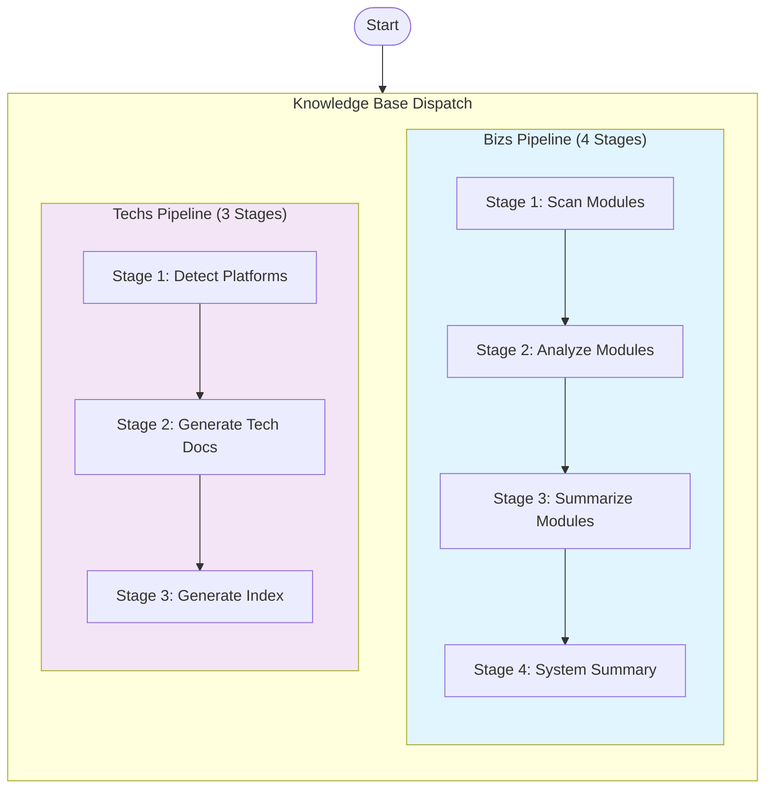

# Knowledge Base Dispatch

Orchestrate **both bizs and techs knowledge base generation** in parallel with multi-stage pipelines.

## Language Adaptation

**CRITICAL**: All generated documents must match the user's language. Detect the language from the user's input and pass it to all downstream Worker Agents.

- User writes in 中文 → Generate Chinese documents, pass `language: "zh"` to workers
- User writes in English → Generate English documents, pass `language: "en"` to workers
- User writes in other languages → Use appropriate language code

**All downstream skills must receive the `language` parameter and generate content in that language only.**

## Trigger Scenarios

- "Initialize knowledge base"
- "Initialize bizs and techs knowledge base"
- "Generate knowledge from source code"
- "Dispatch knowledge generation tasks"

## User

Leader Agent (speccrew-team-leader)

## Prerequisites

- Source code available for analysis

## Input

- `source_path`: Source code root path (default: project root)
- `knowledge_types`: Types of knowledge to generate - `"bizs"`, `"techs"`, or `"both"` (default: `"both"`)
  - `bizs`: Generate business knowledge only
  - `techs`: Generate technology knowledge only
  - `both`: Generate both bizs and techs knowledge in parallel
- `output_path`: Output directory (default: `speccrew-workspace/knowledges/`)
- `sync_mode`: Knowledge base update mode - `"full"` or `"incremental"` (default: `"full"`)
  - `full`: Rebuild knowledge base for all modules/platforms
  - `incremental`: Only update modules/platforms affected by recent code changes (Git-managed projects)
- `base_commit` (optional, incremental mode only): Git commit hash used as the comparison base
- `head_commit` (optional, incremental mode only): Git commit hash for current HEAD. If omitted, assume `HEAD`.
- `changed_files` (optional, incremental mode only): Pre-computed list of changed files between `base_commit` and `head_commit` (e.g., from `git diff --name-only`)

## Platform Naming Convention

1. **Read Configuration**:
   - Read `speccrew-workspace/docs/configs/platform-mapping.json` - Get standardized platform mapping rules

2. **Apply Platform Naming Rules**:

To ensure consistency between bizs and techs pipelines, all platform identifiers must follow the standardized mapping.

| Concept | bizs-init (modules.json) | techs-init (techs-manifest.json) | Example (UniApp) |
|---------|--------------------------|----------------------------------|------------------|
| **Category** | `platform_type` | `platform_type` | `mobile` |
| **Technology** | `platform_subtype` | `framework` | `uniapp` |
| **Identifier** | `{platform_type}/{platform_subtype}` | `platform_id` | `mobile-uniapp` |

### Standard Values

Refer to `platform-mapping.json` for complete list:
- `platform_categories` - Valid platform types and their subtypes
- `mappings` - Complete mapping table for all supported platforms
- `naming_conventions` - Field mapping rules between bizs and techs

**Example for UniApp mobile platform:**
- modules.json: `"platform_type": "mobile"`, `"platform_subtype": "uniapp"`
- techs-manifest.json: `"platform_type": "mobile"`, `"platform_id": "mobile-uniapp"`, `"framework": "uniapp"`
## Output

- Task status records in `speccrew-workspace/knowledges/base/sync-state/knowledge-bizs/` and/or `speccrew-workspace/knowledges/base/sync-state/knowledge-techs/`
- Generated documentation in `speccrew-workspace/knowledges/bizs/` and/or `speccrew-workspace/knowledges/techs/`

## Workflow Overview



**Pipeline Execution Rules:**
- When `knowledge_types = "bizs"`: Execute Bizs Pipeline only
- When `knowledge_types = "techs"`: Execute Techs Pipeline only  
- When `knowledge_types = "both"`: Both pipelines run in **PARALLEL**

---

## Bizs Knowledge Pipeline (4-Stage)

### Bizs Stage 1: Generate Module List (Single Task)

**Goal**: Scan source code and identify all modules.

**Action**:
- Invoke 1 Worker Agent (`speccrew-task-worker.md`) with skill `speccrew-knowledge-bizs-init/SKILL.md`
- Task: Analyze project structure, detect modules
- Parameters to pass to skill:
  - `source_path`: Source code directory path (default: project root)
  - `output_path`: Output directory (default: `speccrew-workspace/knowledges/base/sync-state/knowledge-bizs/`)
  - `language`: User's language (e.g., "zh", "en") - **REQUIRED**

**Output**:
- `speccrew-workspace/knowledges/base/sync-state/knowledge-bizs/modules.json`

See [templates/modules-EXAMPLE.json](templates/modules-EXAMPLE.json) for complete example.

### Bizs Stage 2: Module Analysis (Parallel)

**Goal**: Analyze each module in parallel to generate feature details.

**Action (full mode)**:
- Read `speccrew-workspace/knowledges/base/sync-state/knowledge-bizs/modules.json`
- Iterate through each `platform` in `platforms` array
- For each module within the platform, invoke 1 Worker Agent (`speccrew-task-worker.md`) with skill `speccrew-knowledge-module-analyze/SKILL.md`
- Parameters to pass to skill:
  - `module_name`: Module code_name from modules.json
  - `platform_name`: Platform name (e.g., "Web Frontend", "Mobile App")
  - `platform_type`: Platform type (e.g., "web", "mobile-flutter")
  - `system_type`: Module system type - `"ui"` or `"api"` (from modules.json)
  - `source_path`: Platform-specific source path (from platform.source_path)
  - `tech_stack`: Platform tech stack array
  - `entry_points`: Module entry points (relative file paths)
  - `backend_apis`: Associated backend API endpoints for this module (from modules.json, only when `system_type: "ui"`)
  - `output_path`: Output directory for the module (e.g., `speccrew-workspace/knowledges/bizs/{platform_type}/{module_name}/`)
  - `language`: User's language (e.g., "zh", "en") - **REQUIRED**

**Action (incremental mode)**:
- Precondition: Caller has prepared `base_commit`, `head_commit` and `changed_files` (file list from `git diff --name-only base_commit head_commit`).
- Read both previous and latest `modules.json` snapshots if available (e.g., `modules.json` from `base_commit` and current one from Stage 1).
- For each platform and module in the **latest** `modules.json`:
  - Build `Files(module)` from:
    - `platform.source_path + entry_points[*]`
    - (Optional) files that implement `backend_apis` (e.g., controllers/services).
  - Determine module status:
    - **NEW**: module only exists in latest `modules.json`
    - **CHANGED**: `Files(module)` intersects with `changed_files`
    - **DELETED**: module only exists in previous `modules.json`
    - **UNMODIFIED**: all others
- Only dispatch Workers for modules with status **NEW** or **CHANGED**.

**Parallel Tasks** (grouped by platform):
```
Platform: Web Frontend (web)
  Worker 1: module="order",   source="/project/web",   output="speccrew-workspace/knowledges/bizs/web/order/"
  Worker 2: module="payment", source="/project/web",   output="speccrew-workspace/knowledges/bizs/web/payment/"

Platform: Mobile App (mobile-flutter)
  Worker 3: module="order",   source="/project/mobile", output="speccrew-workspace/knowledges/bizs/mobile-flutter/order/"
  Worker 4: module="payment", source="/project/mobile", output="speccrew-workspace/knowledges/bizs/mobile-flutter/payment/"
```

**Output per Module**:
- `{{module_name}}-overview.md` (initial version with feature list)
- `features/{{feature_name}}.md` (one per feature)

**Status Tracking**:
- `speccrew-workspace/knowledges/base/sync-state/knowledge-bizs/stage2-status.json`

### Bizs Stage 3: Module Summarize (Parallel)

**Goal**: Complete each module overview based on feature details.

**Prerequisite**: Stage 2 completed for the module (in full or incremental mode).

**Action (full mode)**:
- Read `speccrew-workspace/knowledges/base/sync-state/knowledge-bizs/modules.json`
- Iterate through each `platform` in `platforms` array
- For each module within the platform, invoke 1 Worker Agent (`speccrew-task-worker.md`) with skill `speccrew-knowledge-module-summarize/SKILL.md`
- Parameters to pass to skill:
  - `module_name`: Module code_name from modules.json
  - `module_path`: Path to module directory (e.g., `speccrew-workspace/knowledges/bizs/{platform_type}/{module_name}/`)
  - `language`: User's language (e.g., "zh", "en") - **REQUIRED**

**Action (incremental mode)**:
- Reuse module status from Stage 2 (NEW / CHANGED / DELETED / UNMODIFIED).
- Only dispatch Workers for modules with status **NEW** or **CHANGED**.

**Parallel Tasks** (grouped by platform):
```
Platform: Web Frontend (web)
  Worker 1: module="order",   module_path="speccrew-workspace/knowledges/bizs/web/order/"
  Worker 2: module="payment", module_path="speccrew-workspace/knowledges/bizs/web/payment/"

Platform: Mobile App (mobile-flutter)
  Worker 3: module="order",   module_path="speccrew-workspace/knowledges/bizs/mobile-flutter/order/"
  Worker 4: module="payment", module_path="speccrew-workspace/knowledges/bizs/mobile-flutter/payment/"
```

**Output per Module**:
- `{{module_name}}-overview.md` (complete version)

**Status Tracking**:
- `speccrew-workspace/knowledges/base/sync-state/knowledge-bizs/stage3-status.json`

### Bizs Stage 4: System Summarize (Single Task)

**Goal**: Generate complete system-overview.md aggregating all platforms and modules.

**Prerequisite**: All Stage 3 tasks completed.

**Action**:
- Read `speccrew-workspace/knowledges/base/sync-state/knowledge-bizs/modules.json` to get platform structure
- Invoke 1 Worker Agent (`speccrew-task-worker.md`) with skill `speccrew-knowledge-system-summarize/SKILL.md`
- Parameters to pass to skill:
  - `modules_path`: Path to knowledge base directory containing all platform modules (e.g., `speccrew-workspace/knowledges/bizs/`)
  - `output_path`: Output path for system-overview.md (e.g., `speccrew-workspace/knowledges/bizs/`)
  - `language`: User's language (e.g., "zh", "en") - **REQUIRED**

**Output**:
- `speccrew-workspace/knowledges/bizs/system-overview.md` (complete with platform index and module hierarchy)

---

## Techs Knowledge Pipeline (3-Stage)

### Techs Stage 1: Detect Platform Manifest (Single Task)

**Goal**: Scan source code and identify all technology platforms.

**Action**:
- Invoke 1 Worker Agent (`speccrew-task-worker.md`) with skill `speccrew-knowledge-techs-init/SKILL.md`
- Task: Analyze project structure, detect technology platforms
- Parameters to pass to skill:
  - `source_path`: Source code directory path
  - `output_path`: Output directory (default: `speccrew-workspace/knowledges/base/sync-state/knowledge-techs/`)
  - `language`: User's language (e.g., "zh", "en") - **REQUIRED**

**Output**:
- `speccrew-workspace/knowledges/base/sync-state/knowledge-techs/techs-manifest.json`

See [templates/techs-manifest-EXAMPLE.json](templates/techs-manifest-EXAMPLE.json) for complete example.

---

### Techs Stage 2: Generate Platform Documents (Parallel)

**Goal**: Generate technology documentation for each platform in parallel.

**Action**:
- Read `speccrew-workspace/knowledges/base/sync-state/knowledge-techs/techs-manifest.json`
- For each platform in `platforms` array, invoke 1 Worker Agent (`speccrew-task-worker.md`) with skill `speccrew-knowledge-techs-generate/SKILL.md`
- Parameters to pass to skill:
  - `platform_id`: Platform identifier from manifest
  - `platform_type`: Platform type (web, mobile, backend, desktop)
  - `framework`: Primary framework
  - `source_path`: Platform source directory
  - `config_files`: List of configuration file paths
  - `convention_files`: List of convention file paths
  - `output_path`: Output directory for platform docs (e.g., `speccrew-workspace/knowledges/techs/{platform_id}/`)
  - `language`: User's language (e.g., "zh", "en") - **REQUIRED**

**Parallel Tasks**:
```yaml
# Worker 1 - Generate web-react tech docs
subagent_type: "speccrew-task-worker"
description: "Generate web-react technology documents"
prompt: |
  skill_path: speccrew-knowledge-techs-generate/SKILL.md
  context:
    platform_id: web-react
    platform_type: web
    framework: react
    source_path: src/web
    config_files: ["src/web/package.json", "src/web/tsconfig.json", "src/web/vite.config.ts"]
    convention_files: ["src/web/.eslintrc.js", "src/web/.prettierrc"]
    output_path: speccrew-workspace/knowledges/techs/web-react/
    language: zh

# Worker 2 - Generate backend-nestjs tech docs
subagent_type: "speccrew-task-worker"
description: "Generate backend-nestjs technology documents"
prompt: |
  skill_path: speccrew-knowledge-techs-generate/SKILL.md
  context:
    platform_id: backend-nestjs
    platform_type: backend
    framework: nestjs
    source_path: src/server
    config_files: ["src/server/package.json", "src/server/nest-cli.json", "src/server/tsconfig.json"]
    convention_files: ["src/server/.eslintrc.js"]
    output_path: speccrew-workspace/knowledges/techs/backend-nestjs/
    language: zh
```

**Output per Platform**:
```
speccrew-workspace/knowledges/techs/{platform_id}/
├── INDEX.md                    # 必需
├── tech-stack.md              # 必需
├── architecture.md            # 必需
├── conventions-design.md      # 必需
├── conventions-dev.md         # 必需
├── conventions-test.md        # 必需
├── conventions-data.md        # 可选 - 仅特定平台需要
└── ui-style/                  # 可选 - 仅前端平台(web/mobile/desktop)
    ├── ui-style-guide.md      # UI 风格指南
    ├── page-types/            # 页面类型分析
    ├── components/            # 组件分析
    ├── layouts/               # 布局模式
    └── styles/                # 样式规范
```

**关于可选文件 `conventions-data.md` 的处理**:

| 平台类型 | 是否需要 conventions-data.md | 说明 |
|----------|------------------------------|------|
| `backend` | ✅ 必需 | 包含 ORM 规范、数据建模、缓存策略 |
| `web` | ⚠️ 视情况而定 | 使用 ORM/数据层的 web 平台需要（如使用 Prisma、TypeORM 等） |
| `mobile` | ❌ 可选 | 根据实际技术栈决定，默认不生成 |
| `desktop` | ❌ 可选 | 根据实际技术栈决定，默认不生成 |

**生成规则**:
1. `speccrew-knowledge-techs-generate` 根据平台类型决定是否需要生成 `conventions-data.md`
2. `speccrew-knowledge-techs-index` 必须检查各平台实际存在的文档，动态生成链接，不得假设所有平台都有相同的文档集合

**Status Tracking**:
- `speccrew-workspace/knowledges/base/sync-state/knowledge-techs/stage2-status.json`

---

### Techs Stage 3: Generate Root Index (Single Task)

**Goal**: Generate root INDEX.md aggregating all platform documentation.

**Prerequisite**: All Techs Stage 2 tasks completed.

**Action**:
- Read `speccrew-workspace/knowledges/base/sync-state/knowledge-techs/techs-manifest.json`
- Invoke 1 Worker Agent (`speccrew-task-worker.md`) with skill `speccrew-knowledge-techs-index/SKILL.md`
- Parameters to pass to skill:
  - `manifest_path`: Path to techs-manifest.json
  - `techs_base_path`: Base path for techs documentation (e.g., `speccrew-workspace/knowledges/techs/`)
  - `output_path`: Output path for root INDEX.md (e.g., `speccrew-workspace/knowledges/techs/`)
  - `language`: User's language (e.g., "zh", "en") - **REQUIRED**

**Critical Requirements for Techs Index Generation**:

1. **Dynamic Document Detection**: 
   - Must scan each platform directory to detect which documents actually exist
   - Do NOT assume all platforms have the same document set
   - `conventions-data.md` may not exist for all platforms

2. **Dynamic Link Generation**:
   - Only include links to documents that actually exist
   - For missing optional documents, either omit the link or mark as "N/A"

3. **Platform-Specific Document Recommendations**:
   - Adjust "Agent 重点文档" recommendations based on actual available documents

**Output**:
- `speccrew-workspace/knowledges/techs/INDEX.md` (complete with platform index and Agent mapping, dynamically generated based on actual document existence)

---

## Parallel Execution Strategy

### When `knowledge_types = "both"`

Both pipelines execute in parallel from Stage 1:

```
Time →
─────────────────────────────────────────────────────────────────────────────

Bizs Pipeline:   [Stage 1] →[Stage 2 Parallel] →[Stage 3 Parallel] →[Stage 4] →[Report]
                      │          │                   │
Techs Pipeline:   [Stage 1] →[Stage 2 Parallel] →[Stage 3] →[Report]
                      │          │
                  Both Stage 1s run in parallel
                  (independent tasks)

─────────────────────────────────────────────────────────────────────────────
```

**Execution Rules**:
1. **Stage 1 Parallel**: Both bizs-init and techs-init Workers launch simultaneously
2. **Independent Progress**: Each pipeline proceeds through its stages independently
3. **No Cross-Dependencies**: Bizs and techs pipelines do not depend on each other
4. **Unified Final Report**: Generate a combined report after both pipelines complete

---

## Execution Summary

**Action**:
- Read all status files
- Read modules.json for platform structure
- Generate summary report grouped by platform

**Output**:
```
Knowledge base initialization completed:

Pipeline Summary:
- Stage 1 (Module List): ✅ Completed - 2 platforms, 8 modules identified
- Stage 2 (Analysis): ✅ Completed - 8/8 modules analyzed
- Stage 3 (Summarize): ✅ Completed - 8/8 modules summarized
- Stage 4 (System): ✅ Completed

Platform Breakdown:
- Web Frontend (web): 4 modules, 16 features
- Mobile App (mobile-flutter): 4 modules, 16 features

Statistics:
- Platforms: 2
- Total Modules: 8
- Total Features: 32
- Total Entities: 18
- Total APIs: 56

Output Files:
- knowledge/bizs/system-overview.md
- knowledge/bizs/web/order/order-overview.md
- knowledge/bizs/web/order/features/*.md (4 files)
- knowledge/bizs/mobile-flutter/order/order-overview.md
- knowledge/bizs/mobile-flutter/order/features/*.md (4 files)
- [Other platforms and modules...]

Next Steps:
- Review system-overview.md for complete system structure
- Use speccrew-pm-requirement-assess for new requirements
```

## Master Execution Flow

### Step 1: Parse Input Parameters

1. Determine `knowledge_types`:
   - `"bizs"`: Run bizs pipeline only
   - `"techs"`: Run techs pipeline only
   - `"both"`: Run both pipelines in parallel (default)

2. Set default paths:
   - `source_path`: Project root if not specified
   - `bizs_output`: `speccrew-workspace/knowledges/bizs/`
   - `techs_output`: `speccrew-workspace/knowledges/techs/`

### Step 2: Launch Stage 1 (Parallel when knowledge_types = "both")

**IF knowledge_types = "bizs" OR "both"**:
- Launch Bizs Stage 1 Worker (speccrew-knowledge-bizs-init)

**IF knowledge_types = "techs" OR "both"**:
- Launch Techs Stage 1 Worker (speccrew-knowledge-techs-init)

**Wait for all Stage 1 Workers to complete**.

### Step 3: Execute Pipeline Stages (BOTH PIPELINES RUN IN PARALLEL)

**CRITICAL**: When `knowledge_types = "both"`, Bizs Pipeline and Techs Pipeline MUST be launched simultaneously. Do NOT wait for one pipeline to complete before starting the other.

**Launch BOTH pipelines at the same time** (when `knowledge_types = "both"`):

**Bizs Pipeline** (if enabled) — runs concurrently with Techs Pipeline:
- Read `modules.json`
- Launch ALL Bizs Stage 2 Workers in parallel (one per module across all platforms)
- Wait for all Bizs Stage 2 to complete
- **Get timestamp** using `speccrew-get-timestamp` skill with `format: "ISO"`
- **Generate `stage2-status.json`** with timestamp (see Stage 2 Status File Format below)
- Launch ALL Bizs Stage 3 Workers in parallel (one per module across all platforms)
- Wait for all Bizs Stage 3 to complete
- **Get timestamp** using `speccrew-get-timestamp` skill with `format: "ISO"`
- **Generate `stage3-status.json`** with timestamp (see Stage 3 Status File Format below)
- Launch Bizs Stage 4 Worker (system summary)
- Wait for completion

**Techs Pipeline** (if enabled) — runs concurrently with Bizs Pipeline:
- Read `techs-manifest.json`
- Launch ALL Techs Stage 2 Workers in parallel (one per platform)
- Wait for all Techs Stage 2 to complete
- **Get timestamp** using `speccrew-get-timestamp` skill with `format: "ISO"`
- **Generate `stage2-status.json`** with timestamp for techs pipeline
- Launch Techs Stage 3 Worker (root index)
- Wait for completion
- **Get timestamp** using `speccrew-get-timestamp` skill with `format: "ISO"`
- **Generate `stage3-status.json`** with timestamp for techs pipeline

**Note**: Both pipelines are fully independent. Launch them simultaneously using parallel Task invocations. Do NOT run them sequentially.

### Step 4: Generate Unified Final Report

**Action**:
- Read all status files from both pipelines (if applicable)
- Aggregate results
- Generate combined summary report

**Output Format** (when knowledge_types = "both"):
```
╔══════════════════════════════════════════════════════════════════════╗
║          Knowledge Base Initialization Completed                     ║
╠══════════════════════════════════════════════════════════════════════╣
║                                                                     │
║ [Bizs Pipeline]                                                      ║
║ ─────────────────────────────────────────────────────────────────   │
║ Stage 1 (Module List):     ✅ Completed - 2 platforms, 8 modules     ║
║ Stage 2 (Module Analysis): ✅ Completed - 8/8 modules analyzed       ║
║ Stage 3 (Module Summary):  ✅ Completed - 8/8 modules summarized     ║
║ Stage 4 (System Summary):  ✅ Completed                              ║
║                                                                     │
║ [Techs Pipeline]                                                     ║
║ ─────────────────────────────────────────────────────────────────   │
║ Stage 1 (Platform Detection): ✅ Completed - 3 platforms detected    ║
║ Stage 2 (Doc Generation):     ✅ Completed - 3/3 platforms           ║
║ Stage 3 (Index Generation):   ✅ Completed                           ║
║                                                                     │
║ Platform Breakdown:                                                  ║
║ ─────────────────────────────────────────────────────────────────   │
║ Bizs:  Web Frontend (4 modules), Mobile App (4 modules)              ║
║ Techs: web-react, backend-nestjs, mobile-flutter                     ║
║                                                                     │
║ Generated Documents:                                                 ║
║ ─────────────────────────────────────────────────────────────────   │
║   📄 speccrew-workspace/knowledges/bizs/system-overview.md           ║
║   📄 speccrew-workspace/knowledges/bizs/{platform}/{module}/... (8 modules)              ║
║   📄 speccrew-workspace/knowledges/techs/INDEX.md                    ║
║   📄 speccrew-workspace/knowledges/techs/{platform}/... (3 platforms)                    ║
║                                                                     │
╚══════════════════════════════════════════════════════════════════════╝
```

---

## Reference Guides

### Status File Formats

Status files track pipeline execution progress and are generated after each stage completes.

#### File Locations

| Pipeline | Stage | File Path |
|----------|-------|-----------|
| Bizs | Stage 2 | `knowledges/base/sync-state/knowledge-bizs/stage2-status.json` |
| Bizs | Stage 3 | `knowledges/base/sync-state/knowledge-bizs/stage3-status.json` |
| Techs | Stage 2 | `knowledges/base/sync-state/knowledge-techs/stage2-status.json` |
| Techs | Stage 3 | `knowledges/base/sync-state/knowledge-techs/stage3-status.json` |

#### Quick Reference

**Bizs Stage 2** tracks module analysis results:
- `total_modules`, `completed`, `failed` counts
- Per-module: `features_count`, `output_path`

**Bizs Stage 3** tracks module summarization:
- Per-module: `overview_file` path

**Techs Stage 2** tracks platform document generation:
- `total_platforms`, `completed`, `failed` counts
- Per-platform: `documents_generated` list

**Techs Stage 3** tracks root index generation:
- `platforms_indexed` count
- `index_file` path

For complete format specifications and examples, see [STATUS-FORMATS.md](STATUS-FORMATS.md).

---

## Error Handling

### Bizs Pipeline

| Stage | Failure Handling |
|-------|-----------------|
| Stage 1 | Abort bizs pipeline, report error (techs pipeline continues) |
| Stage 2 | Continue with successful modules per platform, report failed modules |
| Stage 3 | Continue with successful modules per platform, report failed modules |
| Stage 4 | Abort bizs pipeline if < 50% modules completed successfully |

### Techs Pipeline

| Stage | Failure Handling |
|-------|-----------------|
| Stage 1 | Abort techs pipeline, report error (bizs pipeline continues) |
| Stage 2 | Continue with successful platforms, report failed platforms |
| Stage 3 | Abort techs pipeline if Stage 2 had critical failures |

### Cross-Pipeline Policy

- **Pipeline Independence**: Failure in one pipeline does NOT affect the other
- **Partial Success**: Report success for completed pipeline, failure for the other
- **Final Report**: Always generate report showing status of both pipelines (if requested)

## Checklist

### For Bizs Pipeline
- [ ] Bizs Stage 1: Platform list generated with modules.json
- [ ] Bizs Stage 2: All modules across all platforms analyzed in parallel
- [ ] Bizs Stage 2 Status: `stage2-status.json` generated with all module results
- [ ] Bizs Stage 3: All modules across all platforms summarized in parallel
- [ ] Bizs Stage 3 Status: `stage3-status.json` generated with all module summaries
- [ ] Bizs Stage 4: System overview generated with platform hierarchy

### For Techs Pipeline
- [ ] Techs Stage 1: Platform manifest generated with techs-manifest.json
- [ ] Techs Stage 2: All platforms processed in parallel
- [ ] Techs Stage 2 Status: `stage2-status.json` generated with all platform results
- [ ] Techs Stage 3: Root INDEX.md generated with Agent mapping
- [ ] Techs Stage 3 Status: `stage3-status.json` generated with index info

### Platform Naming Verification
- [ ] `platform_type` values are consistent between modules.json and techs-manifest.json
- [ ] `platform_subtype` in modules.json matches `framework` in techs-manifest.json
- [ ] `platform_id` in techs-manifest.json follows `{platform_type}-{framework}` format
- [ ] No deprecated platform types used (e.g., `mobile-react-native` as platform_type)

### Document Completeness Verification
- [ ] Each platform directory contains required documents: INDEX.md, tech-stack.md, architecture.md, conventions-design.md, conventions-dev.md, conventions-test.md
- [ ] `conventions-data.md` exists only for appropriate platforms (backend required, others optional)
- [ ] All documents include `<cite>` reference blocks
- [ ] All documents include AI-TAG and AI-CONTEXT comments
- [ ] techs/INDEX.md links only to existing documents

### Final
- [ ] Unified final report generated with platform breakdown
- [ ] All outputs verified

