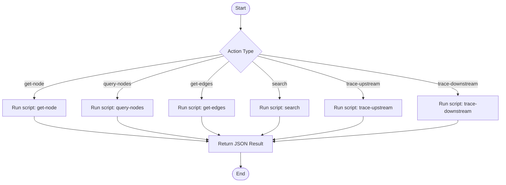

# Knowledge Graph Query

Query the knowledge graph stored in `speccrew-workspace/knowledges/bizs/graph/` to find nodes, edges, and trace relationships. This skill wraps `graph-query.js` script for all read operations.

## Trigger Scenarios

- "Find all APIs in module {module}"
- "What pages call API {apiId}?"
- "Show impact analysis for table {tableId}"
- "Search for entities related to {keyword}"
- "Trace upstream dependencies of {nodeId}"
- "Get all edges for node {nodeId}"

## User

Any Agent (speccrew-task-worker, speccrew-knowledge-dispatch, or other agents)

## Input Variables

| Variable | Type | Description | Example |
|----------|------|-------------|---------|
| `{{action}}` | string | Query action to perform | `"get-node"`, `"query-nodes"`, `"get-edges"`, `"search"`, `"trace-upstream"`, `"trace-downstream"` |
| `{{id}}` | string | Node ID (for get-node, trace-*) | `"api-system-user-list"` |
| `{{module}}` | string | Filter by module (for query-nodes, search) | `"system"`, `"trade"` |
| `{{type}}` | string | Filter by node type (for query-nodes, search) | `"api"`, `"page"`, `"table"` |
| `{{keyword}}` | string | Search keyword (for search) | `"user"`, `"order"` |
| `{{direction}}` | string | Edge direction (for get-edges) | `"in"`, `"out"`, `"both"` |
| `{{depth}}` | number | Trace depth (for trace-*) | `2`, `3` |
| `{{graphRoot}}` | string | Path to graph root directory | `"speccrew-workspace/knowledges/bizs/graph"` |

## Output Variables

| Variable | Type | Description |
|----------|------|-------------|
| `{{status}}` | string | Query result: `"success"` or `"not-found"` |
| `{{resultCount}}` | number | Number of results returned |
| `{{data}}` | object/array | Query result data |

## Output

**Return Value (JSON format):**
```json
{
  "status": "success",
  "action": "query-nodes",
  "resultCount": 5,
  "data": [
    {
      "id": "api-system-user-list",
      "type": "api",
      "name": "List Users API",
      "module": "system",
      "sourcePath": "yudao-module-system/.../UserController.java",
      "description": "Paginated query of system users"
    }
  ]
}
```

## Workflow



---

## Actions

### Action: get-node

Get a single node by its ID.

```bash
node "{skill_path}/scripts/graph-query.js" --action "get-node" --id "{{id}}" --graphRoot "{{graphRoot}}"
```

**Returns:** Single node object or empty if not found.

### Action: query-nodes

Query nodes by module and/or type.

```bash
# By module and type
node "{skill_path}/scripts/graph-query.js" --action "query-nodes" --module "{{module}}" --type "{{type}}" --graphRoot "{{graphRoot}}"

# By module only
node "{skill_path}/scripts/graph-query.js" --action "query-nodes" --module "{{module}}" --graphRoot "{{graphRoot}}"

# By type only
node "{skill_path}/scripts/graph-query.js" --action "query-nodes" --type "{{type}}" --graphRoot "{{graphRoot}}"
```

**Returns:** Array of matching nodes.

### Action: get-edges

Get all edges connected to a node, filtered by direction.

```bash
node "{skill_path}/scripts/graph-query.js" --action "get-edges" --nodeId "{{id}}" --direction "{{direction}}" --graphRoot "{{graphRoot}}"
```

**Direction values:**
- `in` — edges where this node is the `target`
- `out` — edges where this node is the `source`
- `both` — all edges connected to this node

**Returns:** Array of matching edges.

### Action: search

Search nodes by keyword across name, description, tags, and keywords fields.

```bash
# Search with filters
node "{skill_path}/scripts/graph-query.js" --action "search" --keyword "{{keyword}}" --type "{{type}}" --module "{{module}}" --graphRoot "{{graphRoot}}"

# Search all
node "{skill_path}/scripts/graph-query.js" --action "search" --keyword "{{keyword}}" --graphRoot "{{graphRoot}}"
```

**Returns:** Array of matching nodes, sorted by relevance.

### Action: trace-upstream

Trace all upstream dependencies of a node (what depends on / calls this node).

```bash
node "{skill_path}/scripts/graph-query.js" --action "trace-upstream" --id "{{id}}" --depth {{depth}} --graphRoot "{{graphRoot}}"
```

**Use case:** Impact analysis — "If I change this table, what APIs and pages are affected?"

**Returns:** Tree structure of upstream nodes and edges.

```json
{
  "root": { "id": "table-system-user", "type": "table" },
  "upstream": [
    {
      "node": { "id": "api-system-user-list", "type": "api" },
      "edge": { "type": "operates", "metadata": { "operation": "SELECT" } },
      "depth": 1,
      "upstream": [
        {
          "node": { "id": "page-system-user-list", "type": "page" },
          "edge": { "type": "calls", "metadata": { "trigger": "onMounted" } },
          "depth": 2,
          "upstream": []
        }
      ]
    }
  ]
}
```

### Action: trace-downstream

Trace all downstream dependencies of a node (what this node depends on / calls).

```bash
node "{skill_path}/scripts/graph-query.js" --action "trace-downstream" --id "{{id}}" --depth {{depth}} --graphRoot "{{graphRoot}}"
```

**Use case:** Dependency analysis — "What does this page call? What tables does this API touch?"

**Returns:** Tree structure of downstream nodes and edges (same format as trace-upstream).

---

## Common Query Patterns

| Scenario | Action | Parameters | Agent Use Case |
|----------|--------|-----------|---------------|
| Page → API | `get-edges` | nodeId=page-*, direction=out | UI agent: which APIs does this page use |
| API → Table | `get-edges` | nodeId=api-*, direction=out | Dev: which tables does this API touch |
| Table Impact | `trace-upstream` | id=table-*, depth=3 | Assess schema change impact |
| Module Overview | `query-nodes` | module=system | Generate module summary |
| Cross-Module Deps | `get-edges` | direction=out, filter cross-module | Inter-module dependency analysis |
| Keyword Search | `search` | keyword=user, type=api | Find all user-related APIs |

---

## Script Reference

Scripts location: `scripts/graph-query.js` (relative to this skill directory)

| Action | Parameters | Returns |
|--------|-----------|---------|
| `get-node` | `--id <id> --graphRoot <root>` | Single node JSON |
| `query-nodes` | `[--module <m>] [--type <t>] --graphRoot <root>` | Node array |
| `get-edges` | `--nodeId <id> --direction <in\|out\|both> --graphRoot <root>` | Edge array |
| `search` | `--keyword <kw> [--type <t>] [--module <m>] --graphRoot <root>` | Node array |
| `trace-upstream` | `--id <id> [--depth <n>] --graphRoot <root>` | Node + Edge tree |
| `trace-downstream` | `--id <id> [--depth <n>] --graphRoot <root>` | Node + Edge tree |

---

## Checklist

- [ ] `{{action}}` is one of: `get-node`, `query-nodes`, `get-edges`, `search`, `trace-upstream`, `trace-downstream`
- [ ] `{{graphRoot}}` path is correct (`speccrew-workspace/knowledges/bizs/graph`)
- [ ] For `get-node` / `trace-*`: `{{id}}` follows `{type}-{module}-{name}` format
- [ ] For `get-edges`: `{{direction}}` is one of `in`, `out`, `both`
- [ ] For `trace-*`: `{{depth}}` is a positive integer (default: 2)
- [ ] Script executed with Node.js (`node graph-query.js`)
- [ ] Result JSON parsed and used by calling agent
