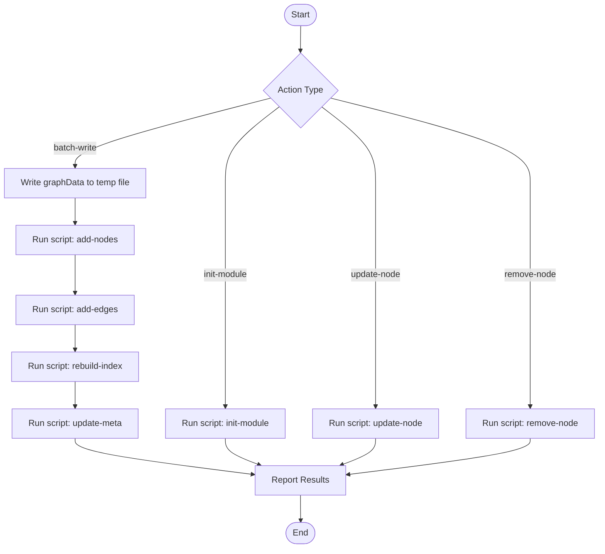

# Knowledge Graph Write

Write graph data (nodes and edges) to the knowledge graph storage. This skill wraps `graph-write.js` script to perform all write operations on `speccrew-workspace/knowledges/bizs/graph/`.

## Trigger Scenarios

- "Write graphData from skill analysis result to graph"
- "Initialize graph structure for module {module}"
- "Batch add nodes and edges for module {module}"
- "Update node {nodeId} in graph"
- "Remove node {nodeId} from graph"

## User

Dispatch Agent (speccrew-knowledge-dispatch)

## Input Variables

| Variable | Type | Description | Example |
|----------|------|-------------|---------|
| `{{action}}` | string | Write action to perform | `"batch-write"`, `"init-module"`, `"update-node"`, `"remove-node"` |
| `{{platformId}}` | string | Platform identifier for directory segregation | `"backend-system"`, `"backend-ai"`, `"web-vue"`, `"mobile-uniapp"` |
| `{{module}}` | string | Target business module | `"system"`, `"trade"`, `"infra"` |
| `{{graphData}}` | object | Graph data from skill output (for batch-write) | `{ "nodes": [...], "edges": [...] }` |
| `{{nodeId}}` | string | Node ID (for update-node / remove-node) | `"api-system-user-list"` |
| `{{nodeData}}` | object | Updated node data (for update-node) | `{ "description": "..." }` |
| `{{graphRoot}}` | string | Path to graph root directory | `"speccrew-workspace/knowledges/bizs/graph"` |

## Output Variables

| Variable | Type | Description |
|----------|------|-------------|
| `{{status}}` | string | Operation result: `"success"` or `"failed"` |
| `{{nodesWritten}}` | number | Number of nodes written |
| `{{edgesWritten}}` | number | Number of edges written |
| `{{message}}` | string | Summary message |

## Output

**Return Value (JSON format):**
```json
{
  "status": "success",
  "action": "batch-write",
  "module": "system",
  "nodesWritten": 5,
  "edgesWritten": 8,
  "message": "Successfully wrote 5 nodes and 8 edges to system module"
}
```

## Workflow



---

## Actions

### Action: batch-write

**Primary use case.** Write all nodes and edges from a skill's `graphData` output to the graph.

**Steps:**

1. **Write graphData to temp file:**
   - Create temp file at `{{graphRoot}}/temp/` with the `graphData` JSON content
   - Temp file name: `batch-{module}-{timestamp}.json`

2. **Add nodes:**
   ```
   node "{skill_path}/scripts/graph-write.js" --action "add-nodes" --platformId "{{platformId}}" --module "{{module}}" --file "{{tempFilePath}}" --graphRoot "{{graphRoot}}"
   ```

3. **Add edges:**
   ```
   node "{skill_path}/scripts/graph-write.js" --action "add-edges" --platformId "{{platformId}}" --module "{{module}}" --file "{{tempFilePath}}" --graphRoot "{{graphRoot}}"
   ```

4. **Update index and metadata** (automatic, handled by script)

5. **Clean up temp file**

**Deduplication Rule:**
- Nodes with the same `id` are **replaced** (last write wins)
- Edges with the same `source` + `target` + `type` combination are **replaced**

### Action: init-module

Initialize empty graph structure for a module. Used before Stage 2 analysis begins.

```
node "{skill_path}/scripts/graph-write.js" --action "init-module" --platformId "{{platformId}}" --module "{{module}}" --graphRoot "{{graphRoot}}"
```

**Creates:**
- `{{graphRoot}}/nodes/{{platformId}}/{{module}}.json` — empty nodes array
- `{{graphRoot}}/edges/{{platformId}}/{{module}}.json` — empty edges array
- Updates `{{graphRoot}}/graph-meta.json` — adds `{{platformId}}/{{module}}` to modules list
- Creates `{{graphRoot}}/edges/{{platformId}}/cross-module.json` if not exists
- Creates `{{graphRoot}}/indices/index.json` if not exists

### Action: update-node

Update an existing node's data fields.

```
node "{skill_path}/scripts/graph-write.js" --action "update-node" --platformId "{{platformId}}" --id "{{nodeId}}" --data '{{nodeDataJson}}' --graphRoot "{{graphRoot}}"
```

### Action: remove-node

Remove a node and all its connected edges.

```
node "{skill_path}/scripts/graph-write.js" --action "remove-node" --platformId "{{platformId}}" --id "{{nodeId}}" --graphRoot "{{graphRoot}}"
```

---

## Script Reference

Scripts location: `scripts/graph-write.js` (relative to this skill directory)

| Action | Parameters | Description |
|--------|-----------|-------------|
| `batch-write` | `--platformId <p> --module <m> --file <path> --graphRoot <root>` | Batch write nodes and edges from temp file |
| `add-nodes` | `--platformId <p> --module <m> --file <path> --graphRoot <root>` | Batch add/replace nodes from temp file |
| `add-edges` | `--platformId <p> --module <m> --file <path> --graphRoot <root>` | Batch add/replace edges from temp file |
| `update-node` | `--platformId <p> --id <id> --data <json> --graphRoot <root>` | Update existing node fields |
| `remove-node` | `--platformId <p> --id <id> --graphRoot <root>` | Remove node and connected edges |
| `init-module` | `--platformId <p> --module <m> --graphRoot <root>` | Initialize empty module files |
| `rebuild-index` | `--graphRoot <root>` | Rebuild global index from all module files |
| `update-meta` | `--graphRoot <root>` | Recalculate and update graph-meta.json stats |

---

## Cross-Module Edge Handling

When edges have `source` and `target` nodes belonging to different modules:
- The script automatically detects cross-module edges
- Cross-module edges are stored in `{{graphRoot}}/edges/{{platformId}}/cross-module.json`
- Module membership is determined by the node ID prefix (e.g., `api-system-*` → module `system`)

---

## Checklist

- [ ] `{{action}}` is one of: `batch-write`, `init-module`, `update-node`, `remove-node`
- [ ] `{{platformId}}` is provided (required for all write actions)
- [ ] `{{graphRoot}}` path is correct (`speccrew-workspace/knowledges/bizs/graph`)
- [ ] For `batch-write`: `{{graphData}}` contains valid `nodes` and `edges` arrays
- [ ] For `batch-write`: temp file created and cleaned up after write
- [ ] For `init-module`: module directory files created successfully under `nodes/{{platformId}}/` and `edges/{{platformId}}/`
- [ ] For `update-node` / `remove-node`: `{{nodeId}}` follows `{type}-{module}-{name}` format
- [ ] Script executed with Node.js (`graph-write.js`)
- [ ] Index and metadata updated after write operations
- [ ] Cross-module edges correctly routed to `edges/{{platformId}}/cross-module.json`
- [ ] Return JSON with `{{status}}`, `{{nodesWritten}}`, `{{edgesWritten}}`, `{{message}}`
