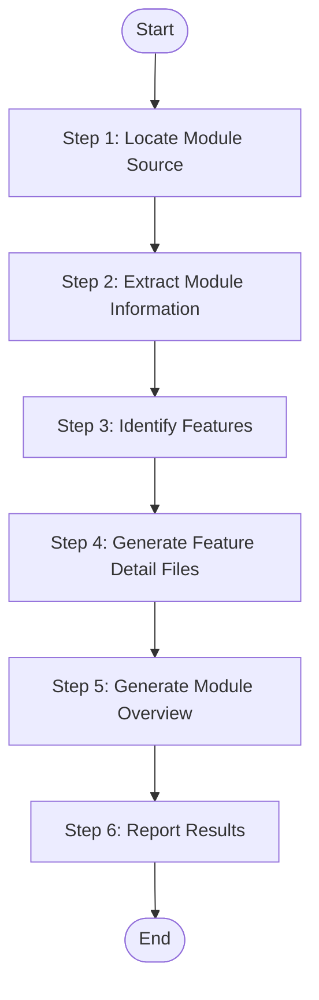
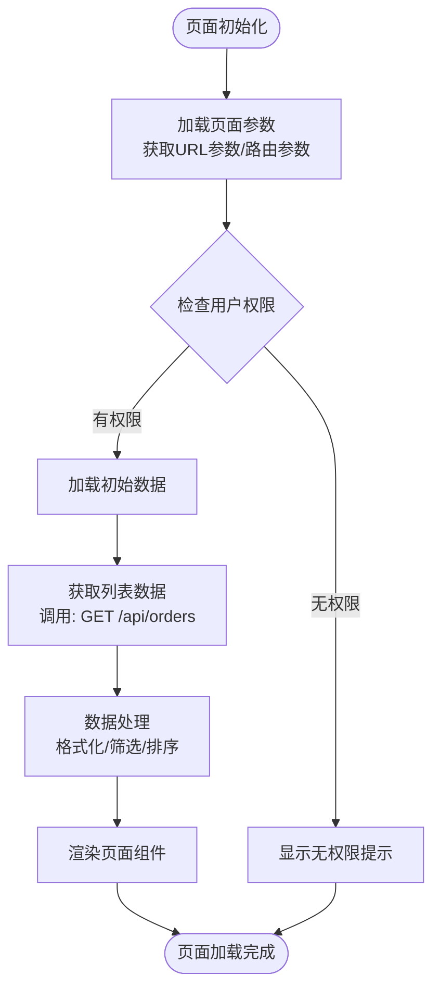
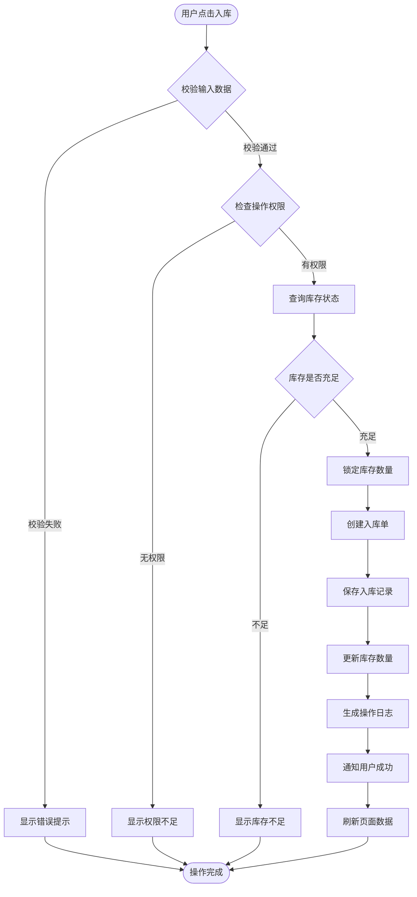

# Module Analysis - Single Module

Analyze one specific module from source code, extract all features, generate {{module_name}}-overview.md (initial version with feature list) and all {{feature_name}}.md files.

## Language Adaptation

**CRITICAL**: Generate all content in the language specified by the `language` parameter.

- `language: "zh"` → Generate all content in 中文
- `language: "en"` → Generate all content in English
- Other languages →Use the specified language

**All output content (feature names, descriptions, business rules) must be in the target language only.**

## Trigger Scenarios

- "Analyze module {name} from source code"
- "Extract features from module {name}"
- "Generate module documentation for {name}"

## User

Worker Agent (speccrew-task-worker)

## Input

- `module_name`: Module code_name from modules.json
- `platform_name`: Platform name (e.g., "Web Frontend", "Mobile App")
- `platform_type`: Platform type (e.g., "web", "mobile-flutter", "api")
- `system_type`: Module system type - `"ui"` or `"api"` (from modules.json)
- `source_path`: Platform-specific source path (from platform.source_path)
- `tech_stack`: Platform tech stack array (e.g., ["react", "typescript"])
- `entry_points`: Module entry points (relative file paths from modules.json)
- `backend_apis`: Associated backend API endpoints for this module (only when `system_type: "ui"`)
- `output_path`: Output directory for the module (e.g., `speccrew-workspace/knowledges/bizs/{platform_type}/{module_name}/`)
- `language`: Target language for generated content (e.g., "zh", "en") - **REQUIRED**

## Output Variables

- `feature_count`: Number of features extracted from the module
- `feature_name`: Name of each extracted feature (used for individual feature files)

## Output

- `{output_path}/{module_name}-overview.md` - Initial module overview with feature list
- `{output_path}/features/{feature_name}.md` - Feature detail documents (one per feature)

## Workflow



### Step 1: Locate Module Source

1. **Read Configuration** (if fallback needed):
   - Read `speccrew-workspace/docs/configs/tech-stack-mappings.json` - Determine file extensions and entry patterns based on `tech_stack`

2. **Use `entry_points` from input to locate module source files directly:**

   **System Type Determination:**
   - Use `system_type` parameter to determine analysis approach:
     - `system_type: "ui"` → Follow UI-based analysis
     - `system_type: "api"` → Follow API-based analysis

   **For UI-based modules (system_type = "ui"):**
   - Entry points are page/component files (e.g., `src/pages/orders/index.tsx`)
   - Analyze page structure, components, props, state management
   - Extract user interactions and navigation flows

   **For API-based modules (system_type = "api"):**
   - Entry points are controller/handler files (e.g., `src/controllers/order.controller.ts`)
   - Parse decorators and method signatures to extract features
   - Extract request/response DTOs and validation rules

3. **Fallback (if entry_points analysis insufficient):**
   - Search: `**/{module_name}/**/*.{ts,js,java,go,py}`
   - Query `tech-stack-mappings.json` using `tech_stack` to determine file extensions (e.g., Flutter → `.dart`, Python → `.py`)

### Step 2: Extract Module Information

Based on `system_type`, extract different information:

**For UI-based modules (system_type = "ui"):**

| Information | Source |
|-------------|--------|
| Module Purpose | Page comments, README, or route config comments |
| Pages/Screens | Entry point files and their imports |
| Components | Imported component files |
| State Management | Store files, hooks (e.g., `useStore`, `redux`, `pinia`) |
| User Interactions | Event handlers, form submissions |
| Navigation | Router configurations, navigation links |
| **Frontend Business Flow** | Page initialization logic, data loading sequence, user interaction handling |

**For API-based modules (system_type = "api"):**

| Information | Source |
|-------------|--------|
| Module Purpose | JSDoc comments, README, or code comments |
| Controllers/Handlers | Files matching `*controller.*`, `*handler.*` |
| Services | Files matching `*service.*`, `*provider.*` |
| Entities/Models | Files matching `*entity.*`, `*model.*`, `*dto.*` |
| Public APIs | Route decorators: `@Get`, `@Post`, `@Put`, `@Delete` |
| **Backend Business Flow** | Business logic execution sequence: validation → data retrieval → processing → persistence → response |

### Step 3: Identify Features

1. **Read Configuration**:
   - Read `speccrew-workspace/docs/configs/feature-granularity-rules.json` - Determine how to split features based on complexity
   - Read `speccrew-workspace/docs/configs/validation-rules.json` - Validate feature naming conventions

2. **Apply Feature Granularity Rules**:

Determine splitting strategy based on feature complexity:

| Complexity | Criteria | Splitting Strategy | Example |
|--------|---------|---------|------|
| Simple | ≤3 API endpoints, no complex business flow | Merge into single document | Data Dictionary Management |
| Medium | 3-8 API endpoints, independent business scenarios | Split by operation type | User CRUD, User Status Management |
| Complex | >8 API endpoints, multiple business scenarios | Split by business scenario | Payment Order Management, Payment Security Mechanism |

**Feature Naming Convention:**
- Feature group document: `{module-name}-overview.md` (Module Overview)
- Feature detail document: `{feature-name}.md` (Named by core feature)
- Use target language for naming, maintain semantic clarity

3. **Read Feature Detail Template**:

   Before extracting features, read the template file to understand the required content structure:
   - **Read**: `templates/FEATURE-DETAIL-TEMPLATE.md`
   - **Purpose**: Understand the template chapters and example content requirements for feature detail documents
   - **Key sections to follow**:
     - Section 1: Content Overview (Basic Information, Feature Scope)
     - Section 2: Core Interface Prototype (ASCII Wireframe, Interface Element Description, Form Field Description)
     - Section 3: Interaction Flow Description (Core Operation Flow with Mermaid sequence diagram, Exception Branch Flow, Interaction Rules)
     - Section 4: Data Field Definition (Core Field List, Data Source Description, API Data Contract)
     - Section 5: Business Rule Constraints (Permission Rules, Business Logic Rules, Validation Rules)
     - Section 6: Dependency Analysis (Module Dependencies, Service Dependencies, External Dependencies)
     - Section 7: Performance Considerations (Performance Bottlenecks, Index Suggestions, Caching Strategy, Transaction Boundaries)
     - Section 8: Troubleshooting Guide (Common Issues, Error Code Reference, Key Log Points)
     - Section 9: Notes and Additional Information (Compatibility Adaptation, Pending Confirmations, Extension Notes)
     - Section 10: Appendix (Best Practices, Configuration Examples, Related Documents)

4. **Feature Extraction**:

**For UI-based modules (system_type = "ui"):**

Each page/screen or major user interaction = one feature:

```typescript
// Example: From page component
export default function OrderListPage() {
  // Feature: list-orders
  const [orders, setOrders] = useState([]);
  
  // API call analysis
  useEffect(() => {
    fetchOrders();  // → Find and analyze: GET /api/orders
  }, []);
  
  // Feature: create-order (navigation)
  const handleCreate = () => router.push('/orders/create');
  
  // Feature: get-order-detail (navigation)
  const handleView = (id) => router.push(`/orders/${id}`);
}
```

For each feature, extract:
- **Feature Identification:**
  - Feature name (from page name or user action)
  - Trigger point (page initialization, button click, form submission)
  - Page/Component file path

- **Per-Request Business Flow Analysis:**
  
  **Each API call made by the feature should have its own business flow diagram:**
  
  | Request Type | Example | Business Flow Focus |
  |-------------|---------|---------------------|
  | Page Init | `useEffect(() => fetchOrders(), [])` | 页面加载 → 参数获取 → 权限检查 → 数据查询 → 渲染 |
  | User Action | `onClick={() => createOrder(data)}` | 点击触发 → 数据校验 → 业务检查 → 数据处理 → 结果反馈 |
  | Navigation | `router.push('/orders/' + id)` | 跳转触发 → 参数传递 → 目标页加载 → 数据获取 → 渲染 |

- **Frontend Business Flow** (per request):
  - User action that triggers the request
  - Input data preparation and validation
  - API request construction
  - Response handling and UI updates
  
- **Backend Business Flow** (per request):
  - Request validation → permission check → business rule validation
  - Data query/processing steps
  - Data persistence operations
  - Response assembly
  
- **Data Storage Layer:**
  - Database entities/models referenced by the API
  - Data relationships (foreign keys, associations)
  - Key data fields and their purposes

- **Full Business Flow Visualization** (per request):
  - Generate Mermaid flowchart for **each API endpoint** called by the feature
  - Show complete flow: User Action → Business Validation → Data Processing → Persistence → Response
  - Mark each step with source file reference
  - Example: If a page calls 3 different APIs, generate 3 separate business flow diagrams

**For API-based modules (system_type = "api"):**

Each public API endpoint = one feature:

```typescript
// Example: From controller
@Controller('orders')
export class OrderController {
  @Post()           → Feature: create-order
  @Get()            → Feature: list-orders
  @Get(':id')       → Feature: get-order-detail
  @Patch(':id')     → Feature: update-order
  @Delete(':id')    → Feature: delete-order
}
```

For each feature, extract:
- Feature name (from endpoint path)
- API method and path
- Request/Response DTOs
- Validation rules
- Business rules from code comments

4. **Source File Tracking**:

**CRITICAL**: For each extracted feature, track the source files:

| Feature | Controller File | Service File | Entity/DTO Files |
|---------|----------------|--------------|------------------|
| create-order | OrderController.java#L45-L60 | OrderService.java#L30-L50 | CreateOrderDTO.java, OrderDO.java |
| list-orders | OrderController.java#L62-L75 | OrderService.java#L52-L70 | OrderQueryVO.java, OrderDO.java |

These source file references will be used in the generated documents for traceability.

### Step 4: Generate {feature-name}.md Files

For each feature, use template `templates/FEATURE-DETAIL-TEMPLATE.md`:

**Template placeholders:**
- `{{feature_name}}`: Feature name (e.g., "create-order")
- `{{module_name}}`: Parent module name
- `{{api_method}}`: HTTP method (GET/POST/PUT/DELETE)
- `{{api_path}}`: Endpoint path
- `{{request_dto}}`: Request DTO fields
- `{{response_dto}}`: Response DTO fields
- `{{validation_rules}}`: Validation decorators
- `{{business_rules}}`: Extracted from code comments
- `{{source_files}}`: Source file references for traceability
- `{{business_flow_diagram}}`: Mermaid flowchart showing business logic flow

**Output:** `{output_path}/features/{feature-name}.md`

**Source Traceability Requirements:**

Each generated document must include source code traceability information:

1. **File Reference Block** (at document start):
```markdown
<cite>
**Referenced Files**
- [OrderController.java](file://path/to/controller)
- [OrderService.java](file://path/to/service)
</cite>
```

2. **Diagram Source** (after each Mermaid diagram):
```markdown
**Diagram Source**
- [OrderController.java](file://path/to/controller#L45-L60)
```

3. **Section Source** (at end of each major section):
```markdown
**Section Source**
- [OrderService.java](file://path/to/service#L30-L50)
```

4. **Generate Business Flow Diagram**:
   - Generate Mermaid flowchart showing complete business logic flow (see [Reference: Business Flow Diagram](#business-flow-diagram-reference))
   - Include business flow details table with step-by-step operation mapping

### Step 5: Generate {{module_name}}-overview.md (Initial)

1. **Read Configuration**:
   - Read `speccrew-workspace/docs/configs/document-templates.json` - Get template structure and placeholder requirements
   - Read `speccrew-workspace/docs/rules/mermaid-rule.md` - Ensure diagrams follow compatibility guidelines

2. **Use template `templates/MODULE-OVERVIEW-TEMPLATE.md`, fill sections:**

**Mermaid Diagram Requirements**

When generating Mermaid diagrams, you **MUST** follow the compatibility guidelines defined in:
- **Reference**: `speccrew-workspace/docs/rules/mermaid-rule.md`

Key requirements:
- Use only basic node definitions: `A[text content]`
- No HTML tags (e.g., `<br/>`)
- No nested subgraphs
- No `direction` keyword
- No `style` definitions
- Use standard `graph TB/LR` syntax only

**Mermaid Diagram Types:**

Select appropriate diagram type based on scenario:

| Diagram Type | Use Case | Example |
|---------|---------|------|
| `graph TB/LR` | Module structure, dependencies | Project structure diagram, dependency graph |
| `sequenceDiagram` | Interaction flow, API calls | User operation flow, service call chain |
| `flowchart TD` | Business logic, conditional branches | State transition, exception handling |
| `classDiagram` | Class structure, entity relationships | Data model, service interface |
| `erDiagram` | Database table relationships | Entity relationship diagram |
| `stateDiagram-v2` | State machine | Order status, approval status |

**Section 1: Module Basic Info**
- Module name from input
- Purpose from code analysis
- Belongs to domain (inferred from directory structure)

**Section 2: Feature List (Key Section)**

| Feature | API | Status | Detail Doc |
|---------|-----|--------|------------|
| create-order | POST /orders | → Generated | [View](features/create-order.md) |
| list-orders | GET /orders | → Generated | [View](features/list-orders.md) |

**Section 3-6**: Mark as "TBD - Will be completed in summarize stage"

**Source Traceability:**

Module overview document must also include source code traceability information:

```markdown
<cite>
**Referenced Files**
- [OrderController.java](file://path/to/controller)
- [OrderService.java](file://path/to/service)
</cite>
```

### Step 6: Report Results

```
Module analysis completed:
- Platform: {{platform_name}} ({{platform_type}})
- Module: {{module_name}}
- Source Path: {{source_path}}
- Tech Stack: {{tech_stack}}
- Entry Points Analyzed: {{entry_points.length}}
- Features Found: {{feature_count}}
- Generated
  - {{module_name}}-overview.md (initial)
  - features/{{feature_name}}.md ({{feature_count}} files)
- Status: success/partial-failed
- Issues: [if any]
```

## Checklist

- [ ] Platform context received (platform_name, platform_type, tech_stack)
- [ ] Entry points resolved from source_path + entry_points
- [ ] Module source files located using entry points
- [ ] Controllers/Handlers identified (API) or Pages/Components identified (UI)
- [ ] Features extracted with complexity assessment (Simple/Medium/Complex)
- [ ] Feature granularity strategy determined (Merge/Split by operation/Split by scenario)
- [ ] Source files tracked for each feature (Controller, Service, Entity/DTO)
- [ ] Request/Response DTOs analyzed (API) or Props/State analyzed (UI)
- [ ] Validation rules documented
- [ ] **Frontend business flow traced** for each API request (User action → data preparation → API request)
- [ ] **Backend business flow traced** for each API request (Validation → permission check → business processing → persistence)
- [ ] **Business logic flow diagram generated** for each API endpoint (one diagram per request)
- [ ] **Business flow details table created** for each diagram with step-by-step operation/data mapping
- [ ] {feature-name}.md generated with source traceability for each feature
- [ ] {name}-overview.md (initial) generated with feature list and source traceability
- [ ] Mermaid diagrams follow compatibility guidelines
- [ ] Results reported with platform context

---

## Reference Guides

### Business Flow Diagram Reference

This section provides guidelines for generating business logic flow diagrams from source code analysis. These diagrams are designed for product managers and solution architects to understand the complete business process flow.

**Business Flow vs Technical Call Chain:**

| Aspect | Business Flow (Target) | Technical Call Chain (Avoid) |
|--------|----------------------|---------------------------|
| Focus | What business operations happen | What technical components are involved |
| Audience | Product managers, solution architects | Developers, system architects |
| Content | Business rules, data transformations, decisions | Method names, class names, API endpoints |
| Example | "Validate inventory → Check permissions → Create order" | "OrderController.create() → OrderService.save()" |

**Standard Business Flow Diagram Structure:**

**Principle: One Diagram Per API Request**

Each API call triggered by the frontend should have its own business flow diagram. If a single page makes multiple API calls, generate separate diagrams for each.

**Example: Order List Page with Multiple Requests**

A page may have multiple independent business flows:
1. **Initial Load**: `GET /api/orders` - Load order list
2. **Search**: `GET /api/orders?keyword=xxx` - Search orders
3. **Delete**: `DELETE /api/orders/:id` - Delete an order
4. **Export**: `POST /api/orders/export` - Export order list

Each of these should have its own business flow diagram.

For **Page Initialization** scenarios:



For **User Action** scenarios (e.g., "入库" operation):



**Diagram Requirements:**

1. **For UI modules (system_type = "ui"):**
   - Show user actions and page responses
   - Include data loading sequences
   - Display validation and error handling from user perspective
   - Example: "用户输入 → 前端校验 → 提交数据 → 显示结果"

2. **For API modules (system_type = "api"):**
   - Show business rule validation sequence
   - Include data query and transformation steps
   - Display business decision points (conditions)
   - Example: "权限检查 → 数据校验 → 业务处理 → 数据持久化"

3. **Source Traceability in Diagrams:**
   - Add comments showing which code implements each business step
   - Example: `%% Implemented in: OrderService.validateInventory()`

**Business Flow Details Table:**

After the diagram, include a table explaining each business step:

| Step | Business Operation | Description | Input Data | Output Data | Source Reference |
|------|-------------------|-------------|------------|-------------|-----------------|
| 1 | 加载页面参数 | 从URL或路由获取页面所需参数 | URL参数 | 参数对象 | OrderListPage.tsx#L25 |
| 2 | 检查用户权限 | 验证当前用户是否有查看权限 | 用户Token | 权限结果 | AuthGuard.tsx#L40 |
| 3 | 获取列表数据 | 调用后端API获取订单列表 | 查询条件 | 订单列表 | orderApi.ts#L30 |
| 4 | 数据处理 | 格式化日期、计算状态显示 | 原始数据 | 展示数据 | OrderListPage.tsx#L55 |
| 5 | 渲染页面 | 将处理后的数据渲染到UI | 展示数据 | UI组件 | OrderListPage.tsx#L80 |

**Common Business Flow Patterns:**

1. **CRUD Operations:**
   - Create: 数据校验 → 权限检查 → 重复检查 → 数据创建 → 关联更新 → 日志记录
   - Read: 参数解析 → 权限检查 → 数据查询 → 数据组装 → 返回结果
   - Update: 数据校验 → 权限检查 → 存在性检查 → 数据更新 → 关联更新 → 日志记录
   - Delete: 权限检查 → 存在性检查 → 依赖检查 → 数据删除 → 日志记录

2. **Approval Workflows:**
   - 提交申请 → 校验数据 → 检查流程配置 → 创建审批实例 → 通知审批人 → 记录日志

3. **Import/Export Operations:**
   - 文件上传 → 格式校验 → 数据解析 → 业务校验 → 批量处理 → 结果汇总 → 错误反馈

