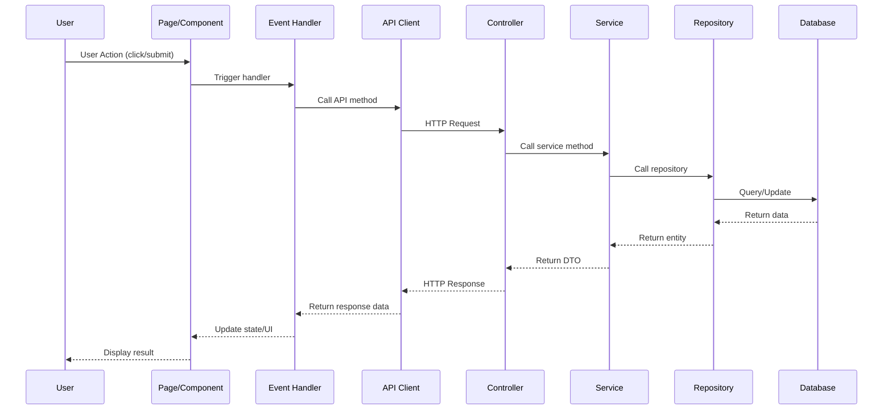

# Module Analysis - Single Module

Analyze one specific module from source code, extract all features, generate {{module_name}}-overview.md (initial version with feature list) and all {{feature_name}}.md files.

## Language Adaptation

**CRITICAL**: Generate all content in the language specified by the `language` parameter.

- `language: "zh"` → Generate all content in 中文
- `language: "en"` → Generate all content in English
- Other languages →Use the specified language

**All output content (feature names, descriptions, business rules) must be in the target language only.**

## Trigger Scenarios

- "Analyze module {name} from source code"
- "Extract features from module {name}"
- "Generate module documentation for {name}"

## User

Worker Agent (speccrew-task-worker)

## Input

- `module_name`: Module code_name from modules.json
- `platform_name`: Platform name (e.g., "Web Frontend", "Mobile App")
- `platform_type`: Platform type (e.g., "web", "mobile-flutter", "api")
- `system_type`: Module system type - `"ui"` or `"api"` (from modules.json)
- `source_path`: Platform-specific source path (from platform.source_path)
- `tech_stack`: Platform tech stack array (e.g., ["react", "typescript"])
- `entry_points`: Module entry points (relative file paths from modules.json)
- `backend_apis`: Associated backend API endpoints for this module (only when `system_type: "ui"`)
- `output_path`: Output directory for the module (e.g., `speccrew-workspace/knowledges/bizs/{platform_type}/{module_name}/`)
- `language`: Target language for generated content (e.g., "zh", "en") - **REQUIRED**

## Output Variables

- `feature_count`: Number of features extracted from the module
- `feature_name`: Name of each extracted feature (used for individual feature files)

## Output

- `{output_path}/{module_name}-overview.md` - Initial module overview with feature list
- `{output_path}/features/{feature_name}.md` - Feature detail documents (one per feature)

## Workflow

### Step 1: Locate Module Source

1. **Read Configuration** (if fallback needed):
   - Read `speccrew-workspace/docs/configs/tech-stack-mappings.json` - Determine file extensions and entry patterns based on `tech_stack`

2. **Use `entry_points` from input to locate module source files directly:**

   **System Type Determination:**
   - Use `system_type` parameter to determine analysis approach:
     - `system_type: "ui"` → Follow UI-based analysis
     - `system_type: "api"` → Follow API-based analysis

   **For UI-based modules (system_type = "ui"):**
   - Entry points are page/component files (e.g., `src/pages/orders/index.tsx`)
   - Analyze page structure, components, props, state management
   - Extract user interactions and navigation flows

   **For API-based modules (system_type = "api"):**
   - Entry points are controller/handler files (e.g., `src/controllers/order.controller.ts`)
   - Parse decorators and method signatures to extract features
   - Extract request/response DTOs and validation rules

3. **Fallback (if entry_points analysis insufficient):**
   - Search: `**/{module_name}/**/*.{ts,js,java,go,py}`
   - Query `tech-stack-mappings.json` using `tech_stack` to determine file extensions (e.g., Flutter → `.dart`, Python → `.py`)

### Step 2: Extract Module Information

Based on `system_type`, extract different information:

**For UI-based modules (system_type = "ui"):**

| Information | Source |
|-------------|--------|
| Module Purpose | Page comments, README, or route config comments |
| Pages/Screens | Entry point files and their imports |
| Components | Imported component files |
| State Management | Store files, hooks (e.g., `useStore`, `redux`, `pinia`) |
| User Interactions | Event handlers, form submissions |
| Navigation | Router configurations, navigation links |
| **Method Call Chain** | Trace from event handler → API service method → HTTP request |

**For API-based modules (system_type = "api"):**

| Information | Source |
|-------------|--------|
| Module Purpose | JSDoc comments, README, or code comments |
| Controllers/Handlers | Files matching `*controller.*`, `*handler.*` |
| Services | Files matching `*service.*`, `*provider.*` |
| Entities/Models | Files matching `*entity.*`, `*model.*`, `*dto.*` |
| Public APIs | Route decorators: `@Get`, `@Post`, `@Put`, `@Delete` |
| **Backend Call Chain** | Controller methods → Service methods → Repository/DAO methods |

### Step 3: Identify Features

1. **Read Configuration**:
   - Read `speccrew-workspace/docs/configs/feature-granularity-rules.json` - Determine how to split features based on complexity
   - Read `speccrew-workspace/docs/configs/validation-rules.json` - Validate feature naming conventions

2. **Apply Feature Granularity Rules**:

Determine splitting strategy based on feature complexity:

| Complexity | Criteria | Splitting Strategy | Example |
|--------|---------|---------|------|
| Simple | ≤3 API endpoints, no complex business flow | Merge into single document | Data Dictionary Management |
| Medium | 3-8 API endpoints, independent business scenarios | Split by operation type | User CRUD, User Status Management |
| Complex | >8 API endpoints, multiple business scenarios | Split by business scenario | Payment Order Management, Payment Security Mechanism |

**Feature Naming Convention:**
- Feature group document: `{module-name}-overview.md` (Module Overview)
- Feature detail document: `{feature-name}.md` (Named by core feature)
- Use target language for naming, maintain semantic clarity

3. **Feature Extraction**:

**For UI-based modules (system_type = "ui"):**

Each page/screen or major user interaction = one feature:

```typescript
// Example: From page component
export default function OrderListPage() {
  // Feature: list-orders
  const [orders, setOrders] = useState([]);
  
  // API call analysis
  useEffect(() => {
    fetchOrders();  // → Find and analyze: GET /api/orders
  }, []);
  
  // Feature: create-order (navigation)
  const handleCreate = () => router.push('/orders/create');
  
  // Feature: get-order-detail (navigation)
  const handleView = (id) => router.push(`/orders/${id}`);
}
```

For each feature, extract:
- **Frontend Layer:**
  - Feature name (from page name or user action)
  - Page/Component file path
  - User interactions (clicks, form submissions)
  - State management (local state, store)
  - Navigation paths
  - **Method Call Chain**: Trace from event handler → API client method → HTTP request
  
- **Backend API Layer:**
  - API calls made by the feature (trace `fetch`, `axios`, `apiClient` calls)
  - API endpoint (method + path)
  - Request parameters and payload structure
  - Response data structure
  - Error handling patterns
  - **Backend Call Chain**: Controller → Service → Repository/DAO → Database
  
- **Data Storage Layer:**
  - Database entities/models referenced by the API
  - Data relationships (foreign keys, associations)
  - Key data fields and their purposes
  - Data flow: UI → API →Database → API →UI

- **Full Call Chain Visualization**:
  - Generate Mermaid sequence diagram showing complete flow
  - Include: User Action → Frontend Handler → API Client → Backend Controller → Service → Database
  - Mark each step with source file reference

**For API-based modules (system_type = "api"):**

Each public API endpoint = one feature:

```typescript
// Example: From controller
@Controller('orders')
export class OrderController {
  @Post()           → Feature: create-order
  @Get()            → Feature: list-orders
  @Get(':id')       → Feature: get-order-detail
  @Patch(':id')     → Feature: update-order
  @Delete(':id')    → Feature: delete-order
}
```

For each feature, extract:
- Feature name (from endpoint path)
- API method and path
- Request/Response DTOs
- Validation rules
- Business rules from code comments

4. **Source File Tracking**:

**CRITICAL**: For each extracted feature, track the source files:

| Feature | Controller File | Service File | Entity/DTO Files |
|---------|----------------|--------------|------------------|
| create-order | OrderController.java#L45-L60 | OrderService.java#L30-L50 | CreateOrderDTO.java, OrderDO.java |
| list-orders | OrderController.java#L62-L75 | OrderService.java#L52-L70 | OrderQueryVO.java, OrderDO.java |

These source file references will be used in the generated documents for traceability.

### Step 4: Generate {feature-name}.md Files

For each feature, use template `templates/FEATURE-DETAIL-TEMPLATE.md`:

**Template placeholders:**
- `{{feature_name}}`: Feature name (e.g., "create-order")
- `{{module_name}}`: Parent module name
- `{{api_method}}`: HTTP method (GET/POST/PUT/DELETE)
- `{{api_path}}`: Endpoint path
- `{{request_dto}}`: Request DTO fields
- `{{response_dto}}`: Response DTO fields
- `{{validation_rules}}`: Validation decorators
- `{{business_rules}}`: Extracted from code comments
- `{{source_files}}`: Source file references for traceability
- `{{call_flow_diagram}}`: Mermaid sequence diagram showing call chain

**Output:** `{output_path}/features/{feature-name}.md`

**Source Traceability Requirements:**

Each generated document must include source code traceability information:

1. **File Reference Block** (at document start):
```markdown
<cite>
**Referenced Files**
- [OrderController.java](file://path/to/controller)
- [OrderService.java](file://path/to/service)
</cite>
```

2. **Diagram Source** (after each Mermaid diagram):
```markdown
**Diagram Source**
- [OrderController.java](file://path/to/controller#L45-L60)
```

3. **Section Source** (at end of each major section):
```markdown
**Section Source**
- [OrderService.java](file://path/to/service#L30-L50)
```

4. **Generate Call Flow Diagram**:
   - Generate Mermaid sequence diagram showing complete call chain (see [Reference: Call Flow Diagram](#call-flow-diagram-reference))
   - Include call chain details table with step-by-step mapping

### Step 5: Generate {{module_name}}-overview.md (Initial)

1. **Read Configuration**:
   - Read `speccrew-workspace/docs/configs/document-templates.json` - Get template structure and placeholder requirements
   - Read `speccrew-workspace/docs/rules/mermaid-rule.md` - Ensure diagrams follow compatibility guidelines

2. **Use template `templates/MODULE-OVERVIEW-TEMPLATE.md`, fill sections:**

**Mermaid Diagram Requirements**

When generating Mermaid diagrams, you **MUST** follow the compatibility guidelines defined in:
- **Reference**: `speccrew-workspace/docs/rules/mermaid-rule.md`

Key requirements:
- Use only basic node definitions: `A[text content]`
- No HTML tags (e.g., `<br/>`)
- No nested subgraphs
- No `direction` keyword
- No `style` definitions
- Use standard `graph TB/LR` syntax only

**Mermaid Diagram Types:**

Select appropriate diagram type based on scenario:

| Diagram Type | Use Case | Example |
|---------|---------|------|
| `graph TB/LR` | Module structure, dependencies | Project structure diagram, dependency graph |
| `sequenceDiagram` | Interaction flow, API calls | User operation flow, service call chain |
| `flowchart TD` | Business logic, conditional branches | State transition, exception handling |
| `classDiagram` | Class structure, entity relationships | Data model, service interface |
| `erDiagram` | Database table relationships | Entity relationship diagram |
| `stateDiagram-v2` | State machine | Order status, approval status |

**Section 1: Module Basic Info**
- Module name from input
- Purpose from code analysis
- Belongs to domain (inferred from directory structure)

**Section 2: Feature List (Key Section)**

| Feature | API | Status | Detail Doc |
|---------|-----|--------|------------|
| create-order | POST /orders | → Generated | [View](features/create-order.md) |
| list-orders | GET /orders | → Generated | [View](features/list-orders.md) |

**Section 3-6**: Mark as "TBD - Will be completed in summarize stage"

**Source Traceability:**

Module overview document must also include source code traceability information:

```markdown
<cite>
**Referenced Files**
- [OrderController.java](file://path/to/controller)
- [OrderService.java](file://path/to/service)
</cite>
```

### Step 6: Report Results

```
Module analysis completed:
- Platform: {{platform_name}} ({{platform_type}})
- Module: {{module_name}}
- Source Path: {{source_path}}
- Tech Stack: {{tech_stack}}
- Entry Points Analyzed: {{entry_points.length}}
- Features Found: {{feature_count}}
- Generated
  - {{module_name}}-overview.md (initial)
  - features/{{feature_name}}.md ({{feature_count}} files)
- Status: success/partial-failed
- Issues: [if any]
```

## Checklist

- [ ] Platform context received (platform_name, platform_type, tech_stack)
- [ ] Entry points resolved from source_path + entry_points
- [ ] Module source files located using entry points
- [ ] Controllers/Handlers identified (API) or Pages/Components identified (UI)
- [ ] Features extracted with complexity assessment (Simple/Medium/Complex)
- [ ] Feature granularity strategy determined (Merge/Split by operation/Split by scenario)
- [ ] Source files tracked for each feature (Controller, Service, Entity/DTO)
- [ ] Request/Response DTOs analyzed (API) or Props/State analyzed (UI)
- [ ] Validation rules documented
- [ ] **Method call chain traced** (Frontend: handler → API client)
- [ ] **Backend call chain traced** (Controller → Service → Repository → Database)
- [ ] **Mermaid sequence diagram generated** for each feature showing complete call flow
- [ ] **Call chain details table created** with step-by-step component/method mapping
- [ ] {feature-name}.md generated with source traceability for each feature
- [ ] {name}-overview.md (initial) generated with feature list and source traceability
- [ ] Mermaid diagrams follow compatibility guidelines
- [ ] Results reported with platform context

---

## Reference Guides

### Call Flow Diagram Reference

This section provides detailed guidelines for generating Mermaid sequence diagrams showing the complete call chain.

**Standard Diagram Structure:**



**Diagram Requirements:**

1. **For UI modules (system_type = "ui"):**
   - Include: User → Page → Handler → API Client
   - Show the actual method names from source code
   - Include source file references as comments in diagram

2. **For API modules (system_type = "api"):**
   - Include: Controller → Service → Repository → Database
   - Show method signatures with parameters
   - Include validation and error handling flows

3. **Source Traceability in Diagrams:**
   - Add comments showing file:line references
   - Example: `%% Source: OrderController.java#L45`

**Call Chain Details Table:**

After the diagram, include a table mapping each step:

| Step | Layer | Component | Method | Source File |
|------|-------|-----------|--------|-------------|
| 1 | Frontend | OrderListPage | handleSubmit | OrderListPage.tsx#L45 |
| 2 | Frontend | orderApi | createOrder | api/order.ts#L23 |
| 3 | Backend | OrderController | create | OrderController.java#L45 |
| 4 | Backend | OrderService | save | OrderService.java#L30 |
| 5 | Backend | OrderRepository | insert | OrderRepository.java#L15 |

