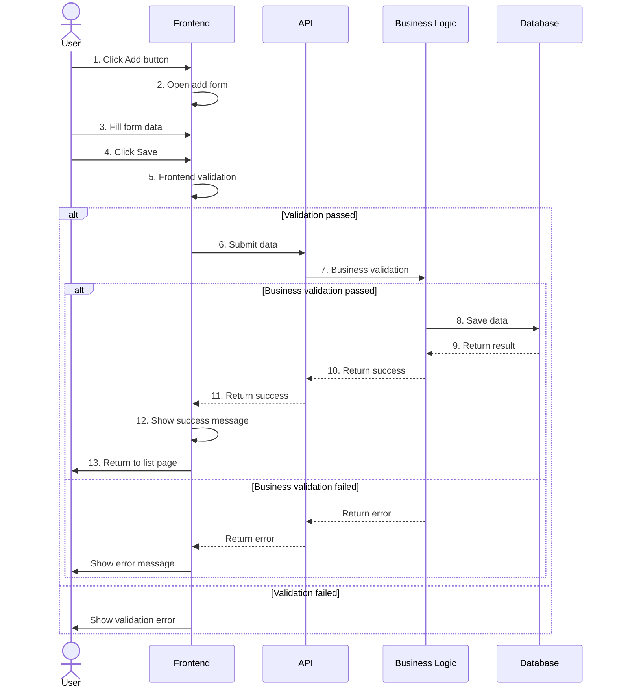
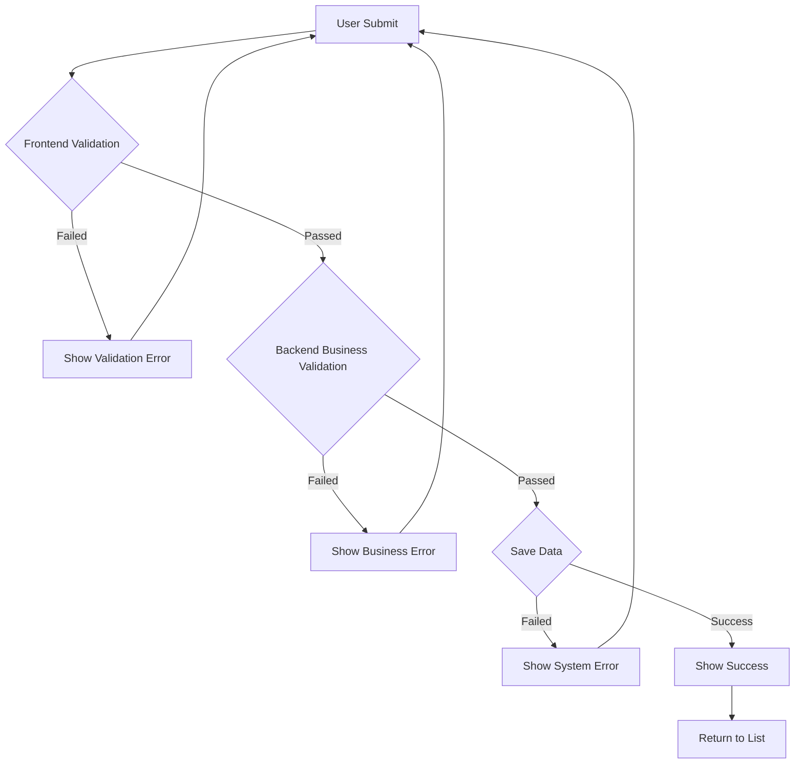
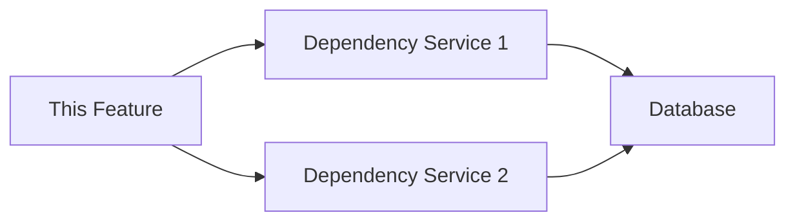

# Feature Detail Design Template - [Feature Name]

> **Applicable Scenario**: Detailed design for a single feature, including UI prototypes, interaction flows, and data definitions, for AI Agent generation and reading
> **Target Audience**: devcrew-product-manager, devcrew-solution-manager, devcrew-designer, devcrew-developer
> **Related Document**: [Module Overview Document](../{{module-name}}-overview.md)
> 
> <!-- AI-TAG: FEATURE_DETAIL -->
> <!-- AI-CONTEXT: This document describes the UI, interaction, and data rules of a single feature in detail. AI should fill all placeholders when generating. -->

<cite>
**Files Referenced in This Document**
- [{Controller}.java](file://path/to/controller)
- [{Service}.java](file://path/to/service)
- [{Entity}.java](file://path/to/entity)
- [{DTO}.java](file://path/to/dto)
</cite>

---

## 1. Content Overview

<!-- AI-TAG: OVERVIEW -->

### 1.1 Basic Information

| Item | Description |
|------|-------------|
| Feature Name | {Fill in feature name} |
| Module | {e.g., Order Management Module} |
| Core Function | {1-3 sentences describing core feature value} |
| Target Users | {Describe target user groups} |
| Applicable Scenario | {Describe core applicable business scenarios} |

### 1.2 Feature Scope

This design includes the following:
- [ ] {Interface 1} Prototype design + Interaction logic
- [ ] {Interface 2} Prototype design + Data rules
- [ ] {Core process} Interaction description + Exception handling

---

## 2. Core Interface Prototype (ASCII Wireframe)

<!-- AI-TAG: UI_PROTOTYPE -->
<!-- AI-NOTE: UI prototype uses ASCII wireframes to visually display page layout and element positions -->

### 2.1 List Page ({Page Name})

```
┌─────────────────────────────────────────────────────────────┐
│ [Page Title] {e.g., Product Management List}                │
├─────────────────────────────────────────────────────────────┤
│ ┌─────────────┬─────────────┬─────────────┬─────────────┐  │
│ │ Filter Area │ □ Checkbox  │ Input □     │ Dropdown ▼  │  │
│ │             │ Keyword:____|____________ │ Status:_____▼│  │
│ │             │ [Query]     [Reset]  [Add]                 │  │
│ └─────────────┴─────────────┴─────────────┴─────────────┘  │
│                                                             │
│ ┌─────────────────────────────────────────────────────────┐ │
│ │ No.  │ Field 1 │ Field 2 │ Field 3 │ Actions         │ │
│ ├──────┼─────────┼─────────┼─────────┼─────────────────┤ │
│ │ 1    │ {Value} │ {Value} │ {Value} │ [Edit][Delete]  │ │
│ │ 2    │ {Value} │ {Value} │ {Value} │ [Edit][Delete]  │ │
│ │ ...  │ ...     │ ...     │ ...     │ ...             │ │
│ └──────┴─────────┴─────────┴─────────┴─────────────────┘ │
│                                                             │
│ ┌─────────────────────────────────────────────────────────┐ │
│ │ Pagination: Total {X} records  Page [1][2][3]  {X}/page ▼│ │
│ └─────────────────────────────────────────────────────────┘ │
└─────────────────────────────────────────────────────────────┘
```

**Interface Element Description:**

| Area | Element | Type | Description | Interaction |
|------|---------|------|-------------|-------------|
| Filter Area | Keyword | Input | {Fuzzy search product name/code} | Enter to trigger query |
| Filter Area | Status Dropdown | Dropdown | {Filter product status} | Change triggers query |
| Filter Area | Query Button | Button | {Execute query} | Click to refresh list |
| List Area | Edit Link | Link | {Open edit page} | Click to navigate |
| List Area | Delete Link | Link | {Delete record} | Click to confirm deletion |

### 2.2 Form Page ({Page Name})

```
┌─────────────────────────────────────────────────────────────┐
│ [Page Title] {e.g., Add Product}                            │
├─────────────────────────────────────────────────────────────┤
│ ┌─────────────────────────────────────────────────────────┐ │
│ │ Basic Information Area                                    │ │
│ │ ┌─────────────┬───────────────────────────────────────┐ │ │
│ │ │ Label       │ Input/Select                           │ │ │
│ │ │ Product:    │ ____|__________________________________ │ │ │
│ │ │ Code:       │ ____|__________________________________ │ │ │
│ │ │ Status:     │ □ Enable  □ Disable                   │ │ │
│ │ │ Category:   │ ______▼                               │ │ │
│ │ │ Image:      │ [Upload] □ Preview Area                │ │ │
│ │ └─────────────┴───────────────────────────────────────┘ │ │
│ └─────────────────────────────────────────────────────────┘ │
│                                                             │
│ ┌─────────────────────────────────────────────────────────┐ │
│ │ Advanced Configuration Area                               │ │
│ │ ┌─────────────┬───────────────────────────────────────┐ │ │
│ │ │ Price:      │ ____|________ CNY                     │ │ │
│ │ │ Stock:      │ ____|________ pcs                     │ │ │
│ │ │ Remarks:    │ ┌───────────────────────────────────┐ │ │ │
│ │ │             │ │ Multi-line text input             │ │ │ │
│ │ │             │ │                                   │ │ │ │
│ │ │             │ └───────────────────────────────────┘ │ │ │
│ │ └─────────────┴───────────────────────────────────────┘ │ │
│ └─────────────────────────────────────────────────────────┘ │
│                                                             │
│ ┌─────────────────────────────────────────────────────────┐ │
│ │ [Save]                    [Cancel]                       │ │
│ └─────────────────────────────────────────────────────────┘ │
└─────────────────────────────────────────────────────────────┘
```

**Form Field Description:**

| Field | Type | Required | Validation Rules | Default Value |
|-------|------|----------|------------------|---------------|
| Product Name | Text | Yes | {Length 2-100, unique} | - |
| Product Code | Text | Yes | {Format: SP+6 digits} | {Auto-generated} |
| Product Status | Radio | Yes | {Enable/Disable} | {Enable} |
| Product Category | Dropdown | Yes | {Must select} | - |
| Price | Number | Yes | {≥0, max 2 decimals} | {0.00} |
| Stock | Integer | Yes | {≥0} | {0} |

### 2.3 Modal Page ({Modal Name})

```
┌─────────────────────────────────────────────────────────────┐
│ ┌─────────────────────────────────────────────────────────┐ │
│ │ [Modal Title] {e.g., Delete Confirmation}               │ │
│ ├─────────────────────────────────────────────────────────┤ │
│ │                                                         │ │
│ │ Message: {e.g., Are you sure to delete this product?    │ │
│ │           This action cannot be undone!}                │ │
│ │                                                         │ │
│ ├─────────────────────────────────────────────────────────┤ │
│ │            [Cancel]        [Confirm]                     │ │
│ └─────────────────────────────────────────────────────────┘ │
└─────────────────────────────────────────────────────────────┘
```

---

## 3. Interaction Flow Description

<!-- AI-TAG: INTERACTION_FLOW -->
<!-- AI-NOTE: Interaction flow uses Mermaid sequence diagrams to clearly show the interaction between user, frontend, and backend -->

### 3.1 Core Operation Flow ({Flow Name})



**Flow Step Description:**

| Step | Operation | Executor | Input | Output | Exception Handling |
|------|-----------|----------|-------|--------|-------------------|
| 1-2 | Open form | User/Frontend | Click | Form page | - |
| 3 | Fill data | User | Form data | - | - |
| 4-5 | Save/Validate | Frontend | Form data | Validation result | Show validation error |
| 6-7 | Submit/Validate | Backend | Submitted data | Validation result | Return business error |
| 8-13 | Save/Return | Backend/Frontend | Valid data | Save result | Return system error |

### 3.2 Exception Branch Flow



**Diagram Source**
- [{Controller}.java](file://path/to/controller#L45-L80)
- [{Service}.java](file://path/to/service#L30-L60)

### 3.3 Interaction Rules

| Trigger | Interaction Behavior | Exception Handling |
|---------|---------------------|-------------------|
| Click Query button | 1. Clear list data<br>2. Show loading state<br>3. Load filtered data | Show "No Data" placeholder when no matches |
| Click Edit button | 1. Open edit form<br>2. Echo current row data | Show "Data loading failed, please retry" when loading fails |
| Input blur | Trigger field format validation (e.g., phone/email) | Show red hint below input when validation fails |
| Click Delete button | 1. Pop up confirmation modal<br>2. Execute deletion after confirmation | Show error message when deletion fails |

---

## 4. Data Field Definition

<!-- AI-TAG: DATA_DEFINITION -->
<!-- AI-NOTE: Data definitions are important for Solution Agent to design APIs and databases -->

### 4.1 Core Field List

| Field Name | Field Type | Data Format | Constraint Rules | Index Suggestion | Remarks |
|------------|------------|-------------|------------------|------------------|---------|
| {Field 1} | String/Number/Boolean | {e.g., length ≤32, phone format} | {e.g., required, unique, default value} | {e.g., INDEX, UNIQUE} | {Additional notes} |
| {Field 2} | String | {e.g., length 1-64} | {Required, supports fuzzy query} | {INDEX for query} | - |
| {Field 3} | Number | {e.g., ≥0, ≤9999} | {Optional, default 0} | - | Unit: pcs |
| {Field 4} | Enum | {e.g., 0-Disabled, 1-Enabled} | {Required, default 1} | - | - |

### 4.2 Data Source Description

| Field Name | Data Source | Update Timing | Description |
|------------|-------------|---------------|-------------|
| {Field 1} | User manual input | When add/edit form submitted | - |
| {Field 2} | Query from {table name} table | Auto-fetched when page loads | Dropdown options |
| {Field 3} | System auto-generated | Generated when data created | e.g., unique code |

### 4.3 API Data Contract

**Request Parameters:**

```json
{
  "{Field 1}": "{Example value}",
  "{Field 2}": "{Example value}",
  "{Field 3}": {Number},
  "{Field 4}": {Enum value}
}
```

**Response Data:**

```json
{
  "code": 0,
  "message": "success",
  "data": {
    "id": "{Record ID}",
    "{Field 1}": "{Return value}",
    "{Field 2}": "{Return value}",
    "createTime": "2024-01-01 12:00:00"
  }
}
```

---

## 5. Business Rule Constraints

<!-- AI-TAG: BUSINESS_RULES -->

### 5.1 Permission Rules

| Operation | Permission Requirement | No Permission Handling |
|-----------|----------------------|----------------------|
| Add/Edit/Delete | Have {role name} role or {permission code} permission | Hide operation button, show "No permission" when clicked |
| View sensitive fields | Have {data permission} scope | Display sensitive fields as "***" |

### 5.2 Business Logic Rules

1. **{Rule 1}**: {e.g., Product code generation rule is "SP+YYMMDD+6 random digits"}
2. **{Rule 2}**: {e.g., When stock is 0, product status automatically changes to "Off-shelf"}
3. **{Rule 3}**: {e.g., After price modification, operation log must be recorded and synced to cache}
4. **{Rule 4}**: {e.g., When same user submits same form repeatedly within 5 minutes, trigger duplicate prevention validation}

### 5.3 Validation Rules

| Validation Scenario | Validation Rule | Prompt Message | Validation Timing | Error Code |
|--------------------|-----------------|----------------|-------------------|------------|
| Form submission | Product name cannot be empty | Please enter product name | Frontend blur + Backend submit | ERR_001 |
| Form submission | Product code format error (must start with SP) | Product code must start with SP, please check | Backend submit | ERR_002 |
| Delete operation | Cannot delete when product is associated with orders | This product is associated with orders and cannot be deleted | Before backend deletion | ERR_003 |

---

## 6. Dependency Analysis

<!-- AI-TAG: DEPENDENCIES -->

### 6.1 Module Dependencies

| Dependency Module | Dependency Type | Purpose | Impact Scope |
|-------------------|-----------------|---------|--------------|
| {Module A} | Strong | {Purpose description} | {Impact when unavailable} |
| {Module B} | Weak | {Purpose description} | {Degraded functionality} |

### 6.2 Service Dependencies



**Diagram Source**
- [{Service}.java](file://path/to/service#L10-L50)

### 6.3 External Dependencies

| External System | Interface Type | Call Scenario | Degradation Strategy |
|-----------------|----------------|---------------|---------------------|
| {Payment Gateway} | REST API | {Payment processing} | {Queue and retry} |
| {SMS Service} | REST API | {Verification code} | {Skip and log} |

---

## 7. Performance Considerations

<!-- AI-TAG: PERFORMANCE -->

### 7.1 Performance Bottlenecks

| Scenario | Bottleneck Description | Optimization Suggestion | Priority |
|----------|----------------------|------------------------|----------|
| {List query} | {Large data volume} | {Add index, pagination} | High |
| {Batch operation} | {Database lock} | {Async processing} | Medium |

### 7.2 Index Suggestions

| Table Name | Index Fields | Index Type | Scenario Description |
|------------|--------------|------------|---------------------|
| {table_name} | {field1, field2} | {COMPOSITE INDEX} | {Query optimization} |
| {table_name} | {field3} | {INDEX} | {Filter condition} |

### 7.3 Caching Strategy

| Cache Scenario | Cache Strategy | Expiration Time | Invalidation Strategy |
|----------------|----------------|-----------------|----------------------|
| {User info} | {Redis} | {30 minutes} | {Write-through} |
| {Configuration} | {Local cache} | {5 minutes} | {TTL expiration} |

### 7.4 Transaction Boundaries

| Operation Scenario | Transaction Scope | Isolation Level | Timeout Setting |
|-------------------|-------------------|-----------------|-----------------|
| {Create order} | {Order + Details} | {READ_COMMITTED} | {30 seconds} |
| {Payment} | {Order + Payment} | {SERIALIZABLE} | {60 seconds} |

---

## 8. Troubleshooting Guide

<!-- AI-TAG: TROUBLESHOOTING -->

### 8.1 Common Issues

| Issue Symptom | Possible Cause | Troubleshooting Steps | Solution |
|---------------|----------------|----------------------|----------|
| {Query timeout} | {Missing index} | {Check execution plan} | {Add index} |
| {Data inconsistency} | {Transaction failure} | {Check transaction logs} | {Manual correction} |
| {Permission denied} | {Role not assigned} | {Check user roles} | {Assign correct role} |

### 8.2 Error Code Reference

| Error Code | Error Description | Trigger Condition | Handling Suggestion |
|------------|-------------------|-------------------|---------------------|
| ERR_001 | {Required field empty} | {Form submission} | {Check required fields} |
| ERR_002 | {Format validation failed} | {Data validation} | {Check data format} |
| ERR_003 | {Business rule violation} | {Business operation} | {Check business rules} |

### 8.3 Key Log Points

| Log Location | Log Level | Key Information | Troubleshooting Purpose |
|--------------|-----------|-----------------|------------------------|
| {Service layer} | ERROR | {Exception stack trace} | {Locate error root cause} |
| {Controller} | INFO | {Request parameters} | {Reproduce issue} |
| {Database} | DEBUG | {SQL statements} | {Performance analysis} |

---

## 9. Notes and Additional Information

<!-- AI-TAG: ADDITIONAL_NOTES -->

### 9.1 Compatibility Adaptation

- **Interface Adaptation**: Supports PC 1920×1080 resolution, responsive adaptation for 1366×768 and above
- **Interaction Adaptation**: Supports mouse click/Enter to trigger actions, supports keyboard Tab key to switch focus

### 9.2 Pending Confirmations

- [ ] **{Pending 1}**: {e.g., Whether product category dropdown needs to support fuzzy search}
- [ ] **{Pending 2}**: {e.g., Whether delete operation needs secondary confirmation}

### 9.3 Extension Notes

- This prototype is a simplified version of the core process, extended fields/features can be added in subsequent iterations
- ASCII wireframe prototype only expresses layout and interaction logic, visual styles (e.g., colors, fonts) should refer to product visual specifications

---

## 10. Appendix

### 10.1 Best Practices

- {Best practice 1: e.g., Use batch operations for large datasets}
- {Best practice 2: e.g., Implement idempotency for critical operations}
- {Best practice 3: e.g., Add proper logging for troubleshooting}

### 10.2 Configuration Examples

```yaml
# Configuration example
feature:
  enabled: true
  timeout: 30s
  retry:
    max_attempts: 3
    delay: 1s
```

### 10.3 Related Documents

- [API Documentation](link)
- [Database Design](link)
- [Module Overview](../{module-name}-overview.md)

---

**Document Status:** 📝 Draft / 👀 In Review / ✅ Published  
**Last Updated:** {Date}  
**Maintainer:** {Name}  
**Related Module Document:** [Module Overview Document](../{{module-name}}-overview.md)

**Section Source**
- [{Controller}.java](file://path/to/controller#L1-L100)
- [{Service}.java](file://path/to/service#L1-L80)
- [{Entity}.java](file://path/to/entity#L1-L50)
