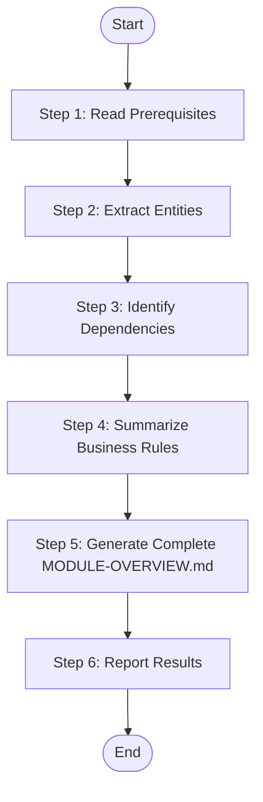

# Module Summarize - Complete Module Overview (XML Workflow)

Read all {{feature_name}}.md files of a specific module, extract and summarize information to complete {{module_name}}-overview.md (full version with entities, dependencies, flows, and rules).

## Language Adaptation

**CRITICAL**: Generate all content in the language specified by the `language` parameter.

- `language: "zh"` → Generate all content in 中文
- `language: "en"` → Generate all content in English
- Other languages → Use the specified language

**All output content (entity names, descriptions, business rules, flow descriptions) must be in the target language only.**

## Trigger Scenarios

- "Summarize module {name} features"
- "Complete module overview for {name}"
- "Finalize module documentation for {name}"

## Input

| Parameter | Type | Required | Description |
|-----------|------|----------|-------------|
| `module_name` | string | Yes | Module name to summarize |
| `module_path` | string | Yes | Path to module directory (e.g., `speccrew-workspace/knowledges/bizs/{{platform_type}}/{{module_name}}/`) containing: {{module_name}}-overview.md (initial version), features/{{feature_name}}.md files |
| `language` | string | Yes | Target language for generated content (e.g., "zh", "en") |

## Output

| Output | Path | Description |
|--------|------|-------------|
| `{{module_name}}-overview.md` | `{{module_path}}/{{module_name}}-overview.md` | Complete module overview (overwritten). Example: `speccrew-workspace/knowledges/bizs/backend-ai/chat/chat-overview.md` |

## Workflow



<!--
== Block Types ==
input      : Workflow input parameters (required=mandatory, default=default value)
output     : Workflow output results (from=data source variable)
task       : Execute action (action: run-skill | run-script | dispatch-to-worker)
gateway    : Conditional branch/gate (mode: exclusive | guard | parallel)
loop       : Iterate over collection (over=collection, as=current item)
event      : Log/confirm/signal (action: log | confirm | signal)
error-handler : Exception handling (try > catch > finally)
checkpoint : Persistent milestone (name=checkpoint name, verify=verification condition)
rule       : Constraint declaration (level: forbidden | mandatory | note)
-->

<workflow>
  <!-- Input Block: Define workflow inputs -->
  <input name="module_name" type="string" required="true" />
  <input name="module_path" type="string" required="true" />
  <input name="language" type="string" required="true" />

  <!-- Step 1: Read Prerequisites -->
  <task name="read_template" action="run-skill" skill="Read">
    <param name="file_path">../speccrew-knowledge-module-summarize/templates/MODULE-OVERVIEW-TEMPLATE.md</param>
    <output name="template_content" />
  </task>

  <task name="read_initial_overview" action="run-skill" skill="Read">
    <param name="file_path">{{module_path}}/{{module_name}}-overview.md</param>
    <output name="initial_overview" />
  </task>

  <task name="discover_features" action="run-skill" skill="Glob">
    <param name="pattern">{{module_path}}/features/*.md</param>
    <output name="feature_files" />
  </task>

  <!-- Loop: Read all feature detail files -->
  <loop name="read_features" over="feature_files" as="feature_file">
    <task name="read_feature" action="run-skill" skill="Read">
      <param name="file_path">{{feature_file}}</param>
      <output name="feature_content" />
    </task>
  </loop>

  <!-- Checkpoint: Verify prerequisites loaded -->
  <checkpoint name="prerequisites_loaded" verify="template_content != null AND feature_files != null" />

  <!-- Gateway: Handle edge case - no features found -->
  <gateway name="check_features" mode="exclusive">
    <branch condition="feature_files.length == 0">
      <event action="log" level="warning">No feature documents found for module {{module_name}}</event>
      <task name="generate_minimal_overview" action="run-skill" skill="Write">
        <param name="file_path">{{module_path}}/{{module_name}}-overview.md</param>
        <param name="content">{{minimal_skeleton}}</param>
      </task>
      <output name="status" from="partial" />
      <event action="signal">workflow_complete</event>
    </branch>
    <branch condition="feature_files.length > 0">
      <event action="log" level="info">Found {{feature_files.length}} feature documents</event>
    </branch>
  </gateway>

  <!-- Step 2: Extract Entities -->
  <task name="extract_entities" action="run-script">
    <param name="script">extract-entities.js</param>
    <param name="inputs">feature_contents</param>
    <output name="extracted_entities" />
  </task>

  <!-- Loop: Process each entity for deduplication -->
  <loop name="process_entities" over="extracted_entities" as="entity">
    <task name="aggregate_entity" action="run-script">
      <param name="script">aggregate-entity.js</param>
      <param name="entity">{{entity}}</param>
      <output name="aggregated_entity" />
    </task>
  </loop>

  <!-- Checkpoint: Entities aggregated -->
  <checkpoint name="entities_aggregated" verify="unique_entities.length > 0" />

  <!-- Step 3: Identify Dependencies -->
  <task name="identify_dependencies" action="run-script">
    <param name="script">identify-dependencies.js</param>
    <param name="inputs">feature_contents</param>
    <output name="dependencies" />
  </task>

  <!-- Classify dependencies -->
  <loop name="classify_deps" over="dependencies" as="dependency">
    <gateway name="classify_direction" mode="exclusive">
      <branch condition="dependency.direction == 'provides'">
        <output name="provided_deps" append="{{dependency}}" />
      </branch>
      <branch condition="dependency.direction == 'consumes'">
        <output name="consumed_deps" append="{{dependency}}" />
      </branch>
    </gateway>
  </loop>

  <!-- Checkpoint: Dependencies classified -->
  <checkpoint name="dependencies_classified" verify="dependencies != null" />

  <!-- Step 4: Summarize Business Rules -->
  <task name="extract_rules" action="run-script">
    <param name="script">extract-rules.js</param>
    <param name="inputs">feature_contents</param>
    <output name="business_rules" />
  </task>

  <!-- Loop: Associate rules with features -->
  <loop name="associate_rules" over="business_rules" as="rule">
    <task name="find_rule_source" action="run-script">
      <param name="script">find-source-feature.js</param>
      <param name="rule">{{rule}}</param>
      <param name="features">{{feature_files}}</param>
      <output name="rule_with_source" />
    </task>
  </loop>

  <!-- Checkpoint: Rules collected -->
  <checkpoint name="rules_collected" verify="business_rules.length >= 0" />

  <!-- Step 5: Generate Complete MODULE-OVERVIEW.md -->
  <!-- Phase A: Skeleton Construction -->
  <task name="count_entities" action="run-script">
    <param name="script">count-items.js</param>
    <param name="items">{{unique_entities}}</param>
    <output name="entity_count" />
  </task>

  <task name="count_dependencies" action="run-script">
    <param name="script">count-items.js</param>
    <param name="items">{{dependencies}}</param>
    <output name="dependency_count" />
  </task>

  <task name="count_flows" action="run-script">
    <param name="script">count-flows.js</param>
    <param name="features">{{feature_contents}}</param>
    <output name="flow_count" />
  </task>

  <task name="count_rules" action="run-script">
    <param name="script">count-items.js</param>
    <param name="items">{{business_rules}}</param>
    <output name="rule_count" />
  </task>

  <!-- Create skeleton structure -->
  <task name="create_skeleton" action="run-script">
    <param name="script">create-overview-skeleton.js</param>
    <param name="template">{{template_content}}</param>
    <param name="entity_count">{{entity_count}}</param>
    <param name="dependency_count">{{dependency_count}}</param>
    <param name="flow_count">{{flow_count}}</param>
    <param name="rule_count">{{rule_count}}</param>
    <param name="language">{{language}}</param>
    <output name="document_skeleton" />
  </task>

  <!-- Rule: Skeleton must be complete before filling -->
  <rule level="mandatory">DO NOT start filling content until the complete skeleton is verified</rule>

  <!-- Checkpoint: Skeleton verified -->
  <checkpoint name="skeleton_verified" verify="document_skeleton != null AND document_skeleton.contains('[TO BE FILLED]')" />

  <!-- Phase B: Content Filling -->
  <!-- Read Mermaid rules -->
  <task name="read_mermaid_rules" action="run-skill" skill="Read">
    <param name="file_path">speccrew-workspace/docs/rules/mermaid-rule.md</param>
    <output name="mermaid_rules" />
  </task>

  <!-- Fill Section 3: Business Entities -->
  <loop name="fill_entities" over="unique_entities" as="entity">
    <task name="fill_entity_row" action="run-script">
      <param name="script">fill-entity-row.js</param>
      <param name="entity">{{entity}}</param>
      <param name="language">{{language}}</param>
      <output name="entity_row" />
    </task>
  </loop>

  <!-- Fill Section 4: Dependencies -->
  <loop name="fill_dependencies" over="dependencies" as="dependency">
    <task name="fill_dependency_row" action="run-script">
      <param name="script">fill-dependency-row.js</param>
      <param name="dependency">{{dependency}}</param>
      <param name="language">{{language}}</param>
      <output name="dependency_row" />
    </task>
  </loop>

  <!-- Fill Section 5: Core Business Flows -->
  <loop name="fill_flows" over="core_flows" as="flow">
    <task name="fill_flow_item" action="run-script">
      <param name="script">fill-flow-item.js</param>
      <param name="flow">{{flow}}</param>
      <param name="language">{{language}}</param>
      <output name="flow_item" />
    </task>
  </loop>

  <!-- Fill Section 6: Business Rules -->
  <loop name="fill_rules" over="business_rules" as="rule">
    <task name="fill_rule_row" action="run-script">
      <param name="script">fill-rule-row.js</param>
      <param name="rule">{{rule}}</param>
      <param name="language">{{language}}</param>
      <output name="rule_row" />
    </task>
  </loop>

  <!-- Error Handler for document writing -->
  <error-handler>
    <try>
      <!-- Write final document -->
      <gateway name="check_existing_doc" mode="exclusive">
        <branch condition="initial_overview != null">
          <!-- Use search_replace for existing document -->
          <loop name="replace_sections" over="sections" as="section">
            <task name="replace_section" action="run-skill" skill="search_replace">
              <param name="file_path">{{module_path}}/{{module_name}}-overview.md</param>
              <param name="section">{{section}}</param>
            </task>
          </loop>
        </branch>
        <branch condition="initial_overview == null">
          <!-- Create new document -->
          <task name="write_overview" action="run-skill" skill="Write">
            <param name="file_path">{{module_path}}/{{module_name}}-overview.md</param>
            <param name="content">{{document_skeleton}}</param>
          </task>
        </branch>
      </gateway>
    </try>
    <catch error="write_error">
      <event action="log" level="error">Failed to write overview document: {{write_error.message}}</event>
      <output name="status" from="failed" />
    </catch>
    <finally>
      <event action="log" level="info">Document write operation completed</event>
    </finally>
  </error-handler>

  <!-- Rule: Content language constraint -->
  <rule level="mandatory">ALL generated content MUST be in the language specified by the language parameter</rule>

  <!-- Rule: Forbidden operations -->
  <rule level="forbidden">FORBIDDEN: create_file for overview document rewrite - use search_replace instead</rule>
  <rule level="forbidden">FORBIDDEN: Full-file rewrite - always use targeted search_replace on specific sections</rule>

  <!-- Checkpoint: Document generated -->
  <checkpoint name="document_generated" verify="output_file_exists == true" />

  <!-- Step 6: Report Results -->
  <task name="generate_report" action="run-script">
    <param name="script">generate-report.js</param>
    <param name="module_name">{{module_name}}</param>
    <param name="feature_count">{{feature_files.length}}</param>
    <param name="entity_count">{{unique_entities.length}}</param>
    <param name="dependency_count">{{dependencies.length}}</param>
    <param name="rule_count">{{business_rules.length}}</param>
    <output name="completion_report" />
  </task>

  <!-- Event: Log completion -->
  <event action="log" level="info">
    Module summarization completed:
    - Module: {{module_name}}
    - Features Processed: {{feature_files.length}}
    - Entities Extracted: {{unique_entities.length}}
    - Dependencies Identified: {{dependencies.length}}
    - Business Rules Summarized: {{business_rules.length}}
    - Output: {{module_name}}-overview.md (complete)
    - Status: success
  </event>

  <!-- Output Block: Define workflow outputs -->
  <output name="status" from="success" />
  <output name="module_name" from="module_name" />
  <output name="output_file" from="{{module_name}}-overview.md" />
  <output name="message" from="Module summarization completed with {{feature_files.length}} features processed" />
</workflow>

## Constraints

### Critical Constraints

> 1. **FORBIDDEN: `create_file` for overview document** — If skeleton exists, use `search_replace`; if not, copy template first then fill with `search_replace`
> 2. **FORBIDDEN: Full-file rewrite** — Always use targeted `search_replace` on specific sections
> 3. **MANDATORY: Template-first workflow** — Template (or existing skeleton) MUST be in place before filling sections

### Content Language

**IMPORTANT**: ALL generated content (entity descriptions, business rules, flow descriptions, section headers, and narrative text) MUST be written in the language specified by the `language` parameter. Only code identifiers, file paths, and technical terms (class names, API endpoints) remain in their original language.

## Return Value Format

```json
{
  "status": "success|failed",
  "module_name": "module_name",
  "output_file": "module_name-overview.md",
  "message": "Module summarization completed with N features processed"
}
```

## Task Completion Report

Upon completion, output the following structured report:

```json
{
  "status": "success | partial | failed",
  "skill": "speccrew-knowledge-module-summarize-xml",
  "output_files": [
    "{module_path}/{module_name}-overview.md"
  ],
  "summary": "Module overview completed with entities, dependencies, and business rules extracted from {feature_count} features",
  "metrics": {
    "modules_processed": 1,
    "documents_generated": 1,
    "features_covered": 0
  },
  "errors": [],
  "next_steps": [
    "Run speccrew-knowledge-system-summarize-xml to aggregate all modules into system overview"
  ]
}
```

## Reference Guides

### Mermaid Diagram Guide

When generating Mermaid diagrams, follow these compatibility guidelines:

**Key Requirements:**
- Use only basic node definitions: `A[text content]`
- No HTML tags (e.g., `<br/>`)
- No nested subgraphs
- No `direction` keyword
- No `style` definitions
- Use standard `graph TB/LR` syntax only

**Diagram Types:**

| Diagram Type | Use Case | Example |
|---------|---------|------|
| `graph TB/LR` | Module structure, dependencies | Project structure diagram, dependency graph |
| `sequenceDiagram` | Interaction flow, API calls | User operation flow, service call chain |
| `flowchart TD` | Business logic, conditional branches | State transition, exception handling |
| `classDiagram` | Class structure, entity relationships | Data model, service interface |
| `erDiagram` | Database table relationships | Entity relationship diagram |
| `stateDiagram-v2` | State machine | Order status, approval status |

### Source Traceability Guide

Aggregate source file references from all feature documents:

> **Note**: Use relative paths from the generated document to the source file. Do NOT use `file://` protocol.

**CRITICAL: Dynamic Relative Path Calculation**

The document generation location is `speccrew-workspace/knowledges/bizs/{platform_id}/{module_path}/{file}.md`, which has a **variable depth** from the project root. You MUST dynamically calculate the relative path depth based on the actual document location.

**Calculation Method:**
1. Count the number of directory separators (`/`) from the project root to the document's directory
2. Each directory level requires one `../` to traverse up to the project root
3. Example: Document at `speccrew-workspace/knowledges/bizs/backend-ai/chat/overview.md` (5 levels) → Use `../../../../../src/...`

**Common Path Depths Reference:**
| Document Location | Depth | Relative Path Prefix |
|---|---|---|
| `speccrew-workspace/knowledges/bizs/{platform}/{module}/` | 5+ | `../../../../../` |
| `speccrew-workspace/knowledges/bizs/{platform}/{module}/{sub}/` | 6+ | `../../../../../../` |

**Source reference examples by tech stack (assuming document at depth 5):**

Backend (Java): `[OrderController.java](../../../../../src/main/java/.../OrderController.java#L10-L25)`
Backend (Python): `[views.py](../../../../../app/order/views.py#L10-L25)`
Backend (Node.js): `[orderController.js](../../../../../src/modules/order/orderController.js#L10-L25)`
Frontend (Vue): `[OrderList.vue](../../../../../src/views/order/OrderList.vue#L10-L25)`
Frontend (React): `[OrderDetail.tsx](../../../../../src/pages/order/OrderDetail.tsx#L10-L25)`

1. **File Reference Block** (at document start):
```markdown
**Referenced Files**

- [OrderController.*](path/to/source/OrderController.*)
- [OrderService.*](path/to/source/OrderService.*)
```

2. **Diagram Source** (after each Mermaid diagram):
```markdown
**Diagram Source**
- [OrderController.*](path/to/source/OrderController.*#L45-L60)
```

3. **Section Source** (at end of document):
```markdown
**Section Source**
- [OrderController.*](path/to/source/OrderController.*#L1-L100)
- [OrderService.*](path/to/source/OrderService.*#L1-L80)
```

## Notes

> **Note**: This skill focuses on document aggregation only. Knowledge graph data (nodes, edges) is handled separately by the dispatch skill's `process-batch-results.js` script during Stage 2. Module-summarize does NOT read from or write to the knowledge graph.

## Checklist

- [ ] Step 1: Prerequisites read (template, initial overview, feature details)
- [ ] Step 2: Entities extracted and aggregated
- [ ] Step 3: Dependencies identified
- [ ] Step 4: Business rules collected
- [ ] Step 5: Section 3-6 completed in {{module_name}}-overview.md
- [ ] Step 6: Results reported
