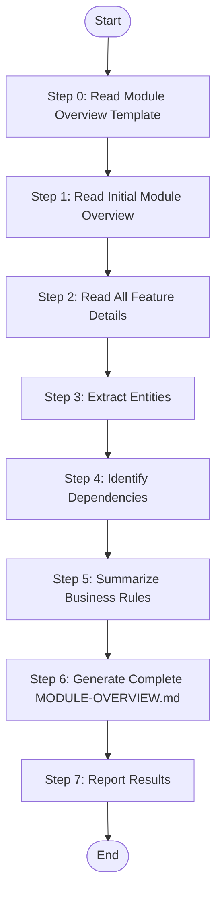

# Module Summarize - Complete Module Overview

Read all {{feature_name}}.md files of a specific module, extract and summarize information to complete {{module_name}}-overview.md (full version with entities, dependencies, flows, and rules).

## Language Adaptation

**CRITICAL**: Generate all content in the language specified by the `language` parameter.

- `language: "zh"` → Generate all content in 中文
- `language: "en"` → Generate all content in English
- Other languages → Use the specified language

**All output content (entity names, descriptions, business rules, flow descriptions) must be in the target language only.**

## Trigger Scenarios

- "Summarize module {name} features"
- "Complete module overview for {name}"
- "Finalize module documentation for {name}"

## User

Worker Agent (speccrew-task-worker)

## Input

- `module_name`: Module name to summarize
- `module_path`: Path to module directory (e.g., `speccrew-workspace/knowledges/bizs/{{platform_type}}/{{module_name}}/`) containing:
  - {{module_name}}-overview.md (initial version)
  - features/{{feature_name}}.md files
- `language`: Target language for generated content (e.g., "zh", "en") - **REQUIRED**

## Output

- `{{module_path}}/{{module_name}}-overview.md` - Complete module overview (overwritten)

## Workflow

### Prerequisites

Before starting, verify the initial module overview file exists:
- **File**: `module_path/module_name-overview.md`
- **Created by**: The dispatch skill (Stage 3 preparation) generates an initial skeleton containing:
  - Section 1: Module Basic Information (from feature inventory metadata)
  - Section 2: Feature List Table (linking to all feature-detail.md files)
  - Remaining sections: Empty placeholders (to be completed by this skill)
- **If missing**: Create a minimal skeleton with Section 1-2 from the feature inventory data, then proceed with the workflow

### Edge Cases

- **No feature documents found**: If `module_path/features/` is empty or missing, generate a minimal overview with only Section 1 (Module Basic Info) and Section 2 (empty feature list), then return with `status: "partial"` and a warning message.
- **Incomplete feature documents**: If a feature-detail.md is missing expected sections (e.g., no Section 3 or Section 6), extract whatever is available and note the gaps in the corresponding overview section with `<!-- DATA INCOMPLETE: {feature_name} missing Section X -->`.
- **Feature count mismatch**: If the number of feature-detail.md files doesn't match the inventory count, log the discrepancy in the return stats but proceed with available documents.



### Step 0: Read Module Overview Template

Before processing, read the template file to understand the required content structure:
- **Read**: `templates/MODULE-OVERVIEW-TEMPLATE.md`
- **Purpose**: Understand the template chapters and example content requirements for module overview documents
- **Key sections to follow**:
  - Section 1: Module Basic Information (Module Positioning, Module Boundary with Mermaid diagram)
  - Section 2: Feature List (Feature Tree with mindmap, Feature List Table with status)
  - Section 3: Business Entities and Relationships (Core Entity List, Entity Relationship Diagram with ER diagram, Entity State Transition with state diagram)
  - Section 4: External Dependencies and Interfaces (Module Dependency Relationships, External Interfaces Provided, Dependent Module Interfaces)
  - Section 5: Core Business Processes (Core Process Within Module with flowchart, Exception Handling Rules)
  - Section 6: Business Rules and Constraints (Business Rules, Data Constraints, Permission Rules)
  - Section 7: Related Pages and Prototypes (Page List, Page Prototype reference)
  - Section 8: Change History (version tracking table)

### Step 1: Read Initial Module Overview

Read existing {{module_name}}-overview.md (initial version) to get:
- Module basic info (name, purpose, domain)
- Feature list with links to detail docs

### Step 2: Read All Feature Details

Find and read all `{{module_path}}/features/{{feature_name}}.md` files.

For each feature-detail.md, extract and categorize the following:

**From Section 3 (Business Entities / State Objects)** — Priority: High
- **Backend modules**: Entity names, database fields, types, relationships, ORM constraints
- **Frontend modules**: State objects (Store/State), component prop interfaces, computed/derived data
- Aggregate across features to build module-level entity list (deduplicate by entity name)

**From Section 4 (Dependencies)** — Priority: High  
- **Backend**: Internal module API calls, external service dependencies, shared DTOs
- **Frontend**: Component imports, Store/State dependencies, route guard dependencies, shared composables/hooks
- Classify as: "Provided by this module" vs "Consumed from other modules"

**From Section 6 (Business Rules)** — Priority: High
- Validation rules, state transitions, authorization rules, data consistency constraints
- Associate each rule with its originating feature

**From Section 5 (Core Processes)** — Priority: Medium
- Step sequences, branching logic, exception handling paths
- Identify cross-feature flows that span multiple features

**From Section 2 (Feature Details / API Definitions)** — Priority: Medium
- Data constraints: field types, ranges, uniqueness, required fields
- Build constraint matrix for entities

### Step 3: Extract Entities

Aggregate entities from all features:

```
From Feature A: Order, OrderItem
From Feature B: Order, Payment
---------------------------------
Module Entities: Order, OrderItem, Payment
```

For each entity, collect:
- Fields and types
- Validation constraints
- Relationships (from multiple features)

### Step 4: Identify Dependencies

Analyze feature details to identify:
- **Internal dependencies**: Other modules this module calls
- **External dependencies**: Third-party services, APIs
- **Data dependencies**: Shared entities, common DTOs

### Step 5: Summarize Business Rules

Collect all business rules from feature details:
- Validation rules
- State transition rules
- Authorization rules
- Data consistency rules

### Step 6: Generate Complete MODULE-OVERVIEW.md

**IMPORTANT**: ALL generated content (entity descriptions, business rules, flow descriptions, section headers, and narrative text) MUST be written in the language specified by the `language` parameter. Only code identifiers, file paths, and technical terms (class names, API endpoints) remain in their original language.

1. **Read Configuration**:
   - Read `speccrew-workspace/docs/rules/mermaid-rule.md` - Get Mermaid diagram compatibility guidelines

2. **Use template `templates/MODULE-OVERVIEW-TEMPLATE.md`, fill all sections**:
   - Follow [Mermaid Diagram Guide](#mermaid-diagram-guide) for diagram generation

**Section 1: Module Basic Info** (from initial version)
- Keep existing information

**Section 2: Feature List** (from initial version)
- Keep feature list table
- Ensure all links to {{feature_name}}.md are correct

**Section 3: Business Entities** (NEW)

**Backend example:**
| Entity Name | Description | Key Attributes | Business Rules |
|---|---|---|---|
| Order | Order master data | id, orderNo, amount, status | Status flow constraint |

**Frontend example:**
| Entity Name | Description | Key Attributes | Business Rules |
|---|---|---|---|
| OrderState | Order list view state | orders[], selectedOrder, loading, error | loading prevents re-fetch |
| OrderFormProps | Order form component interface | order: Order, editable: boolean, onSave: Function | order required |

Include ER diagram based on entity relationships.

**Section 4: Dependencies** (NEW)

**Backend example:**
| Direction | Target | Content | Method |
|---|---|---|---|
| Uses | UserService | Get user info | API call |

**Frontend example:**
| Direction | Target | Content | Method |
|---|---|---|---|
| Imports | UserStore | Get user state | Store injection |
| Imports | UserCard | Display user info | Component import |

**Section 5: Core Business Flows** (NEW)

Based on feature interactions, identify core flows:

**Backend example:**
Create Order: Validate params → Calculate amount → Save to DB → Notify downstream

**Frontend example:**
Order List: Load data → Display list → User selects → Load detail → Display detail → Edit → Submit → Update state

**Section 6: Business Rules** (NEW)

| Rule ID | Rule Name | Description | Related Features |
|---------|-----------|-------------|------------------|
| R001 | Order amount > 0 | Order total must be positive | create-order |
| R002 | Stock check | Must check inventory before order | create-order |

Apply source traceability rules (see [Reference Guides > Source Traceability Guide](#source-traceability-guide))

### Step 7: Report Results

```
Module summarization completed:
- Module: {{module_name}}
- Features Processed: {{feature_count}}
- Entities Extracted: {{entity_count}}
- Dependencies Identified: {{dependency_count}}
- Business Rules Summarized: {{rule_count}}
- Output: {{module_name}}-overview.md (complete)
- Status: success
```

## Reference Guides

### Mermaid Diagram Guide

When generating Mermaid diagrams, follow these compatibility guidelines:

**Key Requirements:**
- Use only basic node definitions: `A[text content]`
- No HTML tags (e.g., `<br/>`)
- No nested subgraphs
- No `direction` keyword
- No `style` definitions
- Use standard `graph TB/LR` syntax only

**Diagram Types:**

| Diagram Type | Use Case | Example |
|---------|---------|------|
| `graph TB/LR` | Module structure, dependencies | Project structure diagram, dependency graph |
| `sequenceDiagram` | Interaction flow, API calls | User operation flow, service call chain |
| `flowchart TD` | Business logic, conditional branches | State transition, exception handling |
| `classDiagram` | Class structure, entity relationships | Data model, service interface |
| `erDiagram` | Database table relationships | Entity relationship diagram |
| `stateDiagram-v2` | State machine | Order status, approval status |

### Source Traceability Guide

Aggregate source file references from all feature documents:

> **Note**: Use relative paths from the generated document to the source file. Do NOT use `file://` protocol.

**Source reference examples by tech stack:**

Backend (Java): `[OrderController.java](../../src/main/java/.../OrderController.java#L10-L25)`
Backend (Python): `[views.py](../../app/order/views.py#L10-L25)`
Backend (Node.js): `[orderController.js](../../src/modules/order/orderController.js#L10-L25)`
Frontend (Vue): `[OrderList.vue](../../src/views/order/OrderList.vue#L10-L25)`
Frontend (React): `[OrderDetail.tsx](../../src/pages/order/OrderDetail.tsx#L10-L25)`

1. **File Reference Block** (at document start):
```markdown
<cite>
**Referenced Files**
- [OrderController.*](path/to/source/OrderController.*)
- [OrderService.*](path/to/source/OrderService.*)
</cite>
```

2. **Diagram Source** (after each Mermaid diagram):
```markdown
**Diagram Source**
- [OrderController.*](path/to/source/OrderController.*#L45-L60)
```

3. **Section Source** (at end of document):
```markdown
**Section Source**
- [OrderController.*](path/to/source/OrderController.*#L1-L100)
- [OrderService.*](path/to/source/OrderService.*#L1-L80)
```

## Notes

> **Note**: This skill focuses on document aggregation only. Knowledge graph data (nodes, edges) is handled separately by the dispatch skill's `process-batch-results.js` script during Stage 2. Module-summarize does NOT read from or write to the knowledge graph.

## Return

**Return Value (JSON format):**

```json
{
  "status": "success|failed",
  "module_name": "module_name",
  "output_file": "module_name-overview.md",
  "message": "Module summarization completed with N features processed"
}
```

---

## Checklist

- [ ] Initial {{module_name}}-overview.md read
- [ ] All {{feature_name}}.md files read
- [ ] Source file references extracted from feature documents
- [ ] Entities extracted and aggregated
- [ ] Dependencies identified
- [ ] Business rules collected
- [ ] Section 3-6 completed in {{module_name}}-overview.md
- [ ] Source traceability information included
- [ ] Mermaid diagrams follow compatibility guidelines
- [ ] Results reported

