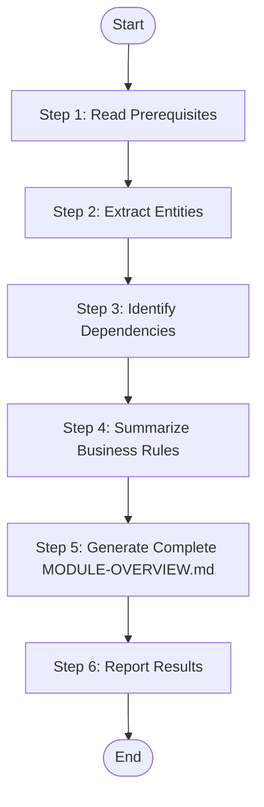

# Module Summarize - Complete Module Overview (XML Workflow)

Read all {{feature_name}}.md files of a specific module, extract and summarize information to complete {{module_name}}-overview.md (full version with entities, dependencies, flows, and rules).

## Language Adaptation

**CRITICAL**: Generate all content in the language specified by the `language` parameter.

- `language: "zh"` → Generate all content in 中文
- `language: "en"` → Generate all content in English
- Other languages → Use the specified language

**All output content (entity names, descriptions, business rules, flow descriptions) must be in the target language only.**

## Trigger Scenarios

- "Summarize module {name} features"
- "Complete module overview for {name}"
- "Finalize module documentation for {name}"

## Input

| Parameter | Type | Required | Description |
|-----------|------|----------|-------------|
| `module_name` | string | Yes | Module name to summarize |
| `module_path` | string | Yes | Path to module directory (e.g., `speccrew-workspace/knowledges/bizs/{{platform_type}}/{{module_name}}/`) containing: {{module_name}}-overview.md (initial version), features/{{feature_name}}.md files |
| `language` | string | Yes | Target language for generated content (e.g., "zh", "en") |

## Output

| Output | Path | Description |
|--------|------|-------------|
| `{{module_name}}-overview.md` | `{{module_path}}/{{module_name}}-overview.md` | Complete module overview (overwritten). Example: `speccrew-workspace/knowledges/bizs/backend-ai/chat/chat-overview.md` |

## Workflow



> **REQUIRED**: Before executing this workflow, read the XML workflow specification: `speccrew-workspace/docs/rules/agentflow-spec.md`

## AgentFlow Definition

<!-- @agentflow: workflow.agentflow.xml -->

## Constraints

### Critical Constraints

> 1. **FORBIDDEN: `create_file` for overview document** — If skeleton exists, use `search_replace`; if not, copy template first then fill with `search_replace`
> 2. **FORBIDDEN: Full-file rewrite** — Always use targeted `search_replace` on specific sections
> 3. **MANDATORY: Template-first workflow** — Template (or existing skeleton) MUST be in place before filling sections

### Content Language

**IMPORTANT**: ALL generated content (entity descriptions, business rules, flow descriptions, section headers, and narrative text) MUST be written in the language specified by the `language` parameter. Only code identifiers, file paths, and technical terms (class names, API endpoints) remain in their original language.

## Return Value Format

```json
{
  "status": "success|failed",
  "module_name": "module_name",
  "output_file": "module_name-overview.md",
  "message": "Module summarization completed with N features processed"
}
```

## Task Completion Report

Upon completion, output the following structured report:

```json
{
  "status": "success | partial | failed",
  "skill": "speccrew-knowledge-module-summarize",
  "output_files": [
    "{module_path}/{module_name}-overview.md"
  ],
  "summary": "Module overview completed with entities, dependencies, and business rules extracted from {feature_count} features",
  "metrics": {
    "modules_processed": 1,
    "documents_generated": 1,
    "features_covered": 0
  },
  "errors": [],
  "next_steps": [
    "Run speccrew-knowledge-system-summarize to aggregate all modules into system overview"
  ]
}
```

## Reference Guides

### Mermaid Diagram Guide

When generating Mermaid diagrams, follow these compatibility guidelines:

**Key Requirements:**
- Use only basic node definitions: `A[text content]`
- No HTML tags (e.g., `<br/>`)
- No nested subgraphs
- No `direction` keyword
- No `style` definitions
- Use standard `graph TB/LR` syntax only

**Diagram Types:**

| Diagram Type | Use Case | Example |
|---------|---------|------|
| `graph TB/LR` | Module structure, dependencies | Project structure diagram, dependency graph |
| `sequenceDiagram` | Interaction flow, API calls | User operation flow, service call chain |
| `flowchart TD` | Business logic, conditional branches | State transition, exception handling |
| `classDiagram` | Class structure, entity relationships | Data model, service interface |
| `erDiagram` | Database table relationships | Entity relationship diagram |
| `stateDiagram-v2` | State machine | Order status, approval status |

### Source Traceability Guide

Aggregate source file references from all feature documents:

> **Note**: Use relative paths from the generated document to the source file. Do NOT use `file://` protocol.

**CRITICAL: Dynamic Relative Path Calculation**

The document generation location is `speccrew-workspace/knowledges/bizs/{platform_id}/{module_path}/{file}.md`, which has a **variable depth** from the project root. You MUST dynamically calculate the relative path depth based on the actual document location.

**Calculation Method:**
1. Count the number of directory separators (`/`) from the project root to the document's directory
2. Each directory level requires one `../` to traverse up to the project root
3. Example: Document at `speccrew-workspace/knowledges/bizs/backend-ai/chat/overview.md` (5 levels) → Use `../../../../../src/...`

**Common Path Depths Reference:**
| Document Location | Depth | Relative Path Prefix |
|---|---|---|
| `speccrew-workspace/knowledges/bizs/{platform}/{module}/` | 5+ | `../../../../../` |
| `speccrew-workspace/knowledges/bizs/{platform}/{module}/{sub}/` | 6+ | `../../../../../../` |

**Source reference examples by tech stack (assuming document at depth 5):**

Backend (Java): `[OrderController.java](../../../../../src/main/java/.../OrderController.java#L10-L25)`
Backend (Python): `[views.py](../../../../../app/order/views.py#L10-L25)`
Backend (Node.js): `[orderController.js](../../../../../src/modules/order/orderController.js#L10-L25)`
Frontend (Vue): `[OrderList.vue](../../../../../src/views/order/OrderList.vue#L10-L25)`
Frontend (React): `[OrderDetail.tsx](../../../../../src/pages/order/OrderDetail.tsx#L10-L25)`

1. **File Reference Block** (at document start):
```markdown
**Referenced Files**

- [OrderController.*](path/to/source/OrderController.*)
- [OrderService.*](path/to/source/OrderService.*)
```

2. **Diagram Source** (after each Mermaid diagram):
```markdown
**Diagram Source**
- [OrderController.*](path/to/source/OrderController.*#L45-L60)
```

3. **Section Source** (at end of document):
```markdown
**Section Source**
- [OrderController.*](path/to/source/OrderController.*#L1-L100)
- [OrderService.*](path/to/source/OrderService.*#L1-L80)
```

## Notes

> **Note**: This skill focuses on document aggregation only. Knowledge graph data (nodes, edges) is handled separately by the dispatch skill's `process-batch-results.js` script during Stage 2. Module-summarize does NOT read from or write to the knowledge graph.

## Checklist

- [ ] Step 1: Prerequisites read (template, initial overview, feature details)
- [ ] Step 2: Entities extracted and aggregated
- [ ] Step 3: Dependencies identified
- [ ] Step 4: Business rules collected
- [ ] Step 5: Section 3-6 completed in {{module_name}}-overview.md
- [ ] Step 6: Results reported
