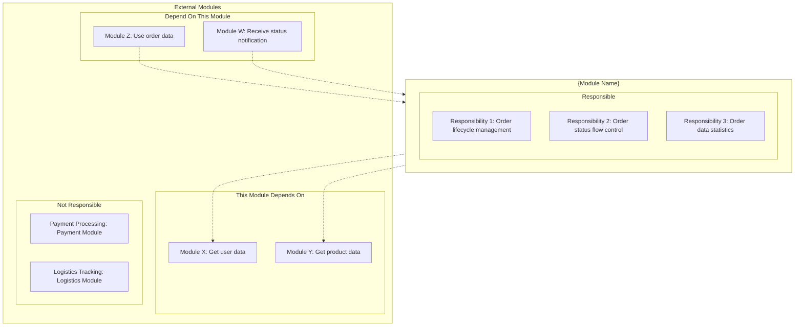
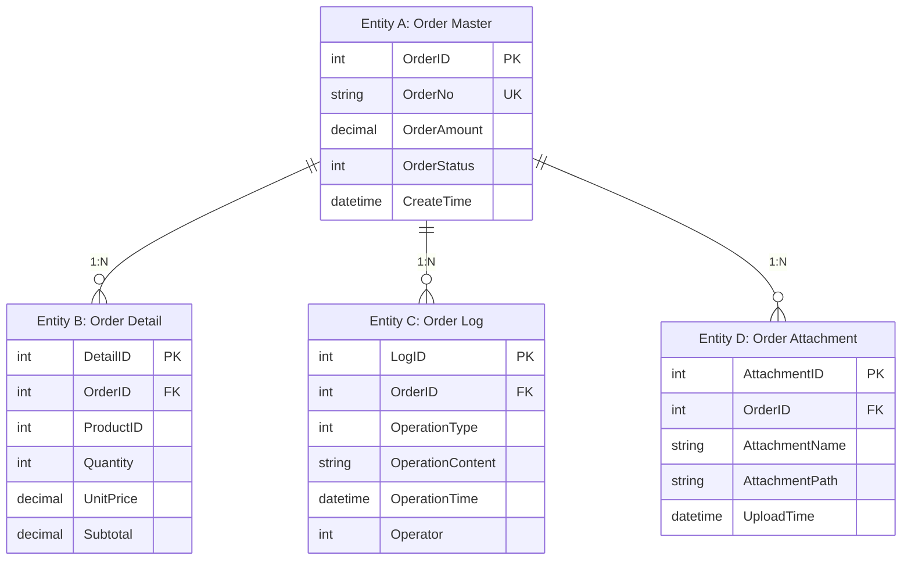
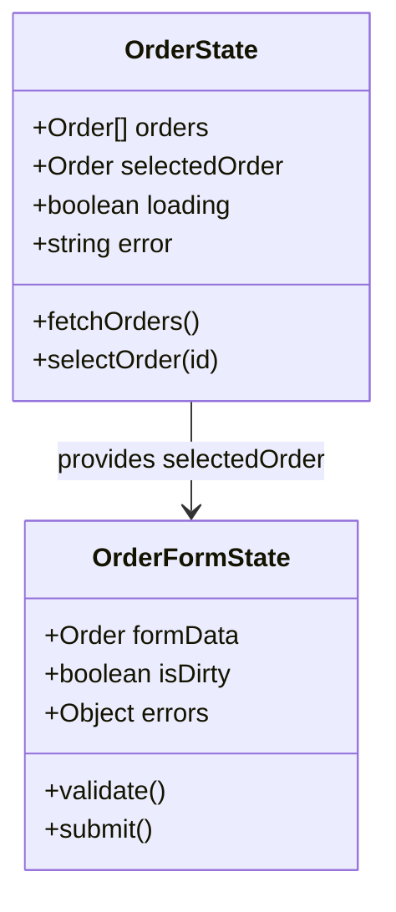
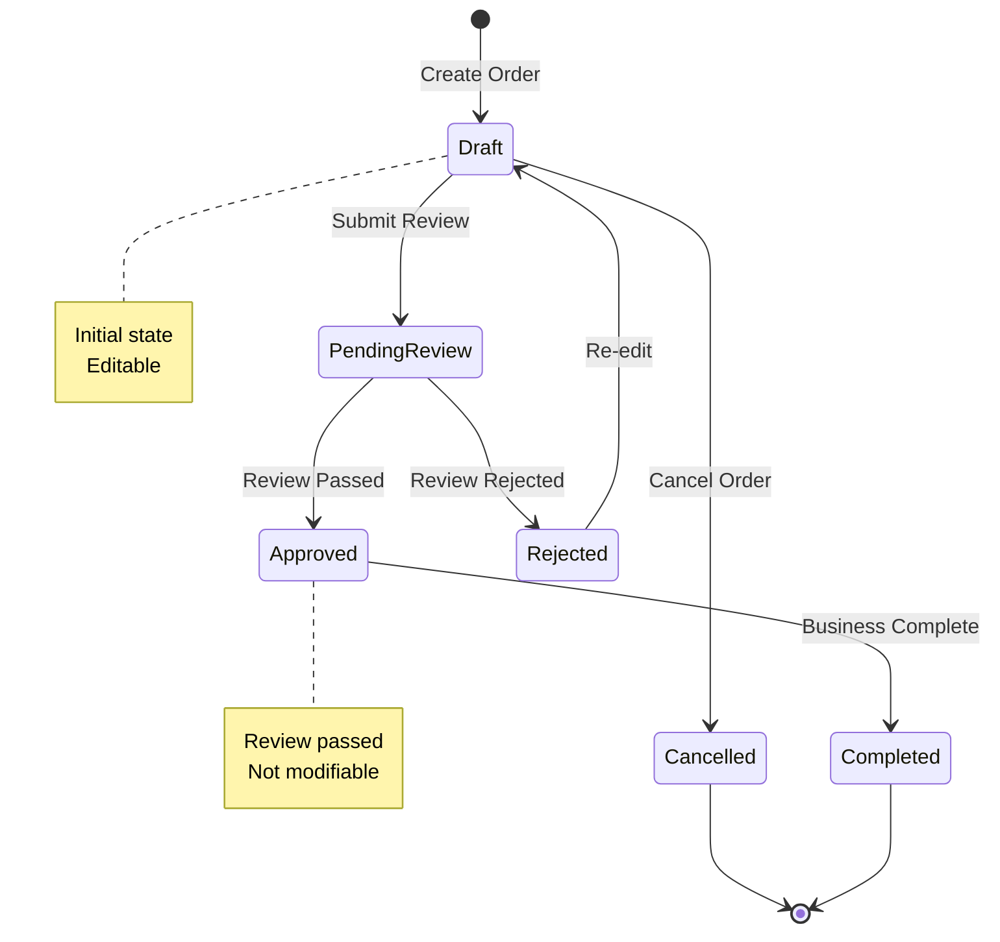
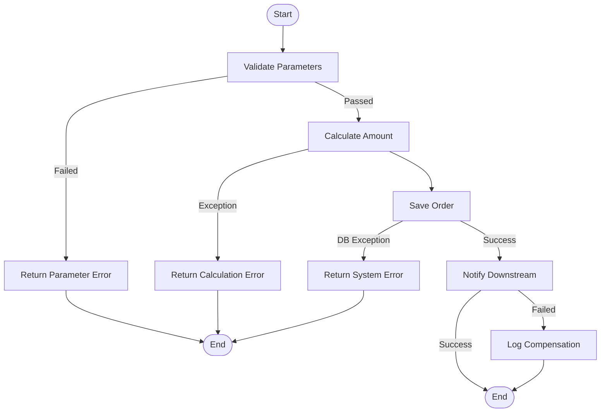

# Module Overview Document - [Module Name]

> **Applicable Scenario**: Describes a single business module's responsibility boundaries, feature list, entity relationships, and external dependencies, for AI Agent to understand module details
> **Target Audience**: devcrew-product-manager, devcrew-solution-manager, devcrew-developer
> **Related Document**: [System Overview Document](../system-overview.md)
> 
> <!-- AI-TAG: MODULE_OVERVIEW -->
> <!-- AI-CONTEXT: Read this document to understand module responsibilities, feature list, entity relationships, and dependency interfaces, used for requirement analysis and solution design -->

<cite>
**Referenced Files**
<!-- Path Note: {relativePath} must be dynamically calculated based on document depth. See SKILL.md "Source Traceability Guide" for calculation method. -->
- [{EntryPoint}]({relativePath}/{sourcePath}/{entryPointFile})    <!-- Backend: Controller/View/Router; Frontend: Page/View component -->
- [{BusinessLogic}]({relativePath}/{sourcePath}/{businessLogicFile})  <!-- Backend: Service; Frontend: Store/Composable/Hook -->
- [{DataModel}]({relativePath}/{sourcePath}/{dataModelFile})      <!-- Backend: Entity/Model; Frontend: Type/Interface definition -->
</cite>

---

## 1. Module Basic Information

### 1.1 Module Positioning

| Item | Description |
|------|-------------|
| Module Name | {Fill in module name} |
| Business Domain | {e.g., Sales Domain, Inventory Domain} |
| Module Responsibility | {One sentence describing core module responsibility} |
| Business Value | {What business problem it solves, what value it brings} |

### 1.2 Module Boundary

<!-- AI-TAG: MODULE_BOUNDARY -->
<!-- AI-NOTE: Module boundaries help AI understand responsibility scope, avoiding scope creep during requirement analysis -->



**Diagram Source**
- [{Module} Entry Point]({relativePath}/{sourcePath}/{moduleEntryFile})

**Boundary Description:**
| Type | Content | Description |
|------|---------|-------------|
| **Responsible** | {Responsibility 1, Responsibility 2, Responsibility 3} | Core responsibilities of this module |
| **Depends On** | {Module X, Module Y} | External modules called by this module |
| **Depended By** | {Module Z, Module W} | External modules that call this module |
| **Not Responsible** | {Payment Processing, Logistics Tracking} | Explicitly out of this module's scope |

---

## 2. Feature List

### 2.1 Feature Tree

<!-- AI-TAG: FEATURE_TREE -->
<!-- AI-NOTE: Feature tree helps AI understand module feature structure, used for requirement matching and scope judgment -->

```mermaid
mindmap
  root(([{Module Name}]))
    Feature Group A
      Feature A1 ✅
      Feature A2 ✅
      Feature A3 🚧
      Feature A4 ⏳
    Feature Group B
      Feature B1 ✅
      Feature B2 🚧
    Feature Group C
      Feature C1 ⏳
      Feature C2 ⏳
```

**Status Legend:** ✅ Released / 🚧 In Development / ⏳ Planned / ❌ Deprecated

### 2.2 Feature List Table

| Feature Group | Feature | Description | Status | Priority | Remarks |
|---------------|---------|-------------|--------|----------|---------|
| {Order Management} | {Create Order} | {Supports manual/import creation} | ✅ | P0 | {Released} |
| {Order Management} | {Query Order} | {Multi-dimensional filter query} | ✅ | P0 | {Released} |
| {Order Review} | {Submit Review} | {Submit order to review process} | 🚧 | P1 | {In Development} |
| {Data Statistics} | {Order Report} | {Statistics by time/region} | ⏳ | P2 | {Planned} |

---

## 3. Business Entities and Relationships

### 3.1 Core Entity List

| Entity Name | Type | Description | Key Attributes | Business Rules |
|---|---|---|---|---|
| *{Entity1}* | *Data Entity / State Object* | *{description}* | *{key fields}* | *{constraints}* |

<!-- 
Backend examples: Order (DB Entity), OrderDTO (Data Transfer Object)
Frontend examples: OrderState (Store State), OrderFormProps (Component Interface)
-->

### 3.2 Entity Relationship Diagram

<!-- AI-TAG: ENTITY_RELATIONSHIP -->
<!-- AI-NOTE: ER diagram is crucial for Solution Agent to design databases and APIs -->



<!-- For frontend modules, replace ER diagram with State Relationship diagram:

-->

### 3.3 Entity State Transition

<!-- AI-TAG: STATE_MACHINE -->
<!-- AI-NOTE: State machine is important for understanding business rules and implementing state control logic -->

**Entity A (Order) State Machine:**



| State | Description | Transferable States | Trigger Condition |
|-------|-------------|---------------------|-------------------|
| {Draft} | {Draft state} | {PendingReview/Cancelled} | {Submit/Cancel} |
| {PendingReview} | {Waiting for review} | {Approved/Rejected} | {Review passed/rejected} |
| {Approved} | {Review passed} | {Completed} | {Business complete} |

---

## 4. External Dependencies and Interfaces

### 4.1 Module Dependency Relationships

| Dependency Direction | Module Name | Dependency Content | Dependency Method | Description |
|---------------------|-------------|-------------------|-------------------|-------------|
| {This module depends on} | {User Center} | {Get user info} | {API call} | {Get details by user ID} |
| {This module depends on} | {Product Module} | {Get product info} | {API call} | {Get details by product ID} |
| {Depends on this module} | {Payment Module} | {Query order info} | {API call} | {Validate order during payment} |
| {Depends on this module} | {Logistics Module} | {Receive order shipment} | {Message subscription} | {Notify after order review passed} |

### 4.2 External Interfaces Provided

| Interface Name | Type | Caller/Consumer | Description |
|---|---|---|---|
| *{Interface1}* | *API / Component / Hook / Event* | *{caller}* | *{description}* |

<!-- 
Backend examples: GET /api/orders (REST API), OrderCreatedEvent (Message)
Frontend examples: <OrderDetail :order="order" /> (Component Props), useOrder(id) (Hook/Composable), emit('save', order) (Event)
-->

### 4.3 Dependent Module Interfaces

| Interface Name | Provider | Function Description | Call Scenario |
|----------------|----------|---------------------|---------------|
| {Get User} | {User Center} | {Get user by ID} | {Validate when creating order} |
| {Get Product} | {Product Module} | {Get product by ID} | {Validate when creating order} |

---

## 5. Core Business Processes

### 5.1 Core Process Within Module

<!-- AI-TAG: CORE_PROCESS -->
<!-- AI-NOTE: Core processes are important for Solution Agent to design solutions and plan interfaces -->

**Process: {Create Order Process}**



**Diagram Source**
- [{Module} Business Logic]({relativePath}/{sourcePath}/{moduleLogicFile})

**Process Step Description:**

| Step | Step Name | Processing Logic | Input | Output | Exception Handling |
|------|-----------|------------------|-------|--------|-------------------|
| 1 | {Parameter Validation} | {Validate user, product, inventory} | {Request parameters} | {Validation result} | {Return parameter error} |
| 2 | {Amount Calculation} | {Calculate product amount, discount, shipping} | {Product info} | {Order amount} | {Calculation exception} |
| 3 | {Save Order} | {Write to order master and detail tables} | {Order data} | {Order ID} | {Database exception} |
| 4 | {Notify Downstream} | {Send order creation message} | {Order ID} | {Send result} | {Log only, no retry} |

<!-- For frontend modules, core processes typically include:
1. Data Loading Flow: Component mount → Fetch data → Loading state → Render
2. User Interaction Flow: User action → Validate → API call → Update state → Feedback
3. Navigation Flow: Route change → Guard check → Load page data → Render
-->

### 5.2 Exception Handling Rules

| Exception Scenario | Exception Type | Handling Strategy | User Prompt | Log Record |
|-------------------|----------------|-------------------|-------------|------------|
| {Parameter validation failed} | {Business Exception} | {Return error directly} | {Show specific error} | {Log warning} |
| {Product not exist} | {Business Exception} | {Return error} | {Prompt product invalid} | {Log warning} |
| {Database timeout} | {System Exception} | {Retry 3 times} | {Prompt system busy} | {Log error} |
| {Downstream notification failed} | {System Exception} | {Log for compensation} | {No prompt to user} | {Log error} |

---

## 6. Business Rules and Constraints

### 6.1 Business Rules

| Rule ID | Rule Name | Rule Description | Trigger Scenario | Related Entity |
|---------|-----------|------------------|------------------|----------------|
| {R001} | {Order Amount Validation} | {Order amount must be greater than 0} | {When creating order} | {Order Master} |
| {R002} | {Inventory Deduction Rule} | {Deduct inventory after order review passed} | {When review passed} | {Order+Inventory} |
| {R003} | {Status Flow Rule} | {Completed orders cannot be modified} | {When modifying order} | {Order Master} |

### 6.2 Data Constraints

| Constraint Type | Constraint Object | Constraint Rule | Description |
|-----------------|-------------------|-----------------|-------------|
| {Uniqueness} | {Order No} | {Globally unique} | {Business order number, cannot duplicate} |
| {Required} | {User ID} | {Not null} | {Must associate with user} |
| {Range} | {Order Amount} | {≥0} | {Amount cannot be negative} |
| {Association} | {Order Detail} | {At least 1 item} | {Order must have details} |

### 6.3 Permission Rules

| Operation / Component | Required Permission | No Permission Handling |
|---|---|---|
| *{operation or component}* | *{permission}* | *{handling}* |

<!-- 
Backend: Create Order → order:create → Return 403
Frontend: /orders/create route → order:create → Redirect to 403 page
Frontend: <CreateButton /> → order:create → Hide component
Frontend: Price field in OrderForm → order:edit_price → Readonly
-->

---

## 7. Related Pages and Prototypes (Optional)

### 7.1 Page List

| Page Name | Page Type | Function Description | Related Feature | Prototype Document |
|-----------|-----------|---------------------|-----------------|-------------------|
| {Order List Page} | {List Page} | {Display order list} | {Query Order} | [Link](ui-prototype.md) |
| {Order Detail Page} | {Detail Page} | {Display order details} | {View Order} | [Link](ui-prototype.md) |
| {Order Edit Page} | {Form Page} | {Edit order info} | {Modify Order} | [Link](ui-prototype.md) |

### 7.2 Page Prototype

> For detailed page prototypes, please refer to [Feature Detail Design Template](./FEATURE-DETAIL-TEMPLATE.md)

---

## 8. Change History

| Date | Version | Change Content | Change Type | Owner | Impact Scope |
|------|---------|----------------|-------------|-------|--------------|
| {Date} | {v1.2} | {Added order review feature} | {New Feature} | {Zhang San} | {Added review status, review interface} |
| {Date} | {v1.1} | {Optimized order query performance} | {Performance} | {Li Si} | {Query interface} |
| {Date} | {v1.0} | {Module initial version} | {Initial Release} | {Wang Wu} | {All} |

---

**Document Status:** 📝 Draft / 👀 In Review / ✅ Published  
**Last Updated:** {Date}  
**Maintainer:** {Name}  
**Related System Document:** [System Overview Document](../system-overview.md)

**Section Source**
- [{Module} Entry]({relativePath}/{sourcePath}/{moduleEntryFile})
- [{Module} Logic]({relativePath}/{sourcePath}/{moduleLogicFile})
- [{Module} Model]({relativePath}/{sourcePath}/{moduleModelFile})
