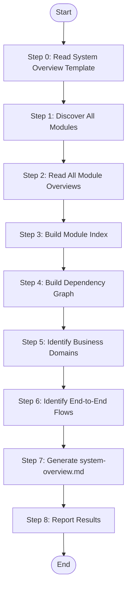

# System Summarize - Complete System Overview (XML Workflow)

Read all {{module_name}}-overview.md files, aggregate information to generate complete system-overview.md with module index, topology, and business flows.

## Language Adaptation

**CRITICAL**: Generate all content in the language specified by the `language` parameter.

- `language: "zh"` → Generate all content in 中文
- `language: "en"` → Generate all content in English
- Other languages → Use the specified language

**All output content (system description, module summaries, flow descriptions) must be in the target language only.**

## Trigger Scenarios

- "Generate system overview from modules"
- "Complete system documentation"
- "Summarize all modules into system view"

## User

Worker Agent (speccrew-task-worker)

## Input

| Parameter | Type | Required | Description |
|-----------|------|----------|-------------|
| `modules_path` | string | Yes | Path to modules directory (e.g., `speccrew-workspace/knowledges/bizs/`) containing all {{platform_type}}/{{module_name}}/{{module_name}}-overview.md files |
| `output_path` | string | Yes | Output path for system-overview.md (e.g., `speccrew-workspace/knowledges/bizs/`) |
| `language` | string | Yes | Target language for generated content (e.g., "zh", "en") |

## Output

| Output | Path | Description |
|--------|------|-------------|
| `system-overview.md` | `{{output_path}}/system-overview.md` | Complete system overview. Example: `speccrew-workspace/knowledges/bizs/system-overview.md` |

## Workflow



> **REQUIRED**: Before executing this workflow, read the XML workflow specification: `speccrew-workspace/docs/rules/xml-workflow-spec.md`

```xml
<?xml version="1.0" encoding="UTF-8"?>
<workflow id="system-summarize-main" status="pending" version="1.0" desc="System summarization workflow">
  <!-- ============================================================
       Input Parameters Definition
       ============================================================ -->
  <block type="input" id="I1" desc="System summarization input parameters">
    <field name="modules_path" required="true" type="string" desc="Path to modules directory"/>
    <field name="output_path" required="true" type="string" desc="Output path for system-overview.md"/>
    <field name="language" required="true" type="string" desc="Target language for generated content"/>
  </block>

  <!-- ============================================================
       Global Continuous Execution Rules
       ============================================================ -->
  <block type="rule" id="GLOBAL-R1" level="forbidden" desc="Continuous execution constraints — NEVER violate">
    <field name="text">DO NOT ask user "Should I continue?" or "How would you like to proceed?" during execution</field>
    <field name="text">DO NOT offer options like "Full execution / Partial / Stop" — always execute ALL tasks to completion</field>
    <field name="text">DO NOT suggest "Due to context window limits, let me pause" — complete current task, use checkpoint for resumption</field>
    <field name="text">DO NOT estimate workload and suggest breaking it into phases — execute ALL items in sequence</field>
    <field name="text">DO NOT warn about "large number of files" or "this may take a while" — proceed with generation</field>
    <field name="text">Context window management: if approaching limit, save progress to checkpoint file and resume — do NOT ask user for guidance</field>
  </block>

  <!-- ============================================================
       Edge Case Rules
       ============================================================ -->
  <block type="rule" id="R-NOTE1" level="note" desc="Edge case handling">
    <field name="text">Empty modules directory: Generate skeleton with warning status if no *-overview.md files found</field>
  </block>
  <block type="rule" id="R-NOTE2" level="note" desc="Incomplete data handling">
    <field name="text">Incomplete module overviews: Use available data and mark gaps with <!-- DATA INCOMPLETE --></field>
  </block>
  <block type="rule" id="R-NOTE3" level="note" desc="Module name conflict handling">
    <field name="text">Same module name from different platforms: Treat as separate modules with platform annotation</field>
  </block>

  <!-- Prerequisites Verification -->
  <block type="event" id="E1" action="log" level="info" desc="Log workflow start">
    <field name="message">Starting system summarization workflow</field>
  </block>

  <!-- Step 0: Read System Overview Template -->
  <block type="task" id="B0" action="run-skill" desc="Read system overview template">
    <field name="skill">Read</field>
    <field name="file_path" value="../speccrew-knowledge-system-summarize/templates/SYSTEM-OVERVIEW-TEMPLATE.md"/>
    <field name="output" var="template_content"/>
  </block>

  <!-- Checkpoint: Template loaded -->
  <block type="checkpoint" id="CP0" name="template_loaded" desc="Template loaded successfully">
    <field name="verify" value="${template_content} != null"/>
  </block>

  <!-- Step 1: Discover All Modules -->
  <block type="task" id="B1" action="run-skill" desc="Discover all module overview files">
    <field name="skill">Glob</field>
    <field name="pattern" value="${modules_path}/**/*-overview.md"/>
    <field name="output" var="module_files"/>
  </block>

  <!-- Gateway: Handle empty modules directory -->
  <block type="gateway" id="G1" mode="exclusive" desc="Check if modules discovered">
    <branch test="${module_files.length} == 0" name="No modules">
      <block type="event" id="E2" action="log" level="warning" desc="Log no modules found">
        <field name="message">No module overview files found in ${modules_path}</field>
      </block>
      <block type="task" id="B2" action="run-script" desc="Generate skeleton document">
        <field name="script" value="generate-skeleton.js"/>
        <field name="template" value="${template_content}"/>
        <field name="output" var="skeleton_doc"/>
      </block>
      <block type="task" id="B3" action="run-skill" desc="Write skeleton document">
        <field name="skill">Write</field>
        <field name="file_path" value="${output_path}/system-overview.md"/>
        <field name="content" value="${skeleton_doc}"/>
      </block>
      <block type="output" id="O-early" desc="Early output for empty case">
        <field name="status" value="warning"/>
      </block>
      <block type="event" id="E3" action="signal" desc="Signal workflow complete">
        <field name="signal" value="workflow_complete_with_warning"/>
      </block>
    </branch>
    <branch test="${module_files.length} > 0" name="Modules found">
      <block type="event" id="E4" action="log" level="info" desc="Log modules discovered">
        <field name="message">Discovered ${module_files.length} module overview files</field>
      </block>
    </branch>
  </block>

  <!-- Extract platform types from paths -->
  <block type="loop" id="L1" over="${module_files}" as="module_file" desc="Extract platform types from paths">
    <block type="task" id="B4" action="run-script" desc="Parse platform from file path">
      <field name="script" value="extract-platform.js"/>
      <field name="file_path" value="${module_file}"/>
      <field name="output" var="platform_info"/>
    </block>
  </block>

  <!-- Checkpoint: Modules discovered -->
  <block type="checkpoint" id="CP1" name="modules_discovered" desc="Modules discovery complete">
    <field name="verify" value="${module_files.length} > 0"/>
  </block>

  <!-- Step 2: Read All Module Overviews -->
  <block type="loop" id="L2" over="${module_files}" as="module_file" desc="Read all module overview files">
    <block type="task" id="B5" action="run-skill" desc="Read module overview">
      <field name="skill">Read</field>
      <field name="file_path" value="${module_file}"/>
      <field name="output" var="module_content"/>
    </block>
    <block type="task" id="B6" action="run-script" desc="Extract module info">
      <field name="script" value="extract-module-info.js"/>
      <field name="content" value="${module_content}"/>
      <field name="file_path" value="${module_file}"/>
      <field name="output" var="module_info"/>
    </block>
  </block>

  <!-- Checkpoint: Module info extracted -->
  <block type="checkpoint" id="CP2" name="modules_read" desc="All modules read successfully">
    <field name="verify" value="${module_infos.length} == ${module_files.length}"/>
  </block>

  <!-- Step 3: Build Module Index -->
  <block type="task" id="B7" action="run-script" desc="Build module index">
    <field name="script" value="build-module-index.js"/>
    <field name="modules" value="${module_infos}"/>
    <field name="output" var="module_index"/>
  </block>

  <!-- Create index table rows -->
  <block type="loop" id="L3" over="${module_infos}" as="module_info" desc="Create index table rows">
    <block type="task" id="B8" action="run-script" desc="Create index row">
      <field name="script" value="create-index-row.js"/>
      <field name="module" value="${module_info}"/>
      <field name="language" value="${language}"/>
      <field name="output" var="index_row"/>
    </block>
  </block>

  <!-- Checkpoint: Index built -->
  <block type="checkpoint" id="CP3" name="index_built" desc="Module index built">
    <field name="verify" value="${module_index} != null"/>
  </block>

  <!-- Step 4: Build Dependency Graph -->
  <block type="task" id="B9" action="run-script" desc="Extract all dependencies">
    <field name="script" value="extract-all-dependencies.js"/>
    <field name="modules" value="${module_infos}"/>
    <field name="output" var="all_dependencies"/>
  </block>

  <!-- Classify dependencies -->
  <block type="loop" id="L4" over="${all_dependencies}" as="dependency" desc="Classify dependencies by type">
    <block type="gateway" id="G2" mode="exclusive" desc="Classify dependency type">
      <branch test="${dependency.type} == 'internal'" name="Internal dependency">
        <block type="output" id="O-int" desc="Add to internal deps">
          <field name="internal_deps" append="${dependency}"/>
        </block>
      </branch>
      <branch test="${dependency.type} == 'external'" name="External dependency">
        <block type="output" id="O-ext" desc="Add to external deps">
          <field name="external_deps" append="${dependency}"/>
        </block>
      </branch>
      <branch test="${dependency.type} == 'cross_platform'" name="Cross-platform dependency">
        <block type="output" id="O-cross" desc="Add to cross-platform deps">
          <field name="cross_platform_deps" append="${dependency}"/>
        </block>
      </branch>
    </block>
  </block>

  <!-- Build directed graph -->
  <block type="task" id="B10" action="run-script" desc="Build dependency graph">
    <field name="script" value="build-dep-graph.js"/>
    <field name="internal_deps" value="${internal_deps}"/>
    <field name="cross_platform_deps" value="${cross_platform_deps}"/>
    <field name="output" var="dependency_graph"/>
  </block>

  <!-- Generate Mermaid diagram -->
  <block type="task" id="B11" action="run-script" desc="Generate Mermaid dependency diagram">
    <field name="script" value="generate-mermaid-diagram.js"/>
    <field name="graph" value="${dependency_graph}"/>
    <field name="diagram_type" value="graph LR"/>
    <field name="output" var="mermaid_deps"/>
  </block>

  <!-- Checkpoint: Dependency graph built -->
  <block type="checkpoint" id="CP4" name="deps_built" desc="Dependency graph built">
    <field name="verify" value="${dependency_graph.nodes.length} > 0"/>
  </block>

  <!-- Step 5: Identify Business Domains -->
  <block type="task" id="B12" action="run-script" desc="Extract business domains">
    <field name="script" value="extract-domains.js"/>
    <field name="modules" value="${module_infos}"/>
    <field name="output" var="business_domains"/>
  </block>

  <!-- Group modules by domain -->
  <block type="loop" id="L5" over="${business_domains}" as="domain" desc="Group modules by domain">
    <block type="task" id="B13" action="run-script" desc="Find domain modules">
      <field name="script" value="find-domain-modules.js"/>
      <field name="domain" value="${domain}"/>
      <field name="modules" value="${module_infos}"/>
      <field name="output" var="domain_modules"/>
    </block>
  </block>

  <!-- Generate domain diagram -->
  <block type="task" id="B14" action="run-script" desc="Generate domain diagram">
    <field name="script" value="generate-domain-diagram.js"/>
    <field name="domains" value="${business_domains}"/>
    <field name="module_groups" value="${domain_module_groups}"/>
    <field name="output" var="domain_diagram"/>
  </block>

  <!-- Checkpoint: Domains identified -->
  <block type="checkpoint" id="CP5" name="domains_identified" desc="Business domains identified">
    <field name="verify" value="${business_domains.length} > 0"/>
  </block>

  <!-- Step 6: Identify End-to-End Flows -->
  <block type="task" id="B15" action="run-script" desc="Analyze cross-module flows">
    <field name="script" value="analyze-cross-module-flows.js"/>
    <field name="dependencies" value="${all_dependencies}"/>
    <field name="modules" value="${module_infos}"/>
    <field name="output" var="end_to_end_flows"/>
  </block>

  <!-- Create flow-module mapping matrix -->
  <block type="loop" id="L6" over="${end_to_end_flows}" as="flow" desc="Build flow-module matrix">
    <block type="task" id="B16" action="run-script" desc="Map flow to modules">
      <field name="script" value="map-flow-modules.js"/>
      <field name="flow" value="${flow}"/>
      <field name="modules" value="${module_infos}"/>
      <field name="output" var="flow_mapping"/>
    </block>
  </block>

  <!-- Checkpoint: Flows identified -->
  <block type="checkpoint" id="CP6" name="flows_identified" desc="End-to-end flows identified">
    <field name="verify" value="${end_to_end_flows.length} >= 0"/>
  </block>

  <!-- Step 7: Generate system-overview.md -->
  <!-- Phase A: Skeleton Construction -->
  <block type="task" id="B17" action="run-script" desc="Count modules">
    <field name="script" value="count-items.js"/>
    <field name="items" value="${module_infos}"/>
    <field name="output" var="module_count"/>
  </block>

  <block type="task" id="B18" action="run-script" desc="Count flows">
    <field name="script" value="count-items.js"/>
    <field name="items" value="${end_to_end_flows}"/>
    <field name="output" var="flow_count"/>
  </block>

  <block type="task" id="B19" action="run-script" desc="Count integrations">
    <field name="script" value="count-items.js"/>
    <field name="items" value="${external_deps}"/>
    <field name="output" var="integration_count"/>
  </block>

  <!-- Read tech stack mappings -->
  <block type="task" id="B20" action="run-skill" desc="Read tech stack mappings">
    <field name="skill">Read</field>
    <field name="file_path" value="speccrew-workspace/docs/configs/tech-stack-mappings.json"/>
    <field name="output" var="tech_mappings"/>
  </block>

  <!-- Read Mermaid rules -->
  <block type="task" id="B21" action="run-skill" desc="Read Mermaid rules">
    <field name="skill">Read</field>
    <field name="file_path" value="speccrew-workspace/docs/rules/mermaid-rule.md"/>
    <field name="output" var="mermaid_rules"/>
  </block>

  <!-- Get timestamp via script -->
  <block type="task" id="B22" action="run-script" desc="Get current timestamp">
    <field name="script" value="scripts/get-timestamp.js"/>
    <field name="output" var="timestamp"/>
  </block>

  <!-- Gateway: Fallback for timestamp -->
  <block type="gateway" id="G3" mode="exclusive" desc="Check timestamp">
    <branch test="${timestamp} == null" name="No timestamp">
      <block type="task" id="B23" action="run-script" desc="Get system fallback timestamp">
        <field name="script" value="get-system-time.js"/>
        <field name="output" var="timestamp"/>
      </block>
      <block type="event" id="E5" action="log" level="warning" desc="Log fallback">
        <field name="message">Using system fallback timestamp</field>
      </block>
    </branch>
  </block>

  <!-- Determine technology stack -->
  <block type="task" id="B24" action="run-script" desc="Determine tech stack">
    <field name="script" value="determine-tech-stack.js"/>
    <field name="platforms" value="${extracted_platforms}"/>
    <field name="mappings" value="${tech_mappings}"/>
    <field name="output" var="tech_stack"/>
  </block>

  <!-- Create skeleton structure -->
  <block type="task" id="B25" action="run-script" desc="Create document skeleton">
    <field name="script" value="create-system-skeleton.js"/>
    <field name="template" value="${template_content}"/>
    <field name="module_count" value="${module_count}"/>
    <field name="flow_count" value="${flow_count}"/>
    <field name="integration_count" value="${integration_count}"/>
    <field name="timestamp" value="${timestamp}"/>
    <field name="tech_stack" value="${tech_stack}"/>
    <field name="language" value="${language}"/>
    <field name="output" var="document_skeleton"/>
  </block>

  <!-- Rule: Skeleton must be complete before filling -->
  <block type="rule" id="R-MAND1" level="mandatory" desc="Skeleton completion rule">
    <field name="text">DO NOT start filling content until the complete skeleton is verified</field>
  </block>

  <!-- Checkpoint: Skeleton ready -->
  <block type="checkpoint" id="CP7" name="skeleton_ready" desc="Document skeleton ready">
    <field name="verify" value="${document_skeleton} != null AND ${document_skeleton}.contains('[TO BE FILLED]')"/>
  </block>

  <!-- Phase B: Content Filling -->
  <!-- Fill Index and Overview section -->
  <block type="task" id="B26" action="run-script" desc="Fill index section">
    <field name="script" value="fill-index-section.js"/>
    <field name="skeleton" value="${document_skeleton}"/>
    <field name="timestamp" value="${timestamp}"/>
    <field name="tech_stack" value="${tech_stack}"/>
    <field name="statistics" value="${aggregated_stats}"/>
    <field name="module_index" value="${module_index}"/>
    <field name="output" var="filled_index"/>
  </block>

  <!-- Fill Section 1: System Overview -->
  <block type="task" id="B27" action="run-script" desc="Fill system overview section">
    <field name="script" value="fill-system-overview.js"/>
    <field name="skeleton" value="${filled_index}"/>
    <field name="modules" value="${module_infos}"/>
    <field name="language" value="${language}"/>
    <field name="output" var="filled_section1"/>
  </block>

  <!-- Fill Section 2: Module Topology -->
  <block type="task" id="B28" action="run-script" desc="Fill module topology section">
    <field name="script" value="fill-module-topology.js"/>
    <field name="skeleton" value="${filled_section1}"/>
    <field name="domain_diagram" value="${domain_diagram}"/>
    <field name="dependency_graph" value="${dependency_graph}"/>
    <field name="mermaid_deps" value="${mermaid_deps}"/>
    <field name="module_index" value="${module_index}"/>
    <field name="language" value="${language}"/>
    <field name="output" var="filled_section2"/>
  </block>

  <!-- Fill Section 3: End-to-End Business Flows -->
  <block type="task" id="B29" action="run-script" desc="Fill business flows section">
    <field name="script" value="fill-business-flows.js"/>
    <field name="skeleton" value="${filled_section2}"/>
    <field name="flows" value="${end_to_end_flows}"/>
    <field name="flow_mappings" value="${flow_mappings}"/>
    <field name="modules" value="${module_infos}"/>
    <field name="language" value="${language}"/>
    <field name="output" var="filled_section3"/>
  </block>

  <!-- Fill Section 4: System Boundaries and Integration -->
  <block type="task" id="B30" action="run-script" desc="Fill system boundaries section">
    <field name="script" value="fill-system-boundaries.js"/>
    <field name="skeleton" value="${filled_section3}"/>
    <field name="external_deps" value="${external_deps}"/>
    <field name="language" value="${language}"/>
    <field name="output" var="filled_section4"/>
  </block>

  <!-- Fill Section 5: Requirement Assessment Guide -->
  <block type="task" id="B31" action="run-script" desc="Fill assessment guide section">
    <field name="script" value="fill-assessment-guide.js"/>
    <field name="skeleton" value="${filled_section4}"/>
    <field name="language" value="${language}"/>
    <field name="output" var="filled_section5"/>
  </block>

  <!-- Error Handler for document writing -->
  <block type="error-handler" id="EH1" desc="Document write error handling">
    <try>
      <!-- Step 7a: Prepare Document -->
      <block type="task" id="B32" action="run-skill" desc="Write document to file">
        <field name="skill">Write</field>
        <field name="file_path" value="${output_path}/system-overview.md"/>
        <field name="content" value="${filled_section5}"/>
      </block>
    </try>
    <catch error-type="write_error">
      <block type="event" id="E6" action="log" level="error" desc="Log write error">
        <field name="message">Failed to write system overview: ${write_error.message}</field>
      </block>
      <block type="output" id="O-err" desc="Error output">
        <field name="status" value="failed"/>
      </block>
    </catch>
    <finally>
      <block type="event" id="E7" action="log" level="info" desc="Log write complete">
        <field name="message">Document write operation completed</field>
      </block>
    </finally>
  </block>

  <!-- Rule: Critical constraints -->
  <block type="rule" id="R-FORB1" level="forbidden" desc="Document creation constraint">
    <field name="text">FORBIDDEN: create_file for documents - Document MUST be created by copying template then filling with search_replace</field>
  </block>
  <block type="rule" id="R-FORB2" level="forbidden" desc="Full rewrite constraint">
    <field name="text">FORBIDDEN: Full-file rewrite - Always use targeted search_replace on specific sections</field>
  </block>
  <block type="rule" id="R-MAND2" level="mandatory" desc="Template-first constraint">
    <field name="text">MANDATORY: Template-first workflow - Step 7a MUST execute before Step 7b</field>
  </block>

  <!-- Checkpoint: Document generated -->
  <block type="checkpoint" id="CP8" name="document_generated" desc="Document generated successfully">
    <field name="verify" value="${output_file_exists} == true"/>
  </block>

  <!-- Step 8: Report Results -->
  <block type="task" id="B33" action="run-script" desc="Calculate metrics">
    <field name="script" value="calculate-metrics.js"/>
    <field name="modules" value="${module_infos}"/>
    <field name="platforms" value="${extracted_platforms}"/>
    <field name="output" var="metrics"/>
  </block>

  <block type="task" id="B34" action="run-script" desc="Generate system report">
    <field name="script" value="generate-system-report.js"/>
    <field name="module_count" value="${module_count}"/>
    <field name="entity_count" value="${metrics.entity_count}"/>
    <field name="api_count" value="${metrics.api_count}"/>
    <field name="dependency_count" value="${all_dependencies.length}"/>
    <field name="flow_count" value="${flow_count}"/>
    <field name="output" var="completion_report"/>
  </block>

  <!-- Event: Log completion -->
  <block type="event" id="E8" action="log" level="info" desc="Log completion summary">
    <field name="message">System summarization completed:
    - Modules Processed: ${module_count}
    - Entities Aggregated: ${metrics.entity_count}
    - APIs Counted: ${metrics.api_count}
    - Dependencies Mapped: ${all_dependencies.length}
    - Business Flows Identified: ${flow_count}
    - Output: system-overview.md (complete)
    - Status: success</field>
  </block>

  <!-- Output Block: Define workflow outputs -->
  <block type="output" id="O1" desc="System summarization results">
    <field name="status" value="success"/>
    <field name="output_file" value="system-overview.md"/>
    <field name="message" value="System summarization completed with ${module_count} modules processed"/>
  </block>
</workflow>
```

## Constraints

### Critical Constraints

> 1. **FORBIDDEN: `create_file` for documents** — Document MUST be created by copying template (Step 7a) then filling with `search_replace` (Step 7b)
> 2. **FORBIDDEN: Full-file rewrite** — Always use targeted `search_replace` on specific sections
> 3. **MANDATORY: Template-first workflow** — Step 7a MUST execute before Step 7b

### Content Language

**IMPORTANT**: ALL generated content (system description, module summaries, flow descriptions, section headers, and narrative text) MUST be written in the language specified by the `language` parameter. Only code identifiers, file paths, and technical terms remain in their original language.

## Return Value Format

```json
{
  "status": "success|failed",
  "output_file": "system-overview.md",
  "message": "System summarization completed with N modules processed"
}
```

## Task Completion Report

Upon completion, output the following structured report:

```json
{
  "status": "success | partial | failed",
  "skill": "speccrew-knowledge-system-summarize-xml",
  "output_files": [
    "{output_path}/system-overview.md"
  ],
  "summary": "System overview generated from {module_count} modules across {platform_count} platforms",
  "metrics": {
    "platforms_covered": 0,
    "modules_summarized": 0,
    "system_overview_generated": true
  },
  "errors": [],
  "next_steps": [
    "Review system-overview.md for completeness",
    "Run speccrew-pm-requirement-assess if requirement assessment is needed"
  ]
}
```

## Reference Guides

### Mermaid Diagram Guide

When generating Mermaid diagrams, follow these compatibility guidelines:

**Key Requirements:**
- Use only basic node definitions: `A[text content]`
- No HTML tags (e.g., `<br/>`)
- No nested subgraphs
- No `direction` keyword
- No `style` definitions
- Use standard `graph TB/LR` syntax only

**Diagram Types:**

| Diagram Type | Use Case | Example |
|---------|---------|------|
| `graph TB/LR` | System structure, module dependencies | System architecture, module dependency graph |
| `sequenceDiagram` | Cross-module interaction flow | User operation flow, service call chain |
| `flowchart TD` | Business logic, conditional branches | State transition, exception handling |
| `classDiagram` | Class structure, entity relationships | Data model, service interface |
| `erDiagram` | Database table relationships | Entity relationship diagram |
| `stateDiagram-v2` | State machine | Order status, approval status |

### Source Traceability Guide

Aggregate source file references from all module overview documents:

> **Note**: Use relative paths from the generated document to the source file. Do NOT use `file://` protocol.

1. **File Reference Block** (at document start):
```markdown
**Referenced Files**

- Aggregated from all module overview documents
- [OrderController.java](path/to/source/OrderController.java)
- [PaymentController.java](path/to/source/PaymentController.java)
```

2. **Diagram Source** (after each Mermaid diagram):
```markdown
**Diagram Source**
- Aggregated from: order-overview.md, payment-overview.md
```

3. **Section Source** (at end of document):
```markdown
**Section Source**
- Aggregated from all module overview documents
```

## Checklist

- [ ] All {{module_name}}-overview.md files discovered
- [ ] Module information extracted
- [ ] Source file references aggregated from module documents
- [ ] Module index table created
- [ ] Dependency graph built
- [ ] Business domains identified
- [ ] End-to-end flows mapped
- [ ] system-overview.md generated with all sections
- [ ] Source traceability information included
- [ ] Mermaid diagrams follow compatibility guidelines
- [ ] Results reported
