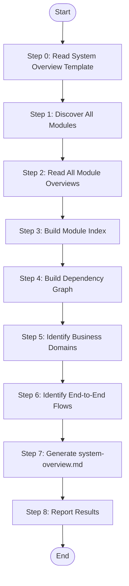

# System Summarize - Complete System Overview

Read all {{module_name}}-overview.md files, aggregate information to generate complete system-overview.md with module index, topology, and business flows.

## Language Adaptation

**CRITICAL**: Generate all content in the language specified by the `language` parameter.

- `language: "zh"` → Generate all content in 中文
- `language: "en"` → Generate all content in English
- Other languages → Use the specified language

**All output content (system description, module summaries, flow descriptions) must be in the target language only.**

## Trigger Scenarios

- "Generate system overview from modules"
- "Complete system documentation"
- "Summarize all modules into system view"

## User

Worker Agent (speccrew-task-worker)

## Input

- `modules_path`: Path to modules directory (e.g., `speccrew-workspace/knowledges/bizs/`) containing all {{platform_type}}/{{module_name}}/{{module_name}}-overview.md files
- `output_path`: Output path for system-overview.md (e.g., `speccrew-workspace/knowledges/bizs/`)
- `language`: Target language for generated content (e.g., "zh", "en") - **REQUIRED**

## Output

- `{{output_path}}/system-overview.md` - Complete system overview
  - Example (single platform): `speccrew-workspace/knowledges/bizs/system-overview.md`
  - Example (multi-platform): `speccrew-workspace/knowledges/bizs/system-overview.md` (aggregates all platforms)

## Workflow

### Prerequisites

Before starting, verify:

- **Module overviews completed**: `modules_path` contains subdirectories for each platform_type, with module directories containing completed `*-overview.md` files (from Stage 3: module-summarize)
- **Output location**: `system-overview.md` will be created at `output_path/system-overview.md`
- **If no modules found**: Proceed with skeleton generation (see Edge Cases)

### Edge Cases

- **Empty modules directory**: If no `*-overview.md` files found, generate a skeleton system-overview.md with empty statistics and return `status: "warning"`.
- **Incomplete module overviews**: If a module-overview.md only has Section 1-2 (initial version), use available data and note gaps with `<!-- DATA INCOMPLETE -->`.
- **Same module name from different platforms**: Treat as separate modules. Use `{module_name} ({platform_type})` for display and `{module_name}_{platform_type}` as internal ID.
- **Missing timestamp service**: If `speccrew-get-timestamp` is unavailable, use system current time as fallback.



### Step 0: Read System Overview Template

Before processing, read the template file to understand the required content structure:
- **Read**: `templates/SYSTEM-OVERVIEW-TEMPLATE.md`
- **Purpose**: Understand the template chapters and example content requirements for system overview documents
- **Key sections to follow**:
  - Index and Overview (Statistics Overview, Module Quick Index)
  - Section 1: System Overview (System Positioning, Business Domain Division with Mermaid diagram)
  - Section 2: Functional Module Topology (Module Hierarchy, Module Dependency Diagram, Module List Index)
  - Section 3: End-to-End Business Processes (Core Business Process List, Process-Module Mapping Matrix, Typical Business Process Diagram)
  - Section 4: System Boundaries and Integration (External System Integration Diagram, Integration Interface List)
  - Section 5: Requirement Assessment Guide
  - Section 6: Change History

### Step 1: Discover All Modules

Find all `*-overview.md` files recursively under `modules_path`, including nested platform_type directories:

```
modules_path/
├── platform_type_1/
│   ├── module_1/
│   │   └── module_1-overview.md
│   └── module_2/
│       └── module_2-overview.md
└── platform_type_2/
    └── module_3/
        └── module_3-overview.md
```

**Example** (bizs knowledge):
```
knowledges/bizs/
├── web-vue/
│   ├── order/order-overview.md
│   └── payment/payment-overview.md
└── backend-java/
    ├── order/order-overview.md
    └── user/user-overview.md
```

Use recursive glob: `**/*-overview.md`
Extract `platform_type` from the path structure for each discovered module.

### Step 2: Read All Module Overviews

For each discovered `*-overview.md`, extract:
- Module name and purpose
- Business domain
- Platform type (from path: web-vue, backend-java, etc.)
- Entity list (backend: DB entities; frontend: State/Props)
- Dependencies (internal modules and external systems)
- Feature count and API/Interface count

**Multi-Tech Stack Aggregation Rules:**

1. **Same-name modules from different platforms**: Treat as SEPARATE entries
   - Display as: `order (web-vue)`, `order (backend-java)` in Module Quick Index
   - Keep separate in all aggregations

2. **Cross-platform dependencies**:
   - web-vue/order may consume backend-java/order API
   - backend-java/order may depend on backend-java/payment
   - Show cross-platform dependencies clearly in Section 4

3. **Entity aggregation**:
   - Backend entities (DB tables, DTOs) and Frontend entities (Store State, Component Props) listed separately with platform annotation

4. **Statistics**:
   - Total modules = COUNT of all *-overview.md files
   - Total entities = SUM across all modules
   - Total APIs = SUM of backend APIs + frontend interfaces

### Step 3: Build Module Index

Create module index table:

| Module | Domain | Purpose | Entities | APIs | Detail Doc |
|--------|--------|---------|----------|------|------------|
| order | Sales | Order lifecycle | Order, OrderItem | 8 | [View](order/order-overview.md) |
| payment | Finance | Payment processing | Payment, Refund | 5 | [View](payment/payment-overview.md) |

### Step 4: Build Dependency Graph

**Extraction Rules:**
1. Read Section 4 (Dependencies) from each module-overview.md
2. Classify dependencies:
   - **Internal**: Module-to-module dependencies within the system
   - **External**: Third-party systems/services (Payment Gateway, ERP, etc.)

3. **Internal dependencies** → Build directed graph:
   - Node: module name (with platform_type annotation if multiple platforms)
   - Edge: A → B means A depends on B
   - Include cross-platform dependencies (e.g., web-vue/order → backend-java/order)

4. **External dependencies** → Collect separately for Section 4: System Boundaries

**Generate Mermaid dependency diagram:**
- Show internal module dependencies only
- Use `graph LR` for layout
- Annotate platform_type if multiple platforms involved

### Step 5: Identify Business Domains

1. Read "Business Domain" field from each module-overview.md
2. Collect unique domain names
3. Group modules by domain (with platform_type):
   
   Example:
   - Sales domain: web-vue/order, backend-java/order, backend-java/promotion
   - User Management: web-vue/user, backend-java/user

4. Generate domain-based Mermaid diagram with domains as subgraphs

### Step 6: Identify End-to-End Flows

Analyze cross-module dependencies to identify business flows:

**Order-to-Payment Flow:**
```
USER → ORDER → INVENTORY → PAYMENT → NOTIFICATION
```

**Refund Flow:**
```
ORDER → PAYMENT → INVENTORY → NOTIFICATION
```

Create flow-module mapping matrix:

| Flow / Module | ORDER | INVENTORY | PAYMENT | NOTIFICATION |
|---------------|-------|-----------|---------|--------------|
| Order-Payment | ✓ | ✓ | ✓ | ✓ |
| Refund | ✓ | ✓ | ✓ | ✓ |

### Step 7: Generate system-overview.md

**⚠️ CRITICAL CONSTRAINTS (apply to Step 7a and 7b):**
> 1. **FORBIDDEN: `create_file` for documents** — Document MUST be created by copying template (Step 7a) then filling with `search_replace` (Step 7b)
> 2. **FORBIDDEN: Full-file rewrite** — Always use targeted `search_replace` on specific sections
> 3. **MANDATORY: Template-first workflow** — Step 7a MUST execute before Step 7b

**Step 7a: Prepare Document**

1. **Read Configuration**:
   - Read `speccrew-workspace/docs/configs/tech-stack-mappings.json` → system tech stacks and display names
   - Read `speccrew-workspace/docs/rules/mermaid-rule.md` → Mermaid diagram guidelines

2. **Invoke** `speccrew-get-timestamp` using Skill tool:
   - Parameters: none (uses default format `YYYY-MM-DD-HHmmss`)
   - Returns: timestamp string (e.g., `2026-03-17-132645`)
   - Use the returned timestamp as generation timestamp in document

3. **Determine Technology Stack**:
   - Extract platform types from discovered module paths
   - Map platform_type to display name via tech-stack-mappings.json
   - Example: `web-vue` → `Vue 3 + TypeScript`; `backend-java` → `Java 17 + Spring Boot`

4. **Copy template to document path**:
   - Read template: `templates/SYSTEM-OVERVIEW-TEMPLATE.md` (already loaded in Step 0)
   - Replace top-level placeholders (system name, generation timestamp, tech stack info)
   - Create document using `create_file` at: `{{output_path}}/system-overview.md`
   - Verify: Document has complete section structure ready for filling

**Step 7b: Fill Each Section Using search_replace**

> ⚠️ **CRITICAL**: Use `search_replace` to fill each section individually. If a section has no applicable content, keep the section title and replace placeholder with "N/A"

**Fill via `search_replace`:**

**Section: Index and Overview** (NEW)
- Generation timestamp (from get-timestamp skill)
- Technology stack (from project config)
- Statistics: module count, entity count, API count, flow count
- Module quick index table

**Fill via `search_replace`:**

**Section 1: System Overview**
- System name from project config
- Core positioning
- Target users
- Deployment type

**Fill via `search_replace`:**

**Section 2: Module Topology**
- Business domain diagram
- Module hierarchy diagram
- Module dependency diagram
- Module index table (from Step 3)

**Fill via `search_replace`:**

**Section 3: End-to-End Business Flows**
- Core business process list
- Flow-module mapping matrix (from Step 6)
- Typical flow diagrams

**Fill via `search_replace`:**

**Section 4: System Boundaries and Integration**
- External system integration diagram
- Integration interface list

**Fill via `search_replace`:**

**Section 5: Requirement Assessment Guide**
- Reference to `speccrew-pm-requirement-assess` skill
- Quick location guide (which section to reference)

Apply source traceability rules (see [Reference Guides > Source Traceability Guide](#source-traceability-guide))

### Step 8: Report Results

```
System summarization completed:
- Modules Processed: {{module_count}}
- Entities Aggregated: {{entity_count}}
- APIs Counted: {{api_count}}
- Dependencies Mapped: {{dependency_count}}
- Business Flows Identified: {{flow_count}}
- Output: system-overview.md (complete)
- Status: success
```

## Reference Guides

### Mermaid Diagram Guide

When generating Mermaid diagrams, follow these compatibility guidelines:

**Key Requirements:**
- Use only basic node definitions: `A[text content]`
- No HTML tags (e.g., `<br/>`)
- No nested subgraphs
- No `direction` keyword
- No `style` definitions
- Use standard `graph TB/LR` syntax only

**Diagram Types:**

| Diagram Type | Use Case | Example |
|---------|---------|------|
| `graph TB/LR` | System structure, module dependencies | System architecture, module dependency graph |
| `sequenceDiagram` | Cross-module interaction flow | User operation flow, service call chain |
| `flowchart TD` | Business logic, conditional branches | State transition, exception handling |
| `classDiagram` | Class structure, entity relationships | Data model, service interface |
| `erDiagram` | Database table relationships | Entity relationship diagram |
| `stateDiagram-v2` | State machine | Order status, approval status |

### Source Traceability Guide

Aggregate source file references from all module overview documents:

> **Note**: Use relative paths from the generated document to the source file. Do NOT use `file://` protocol.

1. **File Reference Block** (at document start):
```markdown
<cite>
**Referenced Files**
- Aggregated from all module overview documents
- [OrderController.java](path/to/source/OrderController.java)
- [PaymentController.java](path/to/source/PaymentController.java)
</cite>
```

2. **Diagram Source** (after each Mermaid diagram):
```markdown
**Diagram Source**
- Aggregated from: order-overview.md, payment-overview.md
```

3. **Section Source** (at end of document):
```markdown
**Section Source**
- Aggregated from all module overview documents
```

## Return

**Return Value (JSON format):**

```json
{
  "status": "success|failed",
  "output_file": "system-overview.md",
  "message": "System summarization completed with N modules processed"
}
```

---

## Task Completion Report

Upon completion, output the following structured report:

```json
{
  "status": "success | partial | failed",
  "skill": "speccrew-knowledge-system-summarize",
  "output_files": [
    "{output_path}/system-overview.md"
  ],
  "summary": "System overview generated from {module_count} modules across {platform_count} platforms",
  "metrics": {
    "platforms_covered": 0,
    "modules_summarized": 0,
    "system_overview_generated": true
  },
  "errors": [],
  "next_steps": [
    "Review system-overview.md for completeness",
    "Run speccrew-pm-requirement-assess if requirement assessment is needed"
  ]
}
```

---

## Checklist

- [ ] All {{module_name}}-overview.md files discovered
- [ ] Module information extracted
- [ ] Source file references aggregated from module documents
- [ ] Module index table created
- [ ] Dependency graph built
- [ ] Business domains identified
- [ ] End-to-end flows mapped
- [ ] system-overview.md generated with all sections
- [ ] Source traceability information included
- [ ] Mermaid diagrams follow compatibility guidelines
- [ ] Results reported

