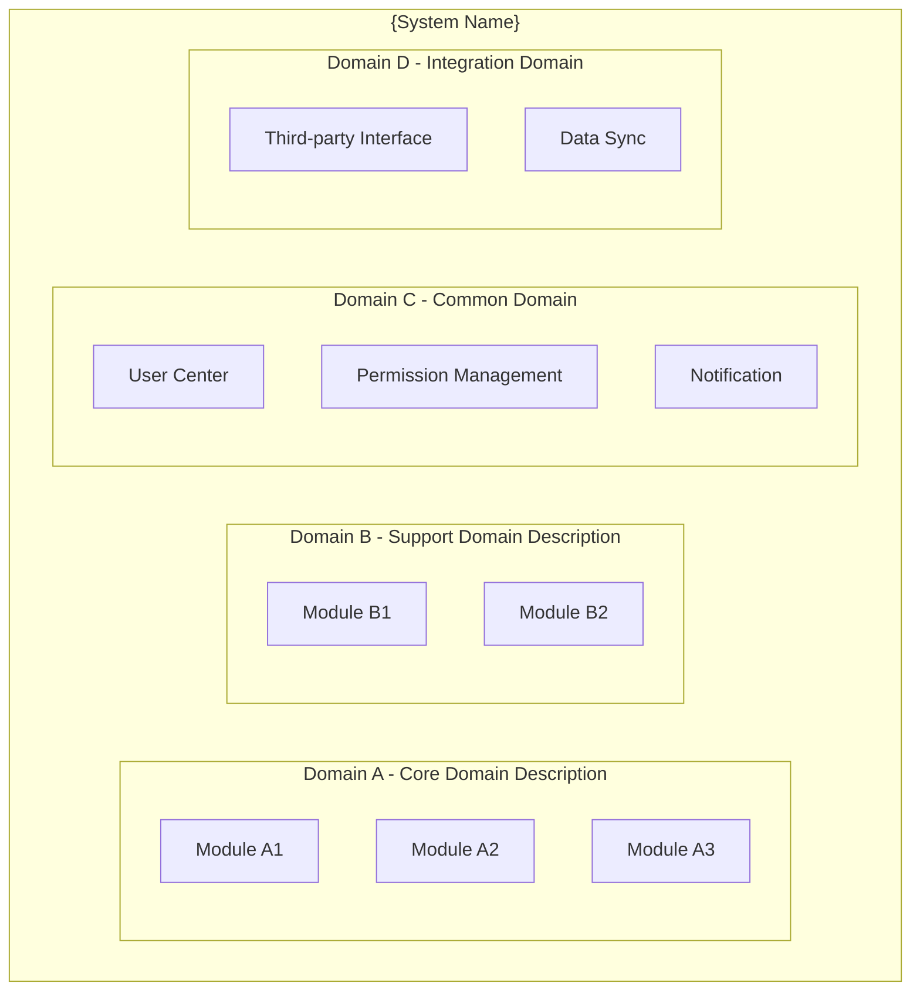
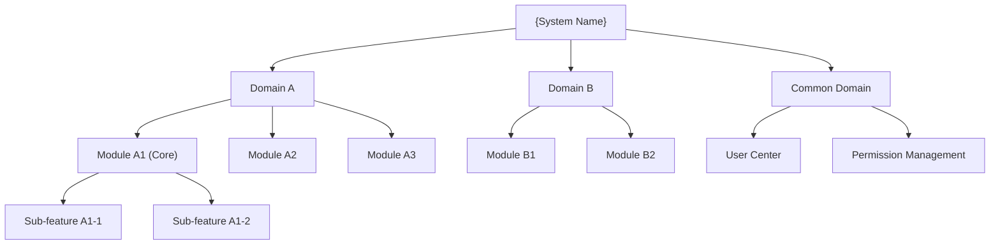
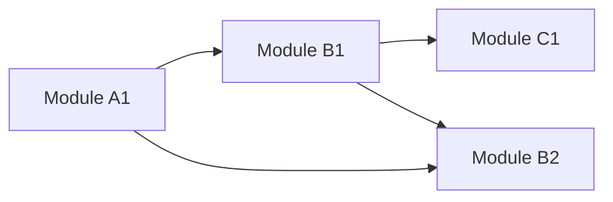
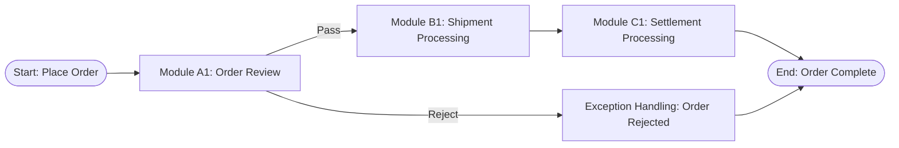
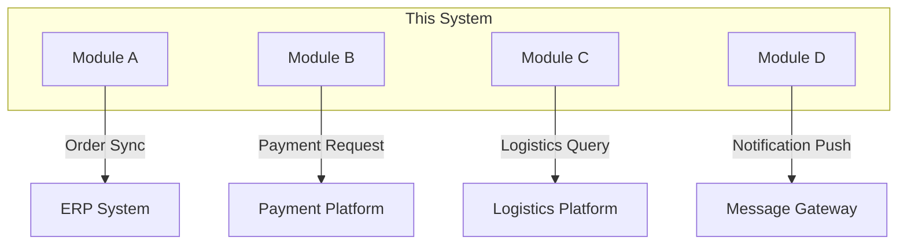

# System Overview Document - [System Name]

> **Applicable Scenario**: Functional panoramic map of ToB software system, for AI Agent (PM Agent / Solution Agent) to read and understand system structure, module relationships, assisting requirement analysis and solution planning
> **Target Audience**: devcrew-product-manager, devcrew-solution-manager, devcrew-developer
> **Update Frequency**: Updated with major system iterations
> 
> <!-- AI-TAG: SYSTEM_OVERVIEW -->
> <!-- AI-CONTEXT: Read this document to understand overall system structure, module division, business processes, used for requirement impact scope judgment and solution planning -->

**Referenced Files**

- Aggregated from all module overview documents
- [{Module} Entry Point](../../{sourcePath}/{moduleEntryFile})
  <!-- Examples: Java Backend: OrderController.java, Vue Frontend: OrderView.vue, React Frontend: OrderPage.tsx -->

---

## Index and Overview

> **Generated At**: {{GeneratedAt}}  
> **Tech Stack**: {{TechStack}}  
> **Source Path**: `{{SourceRoot}}`

### Statistics Overview

| Metric | Count |
|--------|-------|
| Business Modules | {{ModuleCount}} |
| Data Entities | {{EntityCount}} |
| API Interfaces | {{ApiCount}} |
| Business Processes | {{FlowCount}} |

> **Note**: Data Entities include Backend Entities/Models and Frontend Types/Interfaces; API Interfaces include Backend REST APIs and Frontend Component Props/Events

### Module Quick Index

| Module Name | Platform | Business Domain | Module Responsibility | Entity Count | API/Interface Count | Detailed Document |
|---|---|---|---|---|---|---|
| *{module_name}* | *{platform_type}* | *{domain}* | *{description}* | *{count}* | *{count}* | [{module_name}-overview.md]({platform_type}/{module_name}/{module_name}-overview.md) |
{{#each modules}}
| {{name}} | {{platform}} | {{domain}} | {{description}} | {{entityCount}} | {{apiCount}} | [{{name}}-overview.md]({{platform}}/{{name}}/{{name}}-overview.md) |
{{/each}}

---

## 1. System Overview

### 1.1 System Positioning
| Item | Description |
|------|-------------|
| System Name | {Fill in system name} |
| Core Positioning | {One sentence describing what business problem the system solves} |
| Target Users | {Main user groups, e.g., enterprise procurement staff, warehouse managers} |
| Deployment Form | {BS/CS/Mobile/Hybrid} |

### 1.2 Business Domain Division

<!-- AI-TAG: DOMAIN_STRUCTURE -->
<!-- AI-NOTE: Business domain division helps AI understand system boundaries and module ownership -->

**Diagram Source**
- Aggregated from all module overview documents

| Business Domain | Responsibility Description | Core Modules | Business Value |
|-----------------|---------------------------|--------------|----------------|
| {Domain A} | {One sentence description} | {Module A1, A2, A3} | {What problem it solves} |
| {Domain B} | {One sentence description} | {Module B1, B2} | {What problem it solves} |

---

## 2. Functional Module Topology

### 2.1 Module Hierarchy

<!-- AI-TAG: MODULE_HIERARCHY -->
<!-- AI-NOTE: Module hierarchy helps AI understand functional organization relationships -->

**Diagram Source**
- Aggregated from module hierarchy analysis

### 2.2 Module Dependency Diagram

<!-- AI-TAG: MODULE_DEPENDENCIES -->
<!-- AI-NOTE: Module dependency relationships are crucial for Solution Agent to plan solutions, affecting module call order and interface design -->

**Diagram Source**
- Aggregated from module dependency analysis

**Dependency Description:**
- Arrow direction indicates dependency (A → B means A depends on B)
- **Core Modules**: {Module A1, B1} - Business core
- **External Dependencies**: {Module C1} - External systems
- **Support Modules**: {Module B2} - Basic services

### 2.3 Module List Index

| Module Name | Platform | Business Domain | Module Responsibility | Detailed Document | Status |
|---|---|---|---|---|---|
| *{Module A1}* | *{backend/frontend}* | *{Domain A}* | *{One sentence responsibility}* | *[Link]({platform}/module-A1/module-A1-overview.md)* | ✅ Released |
| {Module A1} | Java/Spring | {Domain A} | {One sentence responsibility} | [Link](backend/module-A1/module-A1-overview.md) | ✅ Released |
| {Module A2} | Vue/React | {Domain A} | {One sentence responsibility} | [Link](frontend/module-A2/module-A2-overview.md) | 🚧 In Development |
| {Module B1} | Java/Spring | {Domain B} | {One sentence responsibility} | [Link](backend/module-B1/module-B1-overview.md) | ✅ Released |

---

## 3. End-to-End Business Processes

### 3.1 Core Business Process List

| Process Name | Involved Modules | Process Description | Key Nodes |
|--------------|------------------|---------------------|-----------|
| {Process 1: e.g., Order Fulfillment} | {Module A1→B1→C1} | {Full process from order to delivery} | {Order→Review→Ship→Receive} |
| {Process 2: e.g., Procurement Approval} | {Module A2→B2} | {From application to procurement completion} | {Apply→Approve→Order→Inbound} |

### 3.2 Process-Module Mapping Matrix

| Process/Module | Module A1 | Module A2 | Module B1 | Module B2 | Module C1 |
|----------------|-----------|-----------|-----------|-----------|-----------|
| Order Fulfillment | ✅ Create | - | ✅ Process | - | ✅ Settle |
| Procurement Approval | - | ✅ Apply | - | ✅ Approve | - |
| Inventory Count | ✅ Trigger | - | - | ✅ Execute | - |

> ✅ indicates this process involves this module

### 3.3 Typical Business Process Diagram

<!-- AI-TAG: BUSINESS_FLOW -->
<!-- AI-NOTE: Business processes help AI understand cross-module collaboration, important for PM Agent to judge requirement impact scope and Solution Agent to design solutions -->

**Process Example: {Order Fulfillment Process}**

**Diagram Source**
- Aggregated from cross-module flow analysis

**Process Description:**
| Step | Module | Processing Content | Output Status |
|------|--------|-------------------|---------------|
| 1 | Module A1 | Order review | Pass/Reject |
| 2 | Module B1 | Shipment processing | Shipped |
| 3 | Module C1 | Settlement processing | Settled |

---

## 4. System Boundaries and Integration

### 4.1 External System Integration Diagram

<!-- AI-TAG: EXTERNAL_INTEGRATION -->
<!-- AI-NOTE: External integration information is crucial for Solution Agent to design APIs and integration solutions -->

**Diagram Source**
- Aggregated from external integration analysis

### 4.2 Integration Interface List

| Integration Party | Integration Type | Data Flow | Integration Content | Dependent Module |
|-------------------|------------------|-----------|---------------------|------------------|
| {ERP System} | {API} | {This System→ERP} | {Order Sync} | {Module A1} |
| {Payment Platform} | {SDK} | {Bidirectional} | {Payment/Refund} | {Module C1} |

---

## 5. Requirement Assessment Guide

> **Note**: For new requirement assessment, please use `devcrew-pm-requirement-assess` skill

When PM Agent receives new requirements, should:

1. **Read this document** to understand system structure and module relationships
2. **Use assessment Skill** for standardized requirement analysis
3. **Refer to the following information** to locate impact scope:
   - Section 1.2: Business Domain Division
   - Section 2.3: Module List Index
   - Section 3.2: Process-Module Mapping Matrix
   - Section 4.2: External Integration Interface List

---

## 6. Change History

| Date | Version | Change Content | Changed Module | Change Type | Owner |
|------|---------|----------------|----------------|-------------|-------|
| {Date} | {v1.1} | {Added inventory alert} | {Module B1} | {New Feature} | {Zhang San} |
| {Date} | {v1.0} | {System initial version} | {All} | {Initial Release} | {Li Si} |

---

**Document Status:** 📝 Draft / 👀 In Review / ✅ Published  
**Last Updated:** {Date}  
**Maintainer:** {Name}

**Section Source**
- Aggregated from all module overview documents
